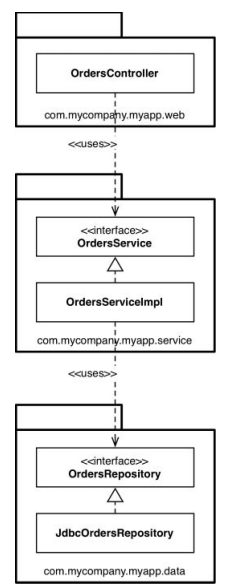
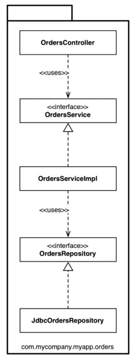
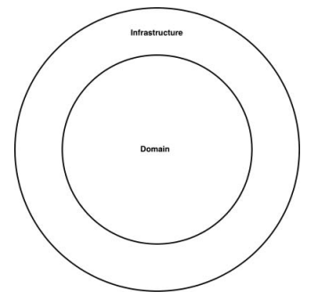
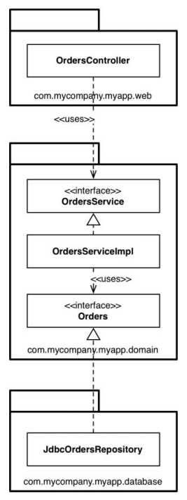
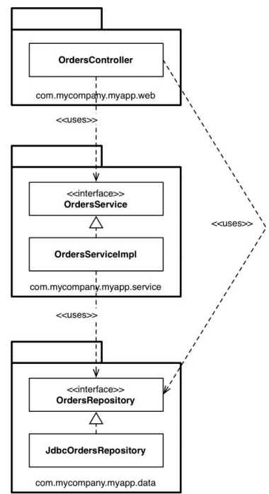
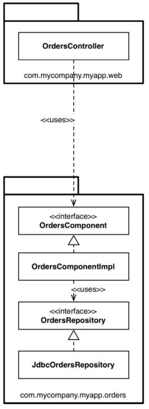
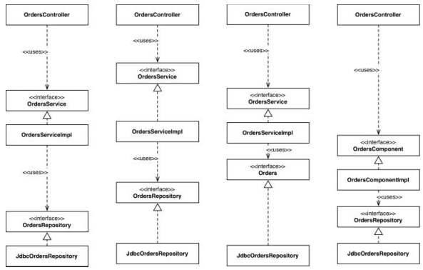
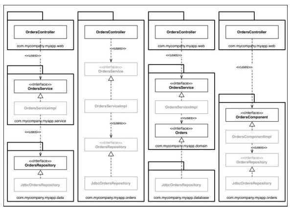

# 34장. 빠져 있는 장

설계나 코드 조직화와 관련된 몇가지 접근법을 `주문 조회하기` 유스케이스를 통해 살펴보자

## 계층 기반 패키지

가장 단순한 방식으로 전통적인 `수평 계층형 아키텍쳐`이며, `계층 기반 패키지`라고 부른다

계층형 아키텍쳐에서는 웹, 업무규칙, 영속성 코드를 위한 계층이 각각 하나씩 존재한다.
엄격한 계층형 아키텍쳐는 반드시 아래 계층에만 의존해야한다.

Martin Fowler는 `프레젠테이션 도메인 데이터(Presentation Domain Data) 계층화`에 처음 시작하기에
계층 아키텍쳐가 적합하다고 애기한다. 엄청난 복잡함을 겪지않고 무언가를 작동시켜주는 아주 빠른 방법이다.

하지만 Uncle Bob은 계층형 아키텍쳐는 업무 도메인에 대해 아무것도 말해주지 않는 문제점을 가진다고한다.
전혀 다른 업무 도메인이더라도 Web, Service, Repository로 구성된 모습이 비슷하게 보일 수 있다.

## 기능 기반 패키지

기능 기반 패키지는 서로 연관된 기능, 도메인 개념 또는 DDD에서의 Aggregate Root에 기반하여
수직의 얇은 조각으로 코드를 나누는 방식이다.

등장하는 인터페이스와 클래스는 이전과 같지만, 모두 세 개가아닌 한개의 패키지에 속하게 된다.
이럼으로써, 코드의 상위 수준 구조가 업무 도메인에 대해 무언가를 알려주게 된다.

다른 이점으로는 주문 조회하기 유스케이스가 변경된 경우 모두 한 패키지에 담겨 있기에 변경할 코드를 찾는 작업이 쉬워진다

하지만, 계층 기반 패키지, 기능 기반 패키지 모두 차선책이다.

## 포트와 어댑터

Uncle Bob에 따르면 `포트와 어댑터`, `헥사고날 아키텍쳐`, `경계, 컨트롤러, 엔티티(BCE)`
모두 세부 구현과 업무 도메인을 독립적이고 분리된 아키텍쳐를 만들기 위해서 존재한다고 한다.
내부는 도메인이고 외부는 인프라로 구성됨을 볼 수 있다.

내부는 도메인 개념을 모두 포함하고, 외부 영역은 UI, 데이터베이스 ,서드파티 등을 포함한다.
여기서 중요한건 `외부가 내부에 의존하며, 절대로 그 반대는 안된다`는 점이다.

이런식으로 주문 조회하기 유스케이스를 구현한 경우 domain 패키지는 내부이며, 나머지 패키지는 모두 외부가 된다.
의존성이 내부를 향해 흐르는 모습이 중요하다.

## 컴포넌트 기반패키지

SOLID, REP, CCP, CRP 등과 같은 조언이 중요하지만, 코드를 조직화하는 방법에 대해서는 다소 다른 결론에 이른다.
이 방법을 `컴포넌트 기반 패키지`라고 부른다.

게층형 아키텍쳐가 좋지 않은 이유는, 계층형 아키텍쳐의 목적이 기능이 같은 코드끼리 서로 분리하기 때문이다.
계층형 아키텍쳐에서는 의존성은 항상 아래를 향하며, 각 계층은 반드시 아래 계층에만 의존한다.
이런 방식으로 `깔끔한 비순환 의존성 그래프`를 만들 수 있다고 생각하지만, 속임수를 써서 `몇몇 의존성을 의도치 않은 방식으로
추가하는 경우`에도 이 비순환 의존성이 유지된다는 점이 중요하다.

위와 같이 의존성 화살표는 여전히 아래를 향하지만, 몇몇 유스케이스의 경우 OrderService를 거치지 않게된다.
이런 조직화는 인접한 계층을 건너뛰는 일이 허용되기에 흔히 `완화된 계층형 아키텍쳐`라고 불린다.
`CQRS패턴을 지키려고 시도하는 경우와 같이 의도된 결과`일 수 있지만, 이외의 경우에서는 업무로직 계층을
우회하는 일은 바람직하지 못하다.

> Command Query Responsibility Segregation(CQRS)  
> 데이터를 변경하고 조회하는 패턴을 서로 분리

여기서 절대적으로 필요한건 웹 컨트롤러는 절대 Repository에 접근해서는 안된다와 같은 원칙이 필요하다.
정적 분석도구를 통해 검사하거나 가능하면 컴파일러를 사용해서 아키텍쳐를 강제하는 방식이 필요하다

컴포넌트 기반 패키지를 도입해야하는 이유는 이때문이다.
이 접근법은 큰 단위(coarse-grained)의 단일 컴포넌트와 관련된 모든 책임을 하나의 패키지로 묶는데 주안점을 둔다.
서비스 중심적인 시각으로 소프트웨어를 바라보며, MSA가 가진 시각과도 동일하다.

컴포넌트 기반 패키지의 접근법의 주된 이점은 주문과 관련된 무언가를 작업해야할 때 오직 한 곳,
OrderComponent만 살펴보면 된다는 점이다. 컴포넌트 내부에서 관심사의 분리는 당연히 이뤄져야하며, 
업무 로직은 데이터 영속성과도 분리되어 있어야한다.

## 조직화 vs 캡슐화

public 지시자를 과용하면 앞서 제시한 네가지 아키텍쳐 접근법은 본질적으로 완전히 같아진다.
개념적으로 접근법들은 다르지만, 구문적으로 완전히 똑같아 진다.

만약 패키지 구조를 다시 살려서 제한적인 접근 지시자를 사용하여 타입을 표시하면 다이어그램이 변화한다.
흐리게 표시된 부분이 접근지시자가 적용된 부분이다.

public 타입이 적을수록필요한 의존성 수는 줄어든다. 따라서 우리는 컴파일러의 도움을 받아
컴포넌트 기반패키지 아키텍쳐 접근법을 강제할 수 있다.

## 결론

- 아키텍트가 고민해야할 사항
  - 설계를 어떻게 해야하만 원하는 코드 구조로 매핑할 수 있을지
  - 그 코드를 어떻게 조직화 할지
  - 런타임과 컴파일타임에 어떤 결합 분리 모드를 적용할지

