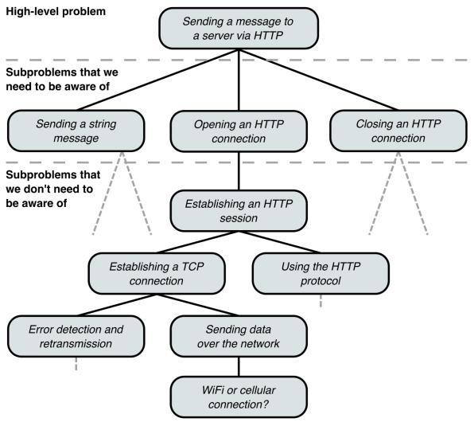

# 2장. 추상화 계층

## 이 장에서 다루는 내용

- 깔끔한 추상화 계층을 통해 문제를 하위 문제로 세분화하는 방법
- 추상화 계층이 코드 품질의 요소를 달성하는 데 어떻게 도움이 되는지
- API 및 구현 세부 사항
- 함수, 클래스 및 인터페이스를 사용해 코드를 추상화 계층으로 나누는 방법

코드 작성의 목적은 문제 해결이며, 보통 문제를 해결할 떄는 여러 개의 작은 하위 문제로 나눌 수 있다.
문제와 하위 문제를 어떻게 해결할지에 앞서, 이를 코드로 어떻게 구성하는 것 또한 중요한 문제이다.
모든 기능을 하나의 거대한 함수나 클래스로 구현할 것인가? 아니면 여러 개의 함수나 클래스로 나눠야 하는가?
나눈다면 어떻게 나눠야 하는가?

코드를 잘 구성한다는 것은 간결한 추상화 계층을 만드는 것으로 귀결될 때가 많다.
이것이 무얼 의미하는지 설명하고, 문제를 추상화 계층으로 나누고, 나눠진 추상화 계층을 반영하도록
코드를 구성하는 방법을 살펴본다.

---

## 2.1 널값 및 슈도코드 규약

여기서 사용되는 슈도코드는 널 안정성(null safety)이 있다고 가정한다. `?` 기호가 붙어 있으면
널 값을 가질 수 있다는 의미이고 널값 여부를 확인하지 않고서는 사용할 수 없도록 컴파일러가 강제한다.

### 2.2 왜 추상화 계층을 만드는가

서버에 메시지를 보내는 코드를 작성한다고 가정하면 다음처럼 간단한 개념만 다루면 이를 수행할 수 있다.

- 서버의 URL
- 연결
- 메시지 문자열 보내기
- 연결 닫기

```java
class Request {
    HttpConnection connection = HttpConnection.connect("http://example.com");
    connection.send("Hello, world!");
    connection.close();
}
```

우리는 간단하게 문제를 해결할 수 있지만, 실제 문자열을 보내는 작업에는 상당히 복잡한 일이 일어난다.

<p align="center"></p>

- 전송할 수 있는 형식으로 문자열 직렬화
- HTTP 프로토콜의 복잡한 동작
- TCP 연결
- 사용자의 장치가 와이파이, 셀룰러 네트워크에 연결되어 있는지 확인
- 데이터를 라디오 신호로 변조
- 데이터 전송 오류 및 수정

하지만 HttpConnection 코드를 구현할 때 이런 복잡한 부분은 생각하지 않고 물리적인 데이터 전송을
추상적인 개념으로 생각할 수 있었고, HTTP 연결을 추상적인 개념으로 생각할 수 있다.
이를 `추상화 계층`이라고 한다.

일반적으로 어떤 문제를 하위 문제로 나눠 내려가며 추상화 계층을 만든다면, `같은 계층 내`에서는 쉽게 이해할 수 있는 몇 개의 개념만을
다루기 때문에 코드가 복잡해 보이지 않는다. 비록 문제가 복잡하더라도 하위 문제들을 식별하고 올바른 추상화
계층ㅇ르 만듦으로써 복잡한 문제를 쉽게 다룰 수 있다.

### 2.2.1 추상화 계층 및 코드 품질의 핵심 요소

#### 가독성

코드의 모든 세부 사항을 이해하는 것은 불가능하다. 하지만 뚜렷한 추상화 계층을 만든다면,
한 번에 한두 개 정도의 계층과 몇 개의 개념만 다루면 된다.

#### 모듈화

다른 게층이나 코드의 일부에 영향을 미치지 않고 계층 내에서만 구현을 변경하기 매우 쉬워진다.

#### 재사용성 및 일반화성

해당 하위 문제에 대한 해결책을 재사용하기 쉬워진다. 적절하게 추상적인 하위 문제로 세분화된다면,
다른 상황에서 유용하게 일반화될 가능성이 크다.

#### 테스트 용이성

신뢰할 수 있는 코드를 작성하고자 한다면, 각 하위 문제에 대한 해결책이 견고하게 작동하지는 확인해야한다.
코드가 추상화 계층으로 분할된다면 하위 문제에 대한 해결책을 완벽하게 테스트하기 쉬워진다.

## 2.3 코드의 계층

추상화 계층을 생성하는 방법은 코드를 서로 다른 단위로 분할하여 단위 간의 의존 관계를 보여주는 의존성 그래프를 생성하는 것이다.
대체로 그 요소는 다음과 같다.

- 함수
- 클래스
- 인터페이스
- 패키지, 네임스페이스, 모듈

### 2.3.1 API 및 구현 세부 사항

코드를 작성할 떄 고려해야 할 두가지 측면이 있다.

- 코드를 호출할 떄 볼 수 있는 내용
  - public 클래스, 인터페이스 및 함수
  - 이름, 입력 파라미터 및 반환 유형이 표현하고자 하는 개념
  - 코드 호출 시, 코드를 올바르게 사용하기 위한 추가 정보(ex. 호출 순서)
- 코드를 호출할 떄 볼 수 없는 내용
  - 구현 세부 사항

서비스를 구축하면 API(Application Programming Interface)를 만들게 되며, API는 
서비스를 사용할 때 알아야 할 것들을에 대한 개념을 형식화하고, 서비스의 `구현 세부사항은 API 뒤에 감춘다`.

API는 호출하는 쪽에 공개할 개념만 정의하면 되고 그 이외의 모든 것은 구현 세부사항이므로,
API 관점에서 생각하면 추상화 계층을 명확하게 만드는데 도움이 된다.
수정 사항이 발생했을 때, API에 이 수정사항에 대한 구현 세부 정보가 새어 나간다면 추상화 계층이 명확하게 구분된 것이 아니다.

### 2.3.2 함수

함수가 하는 일을 다음 중 하나로 제한한다면 좋은 전략이 될 수 있다.

- 단일 업무 수행
- 잘 정의된 다른 함수를 호출해서 더 복잡한 동작 구성

함수를 작게 만들고 수행하는 작업을 명확하게 하면 코드의 가독성과 재사용성이 높아진다.

### 2.3.3 클래스

단일 클래스의 크기에 대해서는 여러 이론과 경험법칙이 존재한다

- 라인 수
  - 300줄보다 긴 클래스는 너무 많은 개념을 다루므로 분리
    - 사실상 경고의 역활이며, 300줄이 넘지 않는 것이 옳다는 것은 아니다
- 응집력
  - 한 클래스 내의 모든 요소들이 얼마나 잘 속해 있는지를 보여주는 척도
  - 순차적 응집력
    - 한 요소의 출력이 다른 요소에 대한 입력으로 필요할 때 발생
    - ex. 커피를 갈고 추출하는 것 사이에는 순차적 응집력이 있다고 볼 수 있다.
  - 기능적 응집력
    - 몇 가지 요소들이 모여서 하나의 일을 성취하는 데 기여할 때 발생
    - 하나의 일이 무엇인가는 주관적일 수 있다
    - ex. 케이크를 만들기 위한 도구를 하나의 서랍에 보관
- 관심사의 분리(separation of concerns)
  - 시스템이 각각 별개의 문제를 다루는 개별 구성요소로 분리되어야 한다

응집력과 관심사의 분리에 대해 생각할 땐 `서로 관련된 여러가지 사항을 하나의 사항을 간주`하는 것을 어느 수준에서 해야
유용할지 결정해야 한다. 상당히 주관적일 수 있으며, 예를 들어 커피를 갈고 추출하는걸 하나의 사항으로
간주할 수 있지만, 향신료만 갈길 원하는 경우 이를 하나의 사항으로 묶을 수 없다.

단일 클래스 내에 얼마나 많은 다른 개념이 들어가 있는지, 어떤 로직이 재사용이나 재구성에 적합한지를
고민하지 않는다면 클래스가 비대해질 수 있다. 이를 1장에서 정의한 네 가지 핵심요소로 살펴보자

- 코드 가독성
  - 단일 클래스에 담겨있는 개념이 많을 수록 해당 클래스의 가독성은 저하
- 코드 모듈화
  - 클래스 및 인터페이스의 사용은 코드 모듈화를 위한 좋은 방법
- 코드 재사용성 및 일반화
  - 두 하위 문제에 대한 해결책을 한 클래스로 묶으면 다른 누군가는 한가지 해결책을 재사용할 기회가 사라진다
- 테스트 용이성
  - 로직이 여러 클래스로 나누어지면 각 부분을 적절하게 테스트하기 쉬워진다

하위 문제를 해결할 때 원래 문제와 다른 관심사인지, 본질적으로 원래 문제의 일부분인지에 대해 의견이 다를 수 있다.
클래스가 분리되어야 하는지는 앞선 네 가지 핵심요소를 고려하여 살펴보는 것이 좋을 수 있고 다음과 같을 때 저품질 코드로 결론 내릴 수 있다.

- 코드를 읽을 수 없다
  - 어떤 개념이 하위 문제를 해결하는데 필요한지 파악하는데 시간이 걸리나
- 코드가 특별히 모듈화 되어 있지 않다
  - 코드를 재구성하거나 수정하는 것이 어렵다
- 코드를 재사용할 수 없다
  - 다른 문제를 해결할 때 여기서 해결된 하위 문제와 동일한 하위 문제를 해결할 수 도 있다.
- 코드를 일반화할 수 없다
- 코드를 테스트하기 어렵다

코드를 적절한 크기의 클래스로 세분화하는 것은 추상화 계층을 만들기 위한 가장 효과적인 도구이다.

### 2.3.4 인터페이스

계층 사이를 뚜렷이 구분하는 방법은 어떤 함수를 외부로 노출할 것인지 인터페이스를 통해 결정하는 것이다.

하나의 추상화 계층에 두 가지 이상의 다른 방식으로 구현을 하거나 향후 다르게 구현할 것으로 예상되는 경우
인터페이스를 정의하는 것이 좋다. 또한 서로 다른 구현이 가능하고 구현 클래스 사이에 전환이 필요할 때 추상화 계층을 나타내는 인터페이스를 정의할 수 있따.

#### 모든 것을 위한 인터페이스

추상화 계층에 대해 한 가지 구현만 있고 향후 다른 구현을 추가할 계획이 없더라도
여전히 인터페이스를 통해 추상화 계층을 표현해야하는가는 팀 문화에 따라 다르다.

향후 다르게 구현할 필요가 있을지 현재 알 수 없더라도 이런 접근 방식은 몇가지 장점이 존재한다.

- public API를 명확하게 보여준다
- 한 가지 구현만 필요하다고 잘못 추측한 것일 수 있다
- 테스트를 쉽게 할 수 있다
- 같은 클래스로 두 가지 하위 문제를 해결할 수 있다
  - LinkedList = List + Queue

하지만 다음과 같은 단점이 존재한다.

- 더 많은 작업이 필요
- 코드가 복잡해질 수 있다

인터페이스를 정의하지 않더라도 클래스에서 어떤 함수를 퍼블릭으로 노출할지 매우 신중하게 생각해야한다.
나중에 필요한 경우 인터페이스를 붙이는 것이 어려워지지 않도록 코드를 작성해야 한다.

### 2.3.5 층이 너무 얇아 질 때

코드를 별개 계층으로 세분화하는 경우 장점도 존재하지만 다음과 같은 단점도 존재한다

- 클래스를 정의하거나 의존성을 새 파일로 임포트할 떄, 보일러 플레이트 코드로 인해 코드의 양이 늘어남
- 로직의 이해를 위해 파일이나 클래스를 따라갈 때 추가적인 이동이 필요
- 인터페이스 뒤 숨겨진 구현 게층을 파악하기 위해 더 많은 노력이 필요하며 디버깅이 어려워질 수 있따

코드를 분할하여 얻는 장점도 존재하지만 이런 비용이 존재하기에 `분할을 위한 분할은 의미가 없다는 것을 명심`해야한다.
다른 곳에서 사용할 가능성이 별로 없는 코드를 분할하는 경우 코드의 계층이 너무 얇아지며,
이는 곧 불필요하게 계층을 쪼갰다고 볼 수 있다.

따라서 코드 계층의 규모를 올바르게 결정하는 것이 중요하다.

- 추상화 계층이 없다면 전혀 관리할 수 없는 코드가 된다
- 계층이 두꺼우면 모듈화되지 않고, 재사용할 수 없으며, 가독성이 낮아진다
- 계층이 얇으면 불필요한 복잡성을 초래한다

일반적으로 계층이 두꺼운건 얇은 것보다 더 문제가 될 수 있다. 따라서 확실하지 않다면,
게층이 얇아져 남용하는 결과를 가져오더라도 계층을 여러개로 나누는 것이 좋다.

## 2.4 마이크로서비스는 어떤가?

MSA는 개별 문제에 대한 해결책이 단일 프로그램으로 컴파일되는 라이브러리 수준이 아닌
독립적으로 실행되는 서비스로 배포도니다. 시스템이 여러 개의 소규모 프로그램으로 분활되어 API를 통해
원격으로 호출할 수 있는 전용 서비스로 배포된다.

MSA는 서비스 자체가 간결한 추상화 계층을 제공하기 때문에 추상화 계층을 만드는게 중요하지 않아 보일 수 있다.
하지만, MSA 역시 크기와 범위를 기준으로 서비스를 나누기 떄문에 내부에 적절한 추상화 계층을 고려해야한다.

MSA는 시스템을 분리하여 보다 모듈화할 수 있는 좋은 방법이지만, 서비스를 구현하기 위해
여러 하위 문제를 해결하는 것은 기존 아키텍쳐와 동일하다. 따라서, 올바른 추상화 및 코드 계층을
만드는 것은 여전히 중요하다

## 요약

- 코드를 깨끗하고 뚜렷한 추상화 계층으로 세분화하면 가독성, 모듈화, 재사용, 일반화, 테스트 용이성이 향상된다
- 함수, 클래스 및 인터페이스를 사용해 코드를 추상화 계층으로 나눌 수 있다
- 코드를 추상화 계층으로 분류하는 방법은 문제에 해결에 대한 경험과 지식이다
- 비대한 계층 떄문에 발생하는 문제는 얇은 계층으로 발생하는 문제보다 심각하다. 확실하지 않다면 계층을 얇게 만들자.