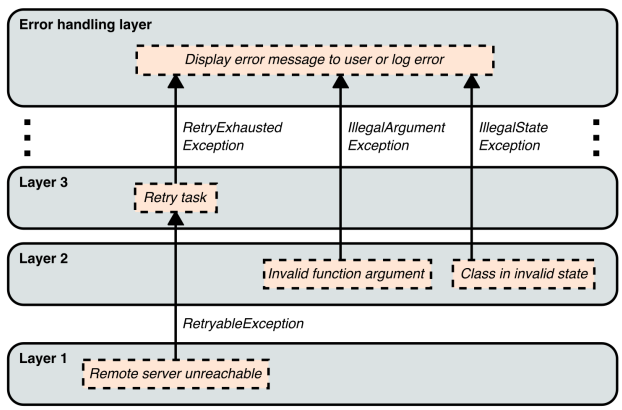

# 4장. 오류

## 이 장에서 다루는 내용

- 시스템이 복구할 수 있는 오류와 복구할 수 없는 오류의 구분
- 신속하게 실패하고 분명하게 실패함
- 오류를 전달하기 위한 다양한 기법과 선택을 위한 고려 사항

소프트웨어가 작동을 계속할 수 있는 오류와 작동을 계속할 합리적인 방법이 없는 오류로 구분하는 것은 유용하다.
이런 차이점을 살펴보고 오류를 적절하게 처리하는 기술에 대해 논의한다.

## 4.1 복구 가능성

### 4.1.1 복구 가능한 오류

많은 소프트웨어 오류는 치명적이지 않으며, 적절하게 처리한다면 작동을 계속할 수 있는 방법이 있다.
잘못된 사용자 입력 외에도 복구 가능한 오류들은 다음과 같다

- 네트워크 오류
- 중요하지 않은 작업 오류

### 4.1.2 복구할 수 없는 오류

오류를 복구할 수 있는 방법이 없을 때가 존재하며 주로 프로그래밍 오류 때문에 발생할 때가 많다.

- 코드와 함께 추가되어야 하는 리소스가 없음
- 어떤 코드가 다른 코드를 잘못 사용한 경우
  - 잘못된 입력 파라미터 호출
  - 상태 초기화를 하지 않음

이런 경우 피해를 최소화하고 개발자가 문제를 발견하고 해결할 가능성을 최대하하는 것이 중요하다.

### 4.1.3 호출하는 쪽에서만 오류 복구 가능 여부를 알 때가 많다

- 오류로부터 복구하기를 호출하는 쪽에서 원하는가?
- 그렇다면 오류를 처리할 필요가 있다는 것을 호출하는 쪽에서 어떻게 알 수 있을까?

간결한 추상화 계층을 만들 때 호출자에 대한 가정을 가능한 하지 않는 것이 좋다. 함수를 작성하는 시점에서는
오류로부터 복구할 수 있는지, 복구해야 하는지 여부를 항상 알 수 있는 것은 아니기 때문이다.

- 함수가 어디서 호출되고 호출 시 제공되는 값이 정확한 정보가 없음
- 코드가 재사용된다면 코드가 어디서 호출되는지에 대한 가정의 무의미하다

호출하는 쪽에서 오류 복구를 원할 것이라는 가정은 좋지만, 오류가 발생할 수 있다는 것을
인식시키지 않으면 제대로 처리하지 못할 것이다.

### 4.1.4 호출하는 쪽에서 복구하고자 하는 오류에 대해 인지하도록 하라

함수 작성자는 작성하는 함수에서 오류가 발생할 수 있음을 호출하는 쪽에서 확실하게 인지하도록 해야한다.

## 4.2 견고성 vs 실패

오류가 발생하면 다음 중 하나를 선택해야 한다

- 실패
  - 상위 계층에서 오류를 처리하거나 프로그램 정지
- 오류 처리 후 계속 진행

### 4.2.1 신속하게 실패하라

신속하게 실패하는 것은 가능한 문제의 실제 발생 지점으로부터 `가까운 곳에서 오류를 나타내는 것`이다.
복구할 수 있는 오류의 경우 호출자 쪽에서 오류를 안정하게 복구할 수 있는 기회를 최대한 제공하고,
복구할 수 없는 오류의 경우 신속하게 파악할 수 있는 기회를 제공한다.

### 4.2.2 요란하게 실패하라

복구할 수 없는 오류가 발생하면 프로그래밍 오류 또는 개발자 실수일 확률이 높다.
버그가 있다는 사실을 알지 못하면 버그 자체를 고칠 수 없다.

요란한 실패는 오류가 발생했지만 아무도 모르는 상황을 막는 것이다. 가장 확실한 방법은 예외나 프로그램을 중단시키는 것이다.

### 4.2.3 복구 가능성의 범위

일반적으로 소프트웨어는 견고하게 작성하는 것이 좋지만, 오류를 알아차리지 못한 채 시스템이 계속 동작하지 못하게
요란하게 실패하는 것 또한 중요하다. 이에 대한 해결책은 오류를 기록하고 모니터링 하는 것이다.

### 4.2.4 오류를 숨기지 않음

독립적이지 않거나, 중요하거나, 낮은 계층에서 오류가 발생해도 계속 진행되면 의도한대로 프로그램이 동작하지 않을 수 있다.
오류를 숨기는 것은 복구할 수 있는 오류와 복구할 수 없는 오류 모두에 문제를 일으킨다

- 호출자가 오류를 복구하고자 하지만 오류가 숨겨지는 경우, 오류를 복구할 기회가 없어짐
- 복구할 수 없은 오류를 숨기면 프로그래밍 오류가 감춰짐

#### 기본값 반환

기본값을 반환하는 것이 간단한 해결책일 수 있지만, 오류가 발생했다는 사실을 숨기게 되므로
호출자는 모든 것이 정상이라고 잘못 판단할 수 있다.

#### 널객체 패턴

기본값과 유사하며 널 객체 내의 벰버 함수는 아무것도 없거나 의미없는 값을 반환한다.
기본값 반환에서의 단점과 동일한 오류가 발생한다.

#### 아무것도 하지 않음

코드가 리턴 값없이 어떤 작업을 수행하는 경우, 오류 발생 신호를 보내지 않는다면 코드가 의도대로 완료되었다고 착각할 수 있다.

## 4.3 오류 전달 방법

일반적으로 오류가 발생하면 상위 계층에 오류를 알리게 된다. 오류 복구가 가능한 경우,
즉시 호출하는 쪽에 오류를 알려 정상적으로 처리 할 수 있도록 해야한다.

- 명시적 방법
  - 오류가 발생할 가능성이 코드 계약의 명확한 부분에 나타내어 오류를 모르고 넘어갈 수 있는 방법이 없게 함
- 암시적 방법
  - 호출자에게 오류를 알리지만 호출자가 오류를 신경쓰지 않아도 되는 경우
  - 문서나 코드를 읽는 등의 노력이 필요

### 4.3.2 명시적 방법: 검사 예외(checked exception)

호출하는 쪽에서 예외를 인지하도록 강제적으로 조치하여 오류를 명시적으로 전달하는 방법

### 4.3.3 암시적 방법: 비검사 예외(unchecked exception)

비검사 예외를 사용하면 예외를 발생시킬 수 있다는 사실을 전혀 모를 수 있다.
비검사 예외는 오류가 발생할 수 있다는 것을 호출하는 쪽에서 인지하리라는 보장이 없기 때문에 암시적인 방법이다.

### 4.3.4 명시적 방법: 널값이 가능한 반환 유형

널 값을 반환하는 것은 `특정 값을 계산하거나 얻는 것이 불가능함`을 표현하는 효과적인 방법이다.
널 안정성을 지원하는 경우 널값이 반환될 수 있다는 것을 호출하는 쪽에 강제적으로 인지하고 그에 따라 처리해야 한다.

### 4.3.5 명시적 방법: 리절트 반환 유형

널값이나 옵셔널 타입을 반환할 때의 문제 중 하나는 오류 정보를 전달할 수 없다는 것이다.
이 때 값을 얻을 수 없는 이유까지 알려주는 리절트 유형을 사용하는 것이 좋다.

### 4.3.6 명시적 방법: 아웃컴 반환 유형

어떤 함수들은 값을 반환하지 않고 동작만 수행하고 종료된다. 이 함수의 경우 오류가 발생할 수 있고
호출한 쪽에 이를 알리고자 한다면, 나타내는 값을 반환하도록 함수를 수정해야한다.
호출자에서는 반환값을 강제적으로 확인해야하기 때문에 이는 오류를 알리는 명백한 방법이다.

#### 아웃컴이 무시되지 않도록 보장

아웃컴 반환 유형에 대한 문제점 중 하나는 `반환값을 무시하거나 함수가 값을 반환한다는 사실을 인지하지 못하는 것`이다.
자바의 경우 @CheckReturnValue 어노테이션을 통해 경고를 생성할 수 있다.

### 4.3.7 암시적 방법: 프로미스 또는 퓨처

비동기적으로 코드를 작성할 떄 프로미스 또는 퓨처 개념을 사용하는데, 프로미스나 퓨쳐는 오류 상태도 전달할 수 있다.
일반적으로 오류처리가 강제가 아니기에 이는 암시적인 방법이다.

### 4.3.8 암시적 방법: 매직값 반환

매직값은 함수의 정상적인 반환 유형에는 적합하지만 특별한 의미를 부여하는 값이다.
매직값의 경우 예상을 벗어나는 결과를 가져올 수 도 있고 버그로 이어질 수 있기에 추천하지 않는 방법이다.

### 정리

- 명시적 방법
  - 검사 예외
  - 널값이 가능한 반환 유형
  - 리절트 반환 유형
  - 아웃컴 반환 유형
- 암시적 방법
  - 비검사 예외
  - 프로미스 또는 퓨처
  - 매직값 반환

## 4.4 복구할 수 없는 오류의 전달

복구할 가능성이 없는 오류가 발생하면 신속하게 실패하고, 요란하게 실패하는 것이 최상의 방법이다.

- 비검사 예외를 발생
- 체크나 어서션을 사용

## 4.5 호출하는 쪽에서 복구하기를 원할 수도 있는 오류의 전달

### 4.5.1 비검사 예외를 사용해야 한다는 주장

#### 코드 구조 개선

대부분의 오류 처리가 코드의 상위 계층에서 이루어질 수 있기 때문에 코드 구조를 개선할 수 있다는 주장이다.

장점은 오류를 처리하는 로직이 코드 전체에 퍼지지 않고 별도로 몇 개의 계층에만 있다는 점이다.

#### 개발자들이 무엇을 할 것인지에 대해 실용적이어야 함

너무 많은 명시적 오류 전달은 결국 잘못된 일을 한다고 주장한다. 예를들어 예외를 캐치하고도 무시하는 등이 있을 수 있다. 

### 4.5.2 검사 예외를 사용해야 한다는 주장

#### 매끄러운 오류 처리

비검사 예외를 사용한다면 모든 오류를 매끄럽게 처리할 수 있는 단일 계층을 갖기가 어렵다.

호출자에서 잠재적 오류를 강제적으로 인식하도록 한다면 이러한 오류를 보다 매끄럽게 처리할 가능성이 커진다.

#### 실수로 오류를 무시할 수 없다

비검사 예외가 사용되면 적극적인 의사 결정이 들어갈 여지가 줄어들고 기본적으로 오류를 처리하지 않는 일이 발생하기 쉽다.

검사 예외를 통해 오류 전달을 하더라도 여전히 잘못된 일을 할 수 있다. 하지만, 이것은 적극적인
노력이 필요하고 눈에 띄는 위반사항이다. 따라서 이런 잘못된 코드를 차단할 가능성이 커진다.

#### 개발자들이 무엇을 할 것인지에 대해 실용적이어야 함

비검사 예외가 코드베이스 전반에 걸쳐 제대로 문서화된다는 보장이 없다.
어떤 코드가 어떤 예외를 발생시킬지에 대해 확실하지 못한다는 것을 의미하고 이는 어디서든 예외가 발생할 수 있음을 의미한다.

모든 예외를 아우르는 예외를 처리하는 것은 바람직하지 않다. 이 경우 현실적으로 복구할 수 없는 많은 오류를 포함하여
많은 오류가 숨겨져 버린다.

### 4.5.3 필자의 의견: 명시적 방식을 사용하라

호출자에서 복구하기를 원할 수도 있는 오류에 대비해 비검사 예외를 사용하지 않는 것이 최상이다.
비검사 예외의 사용은 코드베이스 전반에 걸쳐 완전히 문서화되는 경우가 드물고 이 때문에
많은 버그와 작동 실패가 일어나는 것을 경험했다.

## 요약

- 오류에는 크게 두 가지 종류가 있다
  - 시스템이 복구할 수 있는 오류
  - 시스템이 복구할 수 없는 오류
- 해당 코드에 의해 생성된 오류로부터 복구할 수 있는지 여부는 호출자 쪽에서만 알 수 있는 경우가 많다
- 에러가 발생하면 신속하게 실패하는 것이 좋고, 복구할 수 없는 경우 요란하게 실패하는 것이 바람직하다
- 오류를 숨기는 것은 바람직하지 않으며, 발생했다는 신호를 보내는 것이 바람직하다
- 오류 전달 기법은 두 가지 범주로 나눌 수 있다
  - 명시적 방법
  - 암시적 방법
- 복구할 수 없는 오류에 대해서는 암시적 오류 전달 기법을 사용해야 한다
- 잠재적으로 복구할 수있는 오류에 대해서는 명시적 오류 전달 기법을 추천한다
- 컴파일러 경고는 종종 코드에 문제가 있을 때 이에 대해 표시해준다

