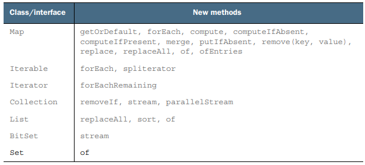

# Appendix A : 기타 언어 업데이트

## A.1 어노테이션

자바 8에서 어노테이션은 두 가지가 개선되었다.

- 어노테이션을 반복할 수 있다
- 모든 형식에 어노테이션을 사용할 수 있다

자바의 어노테이션은 부가 정보를 프로그램에 장식하는 기능으로, `문법적 메타데이터`이다.

- JUnit의 컨텍스트에서 어노테이션으로 설정 작업과 단위 테스트를 구분할 수 있다
- 문서화에 어노테이션을 사용할 수 있다
  - 사용하지 말아야할 메서드에 @Deprecated 어노테이션을 붙일 수 있다
- 자바 컴파일러도 어노테이션을 활용하여 에러를 검출하고, 경고를 줄이고 코드를 생성할 수 있다
- 자바 EE에서 엔터프라이즈 어플리케이션을 설정할 때 어노테이션을 많이 사용한다

### A.1.1 어노테이션 반복

자바 8 이전에는 지정한 하나의 어노테이션만 허용했다.

```text
@interface Authors {
    String name();
}

// 중첩 어노테이션
@Authors(
    { @Author(name = "Raoul"), @Author(name = "Mario"), @Author(name = "Alan") }
)
```

중첩 어노테이션으로 인해 코드가 복잡해지기 때문에 자바 8부터는 반복 어노테이션과 관련된 제한을 해제했다

### A.1.2 형식 어노테이션

자바 8에서는 모든 형식에 어노테이션을 적용할 수 있게되었다.

```text
@NonNull String name = person.getName();

List<@NonNull Car> cars = new ArrayList<>();
```

형식 어노테이션은 프로그램을 분석할 때 유용하다. 예를 들어, `@NonNull` 어노테이션을 사용하면 null을 허용하지 않음을 확신할 수 있다.
이처럼 예상하지 못한 에러 발생 가능성을 줄일 수 있다.

---

## A.2 일반화된 대상 형식 추론

자바 8은 제네릭 인수 추론 기능을 개선했다.

자바 8이전에도 컨텍스트 정보를 이용한 형식 추론을 지원했지만, 컨텍스트에만 의존해서 추론이 실행되었다.
자바 8에서부터는 대상 형식이 메서드 파라미터에도 적용되므로 명시적인 제네릭 파라미터를 제공하지 않아도 된다.
그결과 Collectors.<Car>toList() 대신 Collectors.toList()를 사용할 수 있다.

```text
List<Car> cleanCars = cars.stream()
                          .filter(Car::isClean)
                          // .collect(Collectors.<Car>toList());
                          .collect(Collectors.toList());
```

---


# Appendix B : 기타 라이브러리 업데이트

## B.1 컬렉션

### B.1.1 추가 메서드

<p align="center"></p