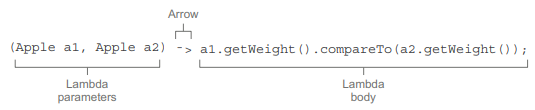
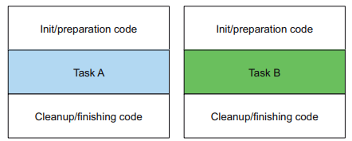
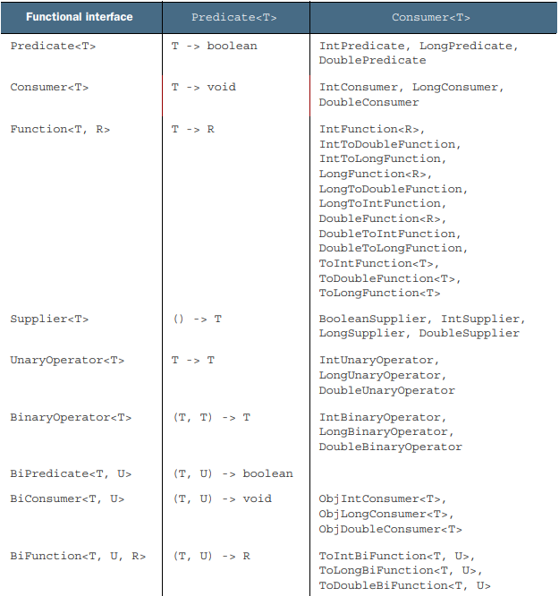
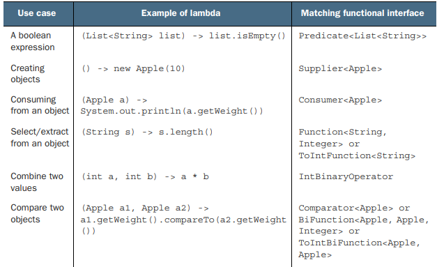
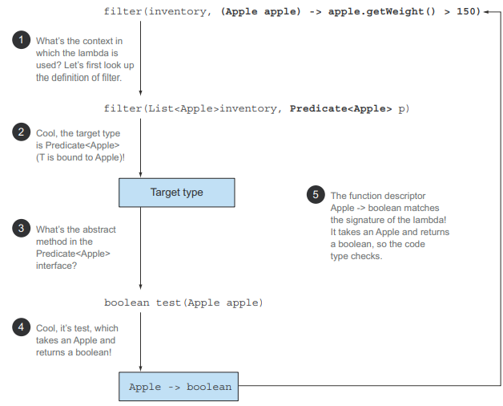
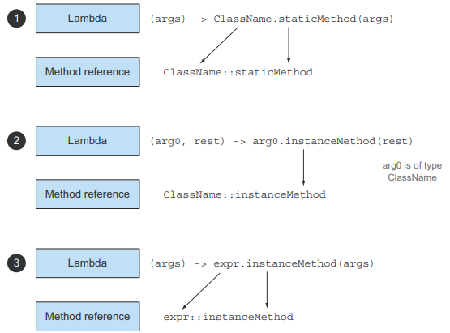

# 3장. 람다 표현식

## 3.1 람다란 무엇인가?

람다 표현식은 메서드로 전달할 수 있는 익명 함수를 단순화한 것이라고 할 수 있다.
람다 표현식에는 이름은 없지만 파라미터 리스트, 바디, 반환 형식, 발생할 수 있는 예외 리스트는 가질 수 있다.

- 익명
  - 보통의 메서드와 달리 이름이 없으므로 익명
- 함수
  - 람다는 메서드처럼 특정 클래스에 종속되지 않으므로 함수라고 부름
- 전달
  - 메서드 파라미터로 전달하거나 변수로 저장할 수 있음
- 간결성
  - 익명 클래스처럼 많은 자질구레한 코드를 구현할 필요없음

람다는 동작 파라미터를 이용할 때, 익명 클래스와 같이 판에 박힌 코드를 구현할 필요가 없어졌다.
Comparator를 통해 람다 표현식의 구조를 알아보자.

<p align="center"></p>

- 파라미터 리스트
  - Comparator에서는 두 대상을 비교하는 데 필요한 두 개의 파라미터
- 화살표
  - 화살표는 람다의 파라미터 리스트와 바디를 구분
- 람다 바디
  - 두 입력을 비교, 람다의 반환값에 해당하는 표현식

---

## 3.2 어디에, 어떻게 람다를 사용할까?

람다는 함수형 인터페이스라는 문맥에서 람다 표현식을 사용할 수 있다.

### 3.2.1 함수형 인터페이스

Predicate<T>는 `하나의 추상 메서드`만 지정하는 함수형 인터페이스이다.
다시 말해, 함수형 인터페이스는 `정확히 하나의 추상 메서드를 지정`하는 인터페이스다.
참고로 `디폴트 메서드가 있더라도` 추상메서드가 하나라면 함수형 인터페이스이다.

```
public interface Comparator<T> {
 int compare(T o1, T o2);
}
public interface Runnable {
 void run();
}
public interface ActionListener extends EventListener {
 void actionPerformed(ActionEvent e);
}
public interface Callable<V> {
 V call() throws Exception;
}
public interface PrivilegedAction<T> {
 T run();
}
```

함수형 인터페이스는 `람다 표현식을 통해 추상 메서드 구현을 직접 전달`할 수 있다.
즉, 전체 표현식을 함수형 인터페이스의 인스턴스로 취급할 수 있게된다.

### 3.2.2 함수 디스크립터

함수형 인터페이스의 추상 메서드의 시그니처는 람다 표현식의 시그니처를 가리킨다.
시그니처를 서술하는 메서드를 함수 디스크립터(Function descriptor)라고 한다.

람다 표현식은 변수에 할당하거나 `함수형 인터페이스를 인수로 받는 메서드로 전달`할 수 있으며,
`함수형 인터페이스의 추상 메서드와 같은 시그니처`를 갖는다.

```
@FucntionalInterface
@FunctionalInterface로 인터페이스를 선언했지만 실제로 함수형 인터페이스가
아닌 경우 컴파일 에러를 발생 시킨다.
예를 들어 추상 메서드가 한개 이상인 경우, 추상 메서드가 없는 경우 등이 있다. 
```

---

## 3.3 람다 활용: 실행 어라운드 패턴

<p align="center"></p>

실행 어라운드 패턴은 자원 처리와 같이 `선언부와 종료부`가 있고, `실행부`에는 자원을 처리하는 코드가 들어간다.

### 3.3.1 1단계: 동작 파라미터화를 기억하라

항상 동일하게 수행되는 설정, 정리과정을 재사용하고 실제 동작만 상황에 따라 다른 동작을 수행할 수 있다면 가장 좋을 것이다.
실제 동작만을 파라미터화할 수 있다

```
String result
 = processFile((BufferedReader br) -> br.readLine() + br.readLine());
```

### 3.3.2 2단계: 함수형 인터페이스를 이용해서 동작 전달

함수형 인터페이스 자리에는 람다를 사용할 수 있다.
`BufferReader ->String과 IOExcetpion을 throw 할 수 있는 시그니쳐`와 일치하는 함수형 인터페이스를 만들어야한다.

```
@FunctionalInterface
public interface BufferedReaderProcessor {
 String process(BufferedReader b) throws IOException;
}
```

### 3.3.3 3단계: 동작 실행

람다 표현식으로 함수형 인터페이스의 추상 메서드 구현을 직접 전달할 수 있다.
또한 전달된 코드는 함수형 인터페이스의 인스턴스로 전달된 코드와 같은 방식으로 처리된다.

```
public String processFile(BufferedReaderProcessor p) throws IOException {
 try (BufferedReader br =
 new BufferedReader(new FileReader("data.txt"))) {
 return p.process(br);
 }
}
```

### 3.3.4 4단계: 람다 전달

```
String oneLine =
 processFile((BufferedReader br) -> br.readLine());
```

---

## 3.4 함수형 인터페이스 사용

함수형 인터페이스의 추상 메서드는 람다 표현식의 시그니처를 묘사한다.
함수형 인터페이스의 `추상 메서드 시그니처를 함수 디스크립터`라고 한다.

자바 8에서 java.util.function 패키지에서 여러가지 새로운 함수형 인터페이스를 제공하며
대표적으로 Predicate, Consumer, Function 등이 존재한다

### 3.4.1 Predicate

Predicate는 `test 추상 메서드를 정의`하며, 제네릭 형식 T를 인수로 받아 `boolean을 반환`한다.
T 형식 객체를 사용하는 불리언 표현식이 필요한 상황에서 사용할 수 있다.

### 3.4.2 Consumer

Consumer는 `accept 추상 메서드를 정의`하며, 제네릭 형식 T를 인수로 받아 `void를 반환`한다.
T 형식 객체를 인수로 받아 어떤 동작을 수행하고 싶을 때 Consumer를 사용할 수 있다

### 3.4.3 Function

Function은 `apply 추상 메서드를 정의`하며, 제네릭 형식 T를 인수로 받아 `제네릭 형식 R 객체를 반환`한다.
입력을 출력으로 매핑하는 람다를 정의할 떄 Function을 사용할 수 있다.

### 기본형 특화

자바의 모든 형식은 참조형(Reference type) 아니면 기본형(Primitive type)에 해당한다.
하지만 제네릭의 내부 구현때문에, 제네릭 파라미터에는 참조형만 사용할 수 있다.
따라서 자바에서는 기본형을 참조형으로 변환하는 기능을 제공하며 이를 `박싱(boxing)`이라고한다.
반대로 참조형을 기본형으로 변환하는 동작을 `언박싱(unboxing)`이라고 한다.
자바에서는 이를 편리하게 제공하기 위해 박싱과 언박싱을 자동으로 이루어지는 `오토박싱(auto boxing)` 기능 또한 제공한다.

하지만 이러한 변환 과정은 필연적으로 비용이 소모된다.
박싱한 값은 기본형을 깜사는 래퍼이고 `힙에 저장되기에 메모리를 더 소비`하고 기본형을 가져올 때도 `메모리를 탐색하는 과정`이 필요하다.

자바 8에서는 오토박싱 동작을 피할 수 있도록 특별한 버젼의 함수형 인터페이스를 제공한다.
예를 들어 IntPredicate는 값을 박싱하지 않고 바로 사용할 수 있는 test 메서드를 제공한다.

<p align="center"></p>
<p align="center"></p>

### 예외, 람다, 함수형 인터페이스의 관계

함수형 인터페이스는 확인된 예외를 던지는 동작을 허용하지 않는다.
따라서 예외를 던지는 람다 표현식을 만들기 위해서는 `예외를 선언하는 함수형 인터페이스를 직접 정의`하거나,
`try/catch block`으로 감싸야한다.

---

## 3.5 형식 검사, 형식 추론, 제약

### 형식 검사

람다가 사용되는 컨텍스트를 이용해서 람다의 형식을 추론할 수 있다.
어떤 컨텍스트에서 기대되는 람다 표현식의 형식을 `대상 형식(target type`)이라고 한다.
예시를 통해 람다 표현식을 사용할 때 어떤 일이 일어나는지 확인할 수 있다.

```
List<Apple> heavierThan150g
    = filter(inventory, (Apple a) -> a.getWeight() > 150);
```
<p align="center"></p>

1. filter 메서드의 선언을 확인
2. filter 메서드의 두 번째 파라미터는 Predicate<Apple> 형식의 객체
3. Predicate<Apple>은 test라는 추상 메서드를 정의
4. test 메서드는 Apple을 파라미터로 받아 boolean을 반환하는 함수 디스크립터를 묘사
5. filter m메서드로 전달된 파라미터는 이 요구사항을 모두 만족해야 함

### 3.5.2 같은 람다, 다른 함수형 인터페이스

대상 형식이라는 특징 때문에 같은 람다 표현식이여도 호환되는 추상 메서드를 가진 다른 함수형 인터페이스로 사용될 수 도 있다.

- Callable<Integer> c = () -> 42;
- PrivilegedAction<Integer> p = () -> 42;
- Comparator<Apple> c1 = (Apple a1, Apple a2) -> a1.getWeight().compareTo(a2.getWeight());
- ToIntBiFunction<Apple, Apple> c2 = (Apple a1, Apple a2) -> a1.getWeight().compareTo(a2.getWeight());
- BiFunction<Apple, Apple, Integer> c3 = (Apple a1, Apple a2) -> a1.getWeight().compareTo(a2.getWeight());

### 특별한 void 호환 규칙

람다의 바디에 `일반 표현식`이 있으면 `void를 반환하는 함수 디스크립터와 호환`된다.

- Predicate<String> p = s -> list.add(s);
- Consumer<String> b = s -> list.add(s);

### 3.5.3. 형식 추론

대상 형식을 이용해서 함수 디스크립터를 알 수 있듯, `컴파일러는 람다의 시그니처도 추론`할 수 있다.
결과적으로 `컴파일러는 람다 표현식의 파라미터 형식에 접근`할 수 있으므로 `람다 문법에서 이를 생략 가능`하다.
즉, 자바 컴파일러는 람다 파라미터 형식을 추론할 수 있다.

- Comparator<Apple> c = (Apple a1, Apple a2) -> a1.getWeight().compareTo(a2.getWeight());
- Comparator<Apple> c = (a1, a2) -> a1.getWeight().compareTo(a2.getWeight());

### 3.5.4 지역 변수 사용

람다 표현식은 익명 함수처럼 `자유 변수(free variable)을 활용`할 수 있으며, 이를 `람다 캡쳐링(capturing lambda)`이라고 한다.

하지만 지역 변수는 명시적으로 final로 선언되거나 실제로 final 처럼 사용되어야 한다.
즉, 람다 표현식은 한번만 할당할 수 있는 지역변수를 캡쳐할 수 있다.

### 지역 변수의 제약

내부적으로 인스턴스 변수와 지역 변수는 태생적부터 다르다. `인스턴스 변수는 힙`에 저장되지만,
`지역 변수는 스택`에 위치한다. 람다가 스레드에서 실행된다면 변수를 할당한 스레드가 사라지면 해당 변수에
접근하려 할 떄 문제가 생긴다. 따라서 자바는 `자유 지역 변수의 복사본을 제공`하며 복사본의 값이
바뀌지 않아야 하므로 final 변수여야한다.

---

## 3.6 메서드 참조

메서드 참조를 이용하면 기존의 메서드 정의를 재활용해서 람다처럼 전달할 수 있다.

- inventory.sort((Apple a1, Apple a2) -> a1.getWeight().compareTo(a2.getWeight()));
- inventory.sort(comparing(Apple::getWeight));

### 3.6.1 요약

메서드 참조는 특정 메서드만을 호출하는 람다의 축약형이라고 생각할 수 있다.
실제로 메서드 참조를 이용하면 기존 메서드 구현으로 람다 표현식을 만들 수 있고 이때 명시적으로
메서드명을 참조함으로써 가독성을 높일 수 있다.

메서드 참조를 새로운 기능이 아니라 하나의 `메서드를 참조하는 람다를 편리하게 표현할 수 있는 문법`으로 간주할 수 있다.

### 메서드 참조를 만드는 방법

<p align="center"></p>

메서드 참조는 세 가지 유형으로 구분할 수 있다

- 정적 메서드 참조
  - Integer::parseInt
- 다양한 형식의 인스턴스 메서드 참조
  - String::length
- 기존 객체의 인스턴스 메서드 참조
  - Apple::getWeight

컴파일러는 람다 표현식의 형식을 검사하는 방식과 비슷하게 메서드 참조가 주어진 함수형 인터페이스와
호환되는지 확인한다. 즉, `메서드 참조는 컨텍스트의 형식과 일치`해야한다.

### 3.6.2 생성자 참조

ClassName:new와 같이 기존 생성자의 참조를 만드는 것 또한 정적 메서드의 참조를 만드는 방법과 비슷하다.
인스턴스화하지 안혹도 생성자에 접근할 수 있는 기능은 다양한 상황에서 응용 가능하다

```text
static Map<String, Function<Integer, Fruit>> map = new HashMap<>();
static {
 map.put("apple", Apple::new);
 map.put("orange", Orange::new);
}

public static Fruit giveMeFruit(String fruit, Integer weight){
 return map.get(fruit.toLowerCase())
 .apply(weight);
}
```

---

### 3.8 람다 표현식을 조합할 수 있는 유용한 메서드

자바 8의 함수형 인터페이스는 다양한 유틸리티 메서드를 포함하며, 여러개의 람다 표현식을 조합해서
복잡한 람다 표현식을 만들 수 있다. 여기서 등장하는 것이 `디폴트 메서드`이다.

### 3.8.1 Comparator 조합

- 역정렬
  - reversed
- Comparator 연결
  - thenComparing

### 3.8.2 Predicate 조합

- negate
  - Predicate를 반전 시킬 때
- and
  - 두 Predicate를 and로 조합
- or
  - 두 Predicate를 or로 조합

### 3.8.3 Function 조합

- andThen
  - 두 함수를 순차적으로 조합
  - f.andThen(g)는 항상 f를 먼저 적용하고 g를 적용
- compose
  - 두 함수를 역순으로 조합
  - f.compose(g)는 항상 g를 먼저 적용하고 f를 적용

---

## 결론

- 람다 표현식은 익명 함수의 일종으로 이름은 없지만 파라미터 리스트, 바디, 반환 형식을 가지며 예외를 던질 수 있다
- 함수형 인터페이스는 하나의 추상 메서드만 정의한 인터페이스
- 함수형 인터페이스를 기대하는 곳에서만 람다 표현식을 사용할 수 있다
- 람다 표현식은 함수형 인터페이스의 추상 메서드를 제공할 수 있으며, `람다 표현식 전체가 함수형 인터페이스의 인스턴스로 취급`된다
- java.util.function 패키지는 자주 사용하는 다양한 함수형 인터페이스를 제공
  - 자바 8에서는 제네릭 함수형 인터페이스와 관련한 오토박싱 문제를 피할 수 있도록 기본형 특화 인터페이스도 제공
  - Comparator, Predicate, Function 같은 함수형 인터페이스는 람다 표현식 조합을 위한 다양한 디폴트 메서드를 제공
- 람다 표현식의 기대 형식을 `대상 형식`이라고 한다
- 메서드 참조를 이용하면 기존의 메서드 구현을 재사용하고 직접 전달 가능