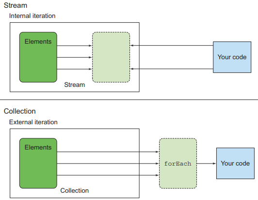
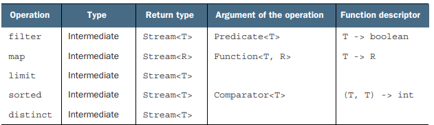
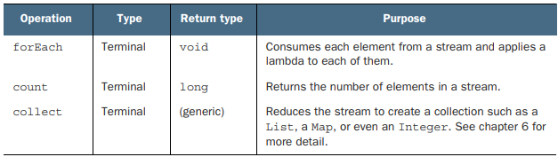

# 스트림 소개

## 4.1 스트림이란 무엇인가?

스트림을 이용하면 선언형으로 컬렉션 데이터를 처리할 수 있으며, 멀티스레드 코드를 구현하지 않아도 데이터를 투명하게 병렬 처리 할 수 있다.
스트림의 새로운 기능은 소프트웨어 공학적으로 다양한 이득을 준다

- 선언형으로 코드를 구현
  - 루프와 if 조건문 등의 제어 블록을 사용해서 어떻게 동작할지 지정할 필요가 없다
  - 단순히 `동작의 수행을 지정`하여 실행한다
  - `선언형 코드와 동작 파라미터화를 활용`해 변하는 요구사항에 쉽게 대응 가능하다
- filter, sorted, map, collect와 같은 빌딩 블록 연산을 연결해 복잡한 데이터 파이프라인을 만들 수 있다
  - 가독성과 명확성이 유지된다
  - 이 같은 연산은 고수준 빌딩 블록(high-level building block)으로 특정 스레딩 모델에 제한되지 않는다
  - 결과적으로 데이터 처리과정을 병렬화하면서 스레드와 락을 걱정할 필요가 없다

자바 8의 스트림 API의 특징을 요약하면 다음과 같다

- 선언형
  - 간결하고 가독성이 좋아진다
- 조립 가능
  - 유연성이 높아진다
- 병렬화
  - 성능이 좋아진다

## 4.2 스트림 시작하기

스트림이란 `데이터 처리 연산을 지원하도록 소스에서 추출된 연속된 요소`로 정의할 수 있다.

- 연속된 요소
  - 스트림은 특정 요소 형식으로 이루어진 연속된 값 집합의 인터페이스를 제공
  - `컬렉션은 자료구조`이므로 시간과 공간의 복잡성과 관련된 `요소 저장 및 접근 연산`이 주를 이룸
  - 반면 `스트림`은 filter, sort와 같은 `표현 계산식`이 주를 이룸
  - 즉, 컬렉션의 주체는 데이터, 스트림의 데이터는 계산
- 소스
  - 스트림은 컬렉션, 배열, IO 자원등의 데이터 제공 소스로부터 데이터를 소비
- 데이터 처리 연산
  - 함수형 프로그래밍 언어의 연산과 비슷한 연산을 지원
  - filter, map, reduce, find, match, sort 등으로 데이터를 조작 가능
  - 순차적으로, 병렬적으로 실행 가능

또한 스트림은 다음과 같은 특징을 가진다

- 파이프라이닝
  - 스트림 연산끼리 연결해 커다란 파이프라인을 구성할 수 있도록 자기 자신을 반환
- 내부 반복
  - iterator를 이용해 명시적으로 반복하는 컬렉션과 달리 `스트림은 내부 반복`을 지원

## 4.3 스트림과 컬렉션

기존 컬렉션과 스트림 모두 `연속된 요소의 값을 저장`하는 자료구조의 인터페이스를 제공한다.
`연속된`이라는 표현은 순서와 상관없이 아무 값에 접근하는 것이 아닌 `순차적으로 접근하는 것을 의미`한다.

데이터를 언제 계산하느냐가 컬렉션과 스트림의 가장 큰 차이다.

- 컬렉션
  - 현재 자료구조가 포함하는 모든 값을 메모리에 저장하는 자료구조
  - 모든 요소는 컬렉션에 추가되기전에 계산되어야 함
  - 요소를 추가하거나 삭제 가능
- 스트림
  - 요청할 때만 요소를 게산하는 고정된 자료구조
  - 요소를 추가하거나 삭제 불가능
  - 사용자가 요청하는 값만 스트림에서 추출
  - 생산자와 소비자 관계를 형성하며 게으르게 만들어지는 컬렉션

## 4.3.1 딱 한번만 탐색할 수 있다

iterator와 마찬가지로 스트림도 한번만 탐색이 가능하면 탐색된 스트림의 요소는 소비된다.
다시 탐색하기 위해서는 초기 데이터 소스에서 새로운 스트림을 만들어야한다.
만약 데이터 소스가 IO 채널이라면 소스를 반복사용할 수 업스므로 새로운 스트림을 만들 수 없다.

### 4.3.2 외부 반복과 내부 반복

컬렉션 인터페이스를 사용하려면 사용자가 직접 요소를 반복하며 이를 외부 반복이라고 한다.
반면 스트림은 반복을 알아서 처리하고 결과 스트림 값을 어딘가 저장해주는 내부 반복을 사용한다.

## 4.4 스트림 연산

### 4.4.1 중간 연산

중간 연산은 다른 스트림을 반환하며, 여러 중간 연산을 연결해서 질의를 만들 수 있다.
중간 연산의 중요한 특징은 연산을 스트림 파이프라인에 실행하기 전까지 아무 연산도 실행하지 않는다는 것이다.
즉, 중간 연산을 합친 다음에 `합쳐진 중간 연산을 최종 연산으로 한번에 처리`한다.

### 4.4.2 최종 연산

최종 연산은 스트림 파이프라인에서 결과를 도출하며 스트림 이외의 결과가 반환된다.

### 4.4.3 스트림 이용하기

스트림의 이용과정은 다음 세가지로 요약할 수 있다.

- 질의를 수행할 데이터 소스
- 스트림 파이프라인을 구성할 중간 연산
- 스트림 파이프라인을 실행하고 결과를 만드는 최종 연산

## 결론

- 스트림은 소스에서 추출된 연속 요소로서, 데이터 처리 연산을 지원한다
- 스트림은 내부 반복을 지원하고 중간 연산과 최종 연산이 있다
  - 중간 연산은 파이프라인을 구성하며 결과를 생성할 순 없다
  - 최종 연산은 파이프라인을 처리해서 결과를 생성한다
- 스트림 요소는 요청할 때 게으르게 계산된다
