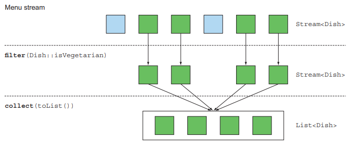
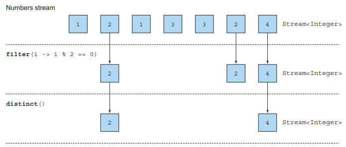
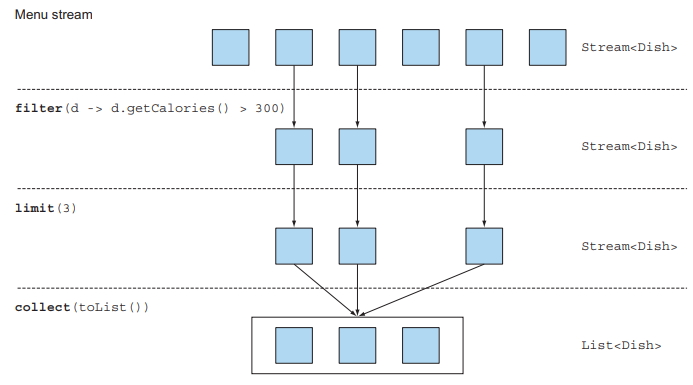
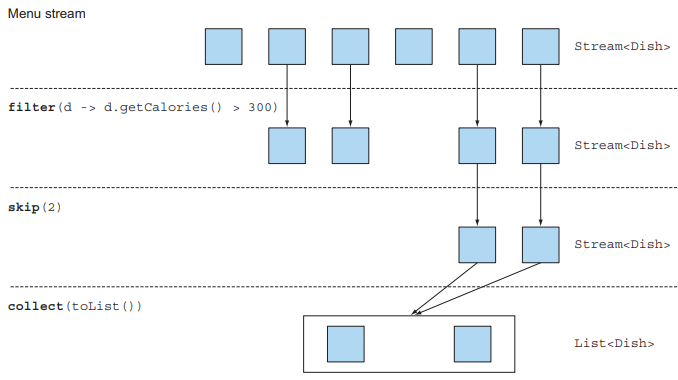
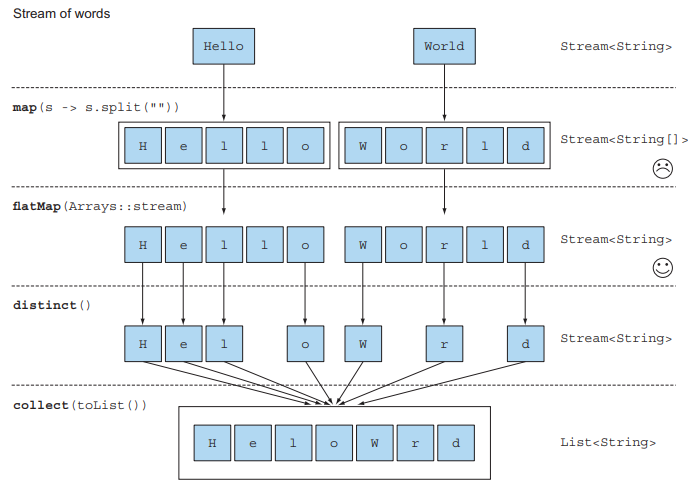
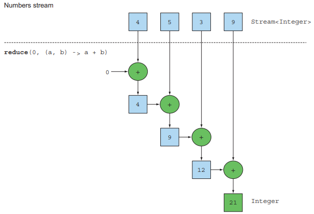

# 5장. 스트림 활용

## 5.1 필터링

### 5.1.1 프레디케이트로 필터링

<p align="center"></p>

filter 메서드는 Predicate(boolean을 반환하는 함수)를 인수로 받아서 `Predicate와 일치하는 모든 요소를 포함하는 스트림`을 반환한다.

### 5.1.2 고유 요소 필터링

<p align="center"></p>

distinct 메서드를 이용해 고유 요소로 이루어진 스트림을 반환할 수 있다.
이떄 `고유 여부의 판단은 객체의 hashCode, equals로 결정`된다.

---

## 5.2 스트림 슬라이싱

### 5.2.1 프레디케이트를 이용한 슬라이싱

### TakeWhile

많은 요소를 포함하고 있는 스트림에서 `특정 조건이 만족했을 때 반복 작업을 중단`할 때 사용한다.
TakeWhile을 이용하면 무한 스트림을 포함한 모든 스트림에 Predicate를 적용해 스트림을 슬라이스 할 수 있다.

```text
List<Dish> slicedMenu1 = specialMenu.stream()
  .takeWhile(dish -> dish.getCalories() < 320)
  .collect(toList());
```

### DropWhile

DropWhile은 takeWhile과 정반대 작업을 수행한다.
Predicate가 처음으로 거짓이 되는 지점까지 요소를 버리며, 즉 `Predicate가 거짓이 되는 지점부터 반환`한다.

```text
List<Dish> slicedMenu2 = specialMenu.stream()
  .dropWhile(dish -> dish.getCalories() < 320)
  .collect(toList());
```

### 5.2.2 스트림 축소

<p align="center"></p>

limit(n) 메서드를 이용하면 주어진 값 이하의 크기를 갖는 새로운 스트림을 반환한다.
filter와 limit을 조합하면 Predicate와 일치하는 요소를 주어진 갯수만큼 선택한 다음 즉시 결과를 반환한다

### 5.2.3 요소 건너뛰기

<p align="center"></p>

처음 n 개의 요소를 제외한 스트림을 반환하는 skip 메서드를 지원하며 limit과 상호 보완적인 연산을 수행한다.
만약 n 개이하의 요소를 가진 스트림이라면 빈 스트림이 반환된다.

---

## 5.3 매핑

### 5.3.1 스트림의 각 요소에 함수 적용하기

스트림은 함수를 파라미터로 받는 map 메서드를 지원하며, 파라미터로 제공된 함수는
각 요소에 적용되며 `함수를 적용한 결과가 새로운 요소로 매핑`된다.
이 과정은 새로운 버전을 만드는 개념에 가까우므로 `변환에 가까운 매핑`이다.

### 5.3.2 스트림 평면화

<p align="center"></p>

flatMap은 각 배열을 스트림이 아니라 `스트림의 컨텐츠로 매핑`한다. 즉, 하나의 평면화된 스트림을 반환한다.
flatMap은 스트림의 각 값을 다른 스트림으로 만든 다음에 `모든 스트림을 하나로 연결하는 기능`을 수행한다.

---

## 5.4 검색과 매칭

### 5.4.1 프레디케이트가 적어도 한 요소와 일치하는지 확인

스트림에서 `최소 하나의 요소와 일치하는지`를 확인할 때는 `anyMatch` 메서드를 이용한다.
anyMatch는 boolean을 반환하는 최종연산이다.

### 5.4.2 프레디케이트가 모든 요소와 일치하는지 검사

anyMatch와 달리 `모든 요소가 주어진 Predicate와 일치`하는 지 확인할 때는 `allMatch` 메서드를 이용한다.

### NoneMatch

allMatch와 반대연산을 수행하는 nonMatch는 `모든 요소가 주어진 Predicate와 일치하지 않는지 확인`한다.

### 쇼트서킷

anyMatch, allMatch, noneMatch 등의 메서드는 `쇼트서킷` 기법을 사용한다.
쇼트 서킷은 모든 스트림 요소를 처리하지않고 결과를 반환할 수 있다.

### 5.4.3 요소 검색

findAny 메서드는 현재 스트림에서 임의의 요소를 반환한다. 쇼트서킷을 이용해 `결과를 찾는 즉시 실행을 종료`한다.

### Optional

Optional은 값의 존재나 부재 여부를 표현하는 컨테이너 클래스이다.

- isPresent()
  - 값이 존재하면 true를 반환하고, 아니면 false를 반환
- ifPresent(Consumer<T> block)
  - 값이 존재하면 주어진 블록을 실행
  - void를 반환하는 람다를 전달
- T get()
  - 값이 존재하면 값을 반환하고, 아니면 NoSuchElementException을 발생
- T orElse(T other)
  - 값이 존재하면 값을 반환하고, 아니면 기본값을 반환

### 5.4.4 첫 번째 요소 찾기

findFirst 메서드는 스트림에서 첫 번째 요소를 찾는 연산이다.

### findFirst와 findAny는 언제 사용하나

findFirst와 findAny 모두 하나의 값을 찾으면 반환하게 되어있는데 왜 둘 다 필요할까?
바로 `병렬 실행` 때문으로, 병렬 실행 환경에서는 첫 번째 요소를 찾기 어렵기 때문에 
병렬 환경에서는 `반환 순서가 상관없다면 제약이 적은 findAny`를 사용해야 한다.

---

## 5.5 리듀싱

리듀스 연산을 이용하면 스트림 요소를 조합해서 더 복잡한 질의를 표현할 수 있다.
리듀싱 연산은 모든 스트림 요소를 처리해서 값으로 도출하는 것으로, 작은 조각이 될 때까지
반복해서 접는 것과 비슷해서 폴드(fold)라고 부른다.

### 5.5.1 요소의 합

<p align="center"></p>

리듀스를 이용한 모든 요소의 합을 보면 `스트림이 하나의 값으로 줄어들 때까지` 람다는 각 요소를 반복한다.

초기값을 받지 않도록 오버로드된 reduce도 존재하며 이때는 Optional 객체를 반환한다.
스트림에 아무 요소도 없는 상황이 존재할 수 있으므로 이를 방지하기 위해 Optional을 반환한다.

### 5.5.2 최댓값과 최솟값

reduce는 새로운 값을 이용해 스트림의 모든 요소를 소비할 때까지 람다를 반복하기에 최댓값과 최솟값을 구할 수 있다.

### reduce 메서드의 장점과 병렬화

기존 반복으로 합계를 구하는 것과 reduce를 이용하는 것은 무슨 차이가 있을까?
reduce는 내부 반복이 추상화되면서 내부 구현에서 병렬로 reduce를 실행할 수 있다.
반면, 기존 반복은 sum 변수를 공유하므로 병렬화가 쉽지 않다.

reduce를 이용해 병렬화를 진행하기 위해선 선행되야되는 조건이 있다.
바로 람다의 상태가 바뀌지 말아야하며, 연산이 어떤 순서로 실행되더라도 결과가 바뀌지 않아야한다.

### 상태 있음과 상태 없음

map, filter 등은 입력 스트림에서 각 요소를 받아 결과를 출력 스트림으로 보낸다.
따라서 람다가 내부적인 가변상태를 가지지 않는 이상 이들은 `내부 상태를 갖지 않는 연산`이다.

하지만, reduce, sum, max는 연산의 결과를 누적할 내부 상태가 필요하다. sorted나 distinct는
언뜻보기엔 상태가 없어 보이지만 스트림의 요소를 정렬하거나 중복을 제거하기 위해선 `과거의 이력`을 알아야한다.
이런 연산을 `내부 상태를 갖는 연산`이라고 한다.

---

## 5.7 숫자형 스트림

```text
int calories = menu.stream()
  .map(Dish::getCalories)
  .reduce(0, Integer::sum);
```

위 코드에는 `박싱 비용`이 숨겨져있다. 스트림 API 숫자 스트림을 효율적으로 처리할 수 있도록
`기본형 특화 스트림(primitive stream specialization)`을 제공한다.

### 5.7.1 기본형 특화 스트림

자바 8에서는 스트림 API가 박싱 비용을 피할 수 있도록 IntStream, DoubleStream, LongStream을 제공한다.

### 숫자 스트림으로 매핑

스트림을 특화 스트림으로 변환할 때 mapToInt, mapToDouble, mapToLong 메서드를 이용한다.
이 메서드들은 map과 같은 기능을 수행하지만, Stream<T> 대신 특화된 스트림을 반환한다.

### 객체 스트림으로 복원

숫자 스트림을 만든 다음에, 원상태인 특화되지 않은 스트림으로 복원할 수 있을까?
`boxed 메서드`를 통해 특화 스트림을 일반 스트림으로 변환할 수 있다.

### 기본값: OptionalInt

만약 IntStream에 요소가 없는 경우 기본 값이 0이라면, 실제 최댓값이 0인 상황과 어떻게 구별할 수 있을까?
이런 상황을 방지하기 위해 OptionalInt를 이용해 최댓값이 없는 상황을 표현할 수 있다.
OptinalInt와 같이 OptinalDouble, OptionalLong의 기본형 특화 스트림버젼도 존재한다.

### 5.7.2 숫자 범위

특정 범위의 숫자를 이용해야 하는 상황이라면 range와 rangeClosed라는 두 정적 메서드를 사용할 수 있다.
range 메서드는 시작값과 종료값이 결과에 포함되지 않는 반면, rangeClosed는 포함된다.

---

## 5.8 스트림 만들기

컬렉션에서 스트림을 얻을 수도 있고 범위의 숫자에서 스트림을 만들 수 도있다.
이빡에도 다양한 방식으로 스트림을 만들 수 있다.

### 5.8.1 값으로 스트림 만들기

임의의 수를 파라미터로 받는 정적 메서드 `Stream.of`를 이용해 스트림을 만들 수 있다

```text
Stream<String> stream = Stream.of("Modern", "Java", "In", "Action");
```

empty 메서드를 사용한다면 스트림을 비울 수 도 있다.

```text
Stream<String> emptyStream = Stream.empty();
```

### 5.8.2 null이 될 수 있는 객체로 스트림 만들기

null이 될 수 있는 객체를 스트림으로 만들어야 하는 상황에서 Stream.ofNullable을 사용할 수 있다.

```text
Stream<Sting> values = Stream.of("config", "home", "user")
  .flatMap(key -> Stream.ofNullable(System.getProperty(key)));
```

### 5.8.3 배열로 스트림 만들기

배열을 파라미터로 받는 정적 메서드 Arrays.stream을 이용해 스트림을 만들 수 있다

```text
int[] numbers = {2, 3, 5, 7, 11, 13};
int sum = Arrays.stream(numbers).sum();
```

### 5.8.4 파일로 스트림 만들기

파일을 처리하는 I/O 연산에 사용하는 자바의 NIO API도 스트림 API를 활용할 수 있다.
예를 들어 Files.lines는 주어진 파일의 행 스트림을 문자열로 반환한다.

```text
long uniqueWords = 0;
try (Stream<String> lines = Files.lines(Paths.get("data.txt"), Charset.defaultCharset())) {
  uniqueWords = lines.flatMap(line -> Arrays.stream(line.split(" ")))
    .distinct()
    .count();
} catch (IOException e) {
  e.printStackTrace();
}
```

### 5.8.5 함수로 무한 스트림 만들기

스트림 API는 함수에서 스트림을 만들 수 있는 Stream.iterate와 Stream.generate를 제공한다.
두 연산을 이용해 `무한 스트림(infinite stream)`, 즉 `크기가 고정되지 않은 스트림`을 만들 수 있다.
iterate와 generate에서 만든 스트림은 요청마다 주어진 함수를 이용해 값을 만들어낸다.

무한 스트림의 경우 limit을 이용해 명시적으로 스트림의 크기를 제한해야한다.
그렇지 않으면 최종 연산을 수행했을 때 아무런 결과가 나오지 않으며, 무한적으로 계산이 반복되므로 정렬하거나 리듀스 할 수 없다.

### iterate

```text
Stream.iterate(0, n -> n + 2)
  .limit(10)
  .forEach(System.out::println);
```

iterate 메서드는 초기값과 람다를 파라미터로 받아 새로운 값을 끊임없이 생산한다.
iterate는 요청할 때마다 값을 생산하기 때문에 `무한 스트림`을 만들 수 있다.
이런 스트림을 `언바운드 스트림(unbounded stream)`이라고 표현한다.

자바 9에서는 iterate 메소드는 Predicate를 지원한다.

```text
IntStream.iterate(0, n -> n < 100, n -> n + 4)
  .forEach(System.out::println);
```

두 번째 인수로 Predicate를 받아 언제까지 작업을 수행할지 정할 수있다.
filter를 통해 같은 결과를 얻을 수 있다고 생각하겠지만 이는 잘못된 생각이다.

```
IntStream.iterate(0, n -> n + 4)
  .filter(n -> n < 100)
  .forEach(System.out::println);
```

해당 코드는 종료되지 않으며, filter 메서드는 언제 이 작업을 중단해야 하는지 알 수 었다.
이런 경우 takeWhile을 이용해야 한다.

```text
IntStream.iterate(0, n -> n + 4)
  .takeWhile(n -> n < 100)
  .forEach(System.out::println);
```

### generate

iterate와 달리 generate는 생산된 값을 연속적으로 계산하지 않는다.

```text
Stream.generate(Math::random)
  .limit(5)
  .forEach(System.out::println);
```

---

## 결론

- filter, distinct, takeWhile, dropWhile, skip, limit 메서드로 스트림을 필터링하거나 슬리이싱할 수 있다
  - 소스가 정렬되어 있다는 사실을 알고 있을 땐, takeWhile, dropWhile 메서드를 이용해 더 효율적으로 스트림을 처리할 수 있다.
- map, flatMap 메서드로 스트림의 각 요소에 함수를 적용해서 다른 요소로 바꿀 수 있다.
- findFirst, findAny, anyMatch, allMatch, noneMatch 메서드를 이용해 스트림의 일부 요소가 특정 조건을 만족하는지 확인할 수 있다.
  - 이들 메서드는 쇼트서킷 기법을 이용하며 전체 스트림을 처리하지 않는다
- reduce 메서드는 스트림의 모든 요소를 반복, 조합하면서 값을 하나씩 계산한다.
- filter, map등은 상태 없는 연산이며, reduce 같은 연산은 값을 계산하는데 필요한 상태를 저장한다
  - sorted, distinct 등의 메서드는 새로운 스트림을 반환하기 전에 스트림의 모든 요소를 버퍼에 저장한다
- 기본형 특화 스트림을 이용하면 박싱 비용을 피할 수 있다.
- 컬렉션 뿐 아니라 값, 배열, 함수, 파일 등 다양한 소스로부터 스트림을 만들 수 있다.