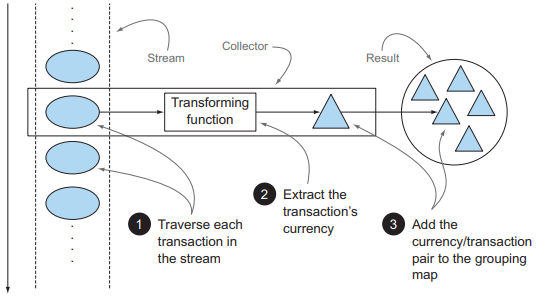
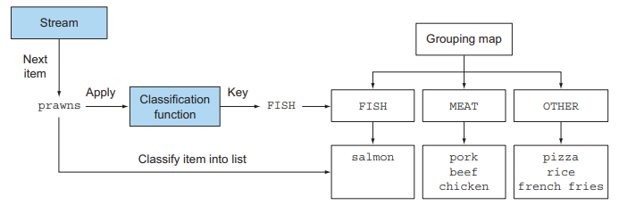
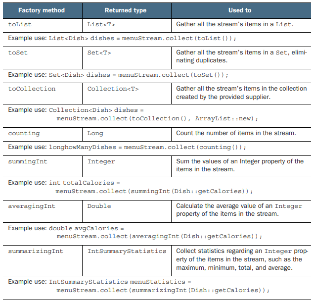
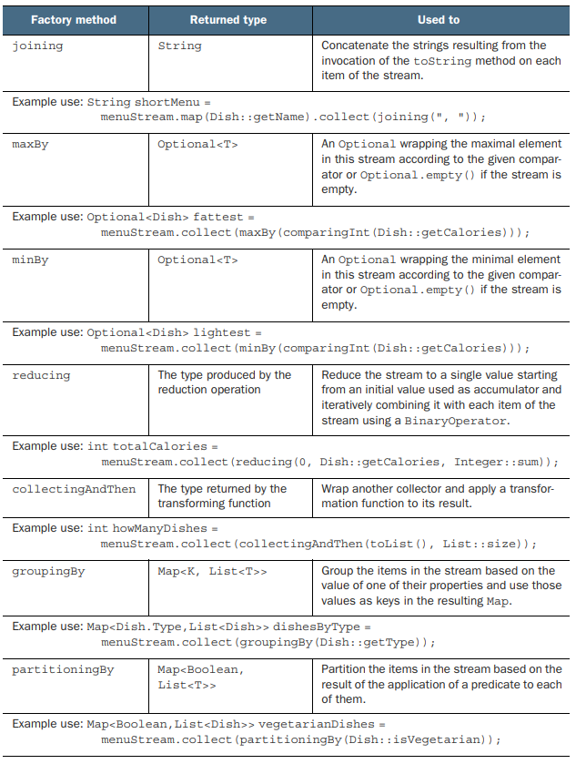
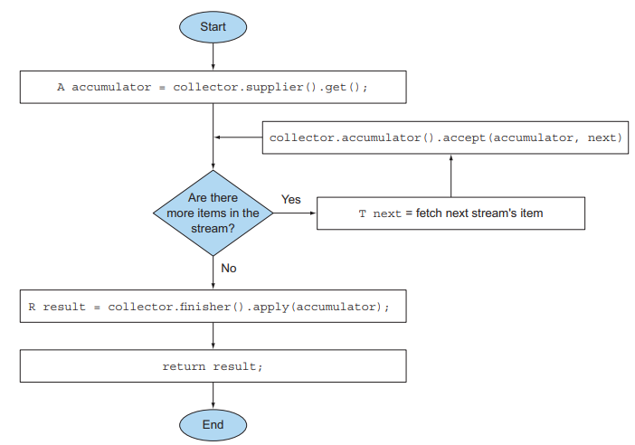
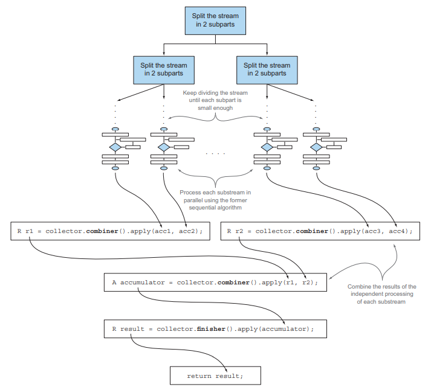

# 6장. 스트림으로 데이터 수집

스트림은 데이터 집합을 처리하는 게으른 반복자라고 할 수 있다.
중간 연산은 한 스트림을 다른 스트림으로 변환하는 연산으로서, 스트림 파이프라인을 구성하고, 
스트림요소를 소비하지 않는다.
최종 연산은 스트림의 요소를 소비해서 최종 결과를 도출하고 스트림 파이프라인을 최적화하면서 계산 과정을 짧게 생략하기도 한다.

이번 장에서 최종 연산인 collect, Collection, Collector 인터페이스를 헷갈리지 않도록 하자!

## 6.1 Collector 란 무엇인가

이전 장에서 collect 메서드로 Collector 인터페이스 구현을 전달했다.
이처럼 `Collector 인터페이스는 스트림 요소를 어떤 식으로 도출할지 지정`한다.
예를 들어, collect 메서드에 groupingBy Collector 인터페이스를 통해 키에 해당하는 요소를 맵으로 만들 수도 있다.

### 6.1.1 고급 리듀싱 기능을 수행하는 Collector

<p align="center"></p>

함수형 API의 장점은 높은 수준의 조합성과 재사용성을 들 수 있다. collec로 `결과를 수집하는 과정`을
간단하면서도 `유연한 방식으로 정의`할 수 있다는 점이 컬렉터의 최대 장점이다.
스트림에 collect를 호출하면 스트림의 요소에 대해 `리듀싱 연산이 수행`된다.

Collectors 유틸리티 클래스에는 자주 사용하는 컬렉터 인스턴스가 정적 팩토리 메서드로 제공된다.

### 6.1.2 미리 정의된 컬렉터

Collectors 유틸리티 클래스에서 제공하는 메서드의 기능은 크게 세가지로 구분된다.

- 스트림 요소를 하나의 값으로 리듀스하고 요약
- 요소 그룹화
- 요소 분할

## 6.2 리듀싱과 요약

collect 메서드의 파라미터인 Collector를 통해 스트림을 재구성할 수 있다.
트리를 구성하는 다수준 맵, 요소들의 합 등 다양한 형식으로 결과를 도출할 수 있다.

### 6.2.1 스트림값에서 최댓값과 최솟값 검색

Collectors.maxBy, minBy를 통해 스트림의 최댓값과 최솟값을 구할 수 있다.
두 컬렉터는 스트림의 욧를 비교하는데 사용할 Comparator를 파라미터로 받는다.

```text
Optional<Dish> mostCalorieDish = menu.stream()
  .collect(maxBy(comparingInt(Dish::getCalories)));
```

객체의 숫자 필드의 합계나 평균 등을 반환하는 연산에도 리듀싱 기능이 자주 사용되며 이런 연산을 `요약 연산`이라고 부른다.

### 6.2.2 요약 연산

#### Summing, Average

summingInt는 파라미터로 전달된 함수는 int 로 매핑한 컬렉터를 반환하며, collect 메서드에 전달되면 요약 작업을 수행한다.
summingInt 이외에도 summingLong, summingDouble도 존재한다.

단순 합계 이외에도 평균을 계산하는 요약 기능도 제공하며, averagingInt, averagingLong, averagingDouble가 존재한다.

#### Summarizing

두 개 이상의 연산을 한번에 수행해야 할 때, summarzing 기능을 사용할 수 있다.
summarzing 기능을 사용하면 총 수, 합계, 평균, 최댓값, 최솟값 등을 계산해준다.

```text
IntSummaryStatistics menuStatistics = menu.stream()
  .collect(summarizingInt(Dish::getCalories));
  
IntSummaryStatistics{count=9, sum=4300, min=120, average=477.777778, max=800}
```

### 6.2.3 문자열 연결

컬렉터에 joining을 이용하면 스트림 각 객체에 toString 메서드를 호출해서 모든 문자열을 하나로 연결해 반환한다.
joining 메서드는 내부적으로 `StringBuilder를 이용`해서 문자열을 하나로 만든다.
두 요소사이에 문자열을 넣을 수 있도록 오버로드된 joining 팩토리 메서드 또한 존재한다.

### 6.2.4 범용 리듀싱 요약 연산

위에서 살펴본 모든 컬렉터는 reducing 팩토리 메서드(Collectors.reduce)로도 구현 가능하다.
하지만 특화된 컬렉션을 사용해 프로그래밍적 편의성과 가독성을 높일 수 있다.

#### collect 와 reduce

그럼 collect와 reduce 메서드는 무엇이 다를까?

collect 메서드는 도출하려는 `결과를 누적하는 컨테이너를 바꾸도록 설계`된 반면,
reduce는 `두 값을 하나로 도출하는 불변현 연산`이라는 차이가 존재한다.
reduce 메서드를 잘못 사용하면 병렬 수행에도 문제가 생길 수 있다.

### 자신의 상황에 맞는 최적의 해법 선택

앞서 살펴본 것처럼 함수형 프로그래밍에서는 하나의 연산을 다양한 방법으로 해결할 수 있다.
또한 스트림 인터페이스에서 제공하는 메서드를 이용하는 것에 비해 `컬렉터를 이용하는 코드`가 더 복잡해지는 것도 알 수 있다.
하지만, 이를 통해 `재사용성과 커스터마이징 가능성`을 제공하는 높은 수준의 `추상화와 일반화`를 얻을 수 있다.

문제를 해결할 수 있는 다양한 해결 방법을 화인하고 현재에 맞는 방법을 선택하는 것이 중요하다.

---

## 6.3 그룹화

<p align="center"></p>

Collectors.groupingBy 메서드를 이용하면 스트림의 요소를 특정 기준에 따라 그룹화할 수 있다.
이 함수를 기준으로 스트림이 그룹화되므로 이를 `분류 함수`라고 부른다.

그룹화 연산의 결과로 그룹화 함수가 반환하는 키와 이에 대응하는 항목 리스트를 값으로 갖는 맵이 반환된다.
단순한 속성 접근자 대신 복잡한 분류 기준이 필요하다면 메서드 참조로는 분류 함수를 사용할 수 없다.

```text
Map<CaloricLevel, List<Dish>> dishesByCaloricLevel = menu.stream()
  .collect(groupingBy(dish -> {
    if (dish.getCalories() <= 400) return CaloricLevel.DIET;
    else if (dish.getCalories() <= 700) return CaloricLevel.NORMAL;
    else return CaloricLevel.FAT;
  }));
```

### 6.3.1 그룹화된 요소 조작

만약 그룹화를 한 이후에 각 결과 그룹에 요소를 조작하는 연산이 필요하다면, 그룹화를 하기전에
필터를 적용해서 문제를 해결할 수 있다고 생각할 수 있다.

```text
Map<Dish.Type, List<Dish>> caloricDishesByType = menu.stream()
  .filter(dish -> dish.getCalories() > 500)
  .collect(groupingBy(Dish::getType));
```

위 방식으로 문제해결이 가능하지만 전체 요소에 대한 필터링 이후 그룹화를 진행하기에,
누락되는 키값이 존재할 수 있다. 이런 경우 Collector 안으로 필터링을 위한 함수를 이동함으로써
문제를 해결할 수 있다.

```text
Map<Dish.Type, List<Dish>> caloricDishesByType = menu.stream()
  .collect(groupingBy(Dish::getType,
   filtering(dish -> dish.getCalories() > 500, toList())));
```

다른 유용한 기능으로는 맵핑 함수를 이용해 요소를 변환할 수 있다.
매핑 함수와 각 항목에 적용한 함수를 모으는데 사용하는 또다른 컬렉터를 인수로 받는 mapping 메서드를 제공한다.

```text
Map<Dish.Type, List<String>> dishNamesByType = menu.stream()
  .collect(groupingBy(Dish::getType,
    mapping(Dish::getName, toList())));
```

### 6.3.2 다수준 그룹화

Collectors.groupingBy는 일반적인 분류 함수와 `컬렉터`를 인수로 받는다.
즉, 바깥쪽 groupingBy 메서드에 항목을 분류할 두번째 내부 groupingBy를 통해 두 수준으로 스트림을 그룹화 할 수 있다.

```text
Map<Dish.Type, Map<CaloricLevel, List<Dish>>> dishesByTypeCaloricLevel = menu.stream()
  .collect(groupingBy(Dish::getType,
    groupingBy(dish -> {
      if (dish.getCalories() <= 400) return CaloricLevel.DIET;
      else if (dish.getCalories() <= 700) return CaloricLevel.NORMAL;
      else return CaloricLevel.FAT;
    })));
```

다수준 그룹화 연산은 다양한 수준으로 확장 가능하며, `n수준 그룹화 결과는 n수준 트리 구조로 표현되는 n수준 맵`이 된다.

### 6.3.3 서브 그룹으로 데이터 수집

첫번째 groupingBy로 넘겨주는 컬렉터의 형식은 제한이 없다. 만약 한개의 파라미터를 갖는 groupingBy(f)의 경우
`groupingBy(f, toList())`의 축약과 같다.

```text
Map<Dish.Type, Long> typesCount = menu.stream()
  .collect(groupingBy(Dish::getType, counting()));
```

### 컬렉터 결과를 다른 형식에 적용하기

collectingAndThen은 `적용할 컬렉터와 변환 함수를 파라미터로 받아 다른 컬렉터를 반환`한다. 

```text
Map<Dish.Type, Dish> mostCaloricByType = menu.stream()
  .collect(groupingBy(Dish::getType,
    collectingAndThen(
        maxBy(comparingInt(Dish::getCalories)),
         Optional::get)));
```

--- 

## 6.4 분할

Predicate를 분류 함수로 사용하는 그룹화 기능을 `분할 함수`라고 한다.
분할 함수는 불리언을 반환하고, 결과적으로 그룹화 맵은 참 또는 거짓의 값을 갖는 두 개의 그룹으로 분류된다.
분할 함수를 사용하지 않고 Predicate를 이용해 필터링을 한 후 리스트로 결과를 수집해도 동일한 결과를 얻을 수 있다.

### 6.4.1 분할의 장점

분할 함수를 이용하면 스트림을 분할할 때 `선택 조건에 맞는 항목과 그렇지 않은 항목을 따로 모을 수 있다`.
partitioningBy가 반환한 맵은 참과 거짓 두 가지 키만 가지므로 간결하고 효과적이다.

---

## Collectors Static Method List

<p align="center"></p>
<p align="center"></p>

---

## 6.5 Collector 인터페이스

Collector 인터페이스는 리듀싱 연산을 어떻게 구현할지 제공하는 메서드 집합으로 구성된다.
Collector 인터페이스를 직접 구현해서 더 효율적으로 문제를 해결하는 컬렉터를 만들 수 있다.

우선적으로 가장 많이 사용되는 toList가 어떻게 구현되었는지 살펴보자

```text
public interface Collector<T, A, R> {
  Supplier<A> supplier();
  BiConsumer<A, T> accumulator();
  Function<A, R> finisher();
  BinaryOperator<A> combiner();
  Set<Characteristics> characteristics();
}
```

- T: 수집될 스트림 항목의 제네릭 형식
- A: 누적자, 수집 과정에서 중간 결과를 누적하는 객체의 형식
- R: 수집 연산 결과 객체의 형식(대부분 컬렉션)

### 6.5.1 Collector 인터페이스의 메서드 살펴보기

<p align="center"></p>

첫 네개의 메서드는 collect 메서드에서 실행하는 함수를 반환하지만, 마지막 메서드 characteristics는
collect 메서드가 어떤 최적화를 이용해 리듀싱 연산을 수행할지 결정하도록 돕는 hint 집합을 제공한다.

#### supplier 메서드 - 새로운 결과 컨테이너 만들기

supplier 메서드는 `빈 결과로 이루어진 Supplier`를 반환한다.
즉, supplier는 수집 과정에서 `빈 누적자 인스턴스를 만드는 파라미터가 없는 함수`이다.

```text
public Supplier<List<T>> supplier() {
    return () -> new ArrayList<T>();
}

public Supplier<Set<T>> supplier() {
    return () -> new HashSet<T>();
}
```

#### accumulator 메서드 - 결과 컨테이너에 요소 추가하기

accumulator 메서드는 `리듀싱 연산을 수행하는 함수`를 반환한다.
스트림에서 n 번째 요소를 탐색할 때 두 개의 파라미터, 즉 스트림의 `n-1 항목과 n 번째 항목`을 함수에 적용한다.

```text
public BiConsumer<List<T>, T> accumulator() {
    return (list, item) -> list.add(item);
}

public BiConsumer<Set<T>, T> accumulator() {
    return (set, item) -> set.add(item);
}
```

#### finisher 메서드 - 최종 변환값을 결과 컨테이너로 적용하기

finisher 메서드는 스트림 탐색을 끝내고 누적자 객체를` 최종 결과로 변환할 때 호출할 함수`를 반환한다.
누적자 객체가 이미 최종 결과인 상황에서는 별도의 변환과정이 필요 없으므로, 항등 함수를 반환한다.

```text
public Function<List<T>, List<T>> finisher() {
    return Function.identity();
}
```

#### combiner 메서드 - 두 결과 컨테이너 병합

<p align="center"></p>

combiner는 스트림의 서로 다른 `서브파트를 병렬로 처리`할 때 누적자가 이 `결과를 어떻게 처리할지 정의`한다.
스트림의 리듀싱을 병렬로 수행할 때 자바 7의 Fork/Join 프레임워크와 Spliterator를 사용한다.
다음은 병렬 리듀싱 수행 과정을 알려준다.

- 스트림을 분할해야 하는지 정의하는 조건이 거짓이 될 때 까지 스트림을 재귀적으로 분할
  - 일반적으로 프로세싱 코어 갯수를 초과하는 병렬 작업은 비효율
- 모든 서브스트림의 각 요소에 리듀싱 연산을 순차적으로 적용
- combiner 메서드가 반환하는 함수로 모든 결과를 합친다
- 모든 결과를 합치면서 연산이 완료

#### characteristics 메서드 - 컬렉터의 병렬 처리 힌트 집합

characteristics 메서드는 컬렉터의 연산을 정의하는 Characteristics 형식의 불변 집합을 반환한다.
스트림을 병렬로 리듀스할 것인지 병렬로 리듀스한다면 어떤 최적화를 선택할지 힌트를 제공한다.

- UNORDERED
  - 리듀싱 결과는 스트림 요소의 방문 순서나 누적 순서에 영향을 받지 않는다.
- CONCURRENT
  - 다중 스레드에서 accumulator 함수를 동시에 호출할 수 있으며, 컬렉터는 스트림의 병렬 리듀싱을 수행할 수 있다.
  - UNORDERED를 함께 설정하지 않는다면, 집합처럼 요소의 순서가 무의미한 상황에서만 리듀싱을 수행할 수 있다.
- IDENTITY_FINISH
  - finisher 메서드가 반환하는 함수는 단순히 identity를 적용할 뿐이므로 생략할 수 있다.

### 컬렉터 구현 없이 커스텀 수집 수행하기

Stream은 세 발행, 누적, 합침을 인수로 받는 collect 메서드를 오버로드 하여,
Collector 인터페이스의 메서드가 반환하는 함수와 같은 기능을 수행할 수 있다.

```text
List<Dish> dishes = menu.stream()
  .collect(
        ArrayList::new,
        List::add,
        List::addAll);
```

Collector 인터페이스를 구현하는 것보다 간결하지만 가독성이 떨어지는 단점이 존재한다.
그렇기에 필요에 따라 커스텀 컬렉터를 구현하는 것이 중복을 피하고 재사용성을 높일 수 있다.
또한, Characteristic을 전달할 수 없기에 IDENTIFY_FINISH와 CONCURRENT지만 UNORDERED는 아닌 컬렉터로만 동작한다.

---

## 결론

- collect는 스트림의 요소를 수집하는 다양한 방법을 파라미터로 갖는 최종 연산이다
  - 스트림의 요소를 하나의 값으로 리듀스하고 요약할 수 있으며, 최소, 최대, 평균등에 대한 컬렉터가 미리 정의되어 있다.
- groupingBy를 통해 스트림의 요소를 그룹화하거나 partitioningBy를 통해 분할할 수 있다.
- Collector는 다수준의 그룹화, 분할, 리듀싱 연산에 적합하게 설계되어 있다
- Collector 인터페이스에 정의된 메서드를 통해 커스텀 컬렉터를 만들 수 있다.