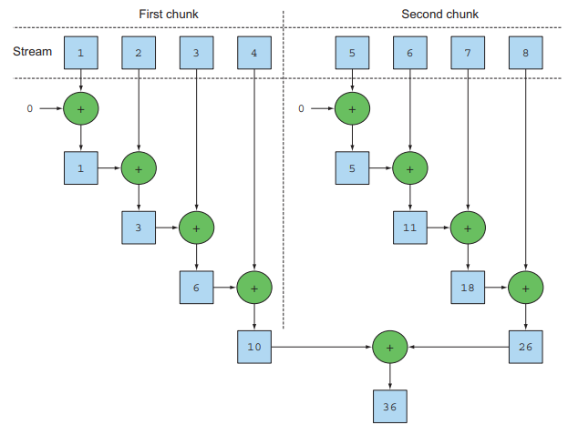
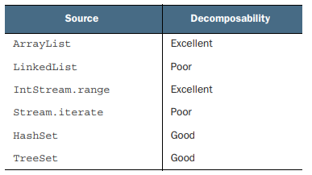
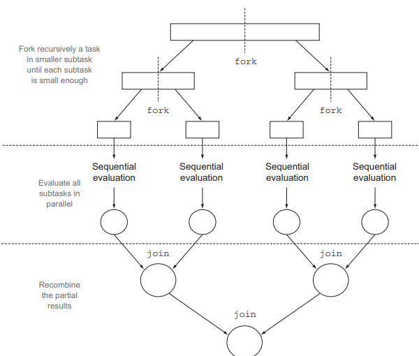
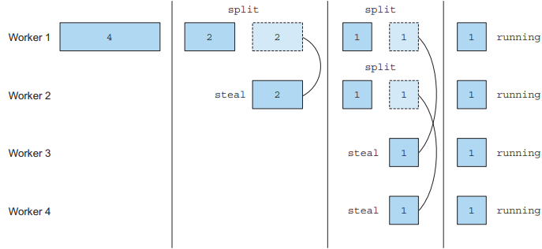
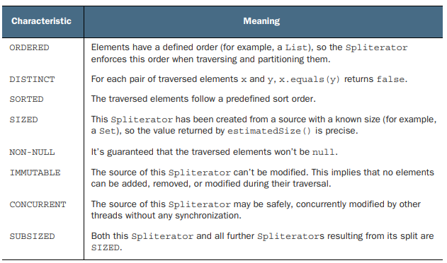

# 7장. 병렬 데이터 처리와 성능

## 7.1 병렬 스트림

### 7.1.1 순차 스트림을 병렬 스트림으로 변환하기
```text
public long parallelSum(long n) {
    return Stream.iterate(1L, i -> i + 1)
                 .limit(n)
                 .parallel()
                 .reduce(0L, Long::sum);
}
```

순차 스트림에 parallel 메서드를 호출하면 기존의 함수형 리듀싱 연산이 병렬로 처리된다.
순차 스트림과 다른 점은 스트림이 여러 청크로 분활 되고 여러 청크에서 병렬로 수행된다.
마지막으로 리듕싱 연산으로 생성된 부분 겨로가를 다시 리듀싱 연산으로 합쳐서 전체 스트림의 리듀싱 연산 겨로가를 도출한다.

<p align="center"></p>

반대로 sequential 메서드를 호출하면 병렬 스트림을 순차 스트림으로 변환할 수 있다.
어떤 연산을 병렬로 실행하고 어떤 연산을 순차로 실행할지 제어 할 수 있다.
하지만 parallel과 sequential 두 메서드 중 최종적으로 호출된 메서드가 전체 파이프라인에 영향을 미치게 된다

### 7.1.2 스트림 성능 측정

그렇다면 병렬을 이용하면 항상 순차나 반복에 비해 성능이 좋아질까?
자바 마이크로 벤치마크 하니스(JMH) 라이브러리를 통해 이를 측정해보면 생각과는 다르다는 사실을 알 수 있다.

```text
iterativeSum -> avg : 3.278
sequentialSum -> avg : 121.843
parallelSum -> avg : 604.059
```

오히려 순차스트림에 비해 5배나 느린 결과를 얻게되는데 왜 그럴까?

- 반복 결과로 박싱된 객체가 만들어지므로 숫자를 더하려면 항상 `언박싱`을 해야한다
- 반복 작업은 병렬로 수행할 수 있는 `독립 단위`로 나누기 어렵다

특히 `이전 연산의 결과에 따라 다음 함수의 입력이 달라지는 iterate 연산`은 청크를 분할하기 어렵다
리듀싱을 시작하는 시점에 전체 숫자 리스트가 준비되어 있지 않으므로 병렬로 처리할 수 있도록 청크를 분할할 수 없다.

따라서, parallel 메서드를 호출할 때 `내부적으로 어떤 일이 일어나는지` 꼭 이해해야한다.

#### 특화된 메서드 사용

iterate 대신 이전에 살펴본 rangedClosed 메서드를 사용하면 다음과 같은 장점이 생기며 이를 측정한 결과는 다음과 같다

- rangedSum -> avg : 5.315
- parallelRangedSum -> avg : 2.677
- 기본형을 사용하므로 박싱과 언박싱 오버헤드가 사라진다
- 청크를 분할할 수 있는 숫자 범위를 생성한다

특화되지 않은 스트림은 오토박싱, 언박싱의 오버헤드를 수반하기 때문에 상황에 따라서
병렬화하는 것 보다 `적절한 자료구조를 선택하는 것이 더 중요`하다는 사실을 알 수 이싿.

즉, 병렬화는 공짜가 아니고 다음과 같은 비용이 발생한다.

- 스트림을 재귀적으로 분할
- 각 서브스트림을 서로 다른 스레드의 리듀싱 연산으로 할당
- 결과를 하나로 합침
- 멀티코어간 데이터 이동

멀티코어간 데이터 이동은 생각보다 비싸기에 데이터 전송시간보다 오래 걸리는 작업만 병렬로 다른 코어에서 작업하는 것이 바람직하다.

### 7.1.3 병렬 스트림의 효과적인 사용법

병렬 스트림 사용시 가장 많이 발생하는 문제는 공유된 상태를 바꾸는 알고리즘을 사용하기 때문에 일어난다.

```text
public static long sideEffectSum(long n) {
    Accumulator accumulator = new Accumulator();
    LongStream.rangeClosed(1, n).forEach(accumulator::add);
    return accumulator.total;
}

public static class Accumulator {
    public long total = 0;
    public void add(long value) { total += value; }
}
```

위 코드는 본질적으로 순차 실행할 수 있도록 구현되어 있으므로 병렬 스트림을 사용하면서 공유된 가변 상태를 바꾸는 코드이다.
그렇기에 병렬 스트림과 병렬 계산에서는 공유된 가변 상태는 반드시 피해야 한다.

### 7.1.4 병렬 스트림 효과적으로 사용하기

그렇다면 어떤 상황에서 병렬 스트림을 사용해야할까? 몇 가지 힌트를 살펴보자

- 직접 측정해보기
  - 언제나 병렬 스트림이 순차 스트림보다 빠른 것은 아니기에 의심이 될 때는 측정을 해보자
- 박싱을 주의하자
  - 자동 박싱과 언박싱은 성능을 크게 저하시킨다
  - 되도록이면 기본형 특화 스트림을 사용하자
- 순차 스트림보다 병렬 스트림에서 성능이 떨어지는 연산이 있다
  - limit, findFirst 등의 short-circuiting 연산은 스트림의 일부분만 탐색하기 때문에 병렬로 실행한다고 해서 성능이 개선되지 않는다
  - 또한 순서에 의존하는 연산은 스트림에서 수행하려면 비싼 비용을 치뤄야한다
  - findAny는 순서와 상관없이 연산하므로 findFirst 보다 성능이 좋다
- 전체 파이프라인 연산 비용을 고려하자
  - 처리해야할 요소 수가 N, 하나의 요소를 처리하는데 드는 비용이 Q라면 전체 처리 비용은 N*Q가 된다
  - Q 가 높아지면 병렬 스트림으로 성능을 개선할 가능성이 있음을 의미한다
- 소량의 데이터에서는 병렬 스트림이 도움되지 않는다
  - 스트림을 생성하는 비용이 비싸기 때문이다
  - 병렬화 과정에서 생기는 부가비용을 상쇄할 수 있을 만큼 이득을 얻지 못할 수 있다
- 스트림을 구성하는 자료구조가 적절한지 확인하자
  - ArrayList는 분할이 쉽지만 LinkedList는 분할이 어렵다
    - ArrayList는 요소를 탐색하지 않고도 리스트를 분할 가능하기 때문이다
- 파이프라인의 중간 연산이 스트림 특성을 어떻게 바꾸는지에 따라 분해 과정의 성능이 달라질 수 있다
  - filter 연산이 존재한다면 스트림의 길으를 예측할 수 없으므로 효과적으로 스트림을 병렬처리 할 수 없다
- 병합과정 비용을 살펴보자
  - 병합 과정의 비용이 비싸다면 병렬 스트림의 성능을 떨어뜨릴 수 있다

#### 스트림 소소의 병렬화 친밀도

<p align="center"></p>

---

## 7.2 Fork/Join 프레임워크

포크/조인 프레임워크는 병렬화할 수 있는 작업을 재귀적으로 작은 작업으로 분할한 다음 서브테스트 각각의 결과를 합쳐셔 전체 결과를 만들도록 설계되었다.
서브테스크를 ForkJoinPool의 작업자 스레드에 분산할당하는 ExecutorService 인터페이스를 구현한다.

### 7.2.1 RecursiveTask 활용

ForkJoinPool을 이용하려면 RecursiveTask<R>의 서브클래스를 만들어야 한다.
R은 병렬화된 테스크가 생성하는 결과 형식이거나 결과가 없을 때는 RecursiveAction의 형식을 갖는다.
또한 RecursiveTask는 추상 메서드인 compute를 구현해야 한다.

```text
protected abstract R compute();
```

compute 메서드는 테스크를 서브테스크로 분할하는 로직과 분할이 불가능해졌을 때 서브테스크의 결과를 생산하는 알고리즘을 정의한다.
대부분의 compute 메서드는 다음의 형태를 가진다.

```text
if (테스크가 충분히 작거나 더 이상 분할할 수 없으면) {
    순차적으로 테스크를 실행
} else {
    테스크를 두 서브테스크로 분할
    테스크가 다시 서브테스크로 분할되도록 메서드를 재귀 호출
    모든 서브테스크의 연산이 완료될 때까지 대기
    서브테스크의 결과를 합침
}
```

<p align="center"></p>

일반적으로 어플리케이션은 두개 이상의 ForkJoinPool을 사용하지 않는다.
즉, 싱클턴 형태로 이를 저장하고 필요시 가져다가 쓰는 형태를 취하게 된다.
Runtime.availableProcessors()를 통해 사용할 스레드 수를 결정하지만, 실제로는 프로세서 갯수 외에 하이퍼 스레딩과 관련된 가상 프로세서도 갯수에 포함된다.

### 7.2.2 Fork/Join 프레임워크 제대로 사용하기

포크/조인 프레임워크는 사용하기 쉬운 편이지만 주의를 기울여햐하는 부분이 존재한다

- join 메서드를 테스크에 호출하면 결과가 준비될 때까지 호출자를 블록시킨다
  - 두 서브테스크가 모두 시작한 다음에 join을 호출해야 함
  - 서브테스크가 다른 테스크가 끝나길 기다리는 부분에서 순차알고리즘보다 느려질 가능성 존재
- RecursiveTask 내에서는 ForkJoinPool의 invoke 메서드를 절대 호출하지 말자
  - invoke 메서드는 테스크를 동기적으로 실행하므로 병렬성을 잃게 된다
  - 대신 compute나 fork 메서드를 호출하자
- 서브테스크에 fork 메서드를 호출해서 ForkJoinPool의 일정을 조절할 수 있다
  - 두 테스크를 실행할 때, 한쪽 작업에는 fork 다른쪽에는 compute 메서드를 호출하는 것이 효율적이다
  - 각 테스크는 같은 스레드를 재사용할 수 있어 불필요한 테스크를 할당하는 오버헤드를 줄일 수 있다
- 포크/조인 프레임워크를 이용하는 병렬 계산은 디버깅하기 어렵다
- 포크/조인 프레임워크를 사용하는 것이 무조건적으로 순차처리보다 빠르지 않을 수 있다
  - 테스크를 분할하는 작업과 각 서브테스크의 결과를 합치는 작업에 비용이 발생하기 때문
  - 고려해야하는 다른 요소
    - JIT 컴파일러에 의한 최적화는 몇 차례의 준비과정과 실행과정을 거쳐야함
    - 컴파일러의 최적화는 병렬보다 순차버전에 집중되기 쉬움

### 7.2.3 작업 훔치기

<p align="center"></p>

실제로 각 테스크가 CPU에 할당되는 상황이라면 특정 갯수로 서브테스크를 분할한다고 해서 성능이 좋아지진 않는다.
코어 갯수와 상관없이 적절한 크기로 분할된 많은 테스크를 포킹하는 것이 더 적합한 방법이다.
이론적으로는 병렬화된 작업이 같은 시간에 끝날 것 같지만, 실제로는 각 작업완료시간으 크게 달라질 수 있다.

이 문제를 포크/조인 프레임워크에서는 `작업 훔치기 기법`으로 해결한다.

- ForkJoinPool은 모든 스레드에 거의 공평하게 작업을 분할한다
- 각 스레드는 자신에게 할당된 테스크를 포함하는 이중 연결 리스트를 참조하며 작업이 끝나면 큐의 head에서 다른 테스크를 가져와 작업을 처리
- 스레드 별로 작업완료 시간이 달라지게 되고 할일이 없어진 테스크는 다른 스레드의 큐의 tail에서 작업을 훔쳐옴
- 모든 테스크가 끝날 때까지 이 작업이 반복

작업 훔치기 기법을 사용하기 때문에 특정 갯수가 아닌 최대한 테스크의 크기를 작게 나누는 것이 스레드간 작업 부하를 비슷한 수준으로 유지할 수 있는 방법이다.

---

### 7.3 Spliterator 인터페이스

자바 8은 Spliterator 인터페이스를 통해 병렬 작업에 특화된 `분할할 수 있는 반복자`를 제공한다.
자바 8의 컬렉션 프레임워크에 포함된 모든 자료구조에서 사용할 수 있는 디폴트 Spliterator 구현을 제공한다.

```text
public interface Spliterator<T> {
    boolean tryAdvance(Consumer<? super T> action);
    Spliterator<T> trySplit();
    long estimateSize();
    int characteristics();
}
```

- T는 탐색하는 요소의 형식
- tryAdvance
  - Spliterator의 요소를 하나씩 순차적으로 소비하면서 탐색해야 할 요소가 남아있으면 참을 반환
- trySplit
  - Spliterator의 일부 요소를 분할해서 두 번째 Spliterator를 생성
- estimateSize
  - 탐색해야 할 요소 수 정보를 제공
  - 요소 수가 정확하진 않더라도 제공된 값을 이용해 더 공평하게 Spliterator를 분할 가능
- characteristics
  - Spliterator 자체의 특성을 int 형태의 상수로 반환
  - ORDERED, DISTINCT, SORTED, SIZED, NONNULL, IMMUTABLE, CONCURRENT, SUBSIZED

### 7.3.1 분할 과정

<p align="center"></p>

스트림을 여러 스트림으로 분할하는 과정은 재귀적으로 동작한다.
가장 마지막 단계를 보면 모든 Spliteator에 호출한 모든 trySplit 메서드가 null을 반환하면서 분할 과정이 완료된다.
위 분할과정은 characteristics 메서드가 반환하는 특성에 영향을 받는다.

#### Spliterator 특성

<p align="center"></p>

Characteristics 메서드는 Spliterator 자체의 특성 집합을 포함하는 int를 반환한다.
특성을 참고하여 Spliterator를 잘 제어하고 최적화 할 수 있다.

## 결론

- 내부 반복을 이요하면 명시적으로 다른 스레드를 사용하지 않고도 스트림을 병렬로 처리 가능하다
- 병렬 처리가 항상 빠른 것은 아니기에 항상 측정이 필요하다
- 병렬 스트림은 처리해야할 데이터가 많거나 각 요소를 처리하는데 오랜 시간이 걸리 때 효과적이다
- 가능하다면 기본형 특화 스트림을 사용하거나 올바른 자료구조를 선택하는 것이 병렬처리 보다 성능적으로 더 큰 영향을 미칠 수 있다
- 포크/조인 프레임워크는 테스크를 작은 테스크로 분할하고 각 스레드로 실행하여 결과를 합쳐 최종결과를 만든다
- Spliterator는 탐색하려는 데이터를 포함하는 스트림을 어떻게 병렬화할 것인지 정의한다