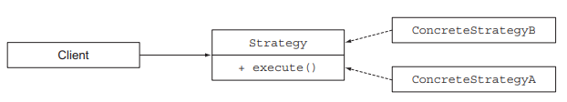
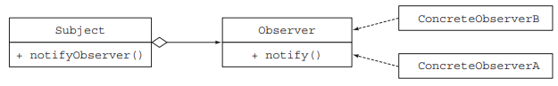
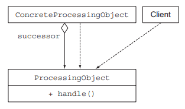
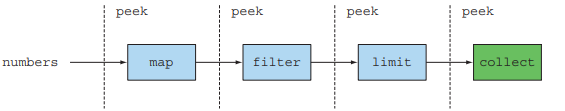

# 리팩토링, 테스팅, 디버깅

## 9.1 가독성과 유연성을 개선하는 리팩토링

### 9.1.1 코드 가독성 개선

코드 가독성이 좋다는 것은 어떤 코드를 다른 사람도 쉽게 이해할 수 있음을 의미한다.
자바 8의 기능을 이용해 코드 가독성을 높일 수 있는 방법에 대해 소개한다.

- 익명 클래스를 람다 표현식으로 리팩토링
- 람다 표현식을 메서드 참조로 리팩토링
- 명령형 데이터 처리를 스트림으로 리팩토링

### 9.1.2 익명 클래스를 람다 표현식으로 리팩토링

하나의 추상 메서드를 구현하는 익명 클래스는 람다 표현식으로 리팩토링할 수 있다.
람다 표현식을 이용해 간결하고, 가독성 좋은 코드로 리팩토링할 수 있다.

```text
Runnable r1 = new Runnable() {
    @Override
    public void run() {
        System.out.println("Hello World 1");
    }
};

Runnable r1 = () -> System.out.println("Hello World 1");
```

하지만 모든 익명 클래스를 람다 표현식으로 변환 가능할 때 주의할 점이 있다.

- 익명 클래스에서 사용한 this와 super는 람다 표현식에서 다른 의미를 가진다
  - 익명 클래스의 this는 익명 클래스 자신
  - 람다에서 this는 람다를 감싸는 클래스
- 익명 클래스는 감싸고 있는 클래스의 변수를 가리킬 수 있다
  - 섀도우 변수(shadow variable)
  - 람다 표현식으로는 변수를 가리킬 수 없음
- 익명 클래스를 람다 표현식으로 바꾸면 컨텍스트 오버로딩에 따른 모호함이 존재할 수 있다
  - 익명 클래스는 명시적으로 형식이 정해짐
  - 람다의 형식은 컨텍스트에 따라 달라짐
  - 명시적 형변환을 통해 모호함을 제거해야 함
```text
interface Task {
    public void execute();
}

public static void doSomething(Runnable r) { r.run(); }
public static void doSomething(Task a) { a.execute(); }
```

### 9.1.3 람다 표현식을 메서드 참조로 리팩토링

람다 표현식을 대신 메서드 참조의 메서드명을 통해 코드의 의도를 제대로 전달하여 가독성을 높일 수 있다.

### 9.1.4 명령형 데이터 처리를 스트림으로 리팩토링

이론적으로 반복자를 이용한 기존 모든 컬렉션 처리를 스트림 API로 바꿔야한다.
왜냐면 스트림 API는 데이터 처리 파이프라인의 의도를 더 명확히 보여주기 때문이다.

하지만 명령형 코드의 break, continue, return 등의 제어 흐름문을 모두 분석해서 같은 기능을 수행하는
스트림 연산으로 유추해야하는 것은 쉬운일이 아니다.

### 9.1.5 코드 유연성 개선

#### 함수형 인터페이스 적용

람다 표현식을 사용하려면 함수형 인터페이스가 필요하다. 자주 사용되는 조건부 연기 실행과 어라운드 패턴으로
람다 표현식 리팩토링을 진행해보자.

#### 조건부 연기 실행

실제 작업을 처리하는 코드 내부에 제어 흐름문이 복잡하게 얽힌 보안 검사나 로깅관련 코드가 조건부 실행이라고 볼 수 있다.

```text
if (logger.isLoggable(Log.FINER)) {
    logger.finer("Problem: " + generateDiagnostic());
}
```

- looger의 상태가 isLoggable이라는 메서드에 의해 클라이언트 코드로 노출
- 로깅할 때 마다 logger 객체의 상태를 매번 확인

```text
logger.log(Level.FINER, "Problem: " + generateDiagnostic());
```

- 위처럼 내부적으로 로거 객체의 상태를 확인하도록 구현할 수 있다.
하지만 이 경우에도 logger가 활성화 되어있지 않더라도, 항상 로그 메시지를 평가하게 된다.

```text
public void log(Level level, Supplier<String> msgSupplier) {
    if (logger.isLoggable(level)) {
        log(level, msgSupplier.get());
    }
}

logger.log(Level.FINER, () -> "Problem: " + generateDiagnostic());
```

- 메서드 파라미터화를 통해 logger가 활성화되어 있지않은 경우 메시지의 생성을 연기할 수 있다.
- 클라이언트 코드에서 객체 상태를 자주 확인하거나 객체의 일부 메서드를 호출하는 경우에는
람다나 메서드 참조를 파라미터로하여 새로운 메서드를 구현하는 것이 좋다.

#### 실행 어라운드

매번 같은 준비, 종료 과정을 반복적으로 수행하는 코드가 있다면 이 부분을 람다로 변환할 수 있다.

---

## 9.2 람다로 객체지향 디자인 패턴 리팩토링

### 9.2.1 Strategy 패턴

<p align="center"></p>

전략패턴은 런타임에 적절한 알고리즘을 선택하는 기법이다. 다양한 기준을 갖는 입력 값을
검증하거나, 다양한 파싱 방법을 사용하거나, 입력 형식을 설정하는 등 다양한 시나리오에 사용할 수 있다.

다양한 전략을 구현하는 새로운 클래스를 새로 구현할 필요없이 람다 표현식으로 직접 전달하면 코드가 간결해진다.
즉, 람다 표현식으로 전략 디자인 패턴을 대신할 수 있다.

```text
Validator numericValidator = new Validator((String s) -> s.matches("[a-z]+"));
boolean b1 = numericValidator.validate("aaaa");

Validator lowerCaseValidator = new Validator((String s) -> s.matches("\\d+"));
boolean b2 = lowerCaseValidator.validate("bbbb");
```

### 9.2.2 Template Method 패턴

아웃라인을 제공한 다음 알고리즘의 일부를 고칠 수 있는 유연함을 제공할 때 템플릿메서드 패턴을 사용한다.
즉, 이 알고리즘을 사용하고 싶은데 그대로는 안되고 조금 고쳐야하는 상황에 적합하다.

```text
abstract class OnlineBanking {
    public void processCustomer(int id) {
        Customer c = Database.getCustomerWithId(id);
        makeCustomerHappy(c);
    }

    abstract void makeCustomerHappy(Customer c);
}
```

람다 표현식이나 메서드 참조로 알고리즘에 추가할 다양한 컴포넌트를 구현할 수 있다.

```text
public void processCustomer(int id, Consumer<Customer> makeCustomerHappy) {
    Customer c = Database.getCustomerWithId(id);
    makeCustomerHappy.accept(c);
}

new OnlineBankingLambda().processCustomer(1337,
    (Customer c) -> System.out.println("Hello " + c.getName()));
```

### 9.2.3 Observer 패턴

<p align="center"></p>

이벤트가 발생했을 때 주체가 다른 객체 리스트인 옵저버들에게 자동으로 알림을 보내야하는 상황에
옵저버 디자인 패턴이 사용된다.

보통 Observer 인터페이스를 구현하는 모든 클래스는 notify와 같은 메서드를 구현하는데,
이 메서드는 주체가 옵저버에게 알림을 보낼 때 호출된다.
어떤 동작을 수행할 것인지를 인스턴스화 하지 않고 람다 표현식으로 전달해서 실행할 동작을 지정할 수 있다.

```text
f.registerObserver((tweet) -> {
    if (tweet != null && tweet.contains("money")) {
        System.out.println("Breaking news in NY! " + tweet);
    }
});

f.registerObserver((tweet) -> {
    if (tweet != null && tweet.contains("queen")) {
        System.out.println("Yet another news in London... " + tweet);
    }
});

pulbic void notifyObservers(String tweet) {
    observers.forEach(o -> o.notify(tweet));
}
```

실행해야할 동작이 간단한 경우 람다를 통해 불필요한 코드를 제거할 수 있지만,
옵저버가 상태를 가지거나 여러 메서드가 정의되는 등의 복잡해지는 경우 기존 클래스 방식으로 구현하는 것이 좋다.

### 9.2.4 Chain of Responsibility 패턴

<p align="center"></p>

한 객체가 어떤 작업을 처리한 다음 다른 객체로 결과를 전달하고, 다른 객체도 작업을 처리하고
또 다른 객체에 전달하는 것이 의무 체인 패턴이다. 보통 처리할 객체 정보를 유지하는 필드를 가지고 있다.

람다 표현식을 조합하는 방법 중 andThen을 이용하면 함수를 조합해서 체인을 만들 수 있다.
```text
UnaryOperator<String> headerProcessing 
    = (String text) -> "From Raoul, Mario and Alan: " + text;
UnaryOperator<String> spellCheckerProcessing 
    = (String text) -> text.replaceAll("labda", "lambda");
Function<String, String> pipeline = 
    headerProcessing.andThen(spellCheckerProcessing);
    
String result = pipeline.apply("Aren't labdas really sexy?!!");
```

---

## 9.3 람다 테스팅

### 9.3.1 보이는 람다 표현식의 동작 테스팅

람다는 익명이므로 테스트 코드 이름을 호출할 수 없다. 필요하다면 람다를 필드에 저장해서
재사용할 수 있으며 람다의 로직을 테스트할 수 있다.

람다 표현식은 함수형 인터페이스의 인스턴스를 생성하기 때문에, 생성된 인스턴스 동작으로 람다 표현식을 테스트할 수 있다.

### 9.3.2 람다를 사용하는 메서드의 동작에 집중하라

람다의 목표는 정해진 동작을 다른 메서드에서 사용할 수 있도록 하나의 조각으로 캡슐화 하는 것이다.
따라서, 람다 표현식을 사용하는 메서드의 동작을 테스트함으로써, 람다를 공개하지 않으면서 검증이 가능하다.

### 9.3.3 복잡한 람다를 개별 메서드로 분할하기

람다 표현식이 복잡해진다면, 람다표현식을 메서드 참자로 바꾸는 것을 생각해보자.
그렇게하면 일반 메서드를 테스트하듯 람다 표현식을 테스트할 수 있게된다.

### 9.3.4 고차원 함수 테스팅

함수를 파라미터로 받거나 다른 함수를 반환하는 메서드를 고차원 함수라고 한다.
메서드가 람다를 파라미터로 받는다면 다른 람다로 메서드의 동작을 테스트할 수 있다.

```text
public void testFilter() {
    List<Integer> numbers = Arrays.asList(1, 2, 3, 4);
    List<Integer> even = filter(numbers, (Integer i) -> i % 2 == 0);
    List<Integer> smallerThanThree = filter(numbers, (Integer i) -> i < 3);
    assertEquals(Arrays.asList(2, 4), even);
    assertEquals(Arrays.asList(1, 2), smallerThanThree);
}
```

---

## 9.4 디버깅

코드에 문제가 생겼을 때 보통 `스택 트레이스와 로그`를 확인한다.
하지만 람다와 스트림은 기존 디버깅 기법을 무력화한다.

### 9.4.1 스택 트레이스 확인

프로그램 실행이 중단되면 어디에서 멈추고 어떻게 멈추는지를 스택 프레임에서 확인할 수 있다.
문제가 발생한 지점에 이르게된 메서드 호출 리스트를 통해 문제가 어떻게 발생한지 이해가 가능하다.

#### 람다와 스택 트레이스

하지만 람다 표현식의 경우 이름이 없기 때문에 조금 복잡한 스택 트레이스가 생성된다.

```text
at Debugging.lambda$main$0(Debugging.java:5)
at Debugging$$Lambda$1/0x0000000800060840.test(Unknown Source)
```

이런 이상한 문자는 람다 표현식 내부에 문제가 생겼음을 의미한다. 람다 표현식은 이름이 없기 때문에
컴파일러에서 람다를 참조하는 이름을 만들어 낸다. 메서드 참조 또한 스택 트레이스에 메서드명이 나타지 않는다.

따라서, 람다 표현식과 관련한 스택 트레이스는 이해하기 어려울 수 있다는 점을 염두에 두자.

### 9.4.2 정보 로깅

<p align="center"></p>

스트림 파이프라인에 적용된 각 연산이 어떤 결과를 도출하는지 확인하려면 peek 연산을 활용할 수 있다.
peek은 자신이 확인한 요소를 파이프라인 다음 연산으로 그대로 전달한다.

## 결론

- 익명 클래스는 람다 표현식으로 바꾸는 것이 좋다
  - 다만 this, shadow variable 등 의미상 다른 점에 주의하자
- 메서드 참조로 람다 표현식보다 더 가독성 있는 코드를 구현할 수 있다.
- 반복적으로 컬렉션을 처리하는 루틴은 스트림 API로 대체할 것을 고려하자
- 람다 표현식을 통해 여러 객체지향 디자인패턴에서 발생하는 불필요한 코드를 제거할 수 있다.
- 람다 표현식의 테스트는 표현식 자체가 아닌 사용되는 메서드의 동작을 테스트해야한다.
- 람다 표현식을 사용하면 스택 트레이스를 이해하기 어려워진다
- 스트림 파이프라인에서 요소를 처리할 때 peek 메서드로 중간 값을 확인할 수 있다.