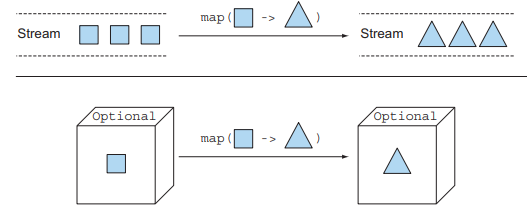
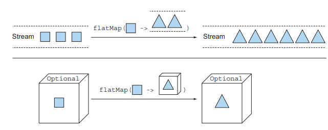
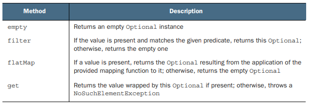
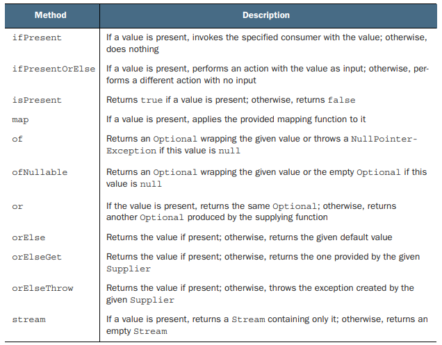

# 11장. null 대신 Optional 클래스

## 11.1 값이 없는 상황을 어떻게 처리할까?

### 11.1.1 보수적인 자세로 NullPointerException 줄이기

예상치 못한 NullPointerException을 피하기 위해서는 null을 확인하는 코드를 추가해서 문제를 해결할 수 있다.
하지만 변수에 접근할 때 마다 중첩된 if가 추가되면서 코드 들여쓰기 수준이 증가한다.
이같은 반복 패턴 코드를 `깊은 의심`이라고 하며 코드의 구조가 엉망이 되고 가독성이 떨어지게 된다.

### 11.1.2 null 떄문에 발생하는 문제

- 에러의 근원
  - NullPointerException은 자바에서 가장 흔히 발생하는 에러이다.
- 코드를 어지럽힘
  - null 확인 코드가 추가되면서 코드의 가독성이 떨어진다.
- 아무 의미가 없음
  - null은 아무 의미가 없는 값이다.
- 자바 철학에 위배됨
  - 자바는 개발자로부터 포인터를 숨겼지만 예외가 null 포인터다.
- 형식 시스템에 구멍을 만듬
  - null은 모든 참조 형식에 할당할 수 있다.

---

## 11.2 Optional 클래스 소개

java.util.Optional<T> 클래스는 값의 존재나 부재 여부를 표현하는 컨테이너 클래스이다.
값이 존재한다면 Optional 클래스는 값을 감싸고, 값이 없다면 Optional.empty()를 반환한다.

null 참조와 Optional.empty()는 의미가 다르다. null 참조는 NullPointerException을 일으킬 수 있지만
Optional.empty()는 Optional 객체이므로 다양하게 활용이 가능하다.

Optional을 이용하면 값이 없는 상황이 우리 ㄷ이텅 문제가 있는 것인지 알고리즘의 버그인지 명확하게 구분이 가능하다.
Optional이 나타나면 이를 unwrap해서 값이 없을 수 있는 상황에 대응을 강제할 수 있다.

---

## 11.3 Optional 적용 패턴

### 11.3.1 Optional 객체 만들기

#### 빈 Optional

Optional.empty()를 통해 빈 Optional 객체를 만들 수 있다

#### null이 아닌 값으로 Optional 만들기

Optional.of()를 통해 null이 아닌 값으로 Optional 객체를 만들 수 있다.

#### null 값으로 Optional 만들기

Optional.ofNullable()를 통해 null 값으로 Optional 객체를 만들 수 있다.
들어오는 객체가 null이라면 빈 Optional 객체가 반환된다.

get메서드를 통해 Optional 객체의 값을 가져올 수 있지만 빈 Optional 객체를 반환하면 NoSuchElementException이 발생한다.
결국 null을 사용했을 때와 같은 문제를 겪게된다.

### 11.3.2 맵으로 Optional의 값을 추출하고 변환하기

<p align="center"></p>

Optional이 값을 포함한다면 map의 파라미터로 제공되는 함수가 값을 바꾸게된다.
만약 Optional이 비어있으면 아무일도 일어나지 않게된다.

```text
Optional<String> name = Optional.ofNullable(null);
Optional<Integer> nameLength = name.map(String::length);
```

### 11.3.3 flatMap으로 Optional 객체 연결

<p align="center"></p>

flatMap은 파라미터로 받은 함수를 적용해 생성된 각각의 스트림의 컨텐츠만 남긴다.
즉, 함수를 적용해 생성된 모든 스트림을 하나의 스트림으로 평준화한다.

Optional의 flatMap 또한 메서드로 전달된 함수를 적용해 생성된 모든 Optional 객체를 하나의 Optional 객체로 합친다.
평준화 과정은 이론적으로 두 Optional을 하나로 합치는 기능을 수행하면서 하나라도 null이라면
빈 Optional을 반환한다.

### 11.3.4 Optional 스트림 조작

자바 9에서 Optional을 포함하는 스트림을 쉽게 처리할 수 있도록 Optional에 stream() 메서드가 추가됬다.
각 Optional을 0개 이상의 항목을 포함하는 스트림으로 변환하고 값을 포함하는 Optional은 언랩하고,
비어있는 Optional은 스트림에서 제거한다.

### 11.3.5 디폴트 액션과 Optional 언랩

- get()
  - 가장 간단하면서 동시에 가장 안전하지 않은 메서드
  - 값이 있으면 값을 반환, 없으면 NoSuchElementException을 발생
- orElse(T other)
  - 값이 있으면 값을 반환, 없으면 기본값을 반환
- orElseGet(Supplier<? extends T> other)
  - 값이 있으면 값을 반환, 없으면 Supplier가 제공하는 기본값을 반환
  - orElse에 대응하는 lazy version
- orElseThrow(Supplier<? extends X> exceptionSupplier)
  - 값이 있으면 값을 반환, 없으면 Supplier가 제공하는 예외를 발생
  - get과 달리 발생시킬 예외를 선택할 수 있음
- ifPresent(Consumer<? super T> consumer)
  - 값이 있으면 파라미터로 주어진 동작 실행
  - 값이 없으면 아무 일도 일어나지 않음
- ifPresentOrElse(Consumer<? super T> action, Runnable emptyAction)
  - 값이 있으면 파라미터로 주어진 동작 실행
  - 값이 없으면 파라미터로 주어진 빈 동작 실행

### 11.3.7 필터로 특정값 거르기

Optional 객체에 filter를 적용하면 Optional 객체가 값이 존재하고 주어진 프레디케이트를 만족하면
값을 반환하고 그렇지 않으면 빈 Optional 객체를 반환한다.

```text
optInsurance
    .filter(insurance -> "CambridgeInsurance".equals(insurance.getName()))
    .ifPresent(x -> System.out.println("ok"));
```

### Optional 클래스 메서드

<p align="center"></p>
<p align="center"></p>

### 기본형 특화 Optional을 사용하지 말아야하는 이유

Optional도 기본형으로 특화된 OptionalInt, OptionalLong, OptionalDouble을 제공한다.
하지만 스트림과 달리 Optional의 최대 요소의 수는 한개이므로 기본형 특화 클래스로 성능을 개선할 수는 없다.

또한, Optional 클래스에서 제공하는 메서드 map, flatMap, filter등을 지원하지 않으므로,
기본형 특화 Optional의 사용을 권장하지 않는다.

## 결론

- 값이 있거나 없음을 표현할 수 있는 java.util.Optional 클래스를 제공한다.
- 팩토리 메서드 Optional.of, Optional.ofNullable, Optional.empty를 이용해 Optional 객체를 만들 수 있다.
- Optional 객체에 값을 포함하면 map, flatMap, filter 등의 메서드를 이용해 Optional 객체를 변환할 수 있다.
- Optional로 값이 없는 상황을 처리할 수 있도록 강제할 수 있다.
  - 즉, Optional로 예상치 못한 NPE를 방지할 수 있다.
