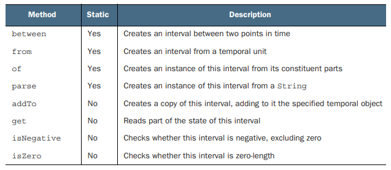
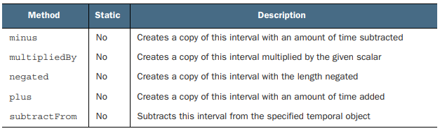
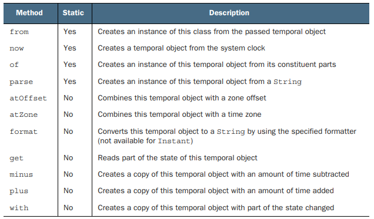
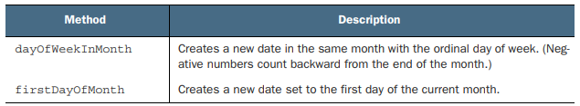
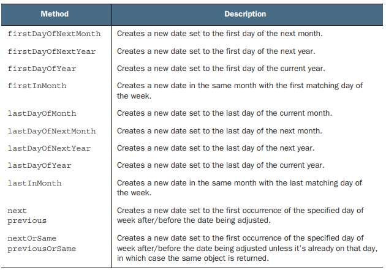

# 12장. 새로운 날짜와 시간 API

## 12.1 LocalDate, LocalTime, Instant, Duration, Period

### 12.1.1 LocalDate와 LocalTime

LocalDate 인스턴스는 시간을 제외한 날짜를 표현하는 불변 객체로, 어떤 시간대 정보도 포함하지 않는다.

정적 팩토리 메서드 of를 이용해 LocalDate 인스턴스를 만들 수 있으며, now() 함수를 통해
시스템 시계의 정보를 이용해 현재 날짜 정보를 얻을 수 있다.

```text
LocalDate date = LocalDate.of(2023, 12, 4);
```

get 메서드에 temporalfield를 전달해 정보를 얻는 방법도 존재하며, 앞으로 살펴볼 다른 날짜와
시간과 관련된 클래스도 비슷한 기능을 제공한다.

TemporalField는 시간 관련 객체에서 어떤 필드의 값에 접근할지 정의하는 인터페이스다.
열거자 ChronoField는 TemporalField를 정의하므로, 열거자 요소를 통해 원하는 정보를 얻을 수 있다

```text
int year = date.get(ChronoField.YEAR);
int month = date.get(ChronoField.MONTH_OF_YEAR);
int day = date.get(ChronoField.DAY_OF_MONTH);
```

시간의 경우 LocalTime 클래스로 표현 가능하고 사용법은 LocalTime과 같다.

```text
LocalTime time = LocalTime.of(23, 45, 20);
```

날짜와 시간 문자열는 parse를 통해 LocalDate와 LocalTime 인스턴스를 만들 수 있다.
이때 DateTimeFormatter를 함께 전달하여 날짜, 시간 객체의 형식을 정할 수 있다.

```text
LocalDate date = LocalDate.parse("2023-12-04");
LocalTime time = LocalTime.parse("23:45:20");
```

### 12.1.2 날짜와 시간 조합

LocalDateTime은 LocalDate와 LocalTime을 쌍으로 갖는 복합 클래스이며, 날짜와 시간을 모두 표현할 수 있다.
of 메서드를 통해 인스턴스를 생성하거나, LocalDate에 atTime으로 시간을 제공하거나, LocalTime에 atDate로 날짜를 제공하여
LocalDateTime을 만들 수도 있다.

```text
LocalDateTime dt1 = LocalDateTime.of(2023, 12, 4, 23, 45, 20);
LocalDateTime dt2 = date.atTime(23, 45, 20);
LocalDateTime dt3 = time.atDate(date);
```

### 12.1.3 Instant : 기계의 날짜와 시간

사람은 보통 주, 날짜, 시간, 분으로 날자와 시간을 계산하지만 기계에서는 이 같은 단위로 시간을 표현하기 어렵다.
java.time.Instant 클래스는 기계에서 사용하는 날짜와 시간 표현 방식으로 표현한다. 즉, Unix Epoch time을
기준으로 특정 지점까지의 시간을 초로 표현한다.

Instant 클래스는 ofEpochSecond에 초를 전달하여 만들 수 있고 나노초(10억분의 1초)의 정밀도를 가진다.
또한 두번째 파라미터를 이용해 나노초 단위로 시간을 보정할 수도 있다.

```text
Instant.ofEpochSecond(3);
Instant.ofEpochSecond(3, 0);
Instant.ofEpochSecond(2, 1_000_000_000);
Instant.ofEpochSecond(4, -1_000_000_000);
```

### 12.1.4 Duration과 Period

이전까지의 클래스들은 모두 Temporal 인터페이스를 구현하는데, 해당 클래스는 특정 시간을 모델링하는 객체의 값을 읽고 조작할지를 정의한다.
Temporal 객체간의 지속시간은 Duration 클래스의 between을 통해 생성할 수 있다. 

Duration 클래스는 초와 나노초로 시간 단위를 표현하므로 between 메서드에 LocalDate는 전달할 수 없다.
대신 년, 월, 일로 시간을 표현할 때는 Period 클래스를 사용한다.

```text
Duration d1 = Duration.between(time1, time2);
Duration threeMinutes = Duration.ofMinutes(3);
Duration threeMinutes = Duration.of(3, ChronoUnit.MINUTES);

Period tenDays = Period.between(LocalDate.of(2014, 3, 8), LocalDate.of(2014, 3, 18));
Period tenDays = Period.ofDays(10);
Period threeWeeks = Period.ofWeeks(3);
Period twoYearsSixMonthsOneDay = Period.of(2, 6, 1);
```

#### Duration과 Period가 공통으로 제공하는 메서드

<p align="center"></p>
<p align="center"></p>

---

## 12.2 날짜 조정, 파싱, 포매팅

withAttribute 메서드를 통해 기존 날짜를 조정할 수 있으며 바뀐 속성을 포함하는 새로운 객체를 반환한다.

```text
LocalDate date1 = LocalDate.of(2014, 3, 18);
LocalDate date2 = date1.withYear(2011);
LocalDate date3 = date2.withDayOfMonth(25);
LocalDate date4 = date3.with(ChronoField.MONTH_OF_YEAR, 9);
```

위에서 보는 with는 TemporalField를 가지고 좀 더 범용적으로 사용할 수 있으며, get 메서드와 쌍을 이룬다.
Temporal 인터페이스는 특정 시간을 정의하고, get과 with는 Temporal 객체의 필드값을 읽거나 고칠 수 있다.
하지만 LocalDate에서 ChronoField.NANO_OF_SECOND와 같이 지원하지 않는 필드를 호출할 경우 UnSupportedTemporalTypeException이 발생한다.

with와 get메서드처럼 plus와 minus 메서드는 특정 시간만큼 앞뒤로 이동시킬 수 있다.
ChronoUnit 열거형은 TemporalUnit 인터페이스를 쉽게 활용할 수 있게 구현을 제공한다.

#### Temporal 클래스가 공통적으로 제공하는 메서드

<p align="center"></p>

### 12.2.1 TemporalAdjuster

다음 주 일요일, 돌아오는 평일, 어떤 달의 마지막 날 등 복잡한 날짜 조정이 필요한 때에는 with 메서드를 통해
더 다양한 동작을 수행할 수 있도록 TemporalAdjuster 인터페이스를 제공한다.
기본적으로 제공하는 TemporalAdjuster 팩토리 메서드 뿐만 아니라 커스텀 TemporalAdjuster를 만들 수도 있다.

```text
LocalDate date1 = LocalDate.of(2014, 3, 18);
LocalDate date2 = date1.with(nextOrSame(DayOfWeek.SUNDAY));
LocalDate date3 = date2.with(lastDayOfMonth());
```

<p align="center"></p>
<p align="center"></p>

```text
@FunctionalInterface
public interface TemporalAdjuster {
    Temporal adjustInto(Temporal temporal);
}
```

### 12.2.2 날짜와 시간 객체 출력과 파싱

포매팅과 파싱 전용 패키지인 java.time.format 패지키가 추가되었고, DateTimeFormatter가 가장 중요한 클래스다.
DateTimeFormatter를 이용해 날짜나 시간을 특정 형식의 문자열로 만들 수 있으며,
반대로 날짜나 시간을 표현하는 문자열을 파싱해서 날짜 객체를 다시 만들 수 있다.

또한 기존 java.util.DateFormat 클래스와 달리 DateTimeFormatter는 불변 객체이므로 쓰레드에서 안전하게 사용가능하다.

```text
LocalDate date = LocalDate.of(2014, 3, 18);
String s1 = date.format(DateTimeFormatter.BASIC_ISO_DATE);
LocalDate date1 = LocalDate.parse(s1, DateTimeFormatter.BASIC_ISO_DATE);

DateTimeFormatter formatter = DateTimeFormatter.ofPattern("dd/MM/yyyy");
String formattedDate = date.format(formatter);
LocalDate date2 = LocalDate.parse(formattedDate, formatter);
```

DateTimeFormatterBuilder를 이용해 좀 더 세부적으로 DateTimeFormatter를 만들 수도 있다.

---

## 12.3 다양한 시간대와 캘린더 활용 방법

새롭게 추가된 날짜와 시간 API는 시간대를 간단하게 처리할 수 있다.
java.time.ZoneId 클래스는 시간대를 표현하는 클래스로, 서머타임같은 복잡한 사항이 자동으로 처리된다.

### 12.3.1 시간대 사용하기

표준 시간이 같은 지역을 묶어서 시간대(time zone) 규칙 집합을 정의하며, 지역 id로 ZoneId를 구분한다
지역 ID는 `지역/도시` 형식으로 이루어지며 IANA TimeZone Database(https://www.iana.org/time-zones) 정보를 사용한다.


```text
ZoneId romeZone = ZoneId.of("Europe/Rome");
```

ZoneId 객체를 얻은 다음 LocalDate, LocalDateTime, Instant를 이용해서 ZonedDateTime 인스턴스로 변환할 수 있다.

```text
LocalDate date = LocalDate.of(2014, Month.MARCH, 18);
ZonedDateTime zdt1 = date.atStartOfDay(romeZone);
LocalDateTime dateTime = LocalDateTime.of(2014, Month.MARCH, 18, 13, 45);
ZonedDateTime zdt2 = dateTime.atZone(romeZone);
Instant instant = Instant.now();
ZonedDateTime zdt3 = instant.atZone(romeZone);
```

## 결론

- 새로운 날짜와 시간 API에서 날짜와 시간 객체는 모두 불변이다
- 새로운 API는 사람과 기계가 편리하게 사용할 수 있도록 두 가지 표현 방식을 제공한다
- 날짜와 시간 객체를 절대적인 방법과 상대적인 방법으로 처리할 수 있으며 기존 인스턴스를 변환하지 않고 새로운 인스턴스가 생성된다
- TemporalAdjuster를 이용하면 단순히 값을 변경하는 것 이상으로 복잡한 동작을 수행할 수 있다
- 날짜와 시간 객체를 특정 포맷으로 출력하고 파싱하는 포매터를 정의할 수 있다
  - 포매터는 스레드 안정성을 보장한다
- 특정 지역/장소에 상대적인 시간대 또는 UTC/GMT 기준의 오프셋을 이용해 시간대를 정의할 수 있다
  - 정의한 시간대를 Temporal 객체에 적용해서 지역화 할 수 있다