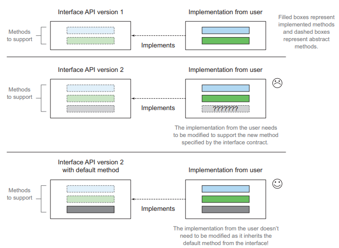
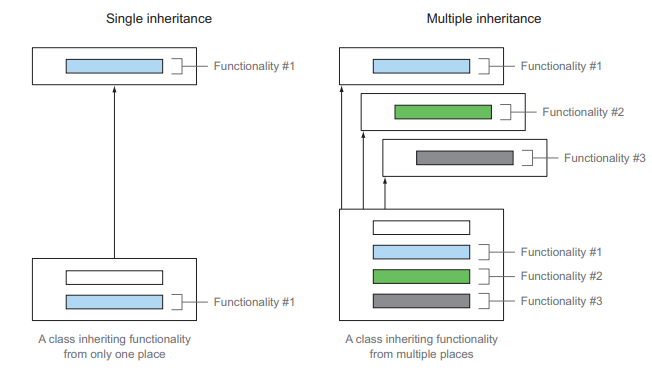
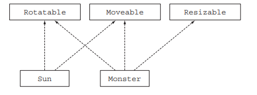
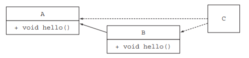
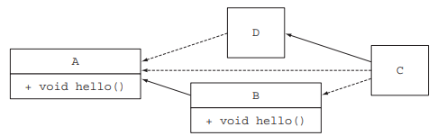
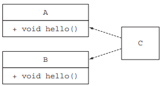
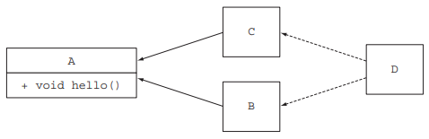

# 디폴트 메서드

인터페이스를 구현하는 클래스는 인터페이스에서 정의하는 모든 메서드를 구현하거나 수퍼 클래스의 구현을 상속받아야한다.
평소에는 문제가 없지만 새로운 메서드를 추가하는 등의 인터페이스를 바꿀 때, 해당 인터페이스를 구현한
모든 클래스를 고쳐야하는 문제가 생긴다.

<p align="center"></p>

자바 8에는 이 문제를 해결하는 새로운 기능을 제공한다.
첫 번째는, 인터페이스 내부에 `정적 메서드`를 사용하는 것이다. 두 번째는 인터페이스의 기본 구현을
제공할 수 있도록 `디폴트 메서드` 기능을 사용하는 것이다. 자바 8에서부터는 메서드 구현을 포함하는
인터페이스를 정의할 수 있게 되었고, 기존 인터페이스를 구현한 클래스는 자동으로 새로운 디폴트 메서드를 상속받게 된다.

## 13.1 변화하는 API

### 사용자가 겪는 문제

인터페이스에 새로운 메서드를 추가하면 `바이너리 호환성`은 유지된다. 바이너리 호환성이란 새로 추가된 메서드를 호출하지만 않으면
새로운 메서드 구현이 없이도 기존 클래스 파일 구현이 잘 동작한다는 의미이다.

그렇기에 공개된 API는 기존 버전과의 호환성 문제로 고치기가 어렵다. 디폴트 메서드는 자동으로 기본 구현을 제공하므로
기존 코드를 고치지 않아도 된다.

#### 바이너리 호환성, 소스 호환성, 동작 호환성

- 바이너리 호환성
  - 즉, 뭔가를 바꾼후에도 에러없이 기존 바이너리가 실행될 수 있는 상황
  - 인터페이스에 메서드를 추가했을 때 추가된 메서드를 호출하지 않으면 문제가 일어나지 않음
- 소스 호환성
  - 코드를 고쳐도 기존 프로그램을 성공적으로 재컴파일 할 수 있음
  - 인터페이스에 메서드를 추가하는 것은 메서드 구현을 해야하므로 소스 호환성이 아님
- 동작 호환성
  - 코드를 바꾼 다음에도 같은 입력값이 주어지면 프로그램이 같은 동작을 실행

---

## 13.2 디폴트 메서드란 무엇인가?

디폴트 메서드를 통해 인터페이스는 자신을 구현하는 클래스에서 메서드를 구현하지 않을 수 있는 
새로운 메서드 시그니처를 제공한다. 디폴트 메서드는 인터페이스 자체에서 구현하고 제공한다.

```text
public interface Sized {
    int size();
    default boolean isEmpty() { return size() == 0; }
}
```

#### 추상 클래스와 자바 8의 인터페이스의 차이점

- 클래스는 하나의 추상클래스만 상속받지 인터페이스는 여러 개를 구현 가능
- 추상 클래스는 인스턴스 변수(필드)로 공통 상태를 가질 수 있음

---

## 13.3 디폴트 메서드 활용 패턴

### 13.3.1 선택형 메서드

인터페이스를 구현하는 클래스에서 메서드의 내용이 비어있는 상황이 종종 발생한다.
예를 들어 Iterator 클래스는 hasNext, next, remove 메서드를 구현해야한다.
하지만, 사용자들이 remove 기능을 잘 사용하지 않아 자바 8이전에는 remove 메서드를 구현을 비워뒀다.
자바 8이후의 Iterator 인터페이스는 다음처럼 remove 메서드를 정의한다.

```text
public interface Iterator<E> {
    boolean hasNext();
    E next();
    default void remove() {
        throw new UnsupportedOperationException();
    }
}
```

기본 구현 제공을 통해 빈 remove 메서드 구현이 필요없어 졌고 불필요한 코드를 줄일 수 있게된다.

### 13.3.2 동작 다중 상속

<p align="center"></p>

기존에는 불가능했던 `동작 다중 상속` 기능도 디폴트 메서드를 통해 구현할 수 있게 되었다.

#### 다중 상속 형식

자바 8에서는 인터페이스가 구현을 포함할 수 있게 되었다.
그렇기에 중복되지 않는 최소한의 인터페이스를 유지한다면, 여러 인터페이스의 동작을 쉽게 재사용할 수 있다.

#### 기능이 중복되지 않는 최소한의 인터페이스 & 인터페이스 조합

다양한 특성을 갖는 여러 모양을 정의한다고 가정하자.
어떤 모양은 회전할 수 없지만 크기는 조절할 수 있고, 어떤 모양은 회전은 할 수 있지만 크기는 조절할 수 없다.
이런 상황에서 디폴트 메서드를 사용한 인터페이스를 사용하면 코드를 재사용하여 구현할 수 있다.

<p align="center"></p>

디폴트 구현을 포함시켜서 구현하면 또다른 장점이 생긴다.
만약 디폴트 메서드 구현을 효율적으로 개선했다고 가정했을 때, 해당 인터페이스를 구현한 모든 클래스에
자동으로 변경된 사항이 적용된다.

---

### 13.4 해석 규칙

디폴트 메서드가 추가되었으므로 같은 시그니처를 가진 디폴트 메서드를 상속받는 상황에서는 어떻게 처리될까?

### 13.4.1 알아야 할 세가지 해결 규칙

1. 클래스가 항상 이긴다. 클래스나 슈퍼 클래스에서 정의한 메서드가 디폴트 메서드보다 우선된다.
2. 1번 규칙 이외에는 서브 인터페이스가 이긴다.
   - 상속관걔를 갖는 인터페이스에서 같은 시그니처를 갖는 메서드를 정의할 때 서브 인터페이스가 우선된다
   - 즉, B가 A를 상속 받는다면 B가 A보다 우선된다
3. 디폴트 메서드 우선순위가 정해지지 않는 다면 여러 인터페이스를 상속받는 클래스에서는 디폴트 메서드를 반드시 명시적으로 오버라이드 해야한다.

### 13.4.2 디폴트 메서드를 제공하는 서브인터페이스가 이긴다

<p align="center"></p>

A와 B 모두 hello 라는 디폴트 메서드를 제공하지만 B는 A를 상속한다.
이 경우, C는 B의 hello 메서드를 상속받게 된다.

<p align="center"></p>

```text
public class D implements A {}
```

D는 A를 상속받았지만 구현을 하지 않았기 때문에 실제로는 A의 디폴트 메서드를 상속받는다.
그렇기 때문에 사실상 위 그림은 A와 B 중에서 어떤 메서드를 선택할지를 정하는 것과 같아진다.
결과적으로 B가 A를 상속받는 관계이므로 B의 hello 메서드가 선택된다.

만약 D가 다음과 같이 구현되었다면 어떻게 될까?

```text
public abstract class D implements A {
    public abstract void hello();
}
```

이 경우 A가 디폴트 메서드를 구현함에도 불구하고 디폴트 메서드의 우선순위를 정할 수 없는 상황이 된다.
즉, 3번 규칙의 상황이 되어 C는 hello를 구현해야한다.

### 13.4.3 충돌 그리고 명시적인 문제 해결

<p align="center"></p>

위 그림과 같은 경우 각 인터페이스간 상속관계가 없기에 hello 메서드를 구별할 기준이 없게된다.
이 경우 자바 컴파일러는 에러를 발생시킨다.

#### 충돌 해결

해당 상황에서는 개발자가 직접 C 클래스에서 사용하려는 메서드를 명시적으로 선택해야한다.

```text
public class C implements A, B {
    public void hello() {
        B.super.hello();
    }
}
```

### 13.4.4 다이아몬드 문제

<p align="center"></p>

해당 상황을 다이아몬드 문제라고 부르며 B와 C의 디폴트 메서드 구현 상태에 따라 선택되는 메서드가 달라진다.

- B에 디폴트 메서드 hello가 존재하는 경우
  - B는 A를 상속받으므로 B의 hello가 선택된다
- B와 C 모두 디폴트 메서드 hello가 존재하는 경우
  - 둘 중 하나의 메서드를 명시적으로 호출해야한다
- B와 C 모두 아무런 구현을 하지 않은 경우
  - 모두 A의 hello를 상속받으므로 A의 hello가 선택된다

## 결론

- 자바 8의 인터페이스는 구현 코드를 포함하는 디폴트 메서드, 정적 메서드를 정의할 수 있다
- 공개된 인터페이스에 추상 메서드를 추가하면 소스 호환성이 깨진다
  - 디폴트 메서드 덕분에 API를 바꾸더라도 기존 버전과 호환성을 유지할 수 있다
- 선택형 메서드와 동작 다중 상속ㅇ도 디폴트 메서드를 사용할 수 있다
- 클래스가 같은 시그니처를 갖는 여러 디폴트 메서드를 상속하면서 생기는 충돌은 해결 규칙을 준수한다