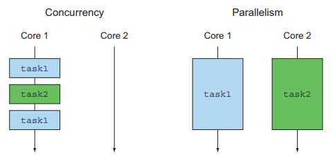
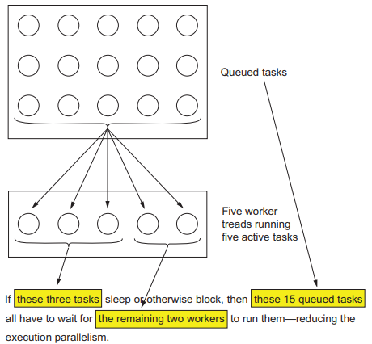
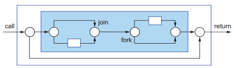
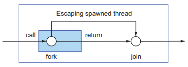
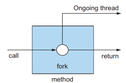
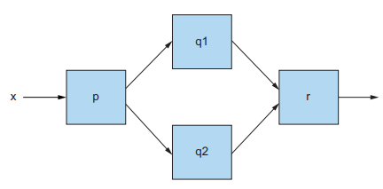
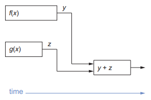
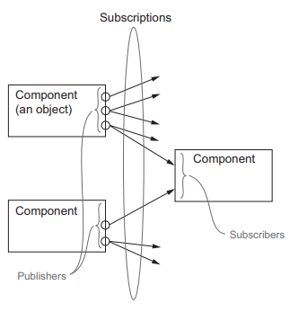

# CompletableFuture와 리액티브 프로그래밍 컨셉의 기초

<p align="center"></p>

- 동시성은 단일 코어 머신에서 발생할 수 있는 프로그래밍 속성으로 서로 겹칠 수 있음
- 병렬성은 병렬 실행을 하드웨어 수준에서 지원

## 15.1 동시성을 구현하는 자바 지원의 진화

처음 자바는 Runnable과 Thread를 동기화된 클래스와 메서드를 이용해 잠궜다.
자바 5에서는 스레드 실행과 테스크 제출을 분리하는 ExecutorService 인터페이스,
Runnable, Thread의 변형을 반환하는 Callable<T> and Future<T>, 제네릭을 지원했다.
이때 ExecutorService는 Runnable과 Callable을 모두 실행할 수 있다.

자바 7에서는 분할과 정복 알고리즘의 포크/조인 구현을 지원하는 RecursiveTask가 추가되었고,
자바 8에서는 스트림과 새로 추가된 람다 지원에 기반한 병렬프로세싱이 추가되었다.

자바는 Future를 조합하는 기능을 추가하면서 동시성을 강화했고, 자바 9에서는 분산 비동기 프로그래밍을
명시적으로 지원하게된다. 이들 API는 메쉬업 어플리케이션, 즉 다양한 웹 서비스를 이용하고
이들 정보를 실시간으로 조합해 사용자에게 제공하거나 추가 웹서비스를 통해 제공하는 종류의 어플리케이션 개발에 필수적인 모델과 툴킷을 제공한다.

자바 9에서는 발행-구독 프로토콜인 Flow가 추가되었고 ComputableFuture와 Flow의 궁극적인 목표는
가능한한 동시에 실행할 수 있는 독립적인 테스크를 만들고 멀티코어 또는 여러기기를 통해 제공되는 병렬성을 쉽게 이용하는 것이다.

### 15.1.1 스레드와 높은 수준의 추상화

프로세스는 한 개 이상의 스레드, 즉 본인이 가진 프로세스와 같은 주소 공간을 공유하는 프로세스를 요청함으로 테스크를
동시에 또는 협력적으로 실행할 수 있다. 멀티코어에서도 프로그램이 스레드를 사용하지 않는다면
효율성을 고려해 여러 프로세서 코어 중 한개만 사용학 된다.

병렬 스트림은 명시적으로 스레드를 사용하는 것에 비해 높은 수준의 추상화를 제공한다.
스트림으로 추상화하는 것은 디자인 패턴을 적용하는 것과 비슷하지만 쓸모없는 코드가 라이브러리 내부로
구현되면서 복잡성도 줄어든다는 장점이 더해진다.

### 15.1.2 Executor와 Thread Pool

#### 스레드의 문제

자바 스레드는 직접 운영체제 스레드에 접근한다. 스레드를 만들고 종료하려면 비싼 비용을 치러야하며
운영체제 스레드의 숫자 또한 제한되어 있다.

#### 스레드풀 그리고 스레드풀이 더 좋은 이유

자바 ExecutorService는 테스크를 제출하고 나중에 결과를 수집할 수 있는 인터페이스를 제공한다.

```text
ExecutorService executor = Executors.newFixedThreadPool(10);
```

예를 들어 위의 코드처럼 10개의 스레드를 포함하는 ExectorService를 만들고 이들을 스레드풀에 저장한다.
스레드 풀에서 사용하지 않은 스레드를 먼저온 테스크의 순서대로 실행 시킬 수 있다.
이 테스크가 종료되면 스레드 또한 스레드 풀에 반환된다.

이런 방식의 장점은 하드웨어에 스레드에 맞는 수의 테스크를 유지함과 동시에 다수의 테스크를 스레드 풀에
아무런 오버헤드 없이 제출할 수 있다는 점이다.

#### 스레드 풀 그리고 스레드 풀이 나쁜 이유

<p align="center"></p>

하지만 스레드 풀 사용에도 다음 두가지 사항에 대해서 주의가 필요하다

- k 개의 스레드를 가진 스레드 풀은 오직 k개 만큼의 스레드를 동시에 실행할 수 있다.
따라서, I/O를 기다리는 등의 블록 상황에서는 아직 테스크가 워커 스레드에 할당된 상태이기에 반환되지 않고 아무작업을 하지 않게된다.
즉, 블록이 될 수 있는 테스크는 스레드 풀에 제출하지 말아야한다는 점이다.
- 중요한 코드를 실행하는 스레드가 죽는 일이 발생하지 않도록 main이 반환되기 전에 모든 스레드 작업이 끝나길 기다려야한다.
프로그램 종료 전 모든 스레드 풀을 종료하는 습관을 갖는 것이 중요하다.

### 15.1.3 스레드의 다른 추상화 : 중첩되지 않은 메서드 호출

<p align="center"></p>

7장에서 설명한 동시성은 테스크나 스레드가 메서드 호출 안에서 시작되며, 메서드 호출은 반환되지 않고
작업이 끝나기를 기다린다. 즉, 스레드 생성과 join()이 한 쌍처럼 동작하며 중첩된 메서드 호출 내에 추가되어 있다.
이를 엄격한 포크/조인이라 부른다.

<p align="center"></p>

시작된 테스크를 내부 호출이 아니라 외부 호출에서 종료하도록 기다리는 좀 더 여유로운 방식의
포크/조인을 사용해도 비교적 안전하다.

<p align="center"></p>

15장에서는 메서드 호출에 의해 스레드가 생성되고 메서드를 벗어나 계속 실행되는 동시성 형태에 초점을 둔다.
이런 메서드 호출자에 기능을 제공하도록 메서드가 반환된 후에도 만들어진 테스크 실행이 계속되는 메서드를 `비동기 메서드`라고 한다.
이런 메서드는 어떤 위험성이 있을까?

- 메서드를 호출한 다음의 코드와 동시에 실행되므로 데이터 경쟁 문제 발생 주의
- 기존 실행 중이던 스레드가 종료되지 않은 상황에서 main 메서드 반환 시 어떻게 될까?
  - 어플리케이션을 종료하지 못하고 모든 스레드가 종료될 때 까지 대기
  - 어플리케이션 종료를 방해하는 스레드를 강제종료 후 실행 종료
  - 위 두가지 방법 모두 안전하지 못하다

이런 문제를 피하려면 어플리케이션에서 만든 모든 스레드를 추적하고 종료 전에 모든 스레드를 종료해야한다.

자바 스레드는 setDaemon() 메서드를 이용해 데몬 또는 비데몬으로 스레드를 구분시킬 수 있다.

- 데몬 스레드는 어플리케이션이 종료될 때 강제 종료
  - 데이터 일관성을 파괴하지 않는 동작을 수행할 때 유용
- 비데몬 스레드가 모두 종료되기 전까지는 main() 메서드는 종료되지 않고 대기

### 15.1.4 스레드에 무엇을 바라는가?

스레드를 활용해 병렬성의 장점을 극대화하도록 프로그램 구조를 만드는 것이다.
즉, 프로그램을 `작은 테스크 단위로 구조화`하는 것이 목표다.

---

## 15.2 동기 API와 비동기 API

자바 8 스트림은 두가지 단계를 이용해 명시적으로 병렬 하드웨어를 이용할 수 있다.
첫 번째는 외부 반복을 내부 반복으로 바꿔야한다. 두 번째로는 parallel() 메서드를 이용하여
자바 런타임 라이브러리가 복잡한 스레드 작업을 하지 않고 병렬로 요소가 처리하도록 할 수 있다.

이런 루프 계산외에 다른 상황에서도 병렬성을 사용할 수 있는데, 다음 예제를 통해 이를 살펴보자

```text
int f(int x);
int g(int x);

int y = f(x);
int z = g(x);
System.out.println(y + z);
```

위 메서드 f와 g는 물리적 결과를 반환하므로 동기 API라고 부른다.
만약 연산이 오래걸리는 작업이 존재한다면, f와 g를 별도의 CPU 코어로 실행함으로써
f와 g중 오래 걸리는 작업의 시간으로 합계를 구하는 시간을 단축할 수 있다.

```text
Result result = new Result();

Thread t1 = new Thread(() -> result.left = f(x));
Thread t2 = new Thread(() -> result.right = g(x));
t1.start();
t2.start();
t1.join();
t2.join();
System.out.println(result.left + result.right);
```

Runnable 대신 Future API 인터페이스를 사용한다면 더 단순화 할 수 있다.

```text
ExecutorService executor = Executors.newFixedThreadPool(2);
Future<Integer> left = executor.submit(() -> f(x));
Future<Integer> right = executor.submit(() -> g(x));
System.out.println(left.get() + right.get());

executor.shutdown();
```

하지만 여전히 명시적인 submit 메서드 호출과 같은 불필요한 코드로 오염되어있다.
외부 반복을 내부 반복으로 바꿔 스트림으로 처리한 것 처럼,비동기 API를 통해 이를 해결할 수 있다.

### 15.2.1 Future 형식 API

Future 형식을 이용하게 되면 f, g의 시그니처가 변경된다.

```text
Future<Integer> f(int x);
Future<Integer> g(int x);

Future<Integer> left = f(x);
Future<Integer> right = g(x);
System.out.println(left.get() + right.get());
```
메서드 f는 `호출 즉시` 자신의 원래 바디를 평가하는 테스크를 포함하는 Future를 반환한다.
g 또한 마찬가지며 get() 메서드를 이용해 두 Future가 완료되어 결과가 합쳐지기를 기다린다.
하지만 큰 프로그램에서는 두가지 이유로 이 방식을 사용하지 않는다.

- 다른 상황에서는 g 메서드에서도 Future 형식이 필요할 수 있으므로 API 형식을 통일하는 것이 바람직하다
- 병렬 하드웨어 프로그램 실행 속도를 극대화하기 위해서는 여러개의 작고 합리적인 테스크로 나누는 것이 좋다

### 15.2.2 리액티브 형식 API

두 번째 대안은 f, g의 시그니처를 바꿔 콜백 형식의 프로그래밍을 이용하는 것이다.

```text
void f(int x, Consumer<Integer> dealWithResult);
```

f에 추가 파라미터로 콜백을 전달해서 f의 바디에서는 return 문으로 결과를 반환하는 것이 아니라,
`결과가 준비되면 이를 람다로 호출하는 테스크로 만드는 것`이다.

```text
f(x, (int y) -> {
    result.left = y;
    System.out.println(result.left + result.right);
});

g(x, (int z) -> {
    result.right = z;
    System.out.println(result.left + result.right);
});
```

하지만 이 경우 결과가 달라진다. f와 g의 호출 합계를 정확하게 출력하지 않고 상황에 따라
먼저 계산된 결과를 출력하게 된다. 락을 걸지 않았기에 값을 두번 출력하거나 때에 따라서
두 피연산자의 값이 업데이트 될 수도 있다.

- if-then-else 를 이용해 적절한 락을 통해 모든 콜백이 호출되었을 때 결과를 출력하도록 할 수 있다.
- 리액티브 형식 API는 일련의 이벤트에 반응하도록 설계되어 있으므로 Future를 이용
  - Future 형식은 일회성의 값을 처리하는데 적합

두 대안 모두 코드를 복잡하게 만들 수 있다. 하지만 어떤 API를 사용할지 미리 생각해두고
사용한다면 계산이 오래걸리는 메서드나 네트워크나 사람의 입력을 기다리는 메서드에서 효율성이 크게 향상될 수 있다.

### 15.2.3 잠자기(그리고 기타 블로킹 동작)는 해로운 것으로 간주

프로그램을 일정 시간 지연시키기 위해 sleep() 메서드를 사용하는 경우가 있는데, 스레드는 잠들어 있어도
여전히 시스템 자원을 점유하게 된다. 스레드 풀에서 스레드를 재사용하는 경우 다른 테스크가 시작되지 못하게 막기 때문에 에는 특히 문제가 된다.

다른 블록 동작들도 마찬가지다. 블록은 다른 테스크가 어떤 동작을 완료하기를 기다리는 동작과(Future의 get())
외부 상호작용(데이터베이스에서 읽기 작업을 기다림)을 기다리는 두 가지로 구분할 수 있다.
이 경우 테스크를 앞과 뒤 부분으로 나누고 블록되지 않을 때만 뒷부분을 자바가 스케쥴링하도록 요청할 수 있다.

```text
work1();
Thread.sleep(10000);
work2();
```
```text
ScheduledExecutorService executor = Executors.newScheduledThreadPool(1);

work1();
executor.schedule(() -> work2(), 10, TimeUnit.SECONDS);
executor.shutdown();
```

위에서 schedule() 메서드를 통해 work1()이 끝난 다음 10초 뒤에 work2()를 개별 테스크로 실행하게 `스케쥴링`할 수 있다.
기존 코드는 sleep 메서드를 이용했기에 워커 스레드가 점유된 상태로 10초간 대기한다.
하지만 스케쥴링을 사용하면 work1()을 실행 후 코드는 종료되지만, `10초 뒤 work2()가 실행되도록 큐에 추가`한다.

두 코드의 다른 점은 기존 코드는 스레드 자원을 점유하는 반면, 스케쥴링 코드는 다른 작업이 실행할 수 있도록 허용한다는 점이다.

가능하다면 I/O작업에도 이 원칙을 적용하면 좋다. 읽기작업을 기다리는 것이 아니라
블록하지 않는 읽기 시작 메서드를 호출하고 읽기 작업이 끝나면 이를 처리할 다음 테스크를 런타임 라이브러리에
스케쥴하도록 요청하고 종료한다.

### 15.2.4 현실성 확인

현실적으로는 모든 거은 비동기라는 설계 원칙은 지킬 수 없다.
자바의 개선된 동시성 API를 이용해 필요한 상황을 찾아보고 모든 API를 비동기로 만드는 것에 의존하지 말고
개선된 동시성 API를 사용해보자.

### 15.2.5 비동기 API에서 예외는 어떻게 처리하는가?

Future나 리액티브 형식의 비동기 API에서 호출된 메서드의 실제 바디는 별도의 스레드에서
실행되므로 이때 발생하는 에러는 호출자의 실행 범위와 관계없는 상황이 된다.

Future를 구현한 CompletableFuture에서는 get() 메서드에 예외를 처리할 수 있는 기능을 제공하며,
예외를 회복할 수 있는 exceptionally() 메서드를 제공한다.

리액티브 형식의 비동기 API에서는 추가 콜백을 만들어 예외를 처리해야한다.

```text
void f(int x, Consumer<Integer> dealWithResult,
                Consumer<Throwable> dealWithException);
```

---

## 15.3 박스와 채널 모델

동시성 모델을 잘 설꼐하고 개념화하려면 그림이 필요한데 이때 사용하는 기법을 `박스와 채널 모델`이라고 부른다.

<p align="center"></p>

박스와 채널 모델을 이용하면 생각과 코드를 구조화할 수 있다.
또한 박스와 채널 모델로 대규모 시스템 구현의 추상화 수준을 높일 수 있다.

---

## 15.4 CompletableFuture와 콤비네이터를 이용한 동시성

자바 8에서는 Future 인터페이스의 구현인 CompletableFuture를 이용해 Future를 조합할 수 있다.
CompletableFuture는 실행할 코드 없이 Future를 만들 수 있도록 허용하며,
complete() 메서드를 이용해 나중에 어떤 값을 이용해 Future를 완료할 수 있다.
추후 get() ㅁ서드를 통해 값을 얻을 수 있다.

```text
CompletableFuture<Integer> a = new CompletableFuture<>();
executorService.submit(() -> a.complete(f(x)));
int b = g(x);
System.out.println(a.get() + b);
```

하지만 이 또한 f의 작업이 끝나지 않는다면 get()을 기다려야하므로 프로세싱 자원을 낭비할 수 있다.
이를 해결하기 위해 두 연산의 결과를 효과적으로 처리할 수 있는 기능이 존재한다.

```text
CompletableFuture<V> thenCombine(CompletableFuture<U> other,
                                  BiFunction<T, U, V> fn);
```

thenCombine() 메서드는 두 CompletableFuture를 받아 한 개의 새로운 CompletableFuture를 반환한다.
즉 처음 두 작업이 끝나면 두 결과에 fn을 적용하고 블록하지 않은 상태로 결과 Future를 반환한다.

```text
CompletableFuture<Integer> a = new CompletableFuture<>();
CompletableFuture<Integer> b = new CompletableFuture<>();
CompletableFuture<Integer> c = a.thenCombine(b, (x, y) -> x + y);
executorService.submit(() -> a.complete(f(x)));
executorService.submit(() -> b.complete(g(x)));

System.out.println(c.get());
```

<p align="center"></p>

Future a와 Future b의 결과를 알지 못하는 상태로 thenCombine 메서드를 통해 `두 연산이 끝났을 때 스레드 풀에서 실행될 연산`을 만든다.
즉, c연산은 `다른 두 작업이 끝나기 전까지는 스레드에서 실행되지 않기에` 먼저 시작하여 블락되지 않는다.
thenCombine 메서드를 통해 이전에 발생했던 블록 문제가 어디서도 일어나지 않는다.

많은 수의 Future를 사용해야 하는 경우 CompletableFuture와 콤비네이터를 이용해 get()에서 블락하지 않고
병렬실행의 효율성은 높이고 데드락은 피하는 최상의 해결책을 구현할 수 있다.

---

## 15.5 발행-구독 그리고 리액티브 프로그래밍

Future와 CompletableFuture는 독립적 실행과 병렬성이라는 정식적 모델에 기반한다.
Future는 get()으로 결과를 얻으므로 한번만 실행해 결과를 제공한다.

반면 리액티브 프로그래밍은 시간이 흐르면서 여러 Future 같은 객체를 통해 여러가지 결과를 제공한다.
자바 9에서는 Flow의 인터페이스에 발행-구독(pub-sub)모델을 적용해 리액티브 프로그래밍을 제공한다.

<p align="center"></p>

- 구독자가 구독할 수 있는 발행자
- 연결을 구독이라고 부른다
- 연결을 이용해 메시지 또는 이벤트를 전송

### 15.5.1 Flow API

플로 인터페이스의 개념을 복잡하게 만드는 두 가지 기능은 압력과 역압력이다.

예를 들어 온도게에서 온도계가 매 초마다 온도를 보고했는데 기능이 업그레이드되면서
매 밀리초마다 보고를 해야한다고 가정해보자. 이 경우 빠른 속도로 발생하는 이벤트를 아무런 문제없이 처리할 수 있을까?
이런 상황을 `압력`이라 부른다.

공에 담긴 메시지를 수직 파이프에 넣는다고 가정했을 때, 출구로 추가될 공의 숫자를 제한하는
역압력 같은 기법이 필요하다.

### 15.5.2 역압력

정보의 흐름 속도를 역압력(흐름제어)으로 제어, 즉 Subscriber에서 Publisher로 정보를 요청해야 할 필요가 있을 수 있다.
Publisher는 여러 Subscriber를 가지고 있기에 역압력 요청을한 연결에만 영향을 끼쳐야한다.

```text
void onSubscribe(Subscription subscription);
```

Publisher와 Subscriber 사이에 채널이 연결되면 첫 이벤트로 이 메서드가 호출된다.
Subscription 객체 내에는 Subscriber와 Publisher가 통신할 수 있는 메서드를 포함한다.
콜백을 통한 `역방향` 소통 효과에 주목해야한다.
```text
interface Subscription {
    void request(long n);
    void cancel();
}
```

---

## 15.6 리액티브 시스템 vs 리액티브 프로그래밍

리액티브 시스템은 런타임 환경이 변화에 대응하도록 전체 아키텍쳐가 설계된 프로그램이다.
`반응성, 회복성, 탄력성`으로 세 가지 속성을 요약할 수 있다.

- 반응성
  - 큰 작업을 처리하느라 간단한 질의의 응답을 지연하지 않고 실시간으로 입력에 반응
- 회복성
  - 한 컴포넌트의 실패로 전체 시스템이 실패하지 않음
- 탄력성
  - 시스템이 자신의 작업 부하에 맞게 적응하여 작업을 효율적으로 처리

이런 속성을 구현하는 방법 중 Flow 관련된 자바 인터페이스에 제공하는 리액티브 프로그래밍 형식을 이용하는 것도 하나의 방법이 될 수 있다.
인터페이스 설계는 Reactive Manifesto의 네 번째 속성인 `메시지 주도` 속성을 반영한다.

## 결론

- 스레드 풀은 보통 유용하지만 블록되는 테스크가 많아지면 문제가 발생한다
- 메서드를 비동기로 만들면 병렬성을 추가할 수 있으며 부수적으로 루프를 최적화한다
- 박스와 채널 모델을 이용해 비동기 시스템을 시각화 할 수 있다
  - CompletableFuture와 Flow API 모두 해당 모델로 표현이 가능하다
- CompletableFuture 클래스는 한번의 비동기 연산을 표현한다
  - 콤비네이터로 비동기 연산을 조합함으로써 기존의 블로킹 문제를 해결할 수 있다
- Flow API는 pub-sub 방식으로, 역압력을 이용하면 자바의 리액티브 프로그래밍의 기초를 제공한다