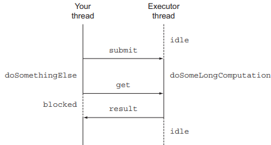
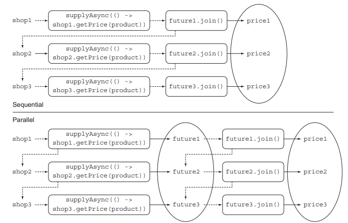
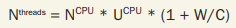
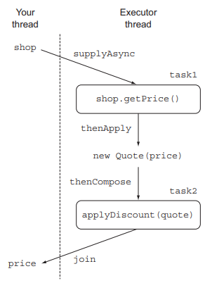
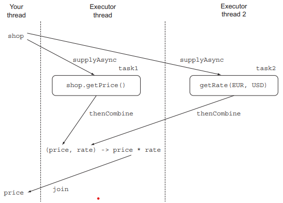

# 16장. CompletableFuture: 안정적 비동기 프로그래밍

## 16.1 Future의 단순 활용

자바 5부터는 미래의 어느 시점에 결과를 얻는 모델에 활용할 수 있도록 Future 인터페이스를 제공하며,
Future는 계산이 끝났을 때 접근할 수 있는 `참조`를 제공한다.

<p align="center"></p>

get() 메서드를 호출했을 때 이미 계산이 완료되어 결과가 준비되었다면 즉시 결과를 반환하지만,
결과가 준비되어있지 않았다면 작업이 완료될 때까지 스레드를 블록시킨다.
만약 오래 걸리는 작업이 영원히 끝나지 않는 문제가 생길 수 있으므로, get 메서드에 스레드가 대기할 최대 타임아웃 시간을 설정하는 것이 좋다.

### 16.1.1 Future 제한

Future 인터페이스가 비동기 계산이 끝났는지 확인하는 isDone 메서드, 계산이 끝나길 기다리는 메서드,
결과 회수 메서드 등이 존재하지만 여러 Future의 결과가 있을 때 이들의 의존성을 표현하기가 어렵다.
예를 들어 오래걸리는 A 작업이 끝나면 결과를 다른 오래 걸리는 B작업으로 전달하고, 다시 그 결과를
다른 작업과 조합하라는 요구사항을 쉽게 구현하기 어렵다.

설명한 기능을 선언형으로 이용할 수 있도록 자바 8에서 제공하는 ComletableFuture를 사용할 수 있다.
Future와 CompletableFuture의 관계는 Collectio과 Stream의 관계와 같다.

### 16.1.2 CompletableFuture로 비동기 어플리케이션 만들기

여러 온라인 상점 중 가장 저렴한 가격을 제시하는 상점을 찾는 어플리케이션을 완성해가며 다음과 같은 기술을 습득해보자

- 고객에게 비동기 API를 제공하는 방법
- 동기 API를 사용해야 할 때 코드를 비블록으로 만드는 방법
- 비동기 동작의 완료에 대응하는 방법

#### 동기 API와 비동기 API

- 동기 API
    - 메서드를 호출한 다음 메서드가 계산을 완료할 때까지 기다렸다가 ㅁ서드가 반환되면 호출자는 반환 값으로 다른 동작을 수행
    - 호출자와 피호출자가 각각 다른 스레드에서 실행되더라도 호출자는 피호출자의 동작을 기다림
    - 동기 API를 사용하는 상황을 블록 호출이라고 함
- 비동기 AI
    - 메서드가 즉시 반환되며 끝내지 못한 나머지 작업을 호출자 스레드와 동기적으로 실행될 수 있도록 다른 스레드에 할당
    - 다른 스레드에 할당된 나머지 계산 결과를 콜백 메서드를 호출해 전달하거나 계산 결과가 끝날 때까지 기다림 메서드를 추가로 호출
    - 비블록 호출

---

## 16.2 비동기 API 구현

```java
public class Shop {
    public double getPrice(String product) {
        return calculatePrice(product);
    }

    public double calculatePrice(String product) {
        delay();
        return random.nextDouble() * product.charAt(0) + product.charAt(1);
    }

    public static void delay() {
        try {
            Thread.sleep(1000L);
        } catch (InterruptedException e) {
            throw new RuntimeException(e);
        }
    }
}
```

getPrice 메서드는 상점의 데이터베이스를 이용해 가격 정보를 얻는 동시에 다른 외부 서비스에 접근한다고 가정한다.
결과적으로 사용자가 이 API를 호출하면 비동기 동작이 완료될 때 까지 1초동안 블락된다.

### 16.2.1 동기 메서드를 비동기 메서드로 변환

```java
class Shop {
  public Future<Double> getPriceAsync(String product) {
    CompletableFuture<Double> futurePrice = new CompletableFuture<>();
    new Thread(() -> {
      try {
        double price = calculatePrice(product);
        futurePrice.complete(price);
      } catch (Exception ex) {
        futurePrice.completeExceptionally(ex);
      }
    }).start();
    return futurePrice;
  }
}
```

동기 메서드 getPrice를 비동기로 바꾸며 Future 인터페이스를 제공한다.
Future는 결과값의 핸들일 뿐 계산이 완료되면 get() 메서드로 결과를 얻을 수 있다.
getPriceAsync 메서드는 즉시 반환되므로 호출자 스레드는 다른 작업을 수행할 수 있다.

### 16.2.2 에러 처리 방법

예외가 발생하면 해당 스레드에만 영향을 미치게 되며, 에러가 발생하더라도 가격 계산이 계속되며 일의 순서가 꼬이게된다.
이렇게되면 get 메서드가 반환될 때까지 영원히 기다릴 수 도 있다.

타임아웃 값을 받는 get 메서드의 오버로드 버전을 만들어 이문제를 해결하여 TimeoutException을 받을 수 있다.
하지만 제품가격 계산에 왜 에러가 발생했는지에 대해 알수는 없다.
이런 경우 CompletableFuture의 completeExceptionally 메서드를 이용해 예외를 포함시킬 수 있다.

```java
class Shop {
  public Future<Double> getPriceAsync(String product) {
    CompletableFuture<Double> futurePrice = new CompletableFuture<>();
    new Thread(() -> {
      try {
        double price = calculatePrice(product);
        futurePrice.complete(price);
      } catch (Exception ex) {
        futurePrice.completeExceptionally(ex);
      }
    }).start();
    return futurePrice;
  }
}
```

#### 팩토리 메서드 supplyAsync로 CompletableFuture 만들기

supplyAsync 팩토리 메서드를 이용하면 CompletableFuture를 간단하게 만들 수 있다.
`supplyAsync는 Supplier를 인수로 받아` CompletableFuture를 반환한다.
앞서 살펴본 예제와 마찬가지로 예외를 처리할 수 있으며, 두번째 인자로 `Executor 또한 지정이 가능`하다.
즉,` 각 CompletableFuture마다 다른 Executor를 지정`할 수 있다.

```java
class Shop {
    public Future<Double> getPriceAsync(String product) {
        return CompletableFuture.supplyAsync(() -> calculatePrice(product));
    }
}
```

---

## 16.3 비블록 코드 만들기

동기 API를 이용해 최저 가격 검색 어플리케이션을 만들어보자.

```java
class Main {
    List <Shop> shops = Arrays.asList(
            new Shop("BestPrice"),
            new Shop("LetsSaveBig"),
            new Shop("MyFavoriteShop"),
            new Shop("BuyItAll")
    );
    
    public List<String> findPrices(String product) {
        return shops.stream()
                .map(shop -> String.format("%s price is %.2f", shop.getName(),
                        shop.getPrice(product)))
                .collect(toList());
    }
}
```

네 개의 상점에서 각각 가격 정보를 얻어오기 때문에 각각 1초씩 걸려 4초가 걸리게 된다.

### 16.3.1 병렬 스트림으로 요청 병렬화 하기

병렬 스트림을 이용해 순차 계산을 병렬화 하면 어떻게 될까?

```java
class Main {
    public List<String> findPrices(String product) {
        return shops.parallelStream()
                .map(shop -> String.format("%s price is %.2f", shop.getName(),
                        shop.getPrice(product)))
                .collect(toList());
    }
}
```

결과는 1초 보다 약간 더 걸리게 되며 성공적으로 개선이 된다. 하지만 더 개선할 방법을 찾아보자.

### 16.3.2 CompletableFuture로 비동기 호출 구현하기
```java
class Main {
    public List<String> findPrices(String product) {
        List<CompletableFuture<String>> priceFutures =
                shops.stream()
                .map(shop -> CompletableFuture.supplyAsync(
                        () -> String.format("%s price is %.2f", shop.getName(),
                                shop.getPrice(product))
                ))
                .collect(toList());

        return priceFutures.stream()
                .map(CompletableFuture::join)
                .collect(toList());
    }
}
```

이 코드를 통해 CompletableFuture의 리스틀 얻을 수 있지만, 우리가 원하는 결과는
String 형식이므로 `CompletableFuture의 동작이 완료되고 결과를 추출`해야한다.
즉, 모든 리스트 내 CompletableFuture에 `join을 호출해 모든 동작이 끝나기를 기다려`야한다.
join은 get과 같지만 아무 예외도 발생시키지 않는다.

<p align="center"></p>

여기서 주목할 점은 두 개의 map 연산을 `하나의 스트림으로 처리하지 않고 두 개로 나눠서 처리`했다는 것이다.
스트림 연산은 게으른 특성 때문에 `하나의 파이프라인으로 처리 시, 모든 요청 동작이 동기, 순차적`으로 이뤄진다.
CompletableFuture로 각 정보를 요청할 때 `기존 요청 작업이 완료되어야 join 결과를 반환하며
다음 정보를 요청`할 수 있기 때문이다.

위 방식으로 결과를 실행하게 되면 2초 정도의 결과를 얻게된다. 병렬 스트림 방식보다 느리게 되어 생각했던 것만큼 좋은 결과는 아닐 수 있다.
그럼 CompletabeFuture를 이용하는 것이 좋지 않은 것일까?

만약 오직 네개의 스레드로만 병렬 실행할 수 있는 기기라고 가정해보자

### 16.3.3 더 확장성이 좋은 해결 방법

만약 다섯 번째 상점이 추가된 상황이라면 네 개의 스레드로만 병렬 실행하는 상황에서 결과가 어떻게 될까?

- 순차 실행 : 5초
- 병렬 스트림
  - 4개의 스레드에서 4개의 상점 처리 1초
  - 추가 상점의 결과를 얻는데 1초
  - 총 2초 이상
- CompletableFuture
  - 2초 이상

결과적으로 병렬 스트림이나 CompletableFuture는 비슷한 작업 시간을 얻을 수 있다.
내부적으로 Runtime.getRuntime().availableProcessors()를 통해 반환하는 스레드 수를 사용하기 때문에
비슷한 결과를 얻게 된다.

하지만 CompletableFuture는 병렬스트림에 비해 다양한 Executor를 지정할 수 있다.
따라서 스레드 풀의 크기를 조절하는 등 어플리케이션에 맞춰 최적화된 설정을 만들 수 있다.

### 16.3.4 커스텀 Executor 사용하기

가격 정보를 검색하려는 상점 수 만큼 스레드를 갖도록 Executor를 설정해보자
쓰레드 수가 너무 많으면 오히려 문제가 될 수 있으므로 최대 100 이하로 설정하는 것이 바람직하다.

```java
class Main {
    private final Executor executor =
            Executors.newFixedThreadPool(Math.min(shops.size(), 100),
                    new ThreadFactory() {
                        public Thread newThread(Runnable r) {
                            Thread t = new Thread(r);
                            t.setDaemon(true);
                            return t;
                        }
                    });
}
```

우리가 만든 풀은 데몬 스레드로 자바 프로그램이 종료될 때 강제로 실행이 종료된다.
이렇게 만들어진 Executor를 CompletableFuture의 두 번째 인수로 전달하면 된다.

```text
CompletableFuture.supplyAsync(() -> calculatePrice(product), executor)
```

#### 스레드 풀 크기 조절

자바 병렬 프로그래밍(브라이언 게츠)에서는 스레드 풀의 최적값을 찾는 방법을 제안한다
스레드 풀이 너무 크면 CPU와 메모리 자원을 경쟁하느라 시간을 낭비할 수 있다.
반면 너무 스레드 풀이 작으면 CPU의 일부 코어가 활용되지 않게 된다.

<p align="center"></p>

- Ncpu
  - Runtime.getRuntime().availableProcessors()를 통해 얻는 코어 수
- Ucpu
  - CPU 활용도(0~1)
- W/C
  - 대기 시간과 계산 시간의 비율

#### 스트림 병렬화와 CompletableFuture 병렬화

우리는 스트림과 CompletableFuture를 이용해 병렬 처리를 할 수 있다.
스트림은 병렬 스트림을 이용하고, CompletableFuture는 컬렉션을 반복하며 CompletableFuture의 내부 연산으로 만드는 것이다.
어떤 병렬화 기법을 사용할지에 대해 참고할 지침이 있다.

- I/O가 포함되지 않는 계산은 스트림 인터페이스가 구현하기 간단하고 효율적일 수 있다.
- I/O를 기다리는 작업을 병렬로 실행할 때는 CompletableFuture를 사용하는 것이 유연성을 제공하며 적합한 스레드 수를 설정할 수 있다.

---

## 16.4 비동기 작업 파이프라인 만들기

기존 가격을 가져오는 것에 추가로 할인 정책이 추가되어 할인된 가격을 계산하는 로직이 추가되었다.
할인된 가격을 가져오는 것 역시 1초의 딜레이가 설정되며 가격을 가져온 이후 할인 가격을 계산하게 된다.

### 16.4.3 동기 작업과 비동기 작업 조합하기

```java
class Main {
    public List<String> findPrices(String product) {
        List<CompletableFuture<String>> priceFutures =
                shops.stream()
                        .map(shop -> CompletableFuture.supplyAsync(
                                () -> shop.getPrice(product), executor))
                        .map(future -> future.thenApply(Quote::parse))
                        .map(future -> future.thenCompose(quote ->
                                CompletableFuture.supplyAsync(
                                        () -> Discount.applyDiscount(quote), executor)))
                        .collect(toList());

        return priceFutures.stream()
                .map(CompletableFuture::join)
                .collect(toList());
    }
}
```

<p align="center"></p>

#### 가격 정보 얻기

팩토리 메서드 supplyAsync를 이용해 비동기적으로 정보를 조회했으며, 그 결과로 Stream<ComepletableFuture<String>>을 얻었다.
설정된 executor는 16.3.4에서 만든 custom executor를 설정한다.

#### Quote 파싱하기

두 번째 변환은 결과 문자열을 Quote로 변환하며 특별한 외부 지연이 없깅 즉시 동작을 수행한다.
따라서, thenApply 메서드를 호출한다음 문자열을 Quote 인스턴스로 변환하는 Function을 전달한다.

thenApply 메서드는 CompletableFuture가 끝날 때까지 블록하지 않고, CompletableFuture의 동작이 완전히 완료된 다음에
thenApply 메서드로 전달된 람다가 실행된다. 마치 CompletableFuture의 결과물로 뭘 할지 지정하는 것과 같다.

#### CompletableFuture를 조합해서 할인된 가격 계산하기

세 번째 변환은 할인을 적용하는 것으로 이전 두 변환과 다르게 원격 실행이 포함되어 1초의 지연을 가진다.

람다 표현식으로 이 동작을 supplyAsync에 전달하여 다른 ComletabeFuture를 반환한다.
결과적으로 두 가지 CompletableFuture로 이루어진 연쇄적으로 수행되는 두 개의 비동기 동작을 만들 수 있다.

- 상점에서 가격 정보를 얻어와 Quote로 변환
- 변환된 Quote를 Discount 서비스로 전달하여 최종 가격 획득

자바 8에서는 두 비동기 연산을 파이프라인으로 만들 수 있도록 `thenCompose` 메서드를 제공하여,
첫 번째 연산의 결과를 두 번째 연산으로 전달한다.
마지막으로, 세 개의 map 연산의 결과 스트림의 요소를 다시 List<String>으로 변환하기 위해 join을 호출하게 된다.

CompletableFuture의 thenCompose 메서드의 Async 버전도 존재한다.
하지만 여기서는 첫 번째 CompletableFuture의에 두 번째 CompletableFuture의 결과가 의존하므로
Async로 다른 쓰레드에서 동작하든 아니든 실행시간에 영향을 미치지 않는다.
오히려, 쓰레드 전환 오버헤드를 줄이고 효율성이 좀 더 좋은 thenCompose를 사용했다.

### 16.4.4 독립 CompletableFuture와 비독립 CompletableFuture 합치기

위 예제에서는 첫 번째 ComletableFuture에 thenCompose를 실행 후, 두 번째
CompletableFuture에 전달했다. 하지만 실전에서는 독립적으로 실행된 두 개의 CompletableFuture를
조합해야하는 상황이 종종 발생한다.

이 상황에서는 thenCombine 메서드를 사용하며 해당 메서드는 BiFunction을 두 번째 파라미터로 받는다.
BiFunction은 두 개의 CompletableFuture의 결과를 받아 두 결과를 조합하는 방법을 정의한다.

thenCombine 또한 Async 버전이 존재하며, BiFunction이 정의하는 조합 동작이 별도의 테스크에서 비동기적으로 수행된다.

<p align="center"></p>

```java
class Main {
    Future<Double> futurePriceInUSD =
            CompletableFuture.supplyAsync(() -> shop.getPrice(product))
                    .thenCombine(
                            CompletableFuture.supplyAsync(
                                    () -> exchangeService.getRate(Money.EUR, Money.USD)),
                            (price, rate) -> price * rate
                    );
}
```

### 16.4.6 타임아웃 효과적으로 사용하기

Future의 계산의 결과를 읽을 떄 까지 무한정 기다리는 상황을 막기 위해 CompletableFuture에서
제공되는 몇가지 기능을 사용할 수 있다.

orTimeout 메서드는 지정된 시간이 지난 후에 TimeoutExecption으로 완료되면서 다른 CompletableFuture를
반환할 수 있도록 내부적으로 ScheduledThreadPoolExecutor를 사용한다.

```java
class Main {
    Future<Double> futurePriceInUSD =
            CompletableFuture.supplyAsync(() -> shop.getPrice(product))
                    .thenCombine(
                            CompletableFuture.supplyAsync(
                                    () -> exchangeService.getRate(Money.EUR, Money.USD)),
                            (price, rate) -> price * rate
                    )
                    .orTimeout(3, TimeUnit.SECONDS);
}
```

또한 일시적으로 외부 서비스로 부터 얻은 값이 아닌 미리 지정된 값을 사용할 수도 있다.
이 경우 completeOnTimeOut 메서드를 이용할 수 있다.

```java
class Main {
    Future<Double> futurePriceInUSD =
            CompletableFuture.supplyAsync(() -> shop.getPrice(product))
                    .thenCombine(
                            CompletableFuture.supplyAsync(
                                    () -> exchangeService.getRate(Money.EUR, Money.USD))
                                    .completeOnTimeout(DEFAULT_RATE, 1, TimeUnit.SECONDS),
                            (price, rate) -> price * rate
                    );
}
```

---

## 16.5 CompletableFuture의 종료에 대응하는 방법

### 16.5.1 최저가격 검색 어플리케이션 리팩토링

모든 가격 정보를 포함할 때까지 리스트 생성을 기다리지 않도록 바꿔보자.
이 경우 연산 실행 정보를 포함하는 CompletableFuture 스트림을 직접 제어해야한다.

```java
class Main {
    public Stream<CompletableFuture<String>> findPricesStream(String product) {
        return shops.stream()
                .map(shop -> CompletableFuture.supplyAsync(
                        () -> shop.getPrice(product), executor))
                .map(future -> future.thenApply(Quote::parse))
                .map(future -> future.thenCompose(quote ->
                        CompletableFuture.supplyAsync(
                                () -> Discount.applyDiscount(quote), executor)));
    }

  public static void main(String[] args) {
    CompletableFuture[] futures = findPricesStream("myPhone27S")
            .map(f -> f.thenAccept(System.out::println))
            .toArray(size -> new CompletableFuture[size]);
    CompletableFuture.allOf(futures).join();
  }
}
```

새로 추가된 연산은 등록된 CompletableFuture의 계산이 끝나면 값을 소비한다.
`thenAccept` 메서드로 이 기능을 제공하며 메서드는 연산 결과를 소비하는 Consumer를 파라미터로 받는다.
thenAccept 또한 Async 버젼이 존재하며 Consumer 동작이 새로운 쓰레드에서 동작한다.

팩토리 메서드 allOf는 CompletableFuture 배열을 입력받아 CompletableFuture<Void>를 반환한다.
allOf 메서드가 반환하는 CompletableFuture에 join을 호출하면 모든 CompletableFuture의 실행 완료를 기다릴 수 있다.

반면 배열의 CompletableFuture 중 하나의 작업이 끝나길 기다리는 경우 anyOf를 사용한다.

## 결론

- 한 개 이상의 원격 외부 서비스를 사용하는 긴 동작을 실행할 때는 비동기 방식으로 어플리케이션의 성능과 반응성을 향상시킬 수 있다.
- CompletableFuture를 이용할 때 비동기 테스크에서 발생한 에러를 관리하고 전달할 수 있다.
- 동기 API를 CompletableFuture로 감싸서 비동기적으로 소비할 수 있다.
- 서로 독립적인 비동기 동작이든 아니면 비동기 동작이 다른 비동기 동작의 결과에 의존하는 상황이든 여러 비동기 동작을 조합할 수 있다.
- CompletableFuture에 콜백을 등록해서 Future의 동작을 끝내고 결과를 생산했을 때 실행하도록 지정할 수 있다.
- 자바 9에서는 orTimeout, completeOnTimeout 등의 메서드를 이용해 타임아웃을 지정할 수 있다.

