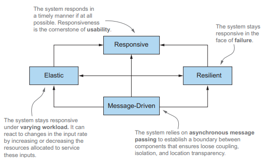
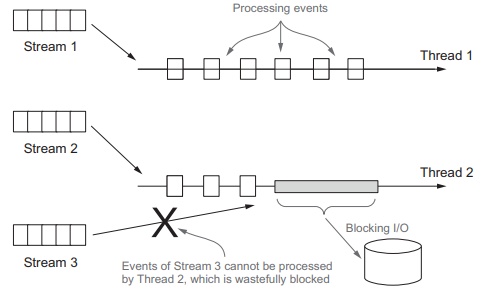

# 17장. 리액티브 프로그래밍

예전과 다르게 오늘 날에는 다음 세 가지를 만족하는 아키텍쳐를 가져야한다.

- 빅데이터
  - 데이터 크기가 페타바이트 단위로 구성되고 매일 증가
- 다양한 환경
  - 모바일 디바이스부터 수천 개의 프롯서로 실행되는 클라우드까지
- 사용 패턴
  - 1년 내내 항상 서비스를 이용하며 밀리초 단위의 응답시간을 기대

리액티브 프로그래밍에서는 다양한 시스템과 소스에서 들어오는 데이터 항목 스트림을
비동기적으로 처리하고 합쳐서 이런 문제를 해결한다.

## 17.1 리액티브 매니패스토

<p align="center"></p>

- 반응성
  - 리액티브 시스템은 빠를 뿐아니라 일정하고 예상할 수 있는 반응 시간을 제공
- 회복성
  - 장애가 발생해도 시스템은 반응
  - 컴포넌트 실행 복제, 여러 컴포넌트의 시간과 공간 분리, 각 컴포넌트가 비동기적으로 작업을 다른 컴포넌트에위임
- 탄력성
  - 작업부하가 발생하면 자동으로 컴포넌트에 할당된 자원 수를 늘림
- 메시지 주도
  - 회복성과 탄력성을 지원하려면 약한 결합, 고립, 위치 투명성등 컴포넌트의 경계를 명확학 정의해야 함
  - 비동기 메시지를 전달해 컴포넌트 끼리의 통신이 이뤄짐

### 17.1.1 어플리케이션 수준의 리액티브

어플리케이션 수준 컴포넌트의 리액티브 프로그래밍의 주요 기능은 비동기로 작업을 수행할 수 있다는 점이다.
리액티브 프레임워크와 라이브러리는 스레드를 퓨처, 액터, 일련의 콜백을 발생시키는 이벤트 루프 등과 공유하고 처리할 `이벤트를 변환하고 관리`한다.

<p align="center"></p>

스레드를 다시 쪼개는 종류의 기술을 이용할 때는 메인 이벤트 루프 안에서는 절대 동작을
블럭하지 않아야 한다는 중요한 전제 조건이 항상 따른다. DB나 파일 시스템 접근, 작업 완료에
얼마나 걸리지 예측이 힘든 원격 서비스 등 모든 I/O관련 동작이 블록 동작에 속한다.

RxJava, Akka 등의 리액티브 프레임워크는 별도로 지정된 스레드 풀에서 블록 동작을 실행시켜
이 문제를 해결한다.

### 17.1.2 시스템 수준의 리액티브

리액티브 어플리케이션은 비교적 짧은 시간 동안만 유지되는 데이터 스트림에 기반한 연산을 수행하며 보통 `이벤트 주도`로 분류된다.
반면 리액티브 시스템은 어플리케이션을 조립하고 상호소통을 조절하기 때문에 주요 속성을 `메시지 주도`로 꼽을 수 있다.

`메시지는 정의된 목적지로` 향하지만, `이벤트`는 관련 이벤트를 관찰하도록 등록된 `컴포넌트가 수신`하는 점이 다르다.
리액티브 시스템에서는 수신자와 발신자가 서로 결합하지 않도록 메시지를 비동기로 처리해야한다.
그래야 시스템이 장애(`회복성`)와 높은 부하(`탄력성`)에서도 `반응성을` 유지할 수 있다.

리액티브 아키텍쳐는 컴포넌트에서 발생한 `장애를 고립`시키고 전체 시스템 장애로 이어지는 것을 막음으로 회복성을 제공한다.
회복성은 `결함 허용 능력(fault-tolerance)`과 같은 의미를 지닌다.
컴포넌트 자체로 문제가 한정되고 외부로는 안정성을 보장하는 방식으로 문제를 관리할 수 있다.

`탄력성의 핵심은 위치 투명성`이다. 시스템의 모든 컴포넌트가 수신자의 위치와 상관없이 다른 서비스와 통신할 수 있음을 의미한다.
위치 투명성으로 인해 시스템을 복제할 수 있고, 작업 부하에 따라 어플리케이션을 확장할 수 있다.
리액티브 어플리케이션은 `시간에 기반한 비동기, 동시적, 비결합`의 특징을 보이는 반면,
리액티브 시스템은 `위치 투명성을 통한 공간적 비결합`을 보여준다.

---

## 17.2 리액티브 스트림과 Flow API

리액티브 프로그래밍은 리액티브 스트림을 사용하는 프로그래밍이다. 리액티브 스트림은
무한의 비동기 데이터를 순서대로 블록하지 않는 역압력을 전제하여 처리하는 기술이다.
역압력은 구독자가 발행자가 이벤트를 제공하는 속도보다 느리게 이벤트를 소비하면서 문제가 발생하지 않도록 하는 장치이다.

리액티브 스트림 프로젝틍서 모든 리액티브 스트림 구현이 제공해야하는 최소 기능 집합을 네개의 인텊이스로 정의했다.
자바의 Flow 뿐만아니라 Akka, 리액터, Rxjava, Vert.x 등의 리액티브 프레임워크는 이 인터페이스를 구현한다.

### 17.2.1 Flow 클래스 소개

리액티브 스트림 프로젝트의 표준에 따라 프로그래밍 발행-구독 모델을 지원할 수 있도록
Flow는 중첩된 인터페이스 4개를 포함한다.

- Publisher
- Subscriber
- Subscription
- Processor

Publisher가 항목을 발행하면 Subscriber가 한개 또는 여러개 항목을 소비하고 Subscription이
이 과정을 관리한다.

Publisher는 자바의 함수형 인터페이스로, Subscriber는 Publihser가 발행한 이벤트의 리스너로 자신을 등록할 수 있다.
Subscription은 Publisher와 Subscriber 사이의 제어흐름, 역압력을 관리한다.

```java
public interface Publisher<T> {
  public void subscribe(Subscriber<? super T> subscriber);
}

public interface Subscriber<T> {
  public void onSubscribe(Subscription subscription);
  public void onNext(T item);
  public void onError(Throwable throwable);
  public void onComplete();
}
```

Subscriber 인터페이스는 Publisher가 이벤트를 발행할 때 호출할 수 있도록 콜백 메서드 네개를 정의한다.
이들 이벤트는 다음 순서로 지정된 메서드 호출을 통해 발행되어야 한다.

```text
onSubscribe onNext* (onError | onComplete)?
```

onSubscribe가 항상 처음 호출되고, onNext는 여러번 호출될 수 있다.
onComplete를 통해 더 이상의 데이터가 없고 종료됨을 알리거나, 장애 발생 시 onError를 호출할 수 있다.

```java
public interface Subscription {
  public void request(long n);
  public void cancel();
}
```

Subscriber가 Publisher에 자신을 등록할 때 Publisher가 처음으로 onSubscirbe 메서드를 호출해 Subscription 객체를 전달한다.
Subscription 인터페이스는 두개의 메서드를 정의하고 하나는 주어진 갯수의 이벤트를 처리할 준비가 되었음을,
두번째는 추가 이벤트를 더 이상 처리하지 않음을 알린다.

```java
public interface Processor<T, R> extends Subscriber<T>, Publisher<R> { }
```

Processor 인터페이스는 Publisher와 Subscriber를 모두 상속하므로 이벤트를 발행하고 소비할 수 있다.

이 인터페이스는 스트림에서 처리하는 이벤트의 변환 단계를 나타낸다.
Processor가 에러를 수신하면 회복하거나 onError를 모든 Subscriber에게 전달할 수 있다.
마지막 Subscriber가 Subscription을 취소하면 Processor는 자신의 업스트림 Subscription도 취소한다.

## 결론

- 리액티브 소프트워는 반응성, 회복성, 탄력성, 메시지 주도의 특성을 가져야한다.
- 여러 어플리케이션을 통합하는 리액티브 시스템은 하나의 어플리케이션을 구현할 때와는 다른 접근 방식을 적용한다.
- 리액티브 어플리케이션은 리액티브 스트림이 전달하는 한 개 이상의 이벤트를 비동기로 처리함을 전제로한다.
- 리액티브 스트림은 비동기적으로 처리되므로 역압력 기법이 기본적으로 탑재된다.
  - 이를 통해 발행자가 빠른 속도로 이벤트를 발행할 때 생기는 문제를 방지한다.
