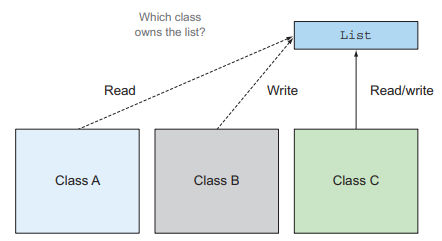
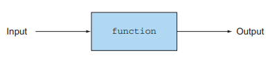
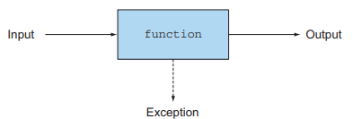
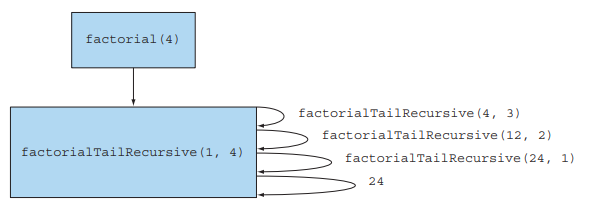

# 18장. 함수형 관점으로 생각하기

## 18.1 시스템 구현과 유지보수

### 18.1.1 공유된 가변 데이터

변수가 예상하지 못한 값을 갖는 이유는 여러 메서드에서 공유된 가변 데이터 구조를 읽고 갱신하기 때문이다.
공유 가변 데이터 구조를 사용하면 프로그램 전체에서 데이터 갱신 사실을 추적하기 어려워진다.

<p align="center"></p>

자신을 포함하는 클래스의 상태 그리고 다른 객체의 상태를 바꾸지 않으며 return 문을 통해서만 
자신의 결과를 반환하는 메서드를 `순수 또는 부작용 없는 메서드`라고 부른다.

불변 객체를 이용해서 부작용을 없애는 방법도 있다. 불변 객체는 복사하지 않고 공유할 수 있으며,
객체의 상태를 바꿀 수 없으므로 스레드 안정성을 제공한다.

부작용 없는 시스템 컴포넌트에서는 메서드가 서로 간섭하는 일이 없으므로 잠금을 사용하지 않고도 병렬성을 사용할 수 있다.

### 18.1.2 선언형 프로그래밍

이 일을 진행하고 다음에 저 값을 갱신하고, 그 다음엔 어떤 작업을 하는지와 같이
작업을 어떻게 수행할 것인지 집중하는 방법이 고전 객체 지향에서 이용하는 방식이다.
이처럼 어떻게에 집중하는 프로그래밍 형식은 명령형 프로그래밍이라고 부르기도 하며,
할당, 조건문, 분기문 등의 명령어가 컴퓨터의 저수준 언어와 비슷하게 생겨서 그렇게 부른다.

어떻게가 아닌 `무엇을`에 집중하는 방식도 존재한다. 무엇을 할지를 정하고 어떻게할지는 내부 라이브러리가 결정한다.
이런 구현 방식을 내부 반복이라고 한다.
선언형 프로그래밍은 우리가 원하는 것과 그 목표를 달성하는 방법에 대한 규칙이 코드에 드러나는 장점이 있다.

### 18.1.3 왜 함수형 프로그래밍인가?

함수형 프로그래밍은 선언형 프로그래밍을 따르는 대표적 방식이다.

작업을 조합하거나 동작을 전달하는 등, 선언형을 사용해서 자연스럽게 읽고 쓸 수 있는 코드를 구현한다.
또한 여러 연산을 연결해서 복잡한 질의를 표현할 수 도 있다.

---

## 18.2 함수형 프로그래밍은 무엇인가?

<p align="center"></p>

함수형 프로그래밍에서 함수란 수학적인 함수와 같다. 0개 이상의 파라미터를 가지며,
한 개 이상의 결과를 반환하지만 부작용이 없어야한다. 즉, 여러 입력을 받아서 여러 출력을
생성하는 `블랙박스`와 같다. 특히 파라미터가 같다면 반복적으로 호출했을 때 항상 같은 결과를 반환해야한다.

- 함수와 if-then-else 등의 수학적 표현만 사용하는 방식은 `순수 함수형 프로그래밍`
- `시스템의 다른 부분에 영향을 미치지 않는다면` 내부적으로 함수형이 아닌 기능을 사용하는 방식은 `함수형 프로그래밍` 

### 18.2.1 함수형 자바

자바에서는 순수 함수형이 아닌 함수형 프로그래밍을 구현하며 실제 부작용이 있지만 이를 보지 못하게 함으로써 함수형을 달성할 수 있다.

함수나 메서드는 지역변수만을 변경해야 함수형이라 할 수 있으며, 참조하는 객체가 있다면 그 객체는 불변이여야 한다.
예외적으로 메서드 내에서 생성한 객체는 필드를 갱신할 수 있지만, 이 경우 외부에 노출되지 않아야하고 다시 호출했을 때의
결과에 영향을 미치지 않아야한다.

함수형은 함수나 메서드가 어떤 예외도 일으키지 않아야한다. 하지만 자바는 비정상적인 입력 값이 있을 때,
예외를 일으키는 것이 자연스러운 방식이다. 결과적으로 다음과 같은 그림이된다.

<p align="center"></p>

예외를 사용하지 않고 나눗셈같은 함수를 표현하려면 Optional을 사용할 수 있다.
하지만 모든 코드에 Optional을 사용할 필요는 없으며, `다른 컴포넌트에 영향을 미치지 않도록
지역적으로 예외를 사용하는 방법을 고려`할 수 있다.

### 18.2.2 참조 투명성

부작용을 감춰야한다는 제약은 `참조 투명성` 개념으로 귀결된다.
같은 파라미터로 함수를 호출했을 때, 항상 같은 결과를 반환한다면 참조 투명한 함수라고 할 수 있다.
즉, 함수는 어떤 입력이 주어졌을 때 언제 어디서 호출하는 같은 결과를 생성해야한다.

참조 투명성를 통해 비싸거나 오래걸리는 연산을 캐싱하는 등 최적화의 기능을 제공할 수 있다.

---

## 18.3 재귀와 반복

순수 함수형 프로그래밍은 반복문이 코드에 스며들 수 있기에, while, for 같은 반복문을 포함하지 않는다.
하지만 함수형 프로그래밍에서는 외부에서 변화를 알아차리지 못하면 아무 상관이 없다고 언급했다.
즉, 지역 변수는 자유롭게 변경할 수 있다.

```text
Iterator<Applle> it = apples.iterator();
while(it.hasNext()) {
    Apple apple = it.next();
    }
}
```

재귀를 이용하면 루프 단계마다 갱신되는 반복 변수를 제거할 수 있다. 또한 스트림을 이용해서 내부 반복을 통해 루프를 숨길 수도 있다.

```text
long factiorialStream(long n) {
    return LongStream.rangeClosed(1, n)
        .reduce(1, (long a, long b) -> a * b);
}
```

하지만 일반적으로 재귀는 함수를 호출할 때마다 호출 스택에 정보를 저장하기 때문에 반복보다 비싼 비용을 가진다.
따라서 큰 입력값이 들어오게 되면 StackOverflowError가 발생할 수 있다.

<p align="center"></p>

```text
long factorialTailRecursive(long n) {
    return factorialHelper(1, n);
}

long factorialHelper(long acc, long n) {
    return n == 1 ? acc : factorialHelper(acc * n, n - 1);
}
```

하지만 함수형 언어에서는 재귀에서 꼬리 호출 최적화(tail-call operation)라는 해결책을 통해 이를 해결할 수 있다.

중간 결과를 각 스택 프레임에 저장하는 일반 재귀와 달리 꼬리 재귀에서는 컴파일러가 하나의 스택 프레임을
재활용할 가능성이 생긴다. 아직 자바에서는 이런 최적화를 제공하지 않지만 다른 JVM에서 이런 최적화를 제공하기에
최적화 여지를 남길 수 있도록 꼬리 재귀를 사용하는 것이 좋다.

## 결론

- 공유된 가변 자료구조를 줄이는 것이 유지보수하고 디버깅하는데 도움이 된다
- 함수형 프로그래밍은 부작용이 없는 메서드와 선언형 프로그래밍 방식을 지향한다
- 함수형 메서드는 입력 파라미터와 결과만을 갖는다
- 같은 파라미터로 함수를 호출했을 때 항상 같은 값을 반환하면 참조 투명성을 가진다
- while 루프 같은 반복문은 재귀로 대체할 수 있다
- 자바에서 꼬리 재귀를 지원하진 않지만 추가적인 컴파일러 최적화를 기대할 수 있다