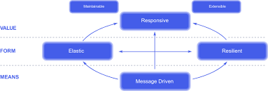

# Ch1. 리액티브 시스템과 리액티브 프로그래밍

## 1.1 리액티브 시스템(Reactive System)이란?

리액티브 시스템에서 `리액티브란 어떤 이벤트나 상황이 발생했을 때 반응하여 적절하게 행동하는 것`을 의미한다.
즉, 리액티브 시스템은 반응을 잘하는 시스템으로서, 반응을 잘한다는 것은 `클라이언트의 요청에 즉각적으로 응답함으로써 지연 시간을 최소화`한다고 볼 수도 있다.

## 1.2 리액티브 선언문으로 리액티브 시스템 이해하기

리액티브 선언문(The Reactive Manifesto)는 리액티브 시스템 구축을 위한 `일종의 설계 원칙이자 리액티브 시스템의 특징`이라고 할 수 있다.

- MEANS는 리액티브 시스템에서 주요 통신 수단으로 무엇을 사용할 것인지를 의미
  - 메시지 기반 통신을 통해서 구성요소들 간의 `느슨한 결합, 격리성, 위치 투명성`을 보장
- FORM은 메시지 기반 통신을 통해서 어떤 형태를 지닌 시스템으로 형성할지를 의미
  - 탄력성(Elastic) 은 시스템의 작업량이 변화하더라도 일정한 응답을 유지하는 것
    - 일정한 응답을 유지하기 위해 시스템 자원을 적절하게 추가하거나 감소시켜 작업량의 변화에 대응하는 것
  - 회복성(Resilient)은 시스템에 장애가 발생하더라도 응답성을 유지하는 것
    - 회복성을 확보하기 위해 리액티브 시스템의 구성요소들은 비동기 메시지 기반 통신을 통해 느슨한 결합과 격리성을 보장
    - 구성요소들이 독립적이기에 장애가 발생하더라도 전체 시스템은 여전히 응답 가능
- VALUE는 비동기 메시지 기반 통신을 바탕으로 회복성과 탄력성을 확보함으로써 즉각적으로 응답가능한 시스템을 구축할 수 있음을 의미
  - 즉 리액티브 시스템의 핵심 가치

## 1.3 리액티브 프로그래밍(Reactive Programming)이란?

리액티브 프로그래밍은 리액티브 시스템을 구축하는데 필요한 프로그래밍 모델을 의미한다.

비동기 메시지 통신을 기반으로 하기에 Blocking I/O 방식이 아닌 Non-Blocking I/O 방식을 사용한다.
Blocking I/O 방식의 통신은 해당 스레드가 작업을 처리할 때 까지 남은 작업들이 차단된다.
반면 Non-Blocking I/O 방식은 해당 스레드가 작업을 처리하는 동안 다른 작업들을 처리할 수 있기에 효율적이다.

## 1.4 리액티브 프로그래밍의 특징

> In computing, reactive programming is a declarative programming paradigm concerned with data streams and the propagation of change.

- declarative programming
  - 선언형 프로그래밍
  - C나 Java같은 명령형 프로그래밍 방식은 실행할 동작을 구체적으로 명시
  - 선언형 프로그래밍 방식은 실행할 동작을 구체적으로 명시하지 않고 어떤 동작을 하겠다는 목표만 선언
- data stream and propagation of change
  - data stream은 데이터의 흐름을 의미하며 지속적으로 데이터가 발생함을 의미
  - propagation of change는 지속적인 데이터가 발생할 때마다 이를 `이벤트`로 보고, 이 이벤트를 발생시키면서 데이터를 계속 전달하는 것

## 1.6 리액티브 프로그래밍 코드 구성

- Publisher
  - 입력으로 들어오는 데이터를 제공하는 역할
- Subscriber
  - Publisher로부터 데이터를 받아서 사용하는 주체
- Data Source(= Data Stream)
  - Publisher의 입력으로 들어오는 데이터
- Operator
  - 요구사항에 맞게 Data Source를 가공하는 역할

---

## 정리

### 리액티브 시스템의 설계

- 비동기 메시지 기반 통신
- 탄력성 + 회복성
- 높은 응답성
- 유지보수와 확장에 용이

### 리액티브 프로그래밍의 특징

- 선언형 프로그래밍 방식
- 데이터 소스의 변경이 있을 때 마다 데이터를 전파
- 메서드 체인형태로 표현

### 리액티브 프로그래밍 코드의 구성요소

- Publisher는 데이터를 Subscriber에게 전달
- Subscriber는 Publisher로부터 데이터를 받아서 사용
- Data Source는 Publisher의 입력으로 전달되는 데이터
- Operator는 Data Source를 가공하는 역할

