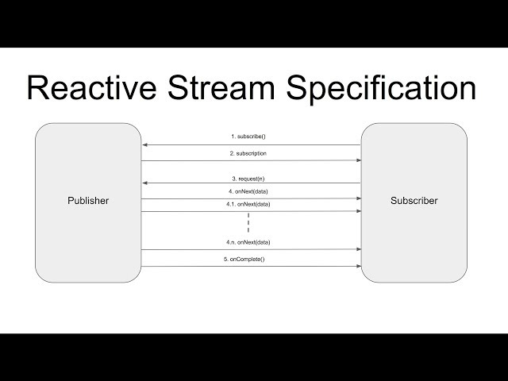

# Ch2. 리액티브 스트림즈(Reactive Streams)

## 2.1 리액티브 스트림즈란?

데이터를 스트림을 Non Blocking 이면서 비동기적인 방식으로 처리하기 위한 리액티브 라이브러리의 표준사양이다.
구현체로는 RxJava, Reactor, Akka Streams, Java 9 Flow API 등이 있다.

## 2.2 리액티브 스트림즈의 구성요소

- Publisher
  - 데이터를 생성하고 발행하는 역할
- Subscriber
  - Publisher로부터 발행된 데이터를 전ㄷ라받아서 처리하는 역할
- Subscription
  - Publisher에 요청할 데이터의 갯수를 지정하고 데이터 구독을 취소하는 역할
- Processor
  - Publisher와 Subscriber의 기능을 모두 가짐
  - Subscriber로서 Publisher를 구독할 수도 반대의 역할도 가능


<p align="center"></p>

리액티브 스트림즈의 컴포넌트인 Publisher와 Subscriber간의 동작 과정은 다음과 같다.

1. Subscriber가 전달받을 데이터를 구독(subscribe())
2. Publisher가 데이터를 발행할 준비가 되었음을 Subscriber에게 알림(onSubscribe())
3. Subscriber는 전달받기 원하는 데이터의 갯수를 Publisher에게 요청(Subscription.request(n))
4. Publisher는 요청받은 데이터의 갯수만큼 데이터를 발행(onNext())
5. Publisher가 모든 데이터 전송이 완료되면 완료되었음을 Subscriber에게 알림(onComplete())
   - 만약 처리 과정에서 에러가 발생한다면 에러 발생을 Subscriber에게 알림(onError())

Subscriber가 Publisher에게 요청 희망 데이터 갯수를 전달하는 이유는 뭘까?

- 실제 Publisher와 Subscriber는 서로 다른 스레드에서 비동기적으로 상호작용
- Publisher의 발행속도가 Subscriber의 처리속도보다 빠르다면 데이터가 Subscriber에게 쌓이게 되어 메모리 부하가 발생할 수 있음

## 2.3 코드로 보는 리액티브 스트림즈 컴포넌트

### Publisher

```java
public interface Publisher<T> {
  void subscribe(Subscriber<? super T> s);
}
```

Publisher는 데이터를 발행하고 전달하고 Subscriber는 데이터를 전달받기 위해 구독을 한다.
하지만 위 메서드를 보면 Publisher에서 subscribe 메서드가 정의되어 있을까?

Kafka와 같은 메시지 기반 시스템의 Pub/Sub과 리액티브 스트림즈의 Publisher와 Subscriber는 의미가 조금 다르다.

Kafka의 경우 Publisher와 Subscriber 사이에 메시지 브로커(Message broker)가 존재하고, Publisher와 Subscriber는 브로커내 토픽을 바라보는 구조이다.
따라서, Publisher는 특정 토픽으로 발행하고 Subscribera는 특정 토픽을 구독만하면 되는 `느슨한 결합구조`이다.

반면 리액티브 스트림즈에서는 Subscriber가 구독하는 것이 개념상으로는 맞지만 Publisher가 파라미터인 Subscriber를 등록하는 형태로 구독이 이뤄진다.

### Subscriber

```java
public interface Subscriber<T> {
  void onSubscribe(Subscription s);
  void onNext(T t);
  void onError(Throwable t);
  void onComplete();
}
```

- onSubscribe(Subscription s)
  - 구독 시작 시점에 어떤 처리를 하는 역할
    - Publisher에게 요청할 데이터 갯수를 지정하거나 구독을 해지하는 등
  - Subscription 객체를 통해 이뤄짐
- onNext(T t)
  - Publisher로부터 데이터를 전달받아서 처리하는 역할
- onError(Throwable t)
  - Publisher가 데이터 발행 중 에러가 발생했을 때 해당 에러를 처리하는 역할
- onComplete()
  - Publisher가 모든 데이터를 발행하고 완료되었음을 알림
  - 후처리를 해야한다면 해당 메서드에서 처리

### Subscription

```java
public interface Subscription {
  void request(long n);
  void cancel();
}
```

- request(long n)
  - Publisher에게 구독할 데이터의 갯수를 요청
- cancel()
  - 구독을 취소하는 역할

### Processor

```java
public interface Processor<T, R> extends Subscriber<T>, Publisher<R> {
}
```

- 별도로 구현하는 메서드가 없고 Subscriber와 Publisher 인터페이스를 상속


### Publisher, Subscriber, Subscription의 동작 과정

1. Publisher의 subscribe 메서드를 통해 `Subscriber 구현 객체를 전달`
2. Publisher 내부에서 `전달받은 Subscriber 구현 객체의 onSubscribe 메서드를 호출`
   - 이때, Subscription 인터페이스 구현 객체를 Subscriber에게 전달
3. 호출된 Subscriber 구현 객체에서 Subscription 객체를 통해 전달받을 데이터의 갯수를 Publisher에 요청
4. Publisher는 요청받은 데이터의 갯수만큼 onNext 호출을 통해 Subscriber에게 데이터를 전달
5. Publisher가 모든 데이터를 전달하고 완료되었음을 알리면 onComplete 호출
   - 만약 에러가 발생한다면 onError 호출

## 2.4 리액티브 스트림즈 관련 용어 정의

- Signal
  - Publisher와 Subscriber 사이의 상호작용
  - onSubscribe, onNext, onError, onComplete 등
  - 사용하는 주체의 관점에서 Signal을 이해해야 함
    - onSubscribe는 Subscriber 인터페이스에 정의되어 있지만 실제 호출해서 사용하는 주체는 Publisher, 즉 Publisher가 Subscriber에게 보내는 Signal
- Demand
  - Subscriber가 Publisher에게 요청하는 데이터
  - Publisher가 아직 Subscriber에 전달하지 않은 Subscriber가 요청한 데이터
- Emit
  - Publisher가 Subscriber에게 데이터를 전달하는 행위
- Upstream/Downstream
  - 리액티브에서 흘러가는 것은 데이터, 즉 Streeam은 데이터
  - 리액티브 프로그래밍은 메서드 체인형식으로 작성하는데 이때, 데이터의 흐름을 Upstream과 Downstream으로 표현
    - Upstream: 데이터의 발생지
    - Downstream: 데이터의 소비지
- Sequence
  - Publisher가 emit하는 데이터의 연속적인 흐름을 정의
  - 다양한 Operator로 데이터의 연속적인 흐름을 정의한 것으로 볼 수 있음
- Source
  - 최초에 생성된 원본

## 2.5 리액티브 스트림즈의 구현 규칙

### Publisher 구현을 위한 주요 기본 규칙

1. Publisher가 Subscriber에게 보내는 onNext signal의 총 갯수는 항상 Subscriber가 요청한 데이터의 갯수보다 작거나 같아야 한다
2. Publisher는 요청된 것보다 적은 수의 onNext signal을 보내고 onComplete나 onError를 호출해 구독을 종료할 수 있다
   - Publisher가 무한 스트림의 경우 에러가 발생하기 전까지 종료가 없기에 예외
3. Publisher의 데이터 처리가 실패하면 onError signal을 보내야한다
4. Publisherdml 데이터 처리가 성공하면 onComplete signal을 보내야한다
5. Publisher가 Subscriber에게 onError, onComplete signal을 보내는 경우 해당 Subscriber의 `구독은 취소`된 것으로 간주되어야 한다
6. 종료 상태 signal(onComplete, onError)을 받으면 더이상 signal이 발생되지 않아야한다
7. 구독이 취소되면 Subscriber는 더이상 signal을 받지 않아야한다

### Subscriber 구현을 위한 주요 기본 규칙

1. Subscriber는 Publisher로 부터 onNext signal을 받기 전에 Subscription.request(n)을 통해 Demand signal을 Publisher에게 보내야 한다
2. onCompleted나 onError는 Subscription 또는 Publihser의 메서드를 호출하면 안된다
   - 순환 및 경쟁 조건 방지
3. onCompelete나 onError가 수신하면 구독이 취소된 것으로 간주한다
4. 구독이 더이상 필요치 않은 경우 cancel을 호출해야한다
5. onSubscribe()는 지정된 Subscriber가 최대 한번만 호출되어야 한다
   - 동일한 구독자가 최대 한번만 구독

### Subscription 구현을 위한 주요 기본 규칙

1. 구독은 Subscriber가 onNext 또는 onSubscriber 내에서 동기적으로 Subscription.request(n)을 호출하도록 허용해야 한다
   - request와 onNext 사이에 상호 재귀로 인한 오버플로 회피
2. 구독이 취소된 후 추가적으로 호출되는 Subscription.request(n)은 무시되어야 한다
3. 구독이 취소된 후 추가적으로 호출되는 Subscription.cancel()은 무시되어야 한다
4. 구독되는 동안 Subscription.request(n)의 파라미터가 0보다 작거나 같으면 onError signal을 보내야한다
5. 구독되는 동안 cancel()은 Publisher가 Subscriber에 보내는 signal을 `결국 중지하도록 요청`해야한다
   - 구독 취소 뿐만 아니라 Publisher에게 signal을 보내는 것을 중지 요청
6. 구독되는 동안 cancel()은 Publisher에게 해당 구독자에 대한 참조를 결국 삭제하도록 요청해야한다
7. cancel(), request() 호출에 대한 응답으로 예외를 던지는 것을 허용하지 않는다
   - 리액티브 스트림즈에서는 예외가 발생하면 해당 예외를 onError signal과 함께 전달
8. 무제한 수의 request() 호출을 허용해야하며 최대 2^63-1 Demand를 지원해야한다

---

## 정리

- 리액티브 스트림즈는 데이터 스트림을 Non Blocking, 비동기적으로 처리하기 위한 리액티브 라이브러리의 표준사양
- 리액티브 스트림즈는 Publisher, Subscriber, Subscription, Processor로 구성
- Publisher와 Subscriber의 동작 과정과 리액티브 스트림즈 컴포넌틔 구현 규칙은 기억해야 함
- 리액티브 스트림즈의 구현체 중 어떤 것을 사용하더라도 핵심 동작 원리는 동일
