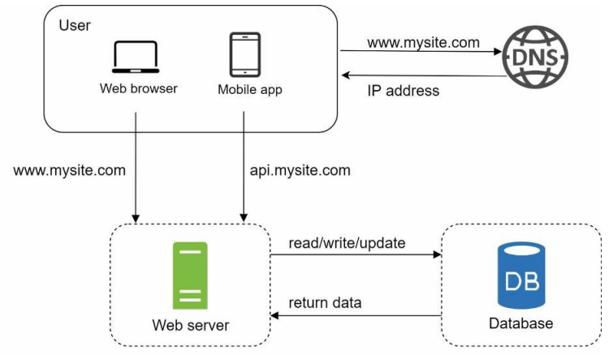

# 1장. 사용자 수에 따른 규모 확장성

## 단일 서버

단일 서버는 모든 컴포넌트가 단 한대의 서버에서 실행되는 간단한 시스템이다.
웹 앱, 데이터베이스, 캐시 등이 서버 한 대에서 실행된다.

<p align="center"></p>

먼저 사용자의 요청이 처리되는 과정과 요청을 만드는 단말에 대해 이해할 필요가 있다.

1. 도메인 이름을 이용해 웹사이트에 접속한다. 도메인 이름을 DNS를 통해 IP 주소로 변환한다.
2. DNS 조회 결과로 IP 주소가 반환된다
3. 해당 IP 주소로 HTTP(HyperText Transfer Protocol) 요청이 전달된다
4. 요청을 받은 웹 서버는 HTML 페이지나 JSON 형태의 응답을 반환한다

---

## 데이터베이스

<p align="center"></p>

사용자가 늘어나면 서버 하나로는 충분치 않기에 여러 서버를 두어야 한다.
하나는 웹, 모바일 트래픽 처리를 위한 용도이고 다른 하나는 데이터베이스용이다.
`웹, 모바일 트래픽 처리 서버(웹 계층)와 데이터베이스 서버(데이터 계층)을 분리`하면
각각을 독립적으로 확장해 나갈 수 있다.

### 어떤 데이터베이스를 사용할 것인가?

관게형 데이터 베이스는 테이블과 열, 컬럼으로 표현한다. SQL을 이용해 여러 테이블에 있는 데이터를
관계에 따라 join 할 수 있다.

반면 비관계형 데이터베이스는 NoSQL이라고 부르며, 다시 네 부류로 나눌 수 있다.
키-값 저장소(key-value store), 그래프 저장소(graph store), 도큐먼트 저장소(document store),
컬럼 저장소(column store)가 있다. NoSQL은 일반적으로 join을 지원하지 않는다.

다음과 같은 경우에 NoSQL을 사용하는데 적합할 수 있다.

- 아주 낮은 응답 지연시간(latency)이 필요한 경우
- 데이터가 비정형(unstructured)인 경우
- 데이터를 직렬화하거나 역직렬화할 수 있기만 하면 되는 경우
- 아주 많은 양의 데이터를 저장할 필요가 있는 경우

## 수직적 vs 수평적 확장

### 수직적 규모 확장

스케일 업이라고도 하며 고사양 자원을 추가하는 것이다. 서버로 `유입되는 트래픽이 적을 때`는 수직적 확장이 좋은 선택이며,
가장 큰 장점은 `단순함`이다.

하지만 다음과 같은 단점이 존재한다.

- 수직적 규모를 무한대로 증설할 수 없음, 즉 한계가 존재
- 장애에 대한 자동복구(failover)나 다중화(redundancy)가 어려움

### 수평적 규모 확장

스케일 아웃이라고 하며 더 많은 서버를 추가하여 성능을 개선하는 것이다.
`대규모 어플리케이션을 지원`하는 데는 수평적 규모 확장이 적절하다.

### 로드밸런서

사용자가 웹 서버에 바로 접속하게 되면, 웹 서버 다운시 웹사이트 또한 접속할 수 없다.
또한 많은 사용자가 몰리거나 서버가 한계 상황에 도달하면 응답 속도가 느려지거나 접속이 불가능할 수 있다.
이런 상황을 대처하기 위해 `트래픽 부하를 고르게 분산`하는 역할을 하는 로드밸런서를 사용한다.

사용자는 로드밸런서의 public ip로 접속하고, 로드밸런서는 웹 서버의 private ip로 접속한다.
부하 분산 집합에 웹 서버를 추가하면 장애를 복구하지 못하는 문제나 웹 계층의 가용성이 향상된다.

### 데이터베이스 다중화

데이터베이스 다중화는 보통 서버 사이에는 master-slave 관계를 설정하고 데이터 원본은 master에, 복제본은 slave에 저장하게된다.
쓰기 연산은 마스터에서만 지원한다. 대부분의 어플리케이션은 쓰기보다 읽기의 비중이 높기에 slave 데이터베이스의 수가 master의 갯수보다 많다.

데이터베이스 다중화의 이점은 다음과 같다

- 더 나은 성능
  - 변경 연산은 master에만 전달되는 반면, 읽기 연산은 slave로 분산된다
  - 병렬로 처리할 수 있는 쿼리가 늘어나므로 성능이 좋아진다
- 안정성(reliability)
  - 데이터베이스 서버 가운데 일부가 유실되어도 데이터가 보존된다
- 가용성(availablity)
  - 데이터를 여러 지역에 복제함으로써, 하나의 데이터베이스가 장애가 발생하더라도 다른 서버의 데이터베이스로부터 데이터를 가져와 서비스를 지속할 수 있다

```text
master가 다운되면 slave가 새로운 master가 되지만, 실제 운영 환경에서는 좀 더 복잡해진다.
slave에 저장된 데이터가 최신 상태가 아닐 수도 있기 때문이다.

복구 스크립트를 사용하던가, 다중 마스터, 원형 다중화 방식을 도입하면 이런 문제를 대처할 수 있다.
```

앞서 설명한 로드 밸런서와 데이터베이스 다중화를 고려하면 다음과 같은 설계안이 된다.

<p align="center"></p>

---

## 캐시

캐시는 비싼 연산 결과 또는 자주 참조되는 데이터를 메모리 안에 두고, 뒤이은 요청이 빠르게 처리될 수 있도록 하는 저장소이다.
어플리케이션의 성능은 데이터베이스를 얼마나 호출하냐에 따라 좌우되는데, 캐시는 그런 문제를 완화시켜준다.

### 캐시 계층

<p align="center"></p>

별도의 캐시 계층을 두면 성능이 개선되고 데이터베이스의 부하를 줄일 수 있으며,
캐시 계층의 구모를 독립적으로 확장시킬 수 있다.

웹서버가 요청을 받고 캐시에 응답이 저장되어있다면, 데이터베이스에 접근하지 않고 바로 응답을 반환한다.
없는 경우에는 데이터베이스에서 데이터를 찾아 캐시에 저장한 뒤 응답을 반환한다.
이런 전략을 `읽기 주도형 캐시 전략(read-through cache strategy)`라고 한다.

다양한 캐시 전략이 존재하며 캐시할 데이터 종류, 크기, 액세스 패턴에 맞는 캐시전략을 선택하면 된다.

### 캐시 사용시 유의할 점

- 캐시는 어떤 상황에 바람직한가?
  - 데이터 갱신은 자주 일어나지 않지만 참조는 빈번하게 일어나는 경우
- 어떤 데이터를 캐시에 두어야할까?
  - 캐시는 휘발성이므로 영속적으로 보관할 데이터는 캐시에 두지 않는다
  - 중요 데이터는 영속 저장소에 두어야한다
- 캐시에 보관된 데이터는 어떻게 만료되는가?
  - 만료 정책을 사전에 정의해 두는 것이 좋다
  - 만료 기한이 너무 짧으면 데이터베이스에 너무 자주 접근하게 된다
  - 만료 기한이 너무 길면 원본 데이터와 차이가 날 가능성이 높아진다
- 일관성은 어떻게 유지되는가?
  - 원본 저장소를 갱신하는 연산과 캐시를 갱신하는 연산이 단일 트랜잭션으로 처리되지 않으면 일관성이 깨질 수 있다
  - 시스템을 확장해 나가는 경우 캐시와 저장소 사이의 일관성을 유지하는 것은 어려운 문제가 된다
- 장애에는 어떻게 대처할 것인가?
  - 캐시 서버를 한 대만 두는 경우 해당 서버는 단일 장애 지점(SPOF, single point of failure)이 된다
    - 즉, 특정지점에서의 장애가 전체 시스템의 동작을 중단시킴
  - 여러 지역에 걸쳐 캐시 서버를 분산시켜야 함
- 캐시 메모리는 얼마나 크게 잡을 것인가?
  - 캐시 메모리가 너무 작으면 자주 캐시에서 eviction되어 캐시 성능이 떨어진다
  - 캐시 메모리를 과할당(overprovision) 하는 것이 하나의 방법이 될 수 있다
- 데이터 방출(eviction) 정책은 무엇인가?
  - 캐시가 꽉찬 경우 기존 캐시 내 데이터를 방출해야 한다.
  - 가장 널리 쓰이는 것은 LRU(Least Recently Used) 방식이다
    - 가장 오랫동안 참조되지 않은 데이터를 방출한다
  - 상황에 맞는 방식을 선택해야 한다

## 컨텐츠 전송 네트워크(CDN, Content Delivery Network)

<p align="center"></p>

CDN은 웹사이트의 정적 컨텐츠를 전송하는데 사용되는, 지리적으로 분산된 서버 네트워크이다.
어떤 사용자가 웹사이트를 방문하면 사용자와 가까운 CDN 서버가 정적 컨텐츠를 전달한다.
만약 CDN 서버의 캐시에 컨텐츠가 없다면 원본 서버에서 컨텐츠를 가져와 캐시에 저장한 뒤 전달한다.

### CDN 사용시 고려해야할 사항

- 비용
  - CDN으로 들어가고 나가는 데이터 전송 양에 따라 요금이 부과된다
  - 자주 사용되지 않는 컨텐츠를 캐싱하는 것은 이득이 크지 않음
- 적절한 만료
  - time-sensitive한 데이터는 컨텐츠 만료 시점을 잘 정해야 한다
- CDN 장애 대처 방안
  - CDN 서버가 죽는 경우 웹사이트, 어플리케이션이 어떻게 동작해야 하는지 고려
  - CDN 서버가 죽어도 웹사이트가 동작하도록 하려면, CDN 서버가 죽었음을 감지하고 원본 서버로 요청을 전달해야 한다
- 컨텐츠 무효화(invalidation)
  - 아직 만료되지 않은 컨텐츠라도 강제로 무효화하면 CDN에서 제거할 수 있음

<p align="center"></p>

캐시와 CDN을 적용하여 추가된 설계는 위와 같으며 다음과 같은 장점을 가진다.

1. 정적 컨텐츠(JS, CSS, 이미지 등)은 웹서버가 아닌 CDN을 통해 제공하여 더 나은 성능을 보장한다
2. 캐시가 데이터베이스 부하를 줄여준다.

---

## 무상태(statless) 웹 계층

이제 웹 계층(web-tier)를 수평적으로 확장하는 방법을 고려해볼 수 있다.
이를 위해서는 상태정보(세션 정보 등)를 웹계층에서 제거해야 한다.

주로 사용하는 방법은 상태 정보를 RDBMS나 NoSQL 같은 지속성 저장소에 보관하고,
필요할 때 가져오도록 하는 것이다. 이렇게 구성된 웹 계층은 `무상태 웹 계층`이라 부른다.

### 상태 정보 의존적인 아키텍쳐

<p align="center"></p>

상태 정보를 보관하는 서버는 클라이언트 정보(상태)를 유지해 요청들 사이에 공유되도록 한다.

문제는 같은 클라이언트로부터의 요청은 항상 같은 서버로 전송되어야 한다는 점이다.
대부분의 로드밸런서가 sticky session이라는 기능을 통해 이를 지원하지만 이는 로드밸런서에 부담을 준다.
또한, 로드밸런서 뒷단에 서버를 추가하거나 제거하기도 어려워지며 서버의 장애를 처리하기도 복잡해진다.

### 무상태 아키텍쳐

<p align="center"></p>

무상태 아키텍쳐를 이용하면 HTTP 요청은 어떤 웹서버로도 전달할 수 있다.
상태 정보가 필요한 경우 공유 저장소로부터 데이터를 가져올 수 있기 때문이다.
상태 정보 저장소는 웹 서버로부터 물리적으로 분리되어 있으므로 단순하고, 안정적이며, 규모확장이 쉽다.

무상태 웹계층을 적용한 아키텍쳐는 다음과 같다.

<p align="center"></p>

---

## 데이터 센터

장애가 없는 상황에서 사용자는 가까운 데이터 센터로 접속하며 이 절차를 지리적 라우팅(geo-routing)이라고 부른다.
지리적 라우팅은 사용자의 위치에 따라 돔인 이름을 어떤 I 주소로 변환할지 결정할 수 있도록 도와주는 DNS 서비스이다.

다중 데이터센터 아키텍쳐를 만들려면 몇 가지 난제를 해결해야한다

- 트래픽 우회
  - 올바른 데이터 센터로 트래픽을 보내는 효과적인 방법을 찾아야 함
- 데이터 동기화
  - 데이터 센터마다 별도의 데이터베이스를 사용한다면 failover로 인해 트래픽이 다른 데이터 센터로 가는 경우 원하는 데이터가 없을 수 있다
  - 보편적으로 데이터를 여러 데이터 센터에 걸쳐 다중화한다
- 테스트와 배포
  - 여러 위치에서 테스트해보는 것이 중요하다
  - 자동화된 배포 도구는 모든 데이터 센터에 동일한 서비스가 설치되도록 하는 중요한 역할을 한다

## 메시지 큐(Message Queue)

<p align="center"></p>

시스템을 확장하려면 시스템의 컴포넌트를 분리하여 각기 독립적으로 확장할 수 있어야한다.
메시지 큐는 실제 분산 시스템이 이 문제를 풀기위해 채용하는 핵심적인 전략이다.

메시지 큐는 메시지의 무손실(durability)을 보장하는 비동기 통신을 지원하는 컴포넌트이다.

생산자 또는 발행자(producer/publihser)는 메시지를 만들어 큐에 발행한다.
큐에는 소비스 또는 구독자(consumer/subscriber)가 존재하며, 메시지를 가져와 해당하는 동작을 수행한다.

메시지 큐를 이용하면 서비스 또는 서버 간 결합이 느슨해져서 규모 확장성이 좋아진다.
생산자는 소비자 프로스세스가 멈추더라도 메시지를 발행할 수 있고, 소비자는 생산자 서비스가 중단되어도
메시지를 수신할 수 있다.

## 로그, 메트릭 그리고 자동화

- 로그
  - 시스템의 오류와 문제들을 쉽게 찾아 낼 수 있기에 `에러 로그 모니터링`은 중요하다
  - 로그를 단일 서비스로 모아주는 도구를 활용하면 더 편리하게 검색, 조회할 수 있다
- 메트릭
  - 메트릭을 잘 수집하면 사업현황, 시스템의 현재 상태를 손쉽게 파악할 수 있다
  - 호스트 단위 메트릭
    - CPU, 메모리, 디스크 I/O 등
  - 종합 메트릭
    - 데이터베이스 계층의 성능, 캐시 계층의 성능 등
  - 핵심 비지니스 메트릭
    - 일별 능동 사용자, 수익, 재방문 등
- 자동화
  - 시스템이 크고 복잡해지면 생산성을 높이기 위해 자동화 도구를 활용
  - 빌드, 테스트, 배포등의 절차를 자동화할 수 있으면 개발 생산성 향상 가능

메시지큐, 로그, 메트릭, 자동화 등을 반영한 설계는 다음과 같으며 다음과 같다.

<p align="center"></p>

---

## 데이터베이스의 규모 확장

저장할 데이터가 많아지면 데이터베이스의 규모를 확장해야하며 두 가지 접근법이 있다.

### 수직적 확장

서버와 마찬가지로 고성능 자원을 증설하는 것으로 무한 증설이 불가능하며 SPOF 등의 단점이 존재한다

### 수평적 확장

데이터베이스의 수평적 확장은 샤딩(sharding)이라고 부르는데 더 많은 서버를 추가하여 성능을 향상시키는 것이다.

샤딩은 대규모 데이터베이스를 샤드(shard)라고 부르는 작은 단위로 분할하는 기술이다.
모든 샤드는 같은 스키마를 쓰지만 샤드에 보관되는 데이터 사이에는 중복이 없다.

<p align="center"></p>

위 그림은 user_id % 4를 해시함수로 사용하여 데이터가 보관되는 샤드를 정한다.
샤딩 전략을 구현할 때 `샤딩 키(sharding key)`를 어떻게 정하는지가 중요하다.
샤딩 키는 데이터가 어떻게 분산될지 정하는 `하나 이상의 컬럼으로 구성`된다.
앞선 예제에서는 user_id를 샤딩 키로 사용했는데, 샤딩 키를 통해 어떤 샤딩에 데이터를 조회나 변경할지 결정할 수 있다.

샤딩은 데이터베이스 규모 확장에 중요한 기술이지만 샤딩 도입에 따른 문제 또한 존재한다

- 데이터 재사딩(resharding)
  - 데이터가 너무 많아져서 하나의 샤드로 감당하기 어려울 때
  - 샤드 간 데이터 분포가 균등하지 못해 특정 샤드에 할당된 공간 소모가 다른 샤드에 비해 빠를 때(샤드 소진)
- 유명인사(celebrity) 문제
  - 핫스팟 키(hotspot key)라고도 부르며, 특정 샤드에 쿼리가 집중되어 서버에 과부하가 걸리는 문제
- 조인과 비정규화
  - 하나의 데이터베이스를 여러 개의 샤드로 쪼개고나면 여러 샤드에 걸친 데이터를 조인하기 어렵다
  - 데이터베이스를 비정규화하거나 하나의 테이블에서 쿼리가 수행될 수 있도록 하는 방법을 이용할 수 있다

데이터베이스 샤딩을 적용하면 다음과 같은 구조가 된다.

<p align="center"></p>

---

## 정리

- 웹 계층은 무상태 계층으로
- 모든 계층에 다중화 도입
- 가능한 많은 데이터를 캐시
- 여러 데이터 센터를 지원
- 정적 컨텐츠는 CDN을 통해 서비스
- 데이터 계층은 샤딩을 통해 규모를 확장
- 각 계층은 독립적 서비스로 분할
- 시스템을 지속적으로 모니터링하고, 자동화 도구를 활용
- 
