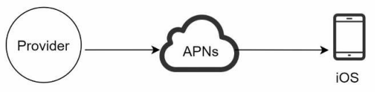
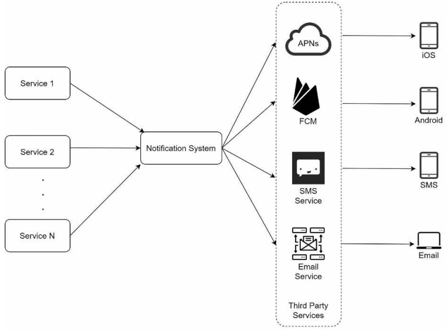
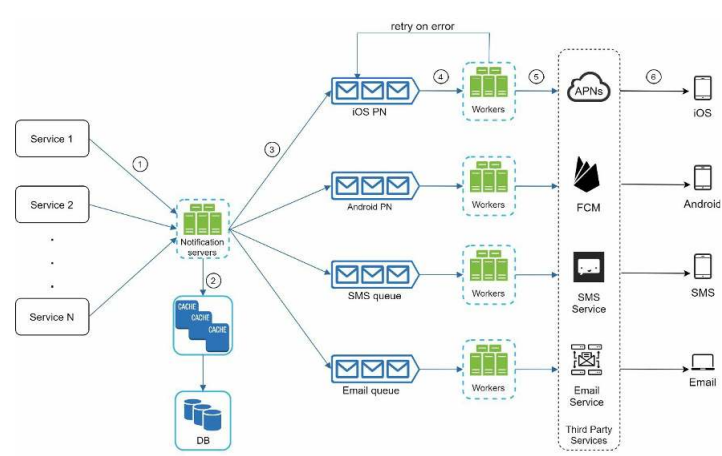
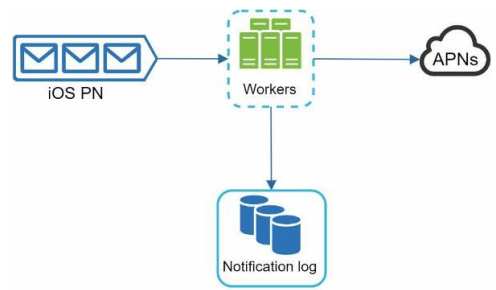
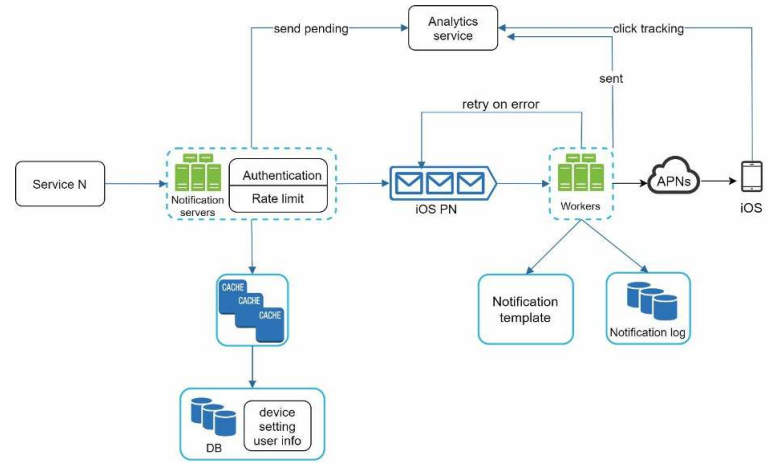

# 10장. 알림 시스템 설계

## 1단계. 문제 이해 및 설계 범위 확정

- 어떤 종류의 알림을 지원해야 하나
  - 푸시, SMS, 이메일 등
- 실시간 시스템이여야 하나
- 어떤 종류의 단말을 지원해야 하나
- 사용자에게 보낼 알림은 누가 만드나
  - 클라이언트 어플리케이션 또는 서버 
- 사용자가 알림을 받지 않도록 설정할 수 있어야하나
- 하루에 몇 건의 알림을 보낼 수 있나

## 2단계. 개략적 설계안 제시 및 동의 구하기

- 알림 유형별 지원 방안
- 연락처 정보 수집 절차
- 알림 전송 및 수신 절차

### 알림 유형별 지원 방안

#### IOS 푸시 알림

IOS 푸시 알림은 세 가지 컴포넌트가 필요하다

- 알림 제공자(Provider)
  - 알림 요청을 만들어 애플 푸시 알림 서비스(APNS, Apple Push Notification Service)에 전달
  - 알림 요청은 다음의 데이터가 필요
    - 단말 토큰
      - 알림 요청을 보내는데 필요한 고유 식별자
    - 페이로드
      - 알림 내용을 담은 JSON 딕셔너리
- APNS(Apple Push Notification Service)
  - 푸시 알림을 IOS 장치로 보내는 역할
- IOS 단말
  - 알림을 수신하는 사용자 단말

#### 안드로이드 푸시 알림

안드로이드 푸시 알림도 IOS 푸시 알림과 비슷하지만 APNS 대신 FCM(Firebase Cloud Messaging)을 사용한다.

#### SMS 메시지

SMS 메시지는 보통 트윌리오(Twilio), 넥스모(Nexmo), 플로우루트(Plivo) 등의 제 3사업자의 서비스를 이용한다.

#### 이메일

대부분 SMTP를 직접 구축하여 메일을 전송하지만 전송 성공률, 데이터 분석 서비스를 이용하기 위해 상용 이메일 서비스를 이용할 수 있다.

### 연락처 정보 수집 절차

알림을 보내기 위해서는 모바일 단말 토큰, 전화번호, 이메일 주소등의 정보가 필요하다.
보통 앱을 설치하거나 처음 계정을 등록했을 때의 정보를 수집하여 DB에 저장해둔다.
한 사용자가 여러 단말을 가질 수 있고, 알림은 모든 단말에 전송해야 되는 점도 고려해야한다.

### 알림 전송 및 수신 절차

#### 개략적인 설계 초안

- 알림 시스템
  - 여러 개의 서비스에게 알림 전송을 위한 API를 제공해야 하고, 서드파티 서비스에 전달할 알림 페이로드를 만들 수 있어야 한다
- 서드파티 서비스
  - 사요앚에게 알림을 실제로 전달하는 역할을 한다
  - 확장성을 고려해야 한다
    - 쉽게 새로운 서비스를 통합하거나 기존 서비스를 제거 가능
    - 특정 서비스는 다른 시장에서 사용할 수 없을 수 있음

위 예시처럼 한대의 알림 시스템 서버로는 몇가지 문제가 존재한다.

- SPOF(Single Point of Failure)
  - 알림 서비스가 하나이기 때문에 해당 서버가 장애가 생기면 전체 서비스 장애로 이어진다
- 규모 확장성
  - 한 대 서비스로 푸시 알림을 처리하므로 DB나 캐시 등 컴포넌트의 개별적 확장이 불가능하다
- 성능 병목
  - 사용자 트래픽이 몰리는 시간에 시스템 과부하 상태에 빠질 수 있음

#### 개략적인 설계 개선안

개선 방안은 다음과 같다.

- DB와 케시를 알림 시스템의 주 서버에서 분리
- 알림 서버를 증설하고 오토 스케일링이 가능하도록 구성
- 메시지 큐를 이용해 시스템 컴포넌트 사이의 강결합 제거

각 컴포넌트는 다음과 같은 기능을 제공한다

- 알림 서버
  - 알림 전송 API
    - 스팸 방지를 위해 인증된 클라이언트만 이용 가능
  - 알림 검증
    - 이메일 주소, 전화번호에 대한 기본적인 검증
  - DB 또는 캐시 질의
    - 캐시는 사용자 정보, 단말 정보, 알림 템플릿등을 캐싱한다
  - 알림 데이터를 메시지 큐에 넣음 
- 메시지 큐
  - 시스템 컴포넌트 간 의존성 제거를 위해 사용
  - 다량의 알림 전송에 대한 버퍼의 역할도 수행
- 작업 서버
  - 메시지 큐에서 전송할 알림을 서드파티 서드파티 서비스로 전달하는 역할

## 3단계. 상세 설계

### 안정성

#### 데이터 손실 방지

알림 전송 시스템에서 중요한 부분은 알림이 소실되면 안된다는 것이다.
따라서, 알림 데이터를 데이터베이스에 보관하고 재시도 매커니즘을 구현해야 한다.

#### 알림 중복 전송 방지

현실적으로 같은 알림이 여러 번 반복되는 것을 완전히 막는 것은 불가능하다. 분산 시스템 특성상 가끔 같은 알림이 중복 전송되기 떄문이다.
하지만 빈도를 줄이기 위해서는 중복을 탐지하는 메커니즘을 도입해야한다.

- 보내야 할 알림이 도착하면 이벤트 ID를 검사하여 이전에 본적 있는 이벤트인지 확인
- 중복된 이벤트라면 버리고 그렇지 않으면 알림 발송

### 추가로 필요한 컴포넌트 및 고려사항

#### 알림 템플릿

대형 알림 시스템은 매일 수백만 건 이상의 알림을 처리하게 된다.
알림 메시지는 대부분 비슷한 형식을 유지하는데, 알림 템플릿은 유사성을 고려하여 알림 메시지를 처음부터
다시 만들 필요가 없게 해준다.

#### 알림 설정

사용자가 알림에 대한 권한을 조정할 수 있도록 알림 설정 테이블에 보관하고, 알림을 보내기 전
해당 사용자가 알림을 켜 두었는지 확인해야 한다.

#### 전송률 제한

전송률 제한을 통해 한 사용자가 받을 수 있는 알림의 수를 제한할 수 있다.

#### 재시도 방법

서드 파티 서비 스가 알림 전송에 실패한 경우, 재시도 전용 큐에 알림을 넣는다.
해당 문제가 지속적으로 발생하면 해당 내용을 통지한다.

#### 푸시 알림과 보안

IOS와 안드로이드 앱의 경우 알림 전송 API는 appKey와 appSecret을 이용해 인증된 클라이언트만 사용할 수 있도록 한다.

#### 큐 모니터링

알림 시스템을 모니터링 할 때 중요한 메트릭 하나는 큐에 쌓인 알림의 갯수이다.
이 수가 너무 크면 이벤트 처리 속도가 느리다는 것이기에 워커 서버를 늘리는 게 좋다.

#### 이벤트 추적

알림 확인율, 클릭율 등 비지니스 로직에 필요한 메트릭은 사용자 경험을 파악하는데 중요한 지표가 될 수 있다.

### 수정된 설계안

