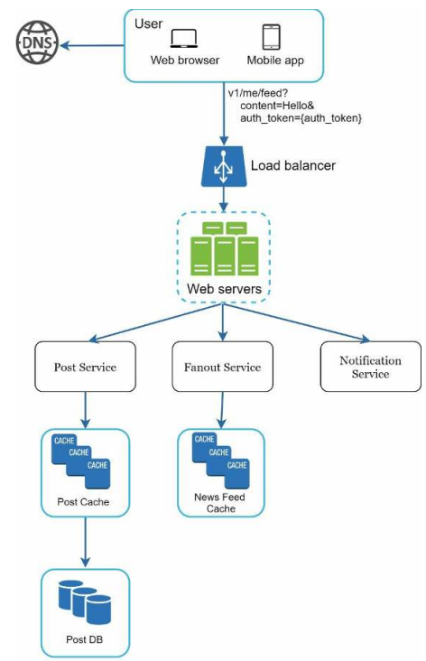
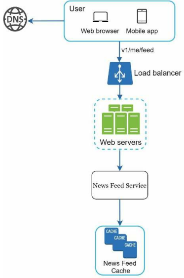
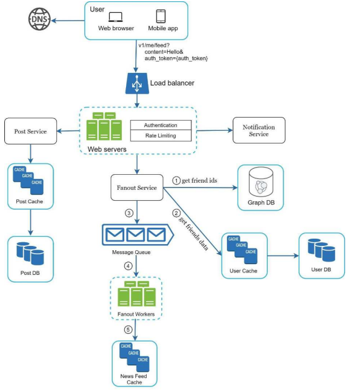
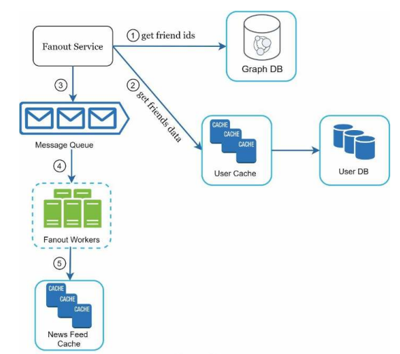
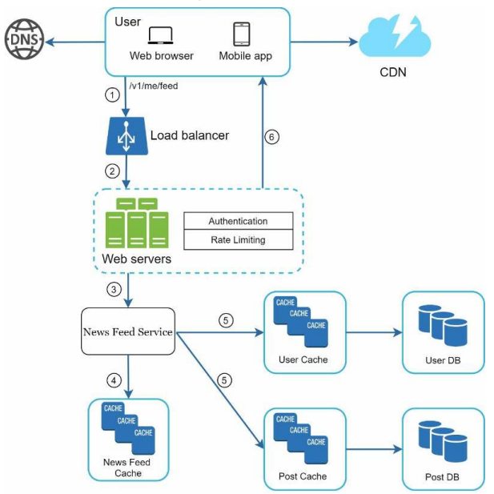

# 11장. 뉴스 피드 시슽엠 설계

## 1단계. 문제 이해 및 설계 범위 확정

- 모바일 앱을 위한 시스템? 웹? 둘다를 지원해야하나
- 뉴스 피드에는 어떤 순서로 스토리가 표시되어야 하나
  - 최신순? 토픽 점수를 통한 특별한 기준?
- 한 사용자는 최대 몇 명의 친구를 가지나
- 트래픽 규모는
- 프디에 이미지나 비디오가 함께 올라가나?

## 2단계. 개략적 설계안 제시 및 동의 구하기

- 피드 발행
  - 사용자가 스토리를 포스팅하면 해당 데이터를 기록
  - 새 포스팅은 친구의 뉴스 피드에 전송됨
- 뉴스 피드 생성
  - 모든 친구의 포스팅을 시간 흐름 역순으로 모아서 생성

### 뉴스 피드 API

뉴스 피드 API는 클라이언트가 서버와 통신하기 위해 사용하는 수단이다.
가장 중요한 API는 피드 발행 API와 피드 읽기 API이다.

#### 피드 발행 API

새 스토리를 포스팅하기 위한 API.

```http request
POST /v1/me/feed
```

Body에는 포스팅 내용을 포함하며, 헤더에는 Authorization을 포함하여 인증을 위해 사용한다.

#### 피드 읽기 API

뉴스 피드를 가져오는 API.

```http request
GET /v1/me/feed
```

헤더에 Authrization을 포함하여 인증을 위해 사용한다. 

### 피드 발행

<p align="center"></p>

- 사용자는 피드 발행 API(POST /v1/me/feed)를 호출하여 새 스토리를 포스팅
- 웹서버에서는 HTTP 요청을 내부 서비스로 중계하는 역할을 한다
- 포스팅 저장 서비스는 새로운 포스팅을 DB와 캐시에 저장한다
- 포스팅 전송 서비스(fanout service)는 새 포스팅을 친구의 뉴스 피드에 푸시한다
- 알림 서비스는 친구들에게 새 포스팅이 올라왔음에 대해 푸시 알림을 보낸다

### 뉴스 피드 생성

<p align="center"></p>

사용자가 보는 뉴스 피드가 어떻게 만들어지는 지 살펴보자

- 사용자는 뉴스 피드를 읽는 주체로 피드 읽기 API(GET /v1/me/feed)를 호출한다
- 웹 서버는 트래픽을 뉴스 피드 서비스로 보낸다
- 뉴스 피드 서비스는 캐시에서 뉴스 피드를 가져온다
  - 뉴스 피드 캐시는 뉴스 피드를 렌더링할 때 필요한 피드 ID를 보관한다

## 3단계. 상세 설계

<p align="center"></p>

### 피드 발행 흐름 상세 설계

#### 웹서버

웹 서버에서는 클라이언트 통신과 함께 인증, 처리율 제한 등의 기능도 수행하게 된다.
특정 인증된 사용자만 포스팅이 가능해야 하며, 특정 시간 동안 올릴 수 있는 컨텐츠의 수에 제한을 둬야한다.

#### 포스팅 전송(fanout) 서비스

팬아웃이란 사용자의 포스팅을 친구 관계에 있는 사용자에게 전달하는 과정이다.
두가지 모델이 존재하는데 쓰기 시점 팬아웃(fanout-on-write) 모델과 읽기 시점 팬아웃(fanout-on-read) 모델이다.

- 쓰기 시점 팬아웃
  - 푸시 모델
  - 새 포스팅을 기록하는 시점에 뉴스 피드를 갱신
  - 즉, 포스팅이 완료되면 바로 사용자의 캐시에 해당 포스팅을 기록
  - 장점
    - 뉴스 피드가 실시간 갱신되고 친구들에게 즉시 전송
    - 포스팅이 기록되는 순간 뉴스 피드가 이미 갱신되므로 뉴스 피드를 읽는데 드는 시간이 짧음
  - 단점
    - 친구가 많을 경우 팬우앗 시간이 많이 들 수 있다(hotkey 문제)
    - 서비스를 자주 사용하지 않는 친구의  피드까지 갱신해야 하므로 컴퓨팅 자원이 낭비
- 읽기 시점 팬아웃
  - 풀 모델
  - 피드를 읽는 시점에 뉴스 피드를 갱신하는 요청 기반 모델
  - 장점
    - 사용하지 않는 사용자에 대해 피드를 갱신하지 않아 컴퓨팅 자원 낭비가 없다
    - 데이터를 모든 친구에게 푸시하는게 아니기 때문에 핫키 문제가 없다
  - 단점
    - 뉴스 피드를 읽는데 시간이 소요된다

<p align="center"></p>

두 방법의 장점을 취하고 단점을 버리는 전략은 다음과 같다.
뉴스 피드를 빠르게 가져오는 것은 중요하기 때문에 기본적으로 푸시 모델을 사용한다.
하지만, 친구나 팔로어가 많은 경우, 해당 사용자의 포스팅은 풀 모델을 사용한다.
또한, 안정 해시를 통해 요청과 데이터를 보다 고르게 분산하여 핫키 문제를 줄여볼 수 있다.

위 설계의 팬아웃 서비스는 다음과 같이 동작한다.

1. 그래프 데이터베이스에서 친구 ID 목록을 가져온다
2. 사용자 정보 캐시와 DB에서 사용자 정보를 가져온다
3. 친구 목록과 새 스토리의 포스팅 ID를 메시지 큐에 넣는다
4. 팬아웃 작업 서버가 뉴스 피드 데이터를 뉴스 피드 캐시에 넣는다. 뉴스 피드 캐시는 <포스팅 ID, 사용자ID> 쌍을 보관하는
매핑 테이블로 볼 수 있다.

### 피드 읽기 흐름 상세 설계

<p align="center"></p>

뉴스 피드를 읽어가는 단계는 다음과 같다.

1. 사용자가 뉴스 피드 읽기 API를 호출(GET /v1/me/feed)
2. 로드밸런서가 요청을 웹서버 가운데 하나로 보낸다
3. 웹 서버는 피드를 가져오기 위해 뉴스 피드 서비스를 호출
4. 뉴스 피드 서비스는 뉴스 피드 캐시에서 포스팅 ID, 사용자 ID 목록을 가져온다
5. 뉴스 피드에 나타날 사용자 정보와 포스팅 정보를 가져온다.
6. 생성된 뉴스 피드를 JSON 형태로 클라이언트에 반환하고, 클라이언트는 이를 렌더링한다