# 12장. 채팅 시스템 설계

## 1단계. 문제 이해 및 설계 범위 확정

- 1:1 채팅 앱? 그룹 채팅 앱?
- 모바일 앱인가? 웹 앱인가?
- 처리해야하는 트래픽 규모는?
- 그룹 채팅의 경우 인원 제한이 있나?
- 중요 기능에 어떤 것들이 있나?
  - 예를 들어 파일 첨부
- 메시지 길이 제한?
- 종단 간 암호화 기능이 있어야 하나?
- 채팅 이력은 얼마나 오래 보관해야하나?

## 2단계. 개략적 설계안 제시 및 동의 구하기

기본 기능에 따라 다음 기능에 집중하도록 한다

- 클라이언트들로부터 메시지 수신
- 메시지 수신자 결정 및 전달
- 수신자가 접속 상태가 아닌 경우 접속할 떄 까지 해당 메시지 보관

채팅의 경우 클라이언트는 네트워크 통신 프로토콜을 통해 서비스에 접속하기에, 어떤 통신
프로토콜을 사용할 것인가도 중요한 문제이다.

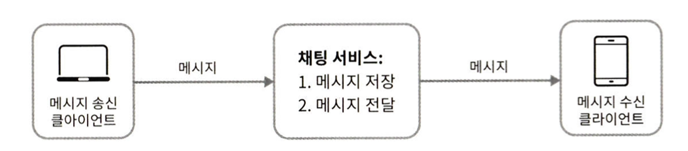

HTTP를 사용한다면, 메시지 송신 시 클라이언트는 채팅 서비스에 HTTP 프로토콜로 연결한 다음
메시지를 보내 수신자에게 해당 메시지를 전달하라고 알린다. 채팅 서비스와의 접속에는
keep-alive 헤더를 사용하면 클라이언트와 서버 사이의 연결을 끊지 않고 계속 유지할 수 있어 효율적이다.
또한 TCP 접속 과정에서 발생하는 핸드쉐이크 횟수를 줄일 수도 있다.

메시지 수신의 경우 이보다 다소 복잡한데, HTTP는 클라이언트가 연결을 만드는 프로토콜이므로, 서버에서 클라이언트로 임의 시점에
메시지를 보내는데는 적합하지 않다. 이를 위해 폴링, 롱 폴링, 웹소켓등의 기술을 사용할 수 있다.

### 폴링(polling)

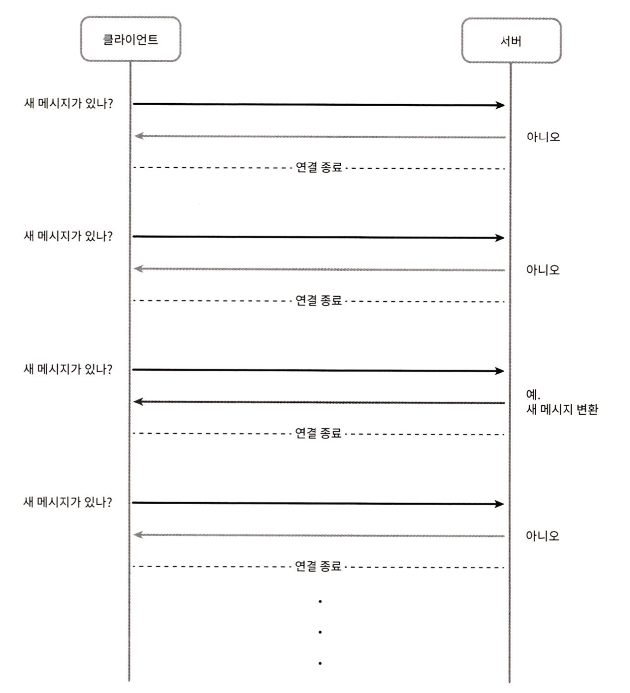

폴링은 클라이언트가 주기적으로 서버에게 새 메시지가 있는지 확인하는 방법으로,
폴링 횟수가 빈번할 수록 비용이 올라간다. 또한, 답해줄 메시지가 없는 경우 서버 자원이 불필요하게 낭비되는 문제가 있다.

### 롱폴링(Long polling)

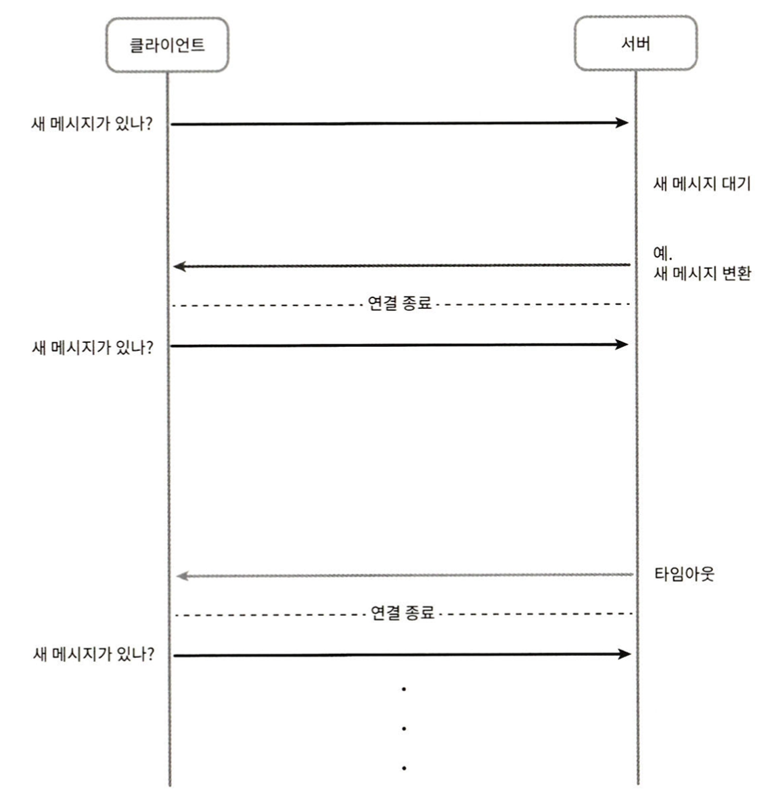

폴링의 비효율적인 부분을 보완하기 위한 방법으로 롱 폴링이 있다.
롱 폴링의 경우 클라이언트는 새 메시지가 반환되거나 타임아웃 될 떄까지 연결을 유지한다.
하지만 롱 폴링 또한 다음과 같은 문제가 존재한다.

- 메시지를 보내는 클라이언트와 수신하는 클라이언트가 같은 채팅 서버에 접속하지 않는 경우 문제가 생길 수 있다
  - HTTP 서버들은 보통 무상태 서버
  - 메시지를 받은 서버가 해당 메시지를 수신할 클라이언트와 롱 폴링 연결 상태가 없을 수 있음
- 서버 입장에서 클라이언트가 연결을 해제했는지 아닌지 알 수 있는 방법이 없음
- 여전히 비효율적
  - 타임아웃이 일어날 떄마다 주기적으로 서버에 다시 접속

### 웹 소켓(Web Socket)

웹 소켓은 서버가 클라이언트에 비동기 메시지를 보낼 때 가장 널리 사용하는 기술이다.

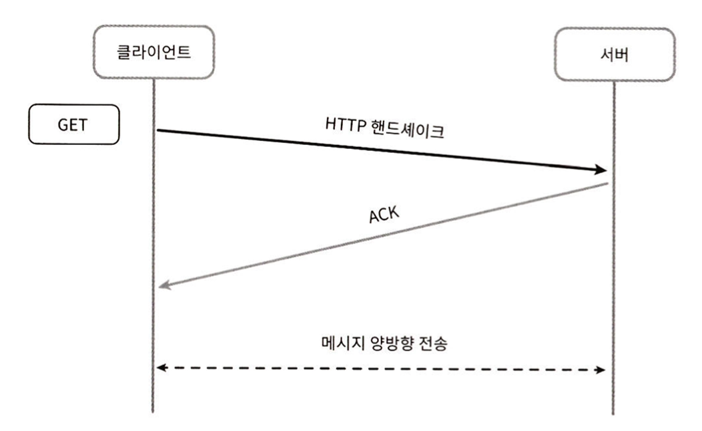

웹 소켓 연결은 클라이언트가 시작하고, 한번 맺어진 연결은 지속되며 양방향이다.
처음에는 HTTP 연결로 핸드쉐이크 절차를 거치고 웹소켓 연결로 업그레이드 된다.
웹 소켓은 일반적으로 방화벽이 있는 환경에서도 잘 동작하며, HTTP나 HTTPS 프로토콜이 사용하는
포트 번호를 그대로 사용한다.

웹 소켓을 이용하면 메시지를 보낼 때나 받을 때 동일한 프로토콜을 사용할 수 있다.
하지만 웹 소켓 연결의 유지를 위해서는 서버 측에서 연결 관리를 해줘야 한다.

### 개략적 설계안

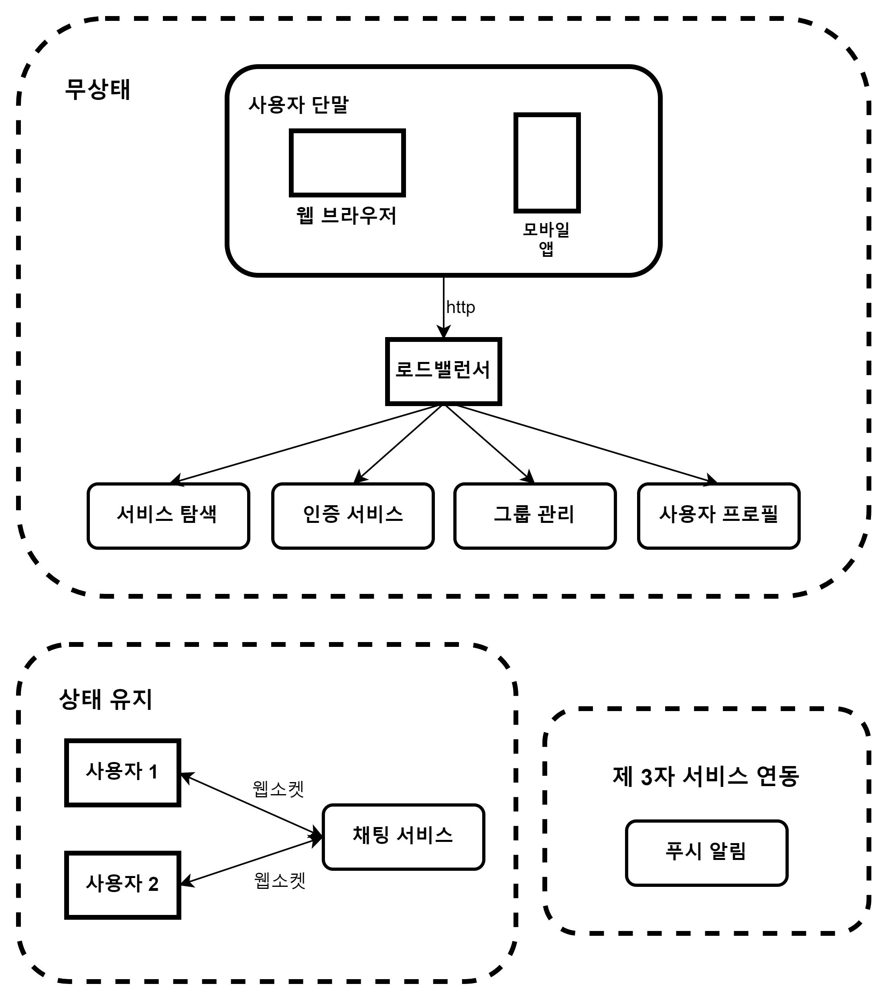

채팅 시스템은 무상태 서비스, 상태 유지 서비스, 제 3자 서비스 연동 세 부분으로 나눠 살펴 볼 수 있다.

#### 무상태 서비스(Stateless Service)

무상태 서비스는 로그인, 회원가입 ,사용자 프로파일 표시등 전통적인 요청/응답 서비스이다.

대부분 직접 구현하지 않아도 외부 서비스를 통해 도입이 가능하다.
이 중 서비스 탐색의 경우 클라이언트가 접속할 채팅 서버의 DNS 호스트명을 클라이언트에게 알려주는 역할을 한다.

#### 상태 유지 서비스(Stateful Service)

채팅 서비스는 클라이언트가 채팅 서버와 독립적인 네트워크 연결을 유지해야하기에 상태 유지가 필요한 서비스이다.
보통 서버에 문제가 생기지 않는한 서버로 연결이 변경되지 않으며 서비스 탐색 서비스와 협력하여
특정 서버에 부하가 몰리지 않도록 해야한다.

#### 제 3자 서비스

보통 채팅 서비스에서 가장 중요한 3자 서비스는 푸시 알림이다.
메시지를 받았다면 앱이 실행 중이 아니더라도 알림을 받아야한다.

#### 규모 확장성

앞서 설명한 모든 서비스는 한대의 서버로 구현할 수 있지만 SPOF의 문제로 인해 이를 지양해야한다.
하지만, 서버 한대를 갖는 설계안에서부터 시작하여 점차 다듬어 나가는 것은 좋은 방법이다.

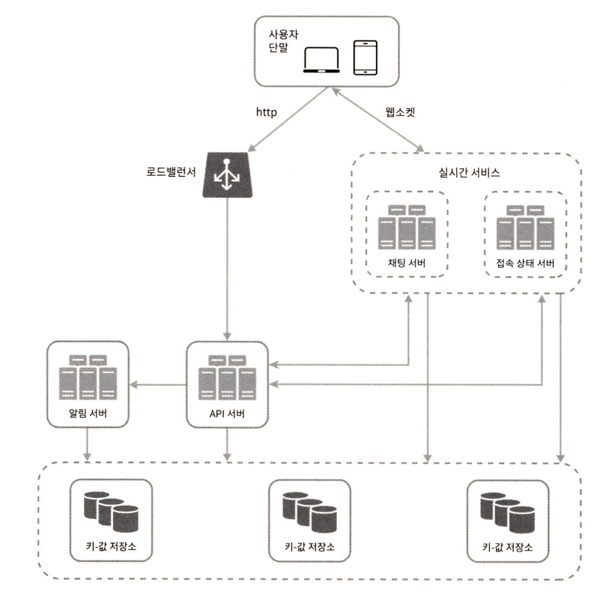

실시간으로 메시지를 주고 받기 위해 클라이언트는 채팅 서버와 웹소켓 연결을 끊지 않고 유지해야한다.

- 채팅 서버는 클라이언트 사이에 메시지를 중개하는 역할을 담당
- 접속상태 서버는 사용자의 접속 여부를 관리
- API 서버는 로그인, 회원가입 등을 처리
- 알림 서버는 푸시알림을 담당
- 키값 저장소는 채팅 이력을 보관

#### 저장소

채팅 서비스에서는 데이터 계층을 RDBMS를 쓸지 NoSQL을 쓸지에 대한 고민 또한 필요하다.
중요하게 따져봐야할 것은 데이터의 유형과 읽기/쓰기 연산의 패턴이다.

채팅 시스템이 다루는 데이터는 보통 두 가지이다.

- 사용자 프로파일, 설정, 친구 목록과 같은 일반적 데이터
  - 안정성 보장을 위한 RDBMS
- 채팅 시스템의 고유한 데이터인 채팅 이력
  - 채팅 데이터의 양은 큼
  - 가장 빈번하게 사용되는 것은 최근에 주고받은 메시지
  - 검색 기능, 특정 메시지로 점프 등 무작위적 데이터 접근 가능
  - 1:1 채팅 앱의 경우 읽기 쓰기 비율은 1:1

채팅 이력의 경우 키값 저장소를 추천하는데 이유는 다음과 같다

- 수평적 규모확장이 쉽다
- 데이터 접근 지연이 낮다
- RDBMS는 롱 테일에 해당하는 부분을 잘 처리하지 못하기에 인덱스가 커지면 무작위 접근을 처리하는 비용이 늘어난다
  - 롱 테일은 파레토의 법칙에서 자주 사용하지 않는 데이터를 의미
  - 랜덤 엑세스의 경우 인덱스를 통한 접근 즉 데이터를 저장하는 블록을 한번에 여러개 접근하는 것이 아닌 한 번에 하나의 블록에 접근하는 것

## 3단계. 상세 설계

### 서비스 탐색

서비스 탐색의 역할은 클라이언트에게 채팅 서버를 추천하는 것이다. 
서비스 탐색 기능을 구현하는데 많이 쓰이는 오픈 소스로는 아파치 주키퍼가 있다.
클라이언트가 접속을 시도하면 사전에 정의된 기준에 따라 채팅 서버를 선택해 준다.

### 메시지 흐름

#### 1:1 채팅 메시지 처리 흐름

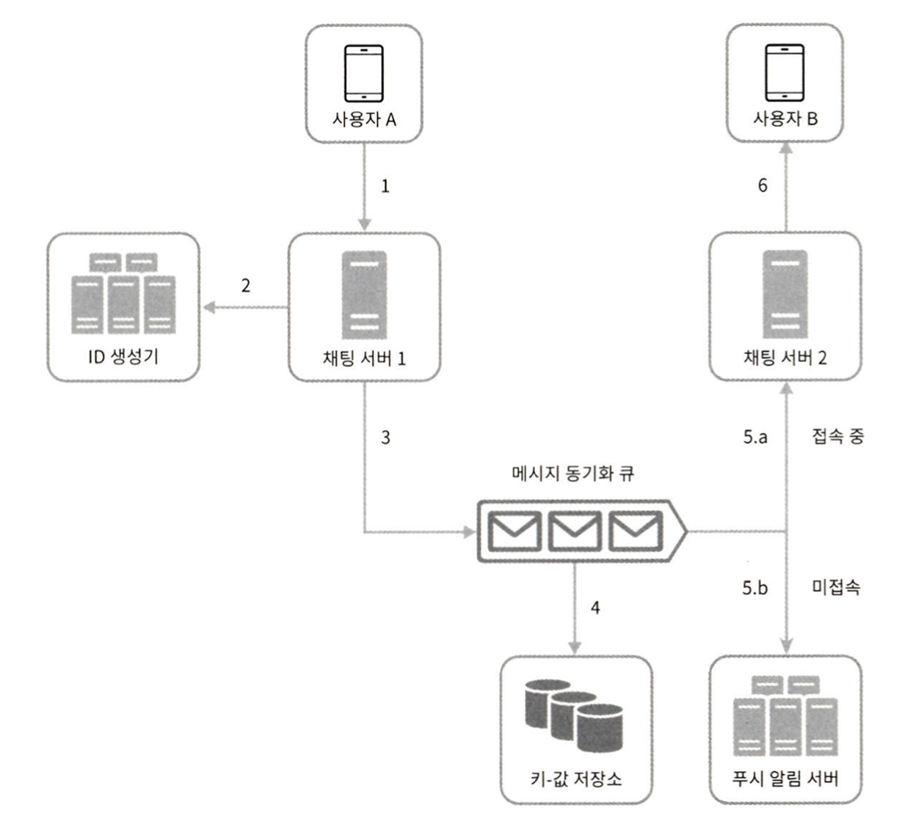

1. 사용자 A가 채팅 서버 1로 메시지 전송
2. 채팅 서버 1은 ID 생성기를 통해 해당 메시지의 ID 생성
3. 채팅 서버 1은 메시지를 메시지 동기화 큐로 전송
4. 메시지가 키값 저장소에 보관
5. 사용자 B가 접속 중인 경우 B가 접속 중인 채팅 서버2로 전송하고 아닌 경우 푸시 알림 서버로 보냄
6. 채팅 서버 2는 메시지를 B에게 전송
7. 
#### 여러 단말 사이의 메시지 동기화

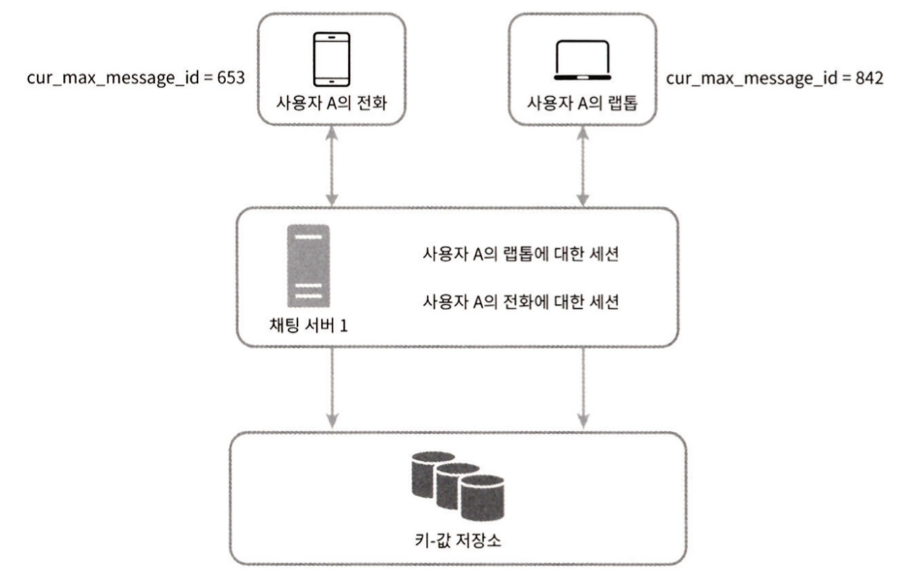

위 그림처럼 전화와 랩톱에서 모두 로그인되어 있는 경우 어떻게 동기화할까?

각 단말은 cur_max_message_id라는 변수를 유지한다. 해당 id는 해당 단말에서 관측된 가장 최신 메시지 ID를 추적하는 용도로
두 가지 조건을 만족하는 경우 새 메시지로 간주한다.

- 수신자 ID가 현재 로그인한 사용자 ID와 같다
- 키값 저장소에 보관된 메시지로서, 그 ID가 cur_max_message_id보다 크다

cur_max_message_id는 단말마다 유지하기에 키값 저장소에서 새 메시지를 가져오는 동기화 작업 구현이 용이하다.

#### 소규모 그룹 채팅에서의 메시지 흐름

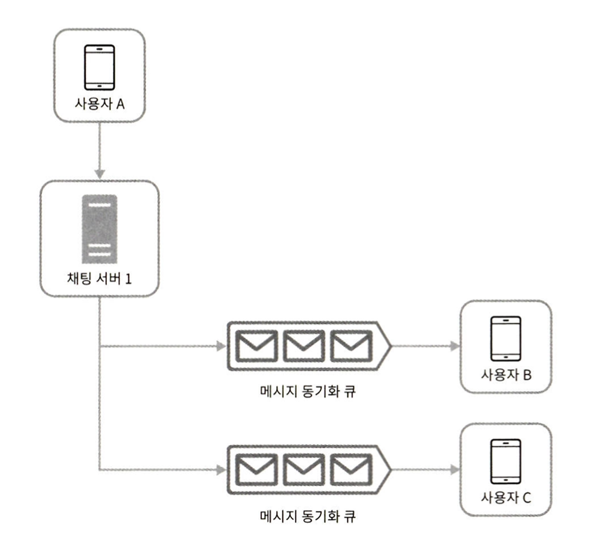

위 그림처럼 A가 보낸 메시지는 사용자 B와 C의 메시지 동기화 큐에 복사된다.
메시지 수신함으로 볼 수 있는데 해당 설계는 소규모 그룹 채팅에 적합하며 이유는 다음과 같다.

- 자기 자신의 큐만 확인하면 새로운 메시지인지 확인할 수 있으므로 메시지 동기화 플로우가 단순
- 그룹이 크지 않으면 메시지를 수신자별로 복사해 큐에 넣는 작업의 비용이 낮다

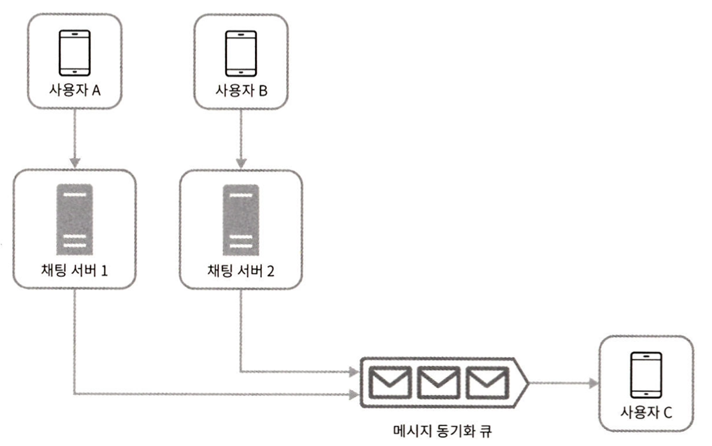

위에서 설명한 메시지 흐름을 수신자 관점에서 본다면, 여러 송신자로부터의 메시지를 수신할 수 있어야한다.
따라서, 메시지 동기화 큐는 여러 사용자로부터 오는 메시지를 받을 수 있어야한다.

### 접속상태 표시

#### 사용자 로그인

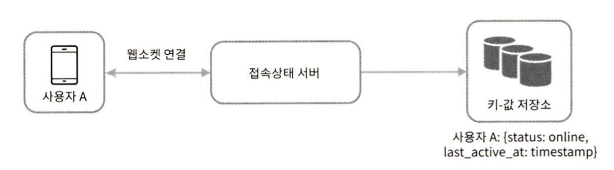

웹소켓 연결이 맺어지고 나서 접속상태 서버는 A의 상태와 last_active_at 타임스탬프 값을 키값 저장소에 보관한다.
해당 절차가 끝나면 사용자는 접속 중으로 표시된다.

#### 로그아웃

키값 저장소에 보관된 사용자 상태가 online에서 offline으로 바뀌게 된다.

#### 접속 장애

사용자가 인터넷 연결이 끊어지면 웹소켓 연결 또한 끊어지게 된다. 이 경우 사용자를 오프라인 상태로
표시하고 연결이 복구되면 온라인 상태로 변경하면 된다. 하지만, 인터넷이 끊어지는 상황은 흔하기 떄문에
해당 상황이 발생할 때마다 접속 상태를 변경하는 것은 바람직하지 않다.

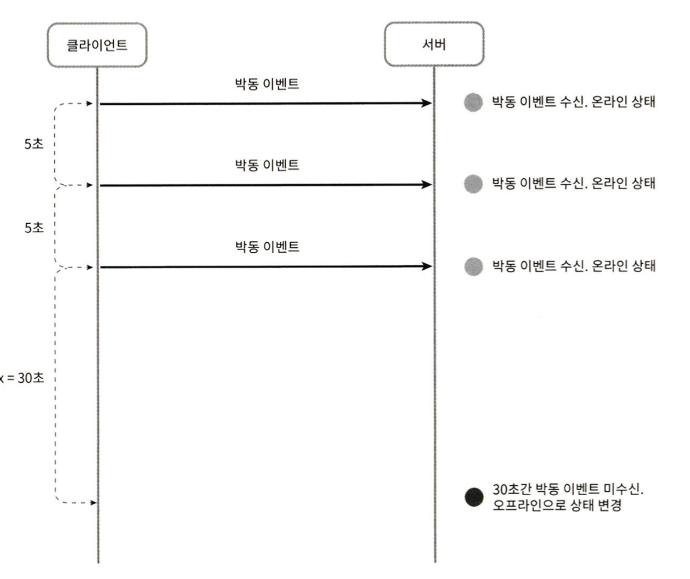

이를 위해 온라인 상태의 클라이언트로부터 박동 이벤트(heartbeat event)를 접속상태 서버로 보내고,
사전에 지정된 시간 내 박동 이벤트를 받으면 온라인으로 표시하는 방법을 사용할 수 있다.

#### 상태 정보의 전송

사용자의 상태정보가 친구들에게는 어떻제 전달될까?

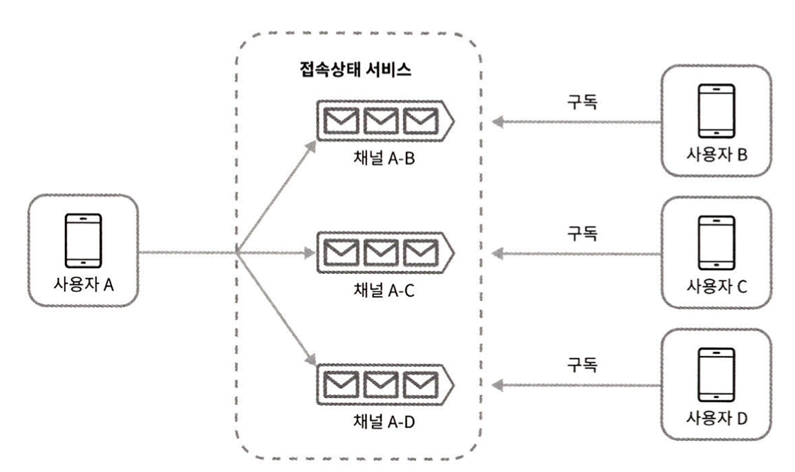

상태정보 서버는 발행-구독모델(publish-subscribe model)을 사용하여 각각의 친구관계마다 채널을 하나씩 둔다.
이 방법은 그룹의 크기가 작을 때 효과적이다. 그룹 크기가 커지면 접속 상태 변화를 알리는 비용이나 시간이 많이 들기 떄문이다.

## 마무리

추가 논의해볼 만한 사항은 다음과 같다

- 사진이나 비디오 등의 미디어를 지원하는 방법
- 종단 간 암호화
- 캐시
  - 클라이언트에서 이미 읽은 메시지를 캐시
- 로딩 속도 개선
- 오류 처리
  - 채팅 서버 오류
  - 메시지 재전송