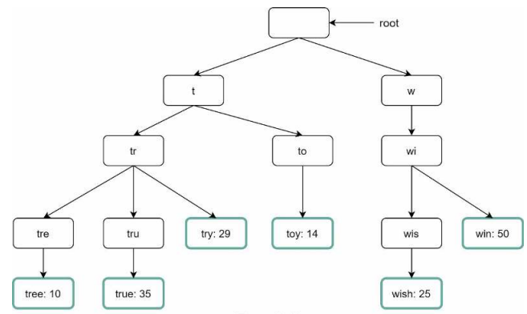
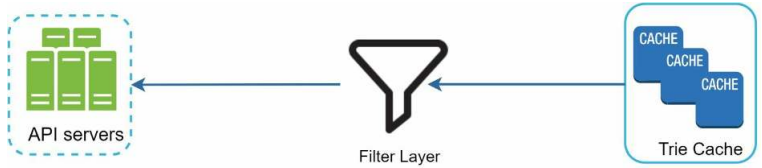

# 13장. 검색어 자동완성 시스템

## 1단계. 문제 이해 및 설계 범위 확정

- 입력하는 단어는 자동완성될 검색어의 첫부분인가 중간 부분도 될 수 있는가?
- 몇 개의 자동완성 검색어가 표시되야 하는가?
- 자동완성 검색어를 고르는 기준은?
- 질의는 영어? 대문자나 특수 문자?
- 얼마나 많은 사용자를 지원해야 하나?

## 2단계. 개략적 설계안 제시 및 동의 구하기

개략적으로 자동완성 시스템은 두 부분으로 나눌 수 있다

- 데이터 수집 서비스
  - 사용자가 입력한 단어를 실시간으로 수집하는 시스템
- 질의 서비스
  - 사용자가 입력한 단어를 통해 인기 검색어를 정렬해 내놓는 서비스

### 데이터 수집 서비스 & 질의 서비스

간단하게는 단어와 사용빈도를 저장하는 빈도 테이블이 있다고 가정할 수 있다.

- 단어(질의, query)
  - 사용자가 입력한 단어(질의)를 저장하는 필드
- frequency
  - 질의문이 사용된 빈도를 저장

frequency를 기준으로 사용빈도가 높은 단어를 사용자에게 제공 가능하다.
데이터 양이 적은 경우 나쁘지 않지만, 데이터가 많아지면 DB 병목현상이 발생할 수 있다.

## 3단계. 상세 설계

### 트라이(trie) 자료구조

데이터 크기가 커지는 경우 RDB를 이용한 방법은 효율적이지 못하다. 이 경우 트라이 자료 구조를 통해 해결할 수 있다.

트라이는 문자열들을 간략하게 저장할 수 있는 자료구조다. retrieval에서 온 것으로, 문자열을 꺼내는 연산에 초점을
맞춘 자료구조이다. 해당 자료구조의 아이디어는 다음과 같다

- 트라이는 트리 형태의 자료구조
- 트리의 루트 노드는 빈 문자열
- 각 노드는 글자 하나를 저장하고, 26(모든 글자의 갯수)개의 자식 노드를 가질 수 있다
- 각 트리 노드는 하나의 단어, 또는 접두어 문자열을 나타낸다

위 그림은 굵은 선으로 표시된 단어들이 저장된 트라이 자료구조다.
기본 트라이 자료구조는 노드에 문자들을 저장한다. 이용 빈도에 따라 정렬된 결과를 내놓기
위해서는 노드에 빈도 정보까지 저장해야한다. 빈도 정보까지 포함한 트리 구조는 다음과 같다.

트라이로 자동완성을 구현하기 위해선 기본적인 용어를 정의해야 한다.

- p: 접두어의 길이
- n: 트라이 안에 있는 노드 갯수
- c: 주어진 노드의 자식 노드 갯수

위 용어를 활용해 가장 많이 사용된 단어(질의)를 찾는 방법은 다음과 같다

- 해당 접두어를 표현하는 노드를 찾는다(시간복잡도 O(p))
- 해당 노드 부터 시작해 하위 트리를 탐색해 모든 유효 노드를 찾는다(시간복잡도 O(c))
- 유효 노드들을 정렬하여 인기있는 검색어들을 찾는다(시간복잡도 O(cLogc))
- 시간 복잡도는 각 단계의 합

위 알고리즘은 최악의 경우 k개의 결과를 얻기 위해 전체 트라이를 다 검색해야하는 문제가 생긴다.
이 문제는 어떻게 해결해야할까?

#### 접두어 최대 길이 제한

검색어의 최대 길이를 제한하면 접두어 노드를 찾는 단계의 시간 복잡도는 O(1)로 변경된다

#### 노드에 인기 검색어 캐시

각 노드에 k개의 인기 검색어를 저장해두면 전체 트라이를 검색하는 일을 방지할 수 있다.
인기 질의어를 캐시하면 질의하는 시간 복잡도를 낮출 수 있다.

하지만, 각 노드에 질의어를 저장할 공간이 필요하다는 단점이 존재한다. 빠른 응답속도가
중요할 때는 저장공간을 활용해 캐싱을 진행할 수 있다.

#### 위 사항을 적용했을 때의 시간 복잡도

- 접두어 노드를 찾는 시간 복잡도 O(1)
- 인기 검색어를 찾는 시간 복잡도 O(1)

각 단계의 시간 복잡도가 O(1)로 바뀌므로 전체 아록리즘의 복잡도는 O(1)로 바뀌게 된다.

### 데이터 수집 서비스

앞서 살펴본 설계는 사용자가 타이핑 할때마다 실시간으로 데이터를 수정하기에 두 가지 관점에서 실용적이지 못하다

- 매일 수천만건의 질의가 입력될 때마다 트라이를 갱신하면 서비스가 느려짐
- 트라이가 만들어지고 나면 인기 검색어는 자주바뀌지 않음

트위터 같은 실시간 어플리케이션이라면 제안 검색어가 항상 최신화되어야 겠지만 구글 검색 같은 경우는
그렇게 자주 바꿔줄 이유는 없다.

사용 방법이 다르더라도 데이터 수집 서비스의 토대는 트라이를 만드는데 쓰는 데이터는 보통 분석 서비스나 로깅 서비스로부터 온다.

#### 데이터 분석 서비스 로그

데이터 분석 서비스 로그에는 검색창에 입력된 단어에 관한 원본 데이터가 보관된다.
데이터는 추가만 되고 수정은 이루어지지 않으며, 로그 데이터에는 인덱싱을 하지 않는다.

#### 로그 취합 서버

데이터 분석 서비스로부터 나오는 로그는 양이 많고 형식도 다를 수 있다. 이 데이터들을 취합하여 시스템이 소비할 수 있도록 변환해야 한다.

데이터 취합 방식은 서비스 사용방식에 따라 달라지며 실시간 어플리케이션의 경우 데이터 취합 주기를 짧게 가져가게 된다.
반면, 대부분의 경우 일주일에 한번 로그를 취합하는 것으로 대체할 수 있다.

#### 취합된 데이터

취합된 데이터는 날짜별 또는 해당 주 별로 사용된 횟수의 합을 저장한다.

#### 작업 서버

작업 서버는 주기적으로 비동기 작업을 실행하여 트라이 자료구조를 만들고 트라이 데이터베이스에 저장하는 역할을 담당한다.

#### 트라이 캐시

트라이 캐시는 분산 캐시 시스템으로 트라이 데이터를 메모리에 유지하여 읽기 연산 성능을 높일 때 사용할 수 있다.

#### 트라이 데이터베이스

트라이 데이터베이스로 사용할 수 있는 선택지는 다음 두 개가 있다.

- 문서 저장소
  - 트라이를 직렬화하여 데이터베이스에 저장
- 키-값 저장소
  - 트라이에 보관된 모든 접두어를 해시 테이블 키로 변환
  - 각 트라이 노드에 보관된 모든 데이터를 해시 테이블 값으로 변환

### 질의 서비스

앞서 다룬 최적화를 적용한 새로운 설계안은 다음과 같다.

해당 서비스는 빠를수록 좋기에 다음과 같은 최적화를 추가로 적용할 수 있다.

- AJAX 요청
  - 요청을 보내고 받기 위해 페이지를 새로고침할 필요가 없음
- 브라우저 캐싱
  - 제안된 검색어들을 브라우저 캐시에 넣어둬 해당 캐시에서 바로 가져갈 수 있게 함
  - cache-control 헤더 사용
- 데이터 샘플링
  - 대규모 시스템의 경우 모든 질의 결과를 로깅하면 CPU 자원과 저장공간이 많이 소모된다
  - 샘플링 기법을 통해 N개의 요청 중 1개만 로깅하도록 한다

### 트라이 연산

#### 트라이 생성

트라이 생성은 작업 서버가 담당하며, 로그나 데이터베이스로부터 취합된 데이터를 이용한다.

#### 트라이 갱신

- 매주 한번씩 갱신
- 트라이의 각 노드를 개별적으로 갱신
  - 트라이가 작을 때 고려
  - 트라이 노드를 갱신하면 상위 노드들도 모두 갱신해야함

#### 검색어 삭제

트라이 캐시 앞에 필터 계층을 두고 불필요, 부적절한 질의어가 반환되지 않도록할 수 있다.
필터 규칙에 따라 검색 결과를 자유롭게 변경할 수 있는 장점이 존재한다.
물리적 삭제는 다음 업데이트에 비동기적으로 진행한다.

### 저장소 규모 확장

트라이의 규모가 커지면 한 서버로 대응하기 어려워진다. 영어만 지원하는 경우 첫 글자를 기준으로 샤딩할 수도 있다.
이 방법의 경우 사용 가능한 서버는 최대 26개로 제한되며, 이 이상으로는 계층적으로 샤딩을 해야한다.

계층적으로 샤딩하는 경우 글자의 위치에 따라 샤딩을 할 수 있다. 하지만, 해당 방법은
데이터를 각 서버에 균등하게 배분하기 불가능하다. 이 문제를 해결하기 위해 과거의 질의 데이터 패턴을 분석하고 샤딩하고,
샤드 관리자를 통해 어떤 검색어가 어디에 위치하는지 가져올 수 있다.

## 마무리

- 다국어 지원은 어떻게 해야할까?
  - 비영어권 국가에서 사용하는 언어를 지원하려면 유니코드 데이터를 저장해야한다
- 국가별 인기 검색어 순위가 다르다면?
  - 국가별로 다른 트라이를 사용