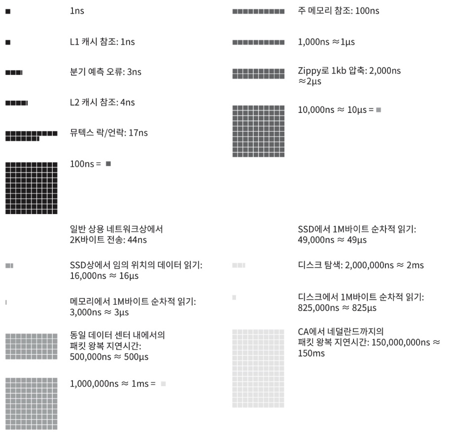
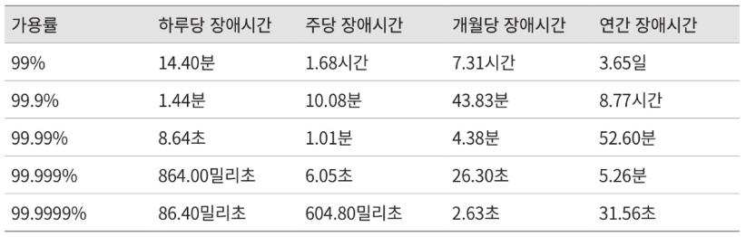

# 2장. 개략적인 규모 추정

시스템 용량이나 성능 요구사항을 개략적으로 추정하라는 것은 어떤 설계가 요구사항에
부합 할 것인지를 보기 위한 것이다.

2의 제곱수나 응답지연 값, 그리고 고가용성에 관계된 수치들을 기본적으로 잘 이해하는 것이 중요하다.

## 2의 제곱수

데이터 볼륨의 단위를 2의 제곱수로 표현하는지 아는 것이 우선이다.
최소 단위는 1 byte이고 8 bit로 구성된다.

## 모든 프로그래머가 알아야 하는 응답지연 값

응답지연은 시스템의 성능을 측정하는 중요한 지표이며, 이 수치들을 통해 컴퓨터 연산들의
처리 속도가 어느 정도인지 짐작할 수 있다. 아래 그림은 2020년을 기준으로 이 수를 시각화하여 표현되었다.

- 메모리는 빠르지만 디스크는 느리다
- 디스크 탐색은 가능한 피하자
- 단순한 압축 알고리즘은 빠르다
- 데이터를 인터넷으로 전송하기 전에 가능하면 압축하라
- 데이터 센터간 데이터를 주고받는 데는 시간이 걸린다

## 가용성에 관계된 수치들

고가용성은 시스템이 오랜 시간동안 지속적으로 중단없이 운영될 수 있는 능력을 지칭한다.
100%는 한번도 중단된적이 없음을 의미하며 대부분의 서비스는 99 에서 100 사이의 값을 갖는다.

SLA(Service Level Agreement)는 서비스 제공자와 사용자 간의 합의로,
서비스 사업자가 제공하는 서비스의 가용시간이 공식적으로 기술되어 있다.

## 규모 추정을 위한 팁

- 올바른 절차를 밟느냐가 결과를 내는 것보다 중요하다
- 근사치를 활용한 계산
  - 적절한 근사치를 활용하여 시간을 절약하자
- 가정을 적어두어 나중에 살펴보자
- 단위를 붙여라
  - 5라고 적으면 5KB인지 5MB인지 알 수 없다
  - 모호함을 방지하자
- 많이 출제되는 개략적인 규모 추정 문제
  - QPS, 최대 QPS, 저장소 요구량, 캐시 요구량, 서버 수
