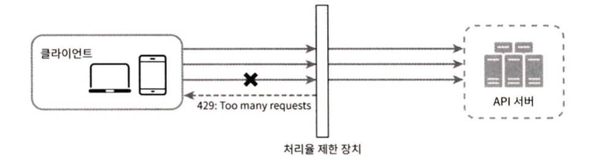
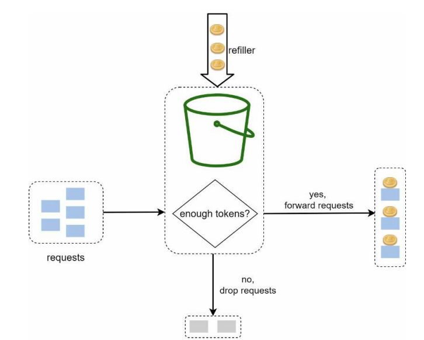
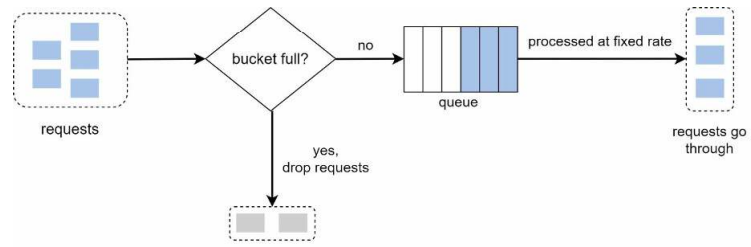
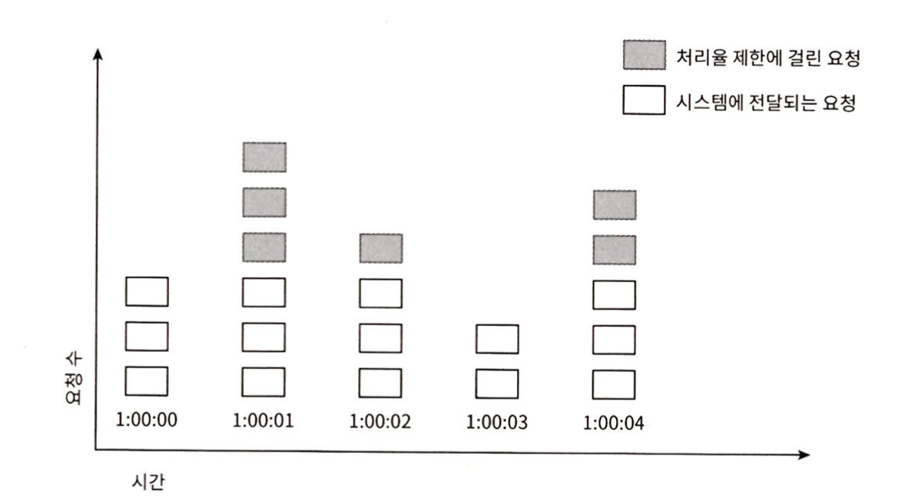
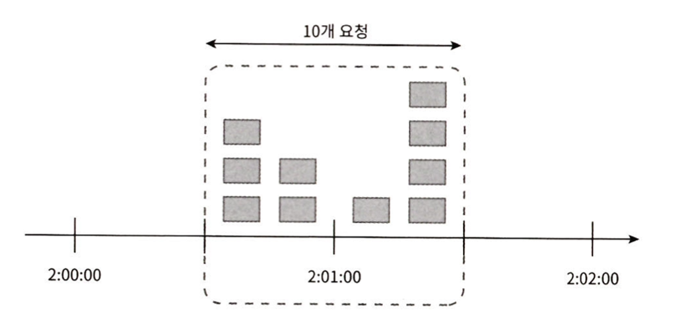
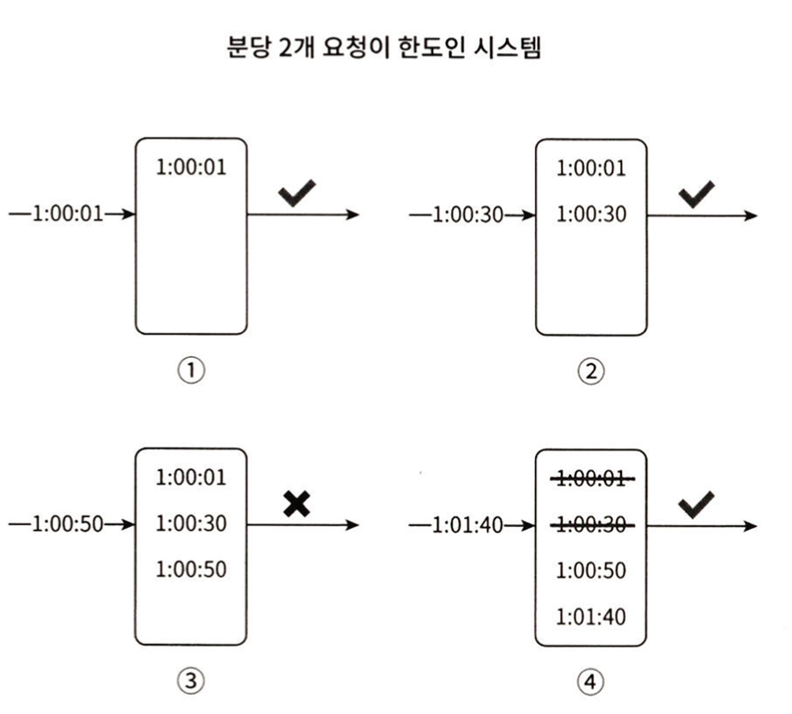
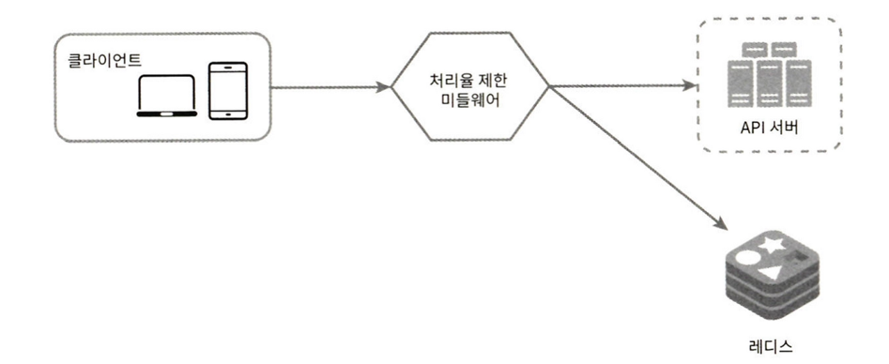
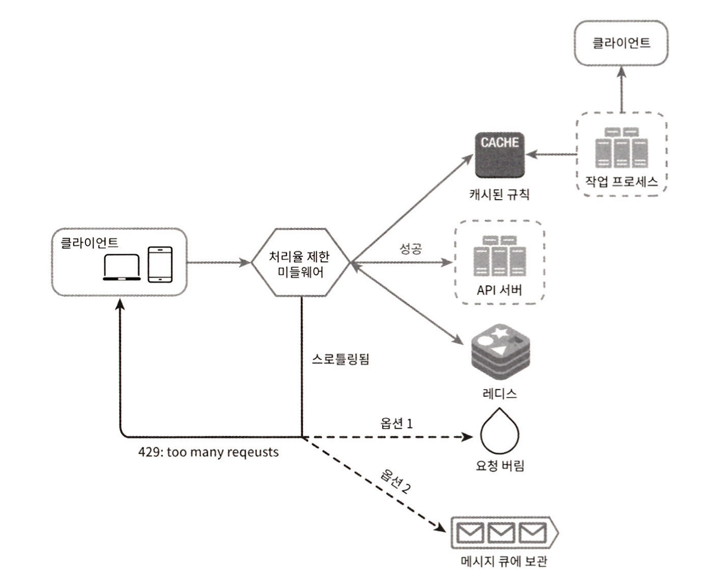
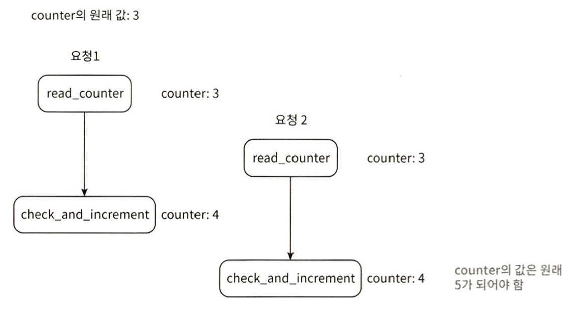
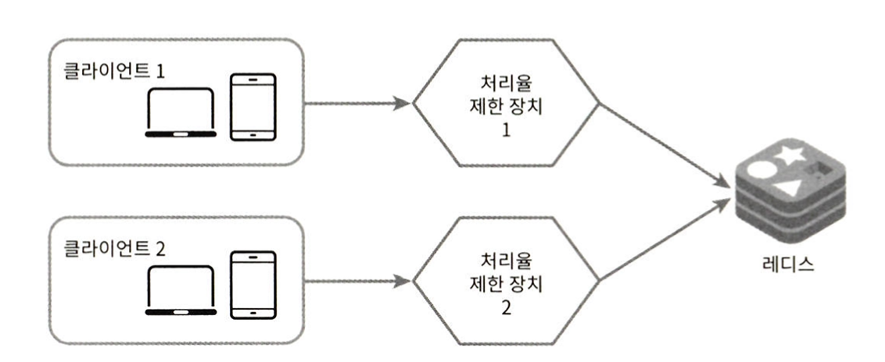

# 4장. 처리율 제한 장치의 설계

처리율 제한 장치(rate limiter)는 클라이언트 또는 서비스가 보내느 트래픽의 처리율을 제어한다.
HTTP를 예로 들면, 특정 기간 내 클라이언트의 요청 횟수를 제한한다. API 요청 횟수가
정의된 임계치를 넘어서면 추가로 도달한 모든 호출은 처리가 중단된다.

- 사용자는 초당 2회 이상 새 글을 올릴 수 없다
- 같은 IP 주소로는 하루에 10개 이상의 계정을 생성할 수 없다

처리율 제한 장치를 두면 좋은 점은 뭘까?

- DoS(Denial of Service)공격에 의한 자원 고갈을 방지할 수 있다
- 비용 절감
  - 추가 요청에 대한 처리를 제한하면 서버를 많이 두지 않아도 되고, 우선 순위가 높은 API에 더 많은 자원을 할당할 수 있다
- 서버 과부하를 막는다
  - 봇에서 오는 트래픽이나 사용자의 잘못된 이용 패턴으로 유발된 트래픽을 걸러낼 수 있다

## 1단계. 문제 이해 및 설계 범위 확정

처리율 제한 장치를 구현하는데는 여러가지 알고리즘을 사용할 수 있고 각각의 장단점이 존재하며,
상황에 따라 적용할 수 있는 방법이 다르다

- 클라이언트 측 제한 장치인가? 서버측 제한 장치인가?
- 어떤 기준으로 API 호출을 제어하나
  - IP 주소? 사용자 ID? 또다른 기준?
- 시스템 규모가 어느 정도인가?
- 시스템이 분산 환경에서 동작하는가?
- 독립된 서비스로? 어플리케이션 코드에 포함?
- 처리율 제한 장치에 의해 거부된 요청을 사용자에게 알려야하나?

## 2단계. 개략적 설계안 제시 및 동의 구하기

### 처리율 제한 장치는 어디에 둘 것인가?

- 일반적으로 클라이언트는 위변조의 위험 때문에 처리율 제한을 안정적으로 걸 수 있는 장소가 아니다
- 서버측에 두는 것이 좋으며, API 서버와 함께 두거나 미들웨어를 만들어 API 서버로 가는 요청을 통제할 수 있다

클라우드 마이크로 서비스의 경우 처리율 제한 장치는 보통 API 게이트웨이라는 컴포넌트에 구현된다.
API 게이트웨이는 처리율 제한, SSL 종단, 사용자 인증, IP 허용 목록 관리 등을 지원한다.

처리율 제한 장치를 서버에 두는지 게이트웨이에 두는지에 대한 정답은 없다.
하지만 일반적으로 적용될 수 있는 몇 가지 지침을 소개한다.

- 현재 사용 중인 기술 스택을 점검하자
  - 프로그래밍 언어가 서버 측 구현을 지원하기 충분할 정도로 효율이 높은지 확인하자
- 필요에 맞는 처리율 제한 알고리즘을 찾아라
- 설계가 마이크로서비스에 기반하고 있다면 처리율 제한 기능 또한 게이트웨이에 포함시켜야 할 수도 있다
- 처리율 제한 서비스를 직접 만드는 데는 시간이 든다
  - 충분한 인력이 없다면 상용 API 게이트웨이를 쓰는 것이 바람직하다

### 처리율 제한 알고리즘

#### 토큰 버킷 알고리즘

토큰 버킷 알고리즘은 간단하고, 알고리즘이 널리 알려져있으며 인터넷 기업들이 많이 사용한다.

- 토큰 버킷은 지정된 용량을 갖는 컨테이너이며, 사전에 설정된 양의 토큰이 주기적으로 채워진다
  - 버킷이 가득차면 추가로 공급된 토큰은 버려진다
- 각 요청은 처리될 때 마다 하나의 토큰을 사용한다.
  - 요청이 버킷에 도착하면 충분한 토큰이있는지 검사한다
  - 충분하다면, 토큰 하나를 꺼낸 후 요청을 시스템에 전달한다
  - 충분하지 않다면, 해당 요청은 버려진다

토큰 버킷 알고리즘은 2개의 파라미터를 받게 된다

- 버킷 크기
  - 버킷에 담을 수 있는 토큰의 최대 갯수
- 토큰 공급률
  - 초당 몇 개의 토큰이 버킷에 공급되는가

그렇다면 버킷은 몇개를 사용해야할까? 공급 제한 규칙에 따라 달라진다

- 일반적으로 APi 엔드포인트마다 별도의 버킷을 둔다
- IP 주소별로 처리율 제한을 적용한다면 IP 주소마다 버킷을 하나씩 할당한다
- 시스템의 처리율을 초당 몇개로 제한한다면, 모든 요청이 하나의 버킷을 공유한다
- 장점
  - 구현이 쉽다
  - 메모리 사용측면에서도 효율적
  - 짧은 시간에 집중되는 트래픽도 처리 가능
- 단점
  - 버킷 크기와 토큰 공급률 튜닝이 쉽지 않음

#### 누출 버킷 알고리즘

누출 버킷 알고리즘은 토큰 버킷 알고리즘과 비슷하지만 요청 처리율이 고정되어 있다.
누출 버킷 알고리즘은 보통 FIFO 큐로 구현한다

- 요청이 도착하면 큐가 가득차 있는지 확인
  - 빈자리가 있다면 큐에 요청을 추가
- 큐가 가득차면 새 요청을 버림
- 지정된 시간마다 큐에서 요청을 꺼내어 처리

누출 버킷알고리즘은 두 개의 파라미터를 갖는다

- 버킷 크기
  - 요청이 처리될 큐 사이즈
- 처리율
  - 지정된 시간당 몇 개의 항모글 처리할지 지정
  - 보통 초 단위로 표현
- 장점
  - 큐의 크기가 제한되어 있어 메모리 사용량 측면에서 효율적
  - 고정된 처리율을 갖고 있어 안정적 출력이 필요한 경우 적합
- 단점
  - 단시간에 많은 트래픽이 몰리는 경우 요청이 쌓이고 최신 요청은 버려짐
  - 두 개의 파라미터를 튜닝하는게 까다로움

#### 고정 윈도우 카운터 알고리즘

- 타임라인을 고정된 간격의 윈도우로 나누고, 각 윈도우 마다 카운터를 붙인다
- 요청이 접수될 때 마다 카운터의 값은 1 씩 증가한다
- 카운터의 값이 사전에 설정된 임계치에 도달하ㅕㅁㄴ 새로운 요청은 새로운 윈도우가 생길 떄 까지 버려진다

이 알고리즘의 문제는 경계 부근에 순간적으로 많은 트래픽이 집중될 때 생긴다.
많은 요청이 몰릴 경우 윈도우에 할당된 양보다 더 많은 요청이 처리될 수 있다.

- 장점
  - 메모리 효율이 좋다
  - 이해하기 쉽다
  - 윈도우가 닫히는 시점에 카운터를 초기화하는 방식은 특정 트래픽 패턴을 처리하기 쉽다
- 단점
  - 윈도우 경계 부근에 일시적인 트래픽이 발생하는 경우 기대했던 처리량보다 더 많은 요청을 처리하게 된다

#### 이동 윈도우 로깅 알고리즘

앞서 살펴 본 고정 윈도우 카운터 알고리즘의 단점을 이 알고리즘을 토앻 보완할 수 있다

- 요청의 타임스탬프를 추적한다
  - 보통 타임스탬프 데이터는 레디스의 정렬 집합 같은 캐시에 보관
- 새 요청이 오면 만료된 타임스탬프는 제거
  - 여기서 만료된 타임 스탬프란 현재 윈도우 시작 시점보다 오래된 타임스탬프
- 새 요청의 타임스탬프를 로그에 추가
- 로그의 크기가 허용치보다 같거나 작을 경우만 요청을 전달
- 장점
  - 처리율 제한 메커니즘이 정교
    - 어느 시점의 윈도우를 보더라도 처리율 한도를 넘지 않음
- 단점
  - 다량의 메모리 사용
    - 거부된 요청의 타임스탬프도 저장하기 때문

#### 이동 윈도우 카운터 알고리즘

- 고정 윈도우 카운터 + 이동 윈도우 로깅 알고리즘
- 장점
  - 이전 시간대의 평균 처리율에 따라 현재 윈도우의 상태를 계산하므로 짧은 시간ㅇ 몰리는 트래픽에도 잘 대응
  - 메모리 효율이 좋음
- 단점
  - 직전 시간대에 도착한 요청이 균등하기 분포되어 있다고 가정하깅 다소 느슨
    - 하지만 실제 측정 결과에 따르면 심각한 문제는 아님

### 개략적인 아키텍쳐

처리율 제한 알고리즘은 얼마나 많은 요청이 접수되었는지 추적할 수 있는 카운터를 추적 대상별로 두고
카운터의 값이 한도를 넘어선다면 이후 요청은 거부하는 것이다.

카운터는 어디에 보관하는게 좋을까?
일반적인 디스크는 I/O가 느리기 때문에, 메모리상의 캐시에 저장하는게 빠르고 시간에 기반한 만료 정책이 있기에 바람직히다.

- 클라이언트가 처리율 제한 미들웨어에게 요청을 전송
- 처리율 제한 미들웨엉서 레디스 지정 버킷의 카운터를 가져와 한도를 검사
  - 한도를 넘어선다면 요청을 거부
  - 한도를 넘어서지 않는다면 요청을 API 서버로 전송하고 카운터를 증가하여 저장

## 3단계. 상세 설계

### 처리율 제한 장치가 사용하는 HTTP 헤더

- X-RateLimit-Remaining
  - 남은 요청 횟수
- X-RateLimit-Limit
  - 클라이언트가 전송할 수 있는 요청의 수
- X-RateLimit-Retry-After
  - 다음 요청을 보낼 수 있는 시간

### 상세 설계

- 처리율 제한 규칙은 디스크에 보관하고 작업 프로세스는 주기적으로 규칙을 디스킁서 읽어 캐시에 저장
- 클라이언트가 요청을 서버로 보내면 요청은 먼저 처리율 제한 미들웨어에 도달
- 처리율 제한 미들웨어는 제한 규칙을 캐시에서 가져옴
  - 카운터 및 타임스탬프 등은 레디스 캐시에서 가져옴
- 가져온 값을 근거로 결정을 내림
  - 처리율 제한에 걸리지 않았다면 API 서버로 보냄
  - 처리율 제한이 걸렸다면 429 Too Many Requests 응답을 보냄
    - 응답 헤더에는 X-RateLimit-Remaining, X-RateLimit-Limit, X-RateLimit-Retry-After 헤더를 포함
    - 정책에 따라 메시지 큐에 보관하거나 버릴 수 있음

### 분산 환경에서의 처리율 제한 장치의 구현

여러 대의 서버와 병렬 스레드를 지원하는 처리율 제한 장치는 다른 요소를 고려해야한다

- 경쟁 조건(race condition)
- 동기화(synchronization)

#### 경쟁 조건

위 예제 처럼 두 개 요청을 처리하는 동안 아직 변경된 값을 저장하지 않은 상태에서 카운터의 값을 더하게 되는 경우,
최종적인 값이 예상했던 결과와 달라지는 문제가 발생한다.

경재 조건 문제의 보편적인 해결책은 락(lock)을 이용하는 것이지만, 시스템의 성능 저하의 문제가 존재한다.
락 대신의 해결책이 두 가지가 존재한다. 하나는 루아 스크립트이고 다른 하나는 `정렬 집합(sorted set)`이라 불리는 레디스 자료구조를 사용하는 것 이다.

#### 동기화

여러대의 처리율 제한 장치 서버가 존재한다면 서버간 동기화가 필요해진다.

이 경우 고정 세션을 이용하여 같은 클라이언트의 요청은 같은 서벙서 처리하도록 할 수 도 있다.
하지만 이 방법은 규모 확장 뿐만 아니라 유연하지 않기 때문에 레디스와 같은 중앙 집중형 데이터 저장소를 쓰는 것이 좋다.

#### 모니터링

처리율 제한 장치를 설치 후에는 다음을 확인하기 위해 모니터링 해야한다.

- 채택된 처리율 제한 알고리즘이 효과적인가
- 정의한 처리율 제한 규칙이 효과적인가

처리율 제한 규칙이 너무 타이트하면 많은 유효 요청이 버려지고, 너무 느슨하면 의도치 않은 트래픽이 허용될 수 있다.
모니터링을 통해 이를 확인하고 규칙을 조정해야한다.

## 4단계. 마무리

이번 장에서는 다음과 같은 알고리즘과 장단점을 살펴보았다.

- 토큰 버킷
- 누출 버킷
- 고정 윈도우 카운터
- 이동 윈도우 로그
- 이동 윈도우 카운터

해당 알고리즘들 이외에도 알고리즘을 구현하는 아키텍쳐, 분산환경에서의 처리율 제한 장치,
최적화, 모니터링등을 볼 수 있었다. 추가적으로 다음과 같은 부분을 살피는 것도 도움이 된다.

- 경성(hard) 또는 연성(soft) 처리율 제한
  - 경성: 요청의 갯수는 임계치를 절대 넘어서지 못함
  - 연성: 요청의 갯수는 잠시 동안 임계치를 넘어설 수 있음
- 다양한 계층에서의 처리율 제한
- 처리율 제한을 회피하는 방법(클라이언트 측)
  - 클라이언트 측 캐시를 사용하여 API 호출 횟수를 줄임
  - 처리율 제한의 한도를 이해하고 단시간 내 많은 요청을 보내지 않도록 함
  - 예외나 에러를 처리하여 우아하게 복구될 수 있도록
  - 재시도 로직을 구현할 때 충분한 백오프(back-off) 시간을 적용