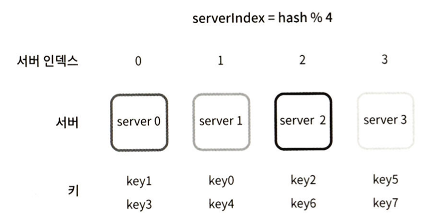
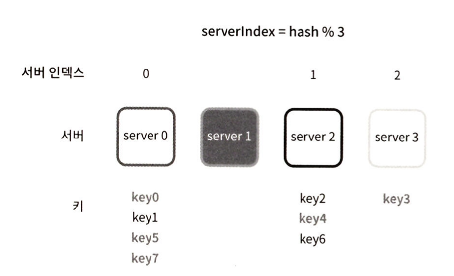
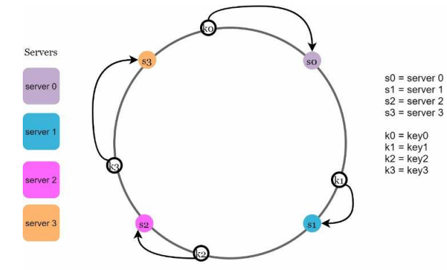
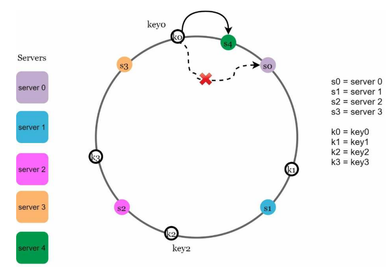
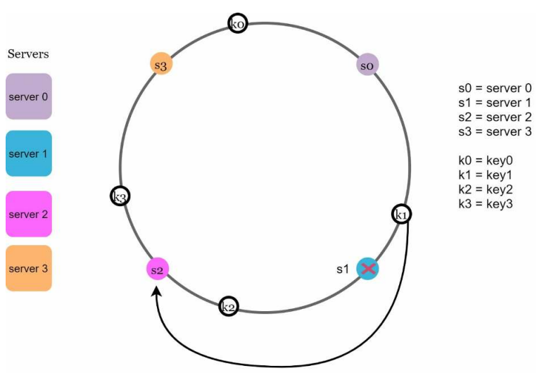
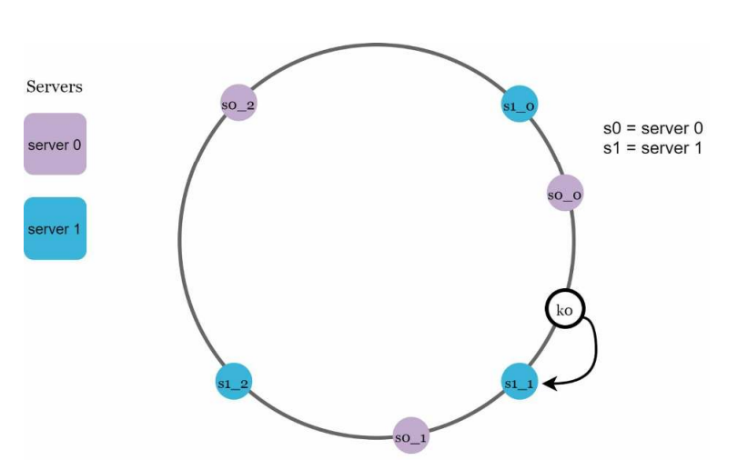

# 5장. 안정 해시 설계

수평적 규모 확장을 위해서는 요청을 서버에 균등학 나누는 것이 중요하다.
안정 해시는 이 목표를 달성하기 위해 보편적으로 사용하는 기술이다.

## 해시 키 재배치 문제

N개의 캐시 서버가 있다고 가정하면 이 서버들에 균등하게 부하를 나누는 보편적인 방법은
다음 해시 함수를 사용하는 것이다

```text
serverIndex = hash(key) % N(서버 갯수)
```

<p align="center"></p>

이 방법은 서버 풀의 크기가 고정되어 있고 데이터 분포가 균등할 때 잘 동작한다.
하지만, 서버가 추가되거나 기존 서버가 삭제되면 문제가 발생한다.

<p align="center"></p>

1번 서버가 문제가 생겼을 때, 대부분의 키가 재분배되고, 대부분 캐시 클라이언트가
데이터가 없는 엉뚱한 서버로 접속하게 되는 대규모 캐시 미스가 발생하게 된다.
안정 해시는 이 문제를 효과적으로 해결하는 기술이다

## 안정 해시

전통적인 해시 테이블은 슬롯의 수(서버의 수)가 바뀌면 거의 대부분의 키를 재배치한다.
반면 안정 해시는 해시 테이블 크기가 조정될 때 평균적으로 오직 `k/n개의 키`만 재배치하는 해시 기술이다.
k 는 키의 갯수이고, n은 슬롯의 갯수이다.

### 해시 공간과 해시 링

해시 함수 f는 SHA-1과 같은 일반적인 해시 함수를 사용한다고 가정하면 해시 공간의 범위는
0부터 2^160 - 1 까지가 된다. 해시 공간의 양쪽을 구부려 접으면 해시 링이 만들어 진다.

#### 서버 조회

<p align="center"></p>

해시 키는 링 위 어디에든 위치 가능하며, 어떤 키가 저장된 서버는 해당 키의 위치로부터
시계 방향으로 링을 탐색해 나가며 만나는 첫 번째 서버가 된다.

#### 서버 추가

<p align="center"></p>

서버를 추가하더라도 키 가운데 일부만 재배치하게 된다.
예를 들어 서버 4가 추가되게 되면, 기존 k0은 s0이 아닌 s4로 재배치되고 나머지 키는 재배치 되지 않는다.

#### 서버 제거

<p align="center"></p>

서버 제거 또한 비슷하게 동작한다. 서버 1이 제거되면, k0은 s2로 재배치되고 나머지 키는 재배치 되지 않는다.

### 기존 구현법의 두 가지 문제

안정 해시 알고리즘은 기본적으로 다음과 같은 절차를 가진다

- `서버와 키를 균등 분포(Uniform Distribution)` 해시 함수를 이용해 해시 링에 배치
- 키의 위치에서 링을 시계 방향으로 탐색하다 만나는 최초의 서버가 키가 저장되는 서버

여기서 두 가지 문제가 존재한다.

1. 서버가 추가되거나 삭제되는 상황을 감안하면 파티션의 크기를 균등하기 유지하는게 불가능하다
   - 파티션은 서버와 서버 사이의 해시 공간
2. 키의 균등 분포를 달성하기 어렵다

위 문제를 해결하기 위해 가상 노드(virtual node) 또는 복제라는 기법을 사용한다.

### 가상 노드

가상 노드는실제 노드 또는 서버를 가리키는 노드로서, 하나의 서버는 링 위에 여러개의 가상 노드를 가질 수 있다.
기존 서버들은 하나가 아닌 여러개의 파티션을 관리 해야한다.

<p align="center"></p>

키의 위치로부터 시계 방향으로 링을 탐색하다 만나는 최초의 가상 노드가 해당 키가 저장될 서버가 된다.

가상 노드의 갯수를 늘리면 키의 분포는 점점 균등해진다. 표준편차가 작아져서 데이터가 고르게 분포되기 때문이다.
100~200개의 가상 노드를 사용했을 경우 표준 편차의 값은 평균의 5% ~ 10% 사이다.
가상 노드의 갯수를 더 늘리면 표준 편차의 값은 더 떨어지지만, 가상 노드 데이터를 저장할 공간이 더 많이 필요하게된다.

따라서, 트레이드 오프가 필요하며 시스템 요구 사항에 맞도록 가상 노드 갯수를 적절히 조절해야한다.

### 재배치할 키 결정

서버가 추가되거나 제거되면 데이터 일부는 재배치 되어야한다. 어떤 범위의 키들이 재배치 될까?

서버가 추가되는 경우, 반시계 방향에 있는 서버와 새로 추가되는 서버들 사이의 키들이 새로 추가되는 서버로 재배치된다.
서버가 삭제되는 경우도 반시계 방향에 있는 서버와 삭제되는 서버 사이의 키를 시계 방향에서 만나는 최초의 서버로 재배치 해야한다.

## 결론

안정 해시는 다음과 같은 이점을 가진다

- 서버가 추가되거나 삭제될 때 재배치되는 키의 수가 최소화
- 데이터가 보다 균등하게 분포하게 되므로 수평적 규모 확장을 달성하기 쉽다
- 핫스팟 기 문제를 줄인다
  - 안정 해시는 데이터를 균등하게 분배하므로 특정 샤드에 대한 접근이 지나치게 빈번하게 발생하는 것을 방지할 수 있다

