# 키-값 저장소 설계

키-값 저장소는 비 관계형 데이터베이스로, 저장되는 값은 고유 식별자를 키로 가져야한다.
키-값 쌍에서는 키는 유일해야 하며 키에 매달린 값은 키를 통해서만 접근이 가능하다.
성능상의 이유로 키는 짧을 수록 좋으며, 값으로는 무슨 데이터가 오든 상관하지 않는다.

## 단일 서버 키-값 저장소

단일 서버 키값 저장소 구현의 가장 단순한 방법은 키-값 쌍을 모두 메모리에 해시 테이블로 저장하는 것이다.
이 방법은 빠른 속도를 보장하긴 하지만 모든 데이터를 메모리 안에 두는 것은 불가능하다는 약점이 있다.
이 문제를 개선하기 위한 방법은 다음과 같다.

- 데이터 압축
- 자주 쓰이는 데이터만 메모리에 두고 나머지는 디스크에 저장

하지만 이 개선책이 적용되더라도 많은 데이터를 저장하기 위해서는 언젠가 분산 키-값 저장소를 만들 필요가 있다.

## 분산 키-값 저장소

분산 키값 저장소는 분산 해시 테이블이라고도 불리며 이 시스템을 설계할 때 CAP 정리를 이해하고 있어야 한다.

### CAP 정리

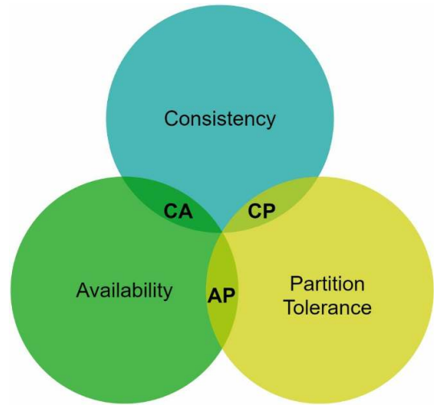

CAP는 일관성(conssitency), 가용성(availability), 파티션 감내(partition tolerance)을 가리킨다.
CAP 정리는 이 세 가지 요구사항을 동시에 만족하는 시스템을 설계하는 것은 불가능하다는 정리다

- 일관성(conssitency)
  - 모든 클라이언트는 어떤 노드에 접근했는지에 관계없이 동일한 데이터를 볼 수 있다.
- 가용성(availability)
  - 클라이언트는 일부 노드의 장애와 무관하계 항상 응답을 받을 수 있어야한다
- 파티션 감내(partition tolerance)
  - 파티션은 두 노드 사이에 통신 장애를 말하며, 네트워크에 파티션이 생기더라도 시스템은 계속 동작해야 한다.

이 세가지 요구사항 가운데 어느 두 가지를 만족하냐에 따라 다음과 같이 분류될 수 있다.

- CP 시스템
  - 일관성과 파티션 감내를 지원하는 키값 저장소
  - 가용성을 희생
- AP 시스템
  - 가용성과 파티션 감내를 지원하는 키값 저장소
  - 데이터 일관성을 희생
- CA 시스템
  - 일관성과 가용성을 지원하는 키값 저장소
  - 파티션 감내를 희생
  - 보통 네트워크 장애는 피할 수 없으므로 분산 시스템은 반드시 파티션 문제를 감내해야 한다
  - 따라서 실세계에서는 CA 시스템은 존재하지 않음

#### 이상적 상태

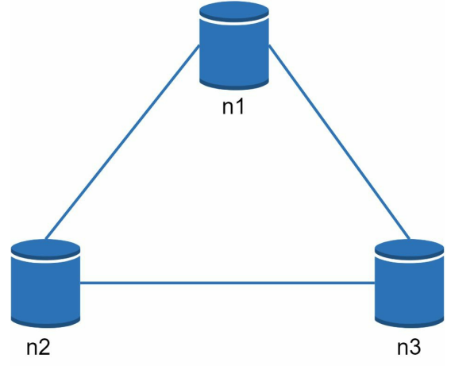

이상적인 환경이라면 네트워크가 파티션되는 상황은 발생하지 않으며, 모든 DB의 데이터가 동일한 데이터를 가진다.
즉, 데이터 일관성과 가용성도 만족된다.

#### 실세계의 분산 시스템

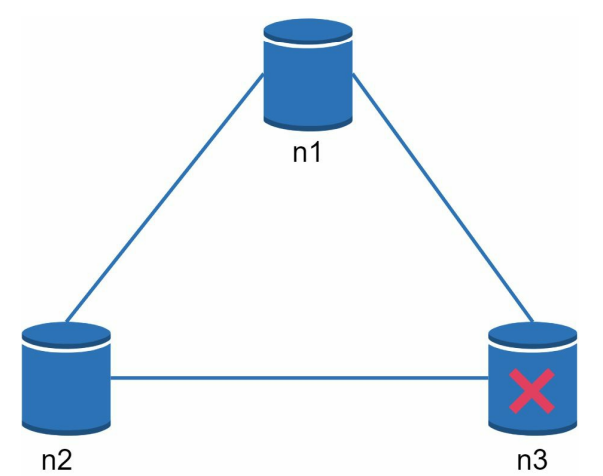

실세계의 분산 시스템은 파티션 문제를 피할 수 없다. 따라서 파티션 문제가 발생하면,
일관성과 가용성 사이에서 하나를 선택해야 한다.

- 일관성 선택(CP 시스템)
  - 서버 간 데이터 불일치 문제를 피하기 위해 n1과 n2에 대해 쓰기 연산을 중단해야 하며, 가용성이 깨지게된다
  - 은행권 시스템은 보통 데이터 일관성을 양보하지 않는다
- 가용성 선택(AP 시스템)
  - 최신화되지 않은 데이터를 반환할 위험이 있더라도 계속 읽기 연산을 허용해야 한다
  - n1과 n2는 계속 쓰기 연산이 지속되고 파티션 문제가 해결된 이후에야 n3는 최신화된 데이터를 받는다

분산 키값 저장소를 만들 때 요구사항에 맞도록 CAP 정리를 적용해야 한다.

## 시스템 컴포넌트

키값 저장소 구현에 핵심이 되는 컴포넌트

### 데이터 파티션

데이터를 파티션 단위로 나눌 때 다음 두 가지 문제를 중요하게 따져봐야한다

- 데이터를 여러 서버에 고르게 분산
- 노드가 추가되거나 삭제될 때 데이터의 이동이 최소화

이 문제는 5장에서 다룬 안정 해시(consistent hashing) 알고리즘을 사용하면 해결할 수 있다.
안정 해시를 이용하면 다음의 장점이 생긴다

- 규모 확장 자동화
  - 시스템 부하에 따라 서버가 추가되거나 삭제되게 만들 수 있음
- 다양성
  - 서버 용량에 맞춰 가상 노드의 수를 조절 가능

### 데이터 다중화

높은 가용성과 안정성을 확보하기 위해서는 데이터를 N개 서버에 비동기적으로 다중화할 필요가 있다.
어떤 키를 해시 링 위에 배치한 후, 키를 기준으로 시계 방향으로 순회하면서 만나는 N 개의 서버에 데이터 사본을 저장하는 방법이 있다
다음은 N이 3인 예시이다.

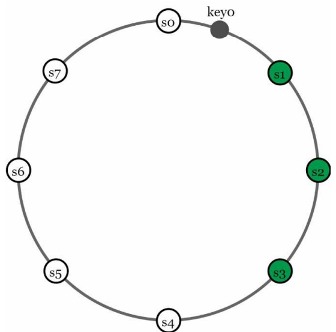

하지만 가상 노드를 사용하는 경우 N 개의 노드가 실제 물리 서버의 갯수 N 보다 작아질 수 있다.
이 문제를 해결하려면 노드를 선택할 때 같은 물리 서버를 중복 선택하지 않도록 해야한다.

### 데이터 일관성

여러 노드에 다중화된 데이터는 적절히 동기화 되어야 한다.
정족수 합의(Quorum Consensus) 알고리즘을 사용하면 읽기, 쓰기 연산 모두에 일관성을 보장할 수 있다.

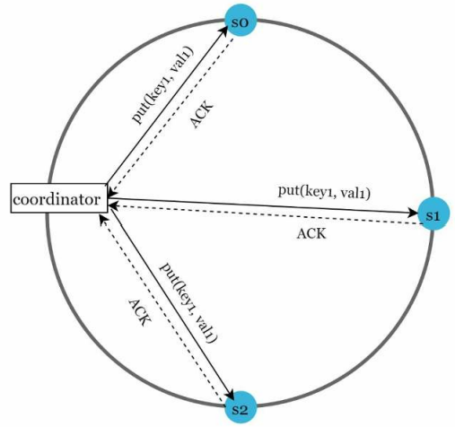

- N
  - 사본 갯수
- W
  - 쓰기 연산에 대한 정족수
  - 쓰기 연산이 성공한 것으로 간주되려면 적어도 W개의 서버로 부터 성공 응답을 받아야 함
- R
  - 읽기 연산에 대한 정족수
  - 읽기 연산이 성공한 것으로 간주되려면 적어도 R개의 서버로 부터 성공 응답을 받아야 함

`W = 1`은 데이터가 한 대 서버에 기록된다는 뜻이 아니다. 이는 중재자(coordinator)가 쓰기 연산에 대한
성공 응답을 최소 한 대 서버에서 받아야 한다는 뜻이다. 이 때 중재자는 클라이언트와 노드 사이에 프록시 역할을 한다.

R 또한 마찬가지이며, W, R, N 값을 정하는 것은 응답 지연과 데이터 일관성 사이의 타협점을 찾는 과정이다.
W와 R이 모두 1인 경우 응답 속도는 빠를 수 있으나 일관성 측면에서는 W와 R이 1보다 큰 값을 갖는 구성보다 낮아진다.
반대로 W와 R이 1보다 큰 경우 응답 속도는 느려질 것이다. `W + R > N`인 경우 강한 일관성(strong consistency)을 보장할 수 있다.

그렇다면 W, R, N의 값은 어떻게 정해야 할까?

- R = 1 , W = N
  - 빠른 읽기 연산에 최적화
- R = N, W = 1
  - 빠른 쓰기 연산에 최적화
- W + R > N
  - 강한 일관성이 보장
- W + R <= N
  - 강한 일관성이 보장되지 않음

#### 일관성 모델(Consistency Model)

일관성 모델은 키값 저장소를 설계할 때 고려해야할 중요한 요소이며 종류가 다양하다.

- 강한 일관성(strong consistency)
  - 모든 읽기 연산은 가장 최근에 갱신된 결과를 반환
- 약한 일관성(weak consistency)
  - 읽기 연산은 가장 최근에 갱신된 결과를 반환하지 못할 수 있음
- 결과적 일관성(eventual consistency)
  - 약한 일관성의 한 형태
  - 갱신 결과가 결국에는 모든 사본에 동기화되는 모델

강한 일관성을 달성하는 일반적인 방법은, 모든 사본에 현재 쓰기 연산의 결과가 반영될 때 까지
해당 데이터에 대한 읽기, 쓰기를 차단하는 것이다. 하지만 이는 고가용성 시스템에는 적절하지 못하다.

다이나모나 카산드라의 경우 결과적 일관성 모델을 채용하며 이 모델은 쓰기 연산이 병렬로 발생하며,
시스템에 저장된 값의 일관성이 깨질 수 있다. 하지만 이 문제는 클라이언트 측에서 버전 정보를 활용하는 방식으로 해결한다.

##### 비 일관성 해소 기법: 데이터 버저닝

데이터를 다중화하면 가용성은 높아지지만 사본 간 일관성이 깨질 수 있다.
버저닝(versioning)과 벡터 시계(vector clock)는 이 문제를 해결하는 기술이다.
버저닝은 데이터를 변경할 때마다 버전 정보를 갱신하는 방식이다.

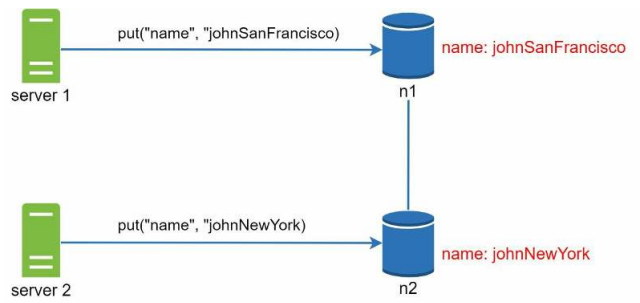

 
위 예시에서 johnSanFransisco는 v1이고 johnNewYork는 v2이다.
두 연산이 동시에 이뤄진 경우, 마지막 두 버전에 대한 충돌은 해소하기 어려워진다.
이 문제를 해결하기 위해선 충돌을 발견하고 해결하는 방법이 필요한데, 이때 사용하는 것이 `벡터 시계`이다.

벡터 시계는 [서버, 버전]의 순서쌍을 데이터에 매달아, 어떤 버전이 선행 버전인지 아닌지 아니면
다른 버전과 충돌이 있는지를 판단한다.

벡터 시계를 사용하면 어떤 버전 X가 버전 Y의 이전 버전인지 판단할 수 있다.
버전 `Y에 포함된 모든 구성요의 값이 X에 포함된 모든 구성 요소보다 같거나 큰지`만 보면된다.

- X버전
  - D([s0, 1], [s1, 1])
- Y 버전
  - D([s0, 1], [s1, 2])
- Y의 버전은 X 버전보다 같거나 크기 때문에 X는 Y의 이전 버전이다.

마찬가지로 충돌은 대상의 구성 요소가 현재 구성요소 값보다 작은 값을 가지고 있는지를 확인함으로써 알 수 있다.

- X 버전
  - D([s0, 1], [s1, 2])
- Y 버전
  - D([s0, 2], [s1, 1])
- Y 버전 내 구성 요소 중 [s1, 1]은 X 버전의 [s1, 2]보다 작기 때문에 충돌이 발생함을 감지한다

벡터 시계는 데이터 일관성을 위해 적합한 방법이지만 두가지 단점이 존재한다.

- 충돌 감지 및 해소 로직이 클라이언트에 들어가므로 클라이언트 구현이 복잡해진다
- [서버, 버전]의 순서쌍 갯수가 빨리 늘어남
  - 보완 방법
    - 임계치를 설정하고 길이가 길어진 오래된 순서쌍을 벡터 시계에서 제거
  - 보완 방법은 버전 간 선후 관계가 정확히 결정되지 않을 수 있는 문제가 있다
  - 하지만 실제 시스템의 측정 결과에 따르면 이 문제는 크게 발생하지 않는다

#### 장애 감지

분산 시스템에서 한 대의 서버가 장애를 보고한다고 해서 바로 장애로 간주하지는 않는다.
보통 두 대 이상의 서버가 똑같은 서버의 장애를 보고해야 해당 서버에 장애가 발생했다고 간주한다.

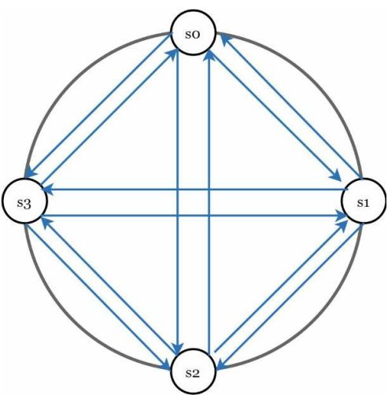

서버 장애를 감지하기 가장 쉬운 방법은 모든 노드 사이에 멀티캐스팅 채널을 구축하는 것이다.
하지만, 이 방법은 서버가 많을 때는 비효율적이다.

가십 프로토콜(gossip protocol)와 같은 장애 감지 프로토콜이 분산환경에서 보다 효율적이다.
다음은 가십 프로토콜의 동작 방식이다.

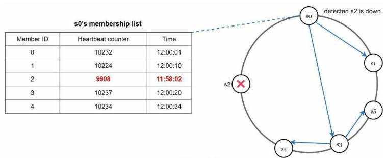

- 각 노드는 멤버십 목록을 유지
  - 멤버십 목록은 각 멤버의 ID와 하트비트 카운터(heartbeat counter) 쌍의 목록
- 각 노드는 주기적으로 자신의 하트비트 카운터를 증가
- 각 노드는 무작위로 선정된 노드들에게 주기적으로 자신의 하트비트 카운터 목록을 보냄
- 하트비트 카운터 목록을 받은 노드는 멤버십 목록을 최신 값으로 갱신
- 어떤 멤버의 하트비트 카운터 값이 지정된 시간동안 갱신되지 않으면 해당 서버는 장애 상태인 것으로 간주

#### 일시적 장애 처리

장애를 감지한 시스템은 가용성을 보장하기 위해 필요한 조치를 취해야한다.
이때 엄격한 정족수 접근법은 데이터 일관성을 위해 읽기와 쓰기 연산을 금지한다.

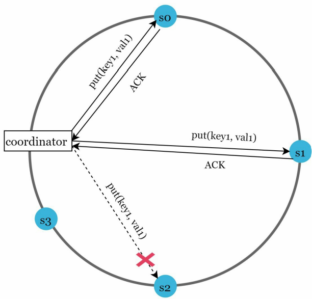

반면 느슨한 정족수 접근법은 이 조건을 완하하여 가용성을 높인다. 쓰기 연산을 수행할 W개의 정상 서버와
읽기 연산을 수행할 R개의 정상 서버를 해시 링에서 고른다.

네트워크나 서버 문제로 장애 상태인 서버로 가는 요청은 다른 서버가 잠시 맡아 처리한다.
장애동안 발생한 변경 사항은 해당 장애가 복구된 이후에 일괄적으로 반영하여 데이터 일관성을 보존한다.
이때, 임시로 쓰기 연산을 처리한 서버에는 그에 고나산 단서(hint)를 남겨 둔다.
이런 장애 처리 방법을 단서 후 임시 위탁(hinted handoff)이라고 한다.

#### 영구 장애 처리

영구적인 노드 장애는 반-엔트로피(anti-entropy) 프로토콜을 구현해 사본들을 동기화할 수 있다.
이 프로토콜은 사본들을 비교하여 최신 버전으로 갱신하는 것 또한 포함되어 있다.

사본 간 일관성이 망가진 상태를 탐지하고 전송 데이터량을 줄이기 위해 머클(Merkle) 트리를 사용할 수 있다.
머클 트리는 각 노드에 자식 노드들에 보관된 해시 값 또는 자식 노드들의 레이블로부터 계산된 해시값을 붙여두는 트리이다.
동작 방식은 다음과 같다.

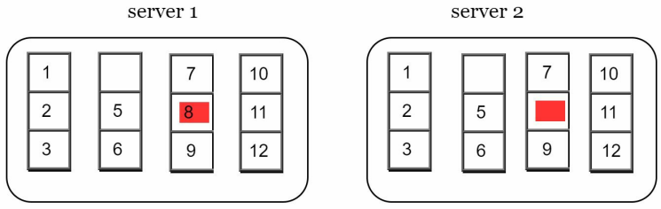

1단계는 키 공간을 버킷으로 나누는 것이다. 위 예시에서는 4개의 버킷으로 나눈다.

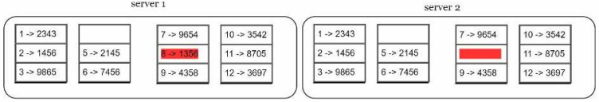

2단계는 버킷에 포함된 각 키에 균등 분포 해시 함수를 적용하여 해시 값을 저장한다.

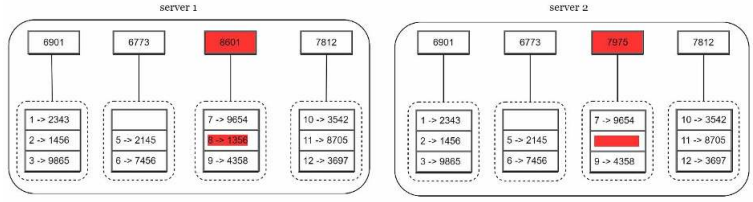

3단계는 버킷별로 해시값을 계산한 후, 해당 값을 레이블로 갖는 노드를 만든다.

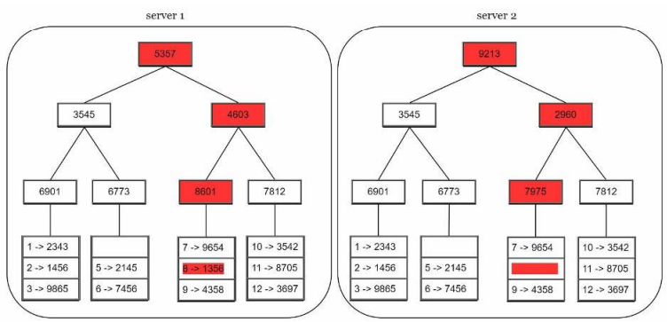

4단계는 자식 노드의 레이블로부터 새로운 해시값을 계싼하여 이진트리 형식으로 구성한다.

머클 트리의 비교는 루트 노드의 해시값을 비교를 시작으로 왼쪽에서부터 오른쪽으로 그리고 하향식으로 진행된다.
이렇게 탐색하다 보면 다른 데이터를 갖는 버킷을 찾을 수 있으므로, 그 버킷들만 동기화하면 된다.

## 요약

분산 키-값 저장소가 가져야 하는 기능과 그 기능 구현에 이용되는 기술표

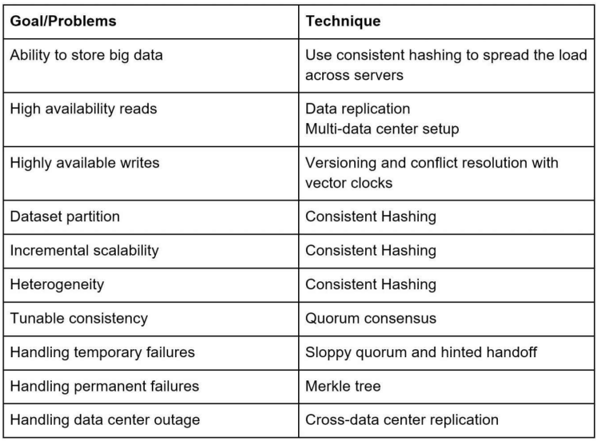

