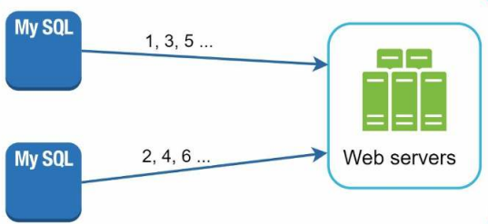
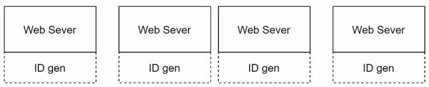
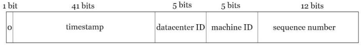

# 분산 시스템을 위한 유일 ID 생성기 설계

유일 ID 생성기에 DB의 auto_increment 설정으로 가능하지 않을까 생각할 수 있다.
하지만, 분산 환경에서 DB 서버 한대로는 요구를 감당할 수 없으며, 여러 데이터 베이스를 쓰는 경우
지연 시간을 낮추기가 무척 어렵다.

## 1단계. 문제 이해 및 설계 범위 확정

예시로 들 유일 ID 생성기의 요구 사항은 다음과 같다

- ID는 유일해야 한다
- ID는 숫자로만 구성되어야 한다
- ID는 64비트로 표현될 수 있어야 한다
- ID는 발급 날짜에 따라 정렬 가능해야 한다
- 초당 10,000개의 ID를 만들 수 있어야 한다

## 2단계. 개략적 설계안 제시 및 동의 구하기

유일성이 보장되는 ID를 만드는 방법은 여러가지가 있을 수 있다.

- 다중 마스터 복제(Multi-Master Replication)
- UUID(Universally Unique Identifier)
- 티켓 서버(Ticket Server)
- 트위터 스노우플레크(Snowflake) 접근법

### 다중 마스터 복제

이 접근법은 DB의 auto_increment 기능을 활용한다. ID 값을 구할 때 1만큼 증가시켜 얻는게 아닌 사용 중인 DB 서버의 갯수 k만큼 증가 시킨다.
하지만 이 접근법은 다음과 같은 단점이 존재한다.

- 여러 데이터 센터에 걸쳐 규모를 늘리기 어려움
- ID의 유일성은 보장되지만, 시간의 흐름에 맞춰 커지도록 보장할 수 없다
- 서버를 추가하거나 삭제할 때도 제대로 동작하도록 만들기 어렵다

### UUID

UUID는 컴퓨터 시스템에 저장되는 정보를 유일하게 식별하기 위한 128비트 숫자로, 충돌 가능성이 지극히 낮다.

- 장점
  - UUID를 만드는 것이 단순
    - 서버 사이의 조율이 필요 없으므로 동기화 이슈가 없다
  - 각 서버가 자기가 쓸 ID를 만드는 구조이므로 규모 확장이 쉽다
- 단점
  - ID가 128비트로 길기 떄문에 짧은 비트의 ID를 사용하는 경우에 변형이 필요
  - ID를 시간순으로 정렬할 수 없다
  - ID에 숫자가 아닌 값이 포함될 수 있다

### 티켓 서버

티켓 서버는 auto_increment 기능을 갖춘 DB 서버를 중앙 집중형으로 하나만 사용하는 것이다.

- 장점
  - 유일성이 보장되는 오직 숫자로만 구성된 ID를 쉽게 만들 수 있음
  - 구현하기 쉽고, 중소 규모 어플리케이션에 적합하다
- 단점
  - SPOF(Single Point of Failure)가 될 수 있다.
    - 이 이슈를 피하려면 티켓 서버를 여러대 둬야하는데, 그런 경우 데이터 동기화같은 새로운 문제가 발생

### 트위터 스노우플레이크 접근법

스노우플레이크 접근법은 ID를 여러절로 분할한다.

- 사인(sign) 비트
  - 1비트를 할당
  - 음수와 양수를 구별하는데 사용
- 타임스탬프(timestamp) 비트
  - 41비트를 할당
  - 기원 시각(epoch) 이후로 몇 밀리초가 경과했는지 나타냄
- 데이터 센터 ID
  - 5비트를 할당
  - 2^5 = 32개 데이터 센터를 지원 가능
- 서버 ID
  - 5비트를 할당
  - 데이터 센터당 32개 서버를 사용 가능
- 일련번호
  - 12비트를 할당
  - 각 서버에서 ID를 생성할 때 마다 일련번호를 1씩 증가
  - 1 밀리초가 경과할 때 마다 0으로 초기화

## 3단계. 상세 설계

### 타임스탬프

타임스탬프는 시간이 흐름에 따라 점점 큰 값을 갖게되므로, 결국 ID는 시간순으로 정렬 가능하다.
41비트로 표현할 수 있는 타임스탬프의 최댓값인 2^41 - 1로 69년에 해당한다.
69년 이후에는 새로운 기원 시각이나 ID 체계를 다른 것으로 이전해야한다.

### 일련번호

일련번호는 12비트이므로, 2^12 = 4096 값을 가질 수 있다. 같은 밀리초 동안 하나 이상의
ID를 만들어내는 경우에만 0보다 큰 값을 갖게 된다.

## 마무리

추가적으로 논의할 수 있는 사항

- 시계 동기화(Clock Synchronization)
  - 기존 살펴본 생성기는 모두 같은 시계를 사용한다고 가정한다
  - 하나의 서버가 여러 코어에서 실행되거나 서버가 물리저긍로 독립된 여러장비에서 실행되는 경우 유효하지 않을 수 있다
  - NTP(Network Time Protocol)를 사용하여 시계를 동기화하는 방법이 존재한다
- 각 section 길이 최적화
  - 동시성이 낮고 수명이 긴 어플리케이션이라면 일련번호 절의 길이를 줄이고 타임스탬프  절의 길이를 늘리는 것이 효과적일 수 있음
- 고가용성
  - 필수 컴포넌트이므로 높은 가용성을 제공해야 한다