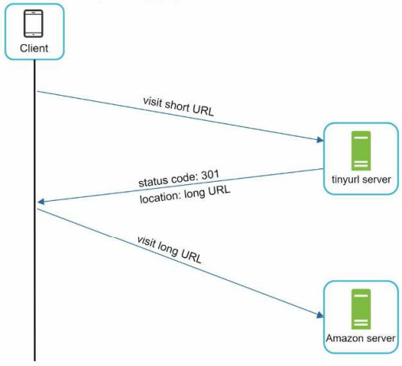
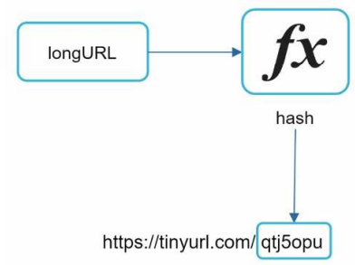
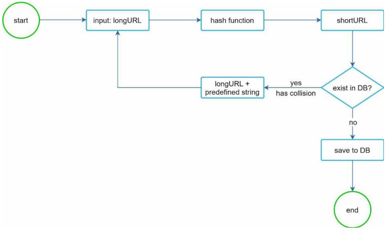
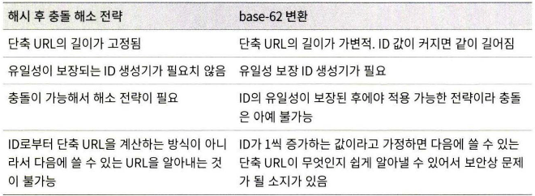
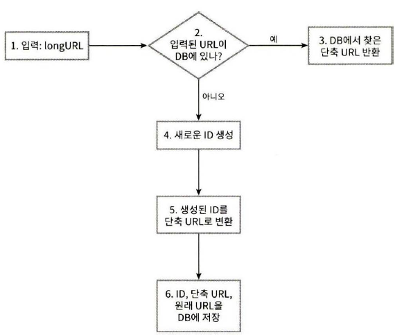
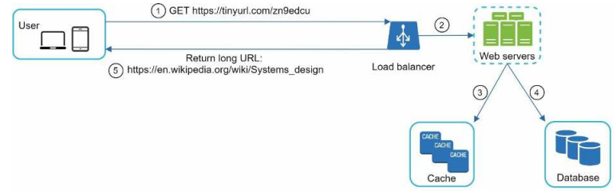

# URI 단축기 설계

## 1단계. 문제 이해 및 설계 범위 확정

시스템의 기본적인 기능

- URL 단축
  - 주어진 긴 URL을 짧게 줄인다
- URL 리디렉션(redirection)
  - 축약도니 URL로 HTTP 요청이 오면 원래 URL로 안내
- 높은 가용성과 규모 확장성, 장애 감내

### 개략적인 추정

- 쓰기 연산
  - 매일 1억 개의 단축 URL 생성
- 초당 쓰기 연산
  - 1억 / 24 시간/ 3600 초 = 1160
- 읽기 연산
  - 읽기 연산과 쓰기 연산의 비율을 10:1 이라고 가정, 읽기 연산은 초앙 11,600회
- URL 단축 서비스는 10년간 운영
  - 1억 * 365 * 10 = 3650억개 레코드 보관
- 축약 전 URL 평균 길이는 100
- 10년 동안 필요한 저장 용량은 100바이트 * 3650억 = 36.5TB

## 2단계. 개략적 설계안 제시 및 동의 구하기

### API 엔드 포인트

클라이언트는 서버가 제공하는 API 엔드포인트를 통해 서버와 통신한다.
URL 단축기는 기본적으로 다음 두개의 엔드포인트를 필요로 한다.

- URL 단축용 엔드포인트
  - 단축할 URL을 인자로 실어서 POST 요청을 보낸다
  - 반환은 단축된 URL
```http request
POST /api/v1/data/shorten
```
- URL 리디렉션용 엔드포인트
  - 단축 URL에 대해 HTTP 요청이 오면 원래 URL로 보내주기 위한 용도
  - 반환은 리디렉션 목적지가 될 원래 URL
```http request
GET /api/v1/shortUrl
```

### URL 리디렉션

<p align="center"></p>

브라우저에 단축 URL을 입력하면 단축 URL을 받은 서버는 그 URL을 원래 URL로 바꾸어서 301 응답의
Location 헤더에 담아 반환한다 301 응답과 302 응답을 선택할 수 있다.

- 301 Permanent Redirect
  - 영구적으로 Location 헤더에 반환된 URL로 이전 되었다는 응답
  - 브라우저는 이 `응답을 캐시`
- 302 Found
  - 일시적으로 Location 헤더가 지정하는 URL에 의해 처리되어야 한다는 응답
  - 언제나 단축 URL 서버에 먼저 보내진 후에 원래 URL로 리디렉션 되어야 함

두 방법은 각기 다른 장단점을 가진다. 서버 부하를 줄이는 것이 중요하다면 301 응답을,
트래픽 분석이 중요할 때는 302 응답을 쓰는 쪽이 유리하다.

URL 리디렉션을 구현하는 가장 쉬운 방법은 해시테이블을 이용해 <단축 URL, 원래 URL> 을 저장하는 것이다.

### URL 단축

<p align="center"></p>

단축 URL에서 중요한 것은 긴 URL을 해시 값으로 대응시킬 수 있는 해시 함수를 찾는 것이다.
이 해시함수는 다음 요구사항을 만족해야 한다.

- 입력으로 주어지는 긴 URL이 다른 값이면 해시 값도 달라져야 함
- 계산된 해시 값은 원래 입력으로 주어졌던 긴 URL로 복원될 수 있어야 함

## 3단계. 상세 설계

### 데이터 모델

해시테이블은 메모리가 유한하기에 실제 시스템에 쓰기에는 한계가 존재한다. 따라서, 관계형
데이터베이스에 저장하는 것이 일반적이다. 가장 단순화된 테이블은 id, shortURL, longURL 컬럼을 가진다

### 해시 함수

앞서 언급했듯 해시 함수는 원래 URL을 단축 URL로 변환하는데 쓰인다.

#### 해시 값 길이

해시 값은 [0-9a-zA-Z] 문자로 구성된 문자열로 사용할 수 있는 문자의 갯수는 10 + 26 + 26 = 62개가 된다.
따라서, 해시 값의 길이를 정하기 위해서는 62^n >= 3650억인 최솟값을 구해야하며 이 시스템에서는 7개면 3.5조개를 만들 수 있다.

#### 해시 후 충돌

<p align="center"></p>

해시 값을 만드는 쉬운 방법은 CRC32, MD5, SHA-1 등을 통해 해시 값을 만든 후 해시 값 길이만큼 잘라서 사용하는 것이다.
하지만 이 경우 충돌이 발생할 수 있으며, 이 경우 충돌이 해소될 때 까지 사전에 정한 문자열을 해시값에 붙인다.

이 방법을 사용하면 충돌은 해소될 수 있지만, 단축 URL을 만들 때 한 번이상 데이터베이스 질의하므로 오버헤드가 크다.
이 경우, 데이터베이스 대신 블룸필터를 사용하면 성능을 높일 수 있다.

#### base-62 변환

진번 변환(base conversion)은 수의 표현 방식이 다른 두 시스템이 같은 수를 공유할 때 유용하다.
62진법이라고 쓴 이유는 해시 값에 사용할 수 있는 문자열의 갯수가 62개이기 떄문이다.

### 두 접근법 비교

<p align="center"></p>

### URL 단축기 상세 설계

<p align="center"></p>

URL 단축기는 시스템의 핵심 컴포넌트로, 처리 흐름이 논리적으로 단순해야하고 기능적으로 언제나 동작해야한다.
또한 4번 흐름에서 새로운 ID를 생성하는 것을 볼 수 있는데, 이 ID는 전역적으로 유일성이 보장되야 한다.
이부분은 7장에서 다룬적이 있다.

### URL 리디렉션 상세 설계

<p align="center"></p>

URL 단축기의 경우 쓰기보다 읽기를 더 자주하는 시스템이라 캐시에 저장하여 성능을 높일 수 있다.

## 4단계. 마무리

추가적으로 논의하면 좋을 사항은 다음과 같다.

- 처리율 제한 장치
  - 많은 양의 URL 단축 요청이 들어올 경우 무력화 될 수 있다
  - 처리율 제한 장치를 통해 필터링 규칙을 만들어 이런 요청들을 걸러낼 수 있다
- 웹 서버의 규모 확장
  - 웹 계층은 무상태 계층이므로 웹 서버를 자유롭게 증설하거나 삭제 가능하다
- 데이터베이스의 규모 확장
  - 데이터베이스를 다중화하거나 샤딩하여 규모 확장성을 달성할 수 있다
- 데이터 분석 솔루션
  - URL 단축기에 데이터 분석 솔루션을 통합해 두면 여러 비지니스적인 정보를 알아낼수 있다
