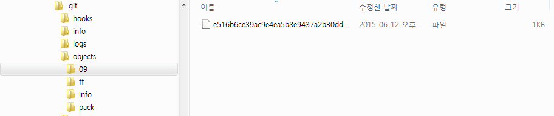
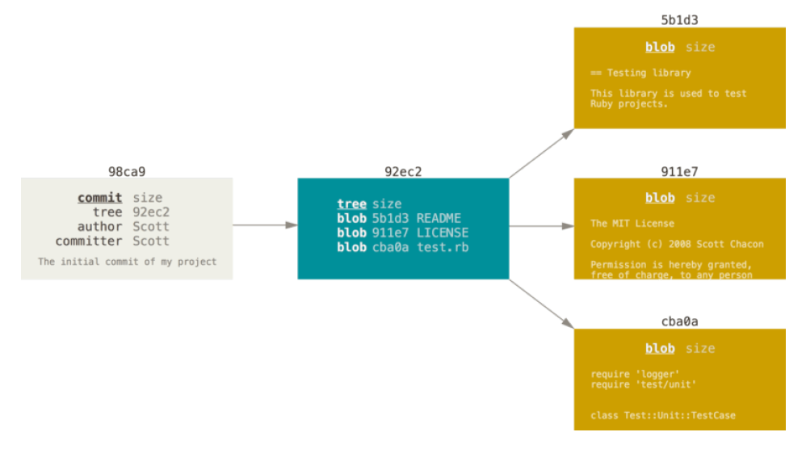
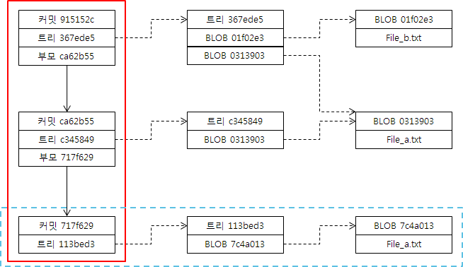
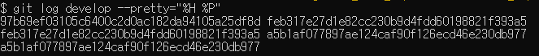
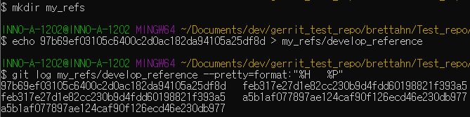
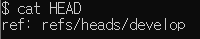

# Git Basic

## Git Intro

- Version Control System(VCS)에서 특정 version을 작업할수 있게 파일로 만드는 것이 체크아웃(Checkout).
- SVN의 경우 이전까지의 변경내용을 누적하여 파일을 만듬.
- Git의 경우 변경된 파일을 통째로 저장하므로, 변경사항 추적 X.
- Checkout 하려는 version의 `BLOB(Binary large object)` 객체를 파일로 변환.
- Git에서의 branch간 이동이 곧 version간의 이동.

## Git Repository

- `git init` 또는 `git clone`시 생김.
- .git 폴더 = git 저장소
- .git 폴더를 포함하는 폴더 = 작업 디렉토리(working directory)
- 작업 디렉토리가 git으로 추적, 관리하는 대상.

## Bare 저장소

- 작업 디렉토리가 없는 저장소 = .git 폴더만 존재하는
- 소스 관리와 공유만이 목적 = 주로 중앙 저장소
- 내용을 수정할 필요가 없는 상태
- .git 폴더만을 떼어 사용

## Git의 디렉토리

### Objects 디렉토리

파일이 저장되는 디렉토리이며, 모든 파일은 `BLOB객체`로 저장한다. 이때 SHA-1로 체크섬(Checksum)을 계산하며,
계산된 hash의 첫 두자리를 Objects 디렉토리 내 `폴더명`으로 사용하고 나머지는 파일이름으로 사용한다.
- Objects 디렉토리 내 객체가 생성되는 시점
  - `git add`로 `staging area`에 파일이 등록될 때
  - `staging area`에 등록 = Git 저장소에 BLOB 객체로 생성된다는 것
- `info`와 `pack`에는 `meta정보`와 `Packfile`이 저장.
  - `Packfile`
    - Snapshot으로 저장된 파일을 SVN과 같은 변경분 저장 방식으로 바꿔, 하나의 파일로 저장된 파일.
    - 관리하는 파일이 많아지거나 remote로 push할 때 자동으로 생성. git gc 명령어에도 생성.

- 파일 목록을 담은 `트리 객체(tree)`와 커밋 정보를 담은 `커밋 객체(commit)`를 저장.
  - 트리 객체는 다른 트리 객체를 하위에 가질 수 있음.
  - 커밋 객체는 특정 최상위 트리 객체와 저자 등의 메타 정보 및 부모 커밋의 정보를 가짐.

- Git 객체 간의 관계를 위와 같이 표현할 수 있음.
  - 파일이 커밋될 경우 커밋 객체는 트리 객체를 가리킴.
  - 트리 객체의 경우 커밋 시점에 존재한 모든 파일에 대한 목록을 가지고 있음.
  - 만약 파일이 지속적으로 커밋 되었을 경우, 새로운 커밋 객체가 만들어지며 이전 커밋에 대한 정보가 커밋 객체에 포함.
  - 이전 커밋에 대한 정보를 확인할 수 있는 부모 커밋 ID를 통해 추적할 수 있음.

### Refs 디렉토리

커밋 id는 길고 복잡하기에 직접 사용하기에 불편하다. 따라서 사용 빈도가 높은 커밋은 별도의 이름을 지정하는데 이를 `reference`라고 한다
- `reference`가 가리키는 `commit id`는 `refs` 디렉토리 내에 reference 별 파일로 저장.
  - 결국 `reference`는 특정 커밋에 대한 포인터이자 `commit id`를 저장한 파일의 경로.
- 예를 들어 master branch를 생각해보면,사실상 refs/heads/master 파일에 `마지막 commit id`가 저장되며, 상대 경로가 그대로 `reference`로 사용.
- 상대 경로를 모두 사용할 필요없이 우리는 master만 사용해도 되는데, 이를 우리는 `branch reference`라고 함.
- `reference`는 특정 커밋을 가리키고, 특정 커밋은 부모 커밋의 정보를 포함.
  - 즉, `reference`가 가리키는 커밋에서 시작하면, 커밋에 포함된 모든 객체에 접근 가능.
- 따라서, `reference`는 단순한 포인터로도 볼 수 있지만, 그 자체가 `하나의 저장 영역` 또는 `작업 영역`으로 볼 수 있음.

`develop branch reference`의 log를 보면
  - 왼쪽은 branch에 연결된 커밋
  - 오른쪽은 부모 커밋을 보여주며,이들의 id를 통해 각 커밋에 접근 할 수 있음.
- Gerrit은 별도로 생성된 reference에 리뷰와 관련된 정보를 저장.
  - Gerrit으로 source를 push할 때 특정 경로로 push해야 하는 이유.

기존에 있던 develop의 커밋 id를 사용자가 직접 생성한 폴더에 복사하고, 이 reference의 log를 출력하면, 기존에 있던 결과와 동일하게 나오는 것을 확인 할 수 있다.

### Info 디렉토리

Git 관리 제외 대상 목록을 저장한 `exclude` 파일과 reference 목록인 `refs` 파일이 존재한다.
- `exclude`파일은 `.gitignore`와 같은 기능, 하지만 다른 사람과 공유되지 않음.
- `.git/info/refs`파일은 `./git/refs`아래의 개별 reference들을 모두 삭제하고 하나의 파일로 정리.

### Hooks 디렉토리

`Hook script`들이 저장된 곳이다.
- Hook script는 git 명령어가 실행될 때 자동으로 실행되는 명령어 묶음.
- 예를 들어, `commit-msg`는 commit 명령어를 실행할 때 change-id를 생성해 메세지에 포함하는 script가 있음.
- 디렉토리 내에는 여러가지 상황에 대한 `template`들이 존재.

### Config 파일

.git 폴더 내의 `config`파일이 있다면 그 repository에 적용되는 설정이 존재한다고 볼 수 있다.
- Git은 `시스템 설정 파일`, `사용자 설정 파일`, `로컬 설정 파일` 3가지 설정 파일을 사용.
  - `시스템 설정 파일`은 Git 설치 폴더 내 etc/gitconfig 파일.
    - Git을 `설치한 시스템 전체`에 적용.
  - `사용자 설정 파일`은 사용자 폴더 내에 있는 .gitconfig 파일
    - ex) `C:\Users\brettahn\.gitconfig`
    - 특정 사용자가 사용하는 `모든 Git 저장소`에 공통으로 적용.
  - `로컬 설정 파일`은 그 `파일이 있는 repository`에 적용.
    - 시스템 설정 파일과 사용자 설정 파일의 내용을 대체 가능.
    - .git 내부의 config 파일이 로컬 설정 파일.

### HEAD 파일

HEAD 파일은 HEAD reference를 가리키는 커밋 id를 저장한다
- `HEAD`는 항상 `현재 작업 디렉터리의 checkout된 version`을 가리킴.
- branch checkout이 되면 그 branch의 reference가 HEAD 파일에 저장.

### 그 외에 디렉토리

- logs : 커밋, 체크아웃 같은 일상적인 git 작업에 대한 기록.
- modules : git sub-module 사용시 sub-module들의 git 저장소가 만들어짐.
- ORIG_HEAD 파일 : HEAD reference가 변경하는 명령을 실행 시 생성, `변경 전의 HEAD reference` 저장.
- FETCH_HEAD 파일 : git fetch 실행 시, 마지막으로 가져온 `remote의 commit id` 저장.

## Gerrit을 이해하기 위한 최소한의 Git

- 스냅샷(Snapshot) : 특정 시점의 상태를 그대로 복사 저장하는 것.
- Gerrit은 프로젝트별로 Git 중앙 저장소를 여러개 두고 접근을 제어
- Gerrit 그자체가 Git server, Git을 이용해 저장 및 관리
- Git은 변경이 발생한 부분만을 저장하는 것이 아닌 변경이 발생한 파일을 통째로 저장
- 하나의 Version = 데이터 전체
- 스냅샷 방식으로 이력을 관리

> 스냅샷(Snapshot) : 특정 시점의 상태를 그대로 복사 저장하는 것.

## Reference Link

[https://d2.naver.com/helloworld/1859580](https://d2.naver.com/helloworld/1859580)