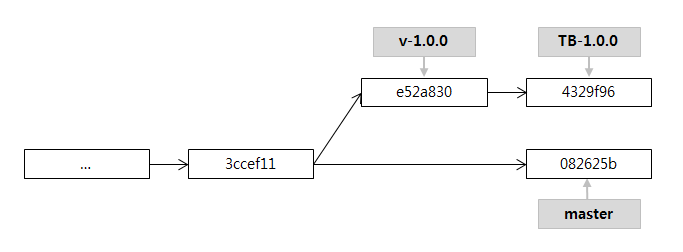
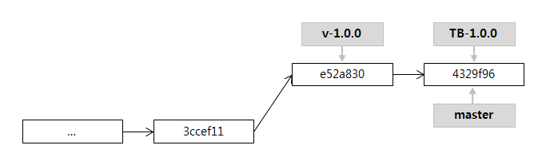
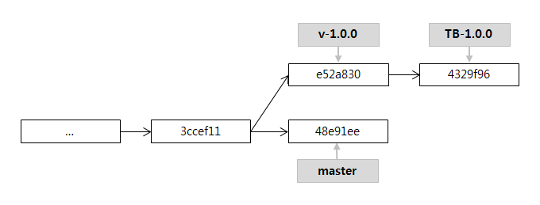
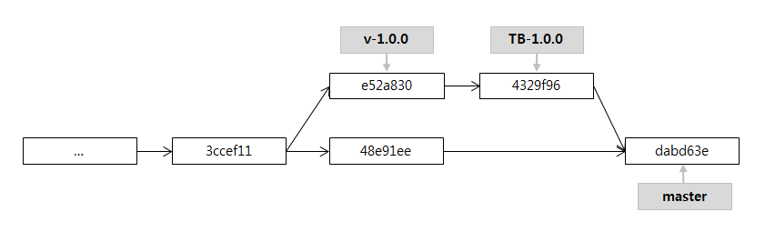
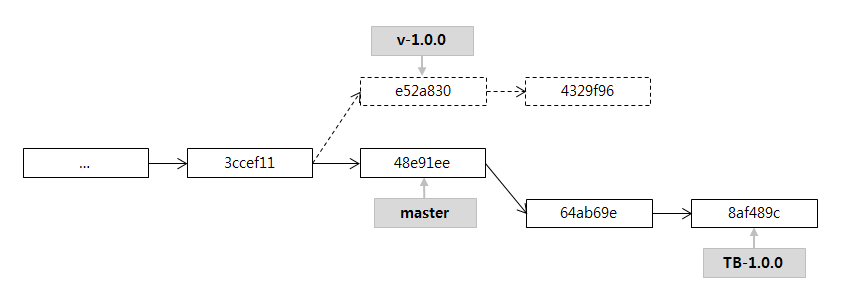
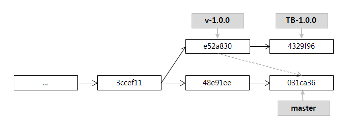

# git merge
 
작업 중인 브랜치에서 메인 브랜치(master)에 병합(merge)할 때 사용하는 git 명령어이다.
merge 이외에 비슷하지만 기능이 다소 다른 것들을 정리해 보았다.

## merge

remote에 변경 사항을 local에 반영할 때, git fetch 후 git merge로 병합한다.
- pull fetch와 merge를 순차적으로 수행하는 명령어.
- remote와 local의 이력 차이를 명확히 아는 경우에만 사용해야 한다
- `fetch`로 이력파악 후 `merge`하는 것을 추천.

## squash

변경사항만을 병합할 때 사용하며, 이력을 복잡하게 하지 않게하거나 다수의 commit을 하나로 합칠 때 유용하다.

- 변경 사항이 바로 commit 되는 것이 아니고, `staging area`로 등록
- BLOB 파일은 만들지만, commit 객체를 만들지는 않음.
- 위 사진은 `e52a830`과 `4329f96`의 commit을 합친 결과(`082625b`).
- 동일한 변경내역을 반영하였지만, 두 브랜치의 이력은 분리된다

## fast-forward

git merge 시, merge 대상 commit이 현재 branch의 끝에서 부터 나온 것이라면 `fast-forward merge`가 진행된다.
병합이라기보단 정렬에 가깝다고 볼 수 있으며, master branch가 가리키는 대상만이 변경된다.

## recursive

만약 위와 같이 master에서도 변경 사항이 있다면 fast-forward merge가 불가능할 때, 사용되는 병합 방법이다.

- 3방향 병합(3-way merge) 알고리즘을 기반으로 2개 branch의 마지막 commit을 병합.
  - 두 branch의 공통 부모 (3ccef11)을 기준, 각 branch의 마지막 commit의 변경 사항 비교 후 병합.

병합 결과 생성된 `dabd63e`의 부모 브랜치는 2개가 된다. (4329f96, 48e91ee).
`fast-forward` 가능 상태라도 `--no-ff` 옵션을 통해 병합이 가능하긴 하며, 두개가 아닌 더 많은 수의 브랜치를 병합하는 경우 octopus 전략이 사용된다.
하지만, `recursive`는 언제든지 `conflict`가 발생할 수 있다는 사실을 인지해야한다.

## rebase

`squash`와 같이 이력을 정리하는 또다른 방법이다. 현재 브랜치의 커밋들을 대상이 되는 branch 기준으로 재작성되며,
`commit id`는 변경되지만, 내용을 모두 그대로 유지한다.

## cherry-pick

브랜치 전체가 아닌 특정 커밋만을 병합하는 것으로, 하나의 커밋만을 `rebase`하는 것으로 볼 수 있다.