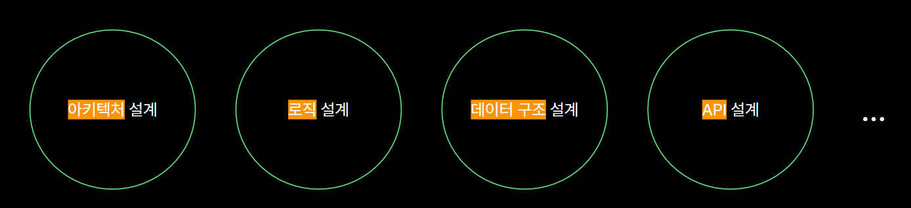

# 나와 팀을 성장시키는 리뷰들

## 개발자의 일과 리뷰?

코드 리뷰하는 이유

- 내가 하는 일이 우리의 목표를 향해 `올바른 방향`으로 가고있는지 확인하기 위해
- 개발자가 일하는 과정 중, 문제를 빨리 발견할 수록 고생을 덜한다
- 즉, 우리는 각 단계마다 필요한 리뷰가 존재한다!

## 요구사항(문제) 분석 단계의 리뷰

요구사항 분석의 핵심은 요구와 조건을 결정하기 위해 `문제를 명확히 정의하는 것`.

- 요구사항에 대한 리뷰를 하지 않으면, 기획자, 디자이너, 개발자 모두 결과물을 다르게 생각하게 된다.
- 효과
  - 개발 범위 축소
  - 우선순위가 높은 일에 집중
  - 유관부서와 신뢰 향상

### 사례 

- 사례에서는 발표자가 있었던 일에 대해 설명되었는데 마케터와 개발팀장의 요구사항 분석에 관한 리뷰가 예시가 되었다.
  - 문제는 마케터가 원하는 어떤 기능의 부재가 아닌, 마케터가 이미 개발된 기능에 대한 인지를 못하는 문제가 있었다.
  - 즉, 정확히 원하는 요구사항에 대해 정확히 정의함에 따라 필요한 부분이 무엇인지 정확하게 파악할 수 있다.

## 설계 단계의 리뷰

설계 리뷰를 하지않는다면 어떤 문제가 발생할까?

- 하지 않아도 되는 일, 하면 좋을일을 하다가 `필요한 일`을 하지 못함
  - 개발을 하다보면 설계시 기술에 집착하는 경우가 발생한다.
  - 그러다보니 서비스 관점에서는 굳이 하지않아도 되는 일을 하게될 수도 있다.
- 동료, 다른 시스템에 주는 영향도를 놓칠 수 있음
- 시스템의 복잡도가 올라가고, 팀의 설계 원칙을 어길 수 있다.
- 효과
  - 구축 범위 축소
  - 예측 가능한 일정
  - 우선 순위가 높은 일에 집중

### 뱅크샐러드 테크 스펙 템플릿
뱅크샐러드의 테크 스펙 템플릿에 대해 간단하게 소개, 설계 단계의 리뷰 예시

- 개발자가 기능을 개발할건지에 대한 요약
- 배경에 대한 설명
- 이 기능에서 해결하고자 하는 것과 해결하지 않아도 될 것
- 어떻게 해결할 건지에 대한 계획

즉, 설계 단계의 리뷰에서 확인해야될 점은 주어진 리소스를 고려하여, `개발 목적을 확실히`하는데 있는 것.
발표자 분의 사례 설명과 함께, 개발 목적보다 `구현 수단에 더 많은 리소스`가 들어가는 일이 없도록 해야된다고 하심. 

## 구현 단계의 리뷰

- 우리에게 가장 익숙한 `코드 리뷰`
- 동료와 함께 프로그래밍하는 `페어 프로그래밍`
- 목적
  - 코드의 논리적인 오류 발견
  - 다른 모듈, 도메인에 대한 부작용 발견
  - 코드 설계 개선
  - 지식 공유 및 토론

### 잘 되었던 사례

- 요구 사항을 온전히 반영했는지 확인
- 작성자 코드에 확장성, 응집도 등에 대한 설계 방향
- 다른 도메인, 모듈, 작업에 미칠 수 있는 부작용
- 기술 공유, 팀내 개발 규칙 및 문화 제안

코드 리뷰를 할 때 코드를 approve 하는 이유를 적어주는 것도 중요하다고 하다.
즉, 내가 이 코드를 승인하는 이유를 동료들에게 알리는 것도 코드 리뷰의 중요한 부분이라고 할 수 있다.

### 코드 리뷰를 정착 시키기 위한 방법

- 팀 전체 캘린더에 코드 리뷰 집중 시간 등록
- 작성자는 코드가 담고 있는 요구 사항, 이슈를 충분히 설명
- 문제 발생 시, `코드 리뷰에서 발견 가능한 문제였는지 반드시 회고`한다

### 경험이 없다면 코드리뷰가 의미가 없을까?

- 경험이 많은 사람만 좋은 리뷰를 할 수 있는 건 아님
- `지금보다 더 나은 방향으로 고민하고 제시하는 의견`이 중요한 것
- 작성자의 코드 `작성 의도`를 궁금해하는 것 또한 좋은 리뷰
- 지식을 공유하고 서로의 성장을 위한 방향으로 리뷰를 시작할 수 있다

구글엔지니어는 이렇게 일한다의 코드리뷰 부분을 읽어보고 논의하는 것도 좋다.

## 테스트 단계의 리뷰

- 시스템이 정해진 요구를 만족하는가
- 예상과 실제가 어떤 차이를 보이는가
- 테스트 종류
  - 단위 테스트: 특정 모듈이 의도한 대로 작동하는가
  - 통합 테스트: 소프트웨어를 결합해 가며 시험
  - 인수 테스트: 실제 운영 환경에서 사용될 준비가 되어있는지 최종 확인

테스트 자체가 리뷰의 의미를 담고 있지만, 테스트를 수행했으면 리뷰가 끝났다고 말할 수 있을까?
발표자 분께서는 테스트 자체도 결함이 존재할 수 있음을 인지하고, 테스트 자체도 리뷰가 필요하다고 언급했다.

## 테스트 자체 리뷰

- 단위 테스트는 코드 리뷰 단계에서 `테스트 코드 자체를 리뷰`
- 통합/인수 테스트는 테스트 `시나리오를 리뷰`
  - 포스트맨 컬렉션 러너

## 배포 단계의 리뷰

배포는 최종 사용자에게 소프트웨어를 전달하는 과정.

- 배포 전 리뷰
  - 릴리즈 노트, 어떤 기능이 배포 될 예정인가
  - 언제 배포될 예정인가
  - CI/CD 파이프라인 자동화
    - 수작업을 자동화한다는 의미보단, 빈번하게 안정적으로 사용자에게 기능을 전달한다는 관점으로 본다
    - 따라서, 파이프라인을 개선할 때도 리뷰가 필요
- 배포 후 리뷰
  - 배포한 기능이 제대로 쓰이는가
  - 성능 문제가 없을까

## 장애 발생 단계의 리뷰

- 후속 조치에서 다루는 것
  - 근본적인 원인
    - 원인을 밝혀내고 모두의 합의를 얻는것
    - 누가에 대해서는 다루지 않는다!!
  - 재발 방지 대책 수립
    - 어떤 액션을 취할 것인가
    - 코드 리뷰 단계에서 예방할 수 있었을까

## Reference

- 나와 팀을 성장시키는 리뷰들 : 코드리뷰만 리뷰가 아니라니까?
- MUSINSA 박미정
