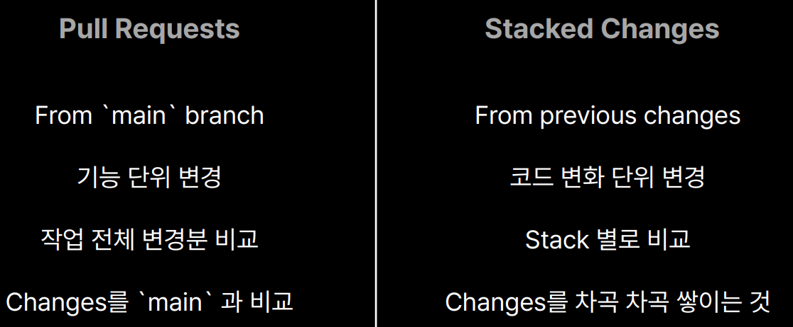
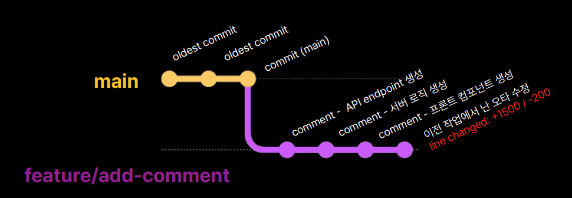
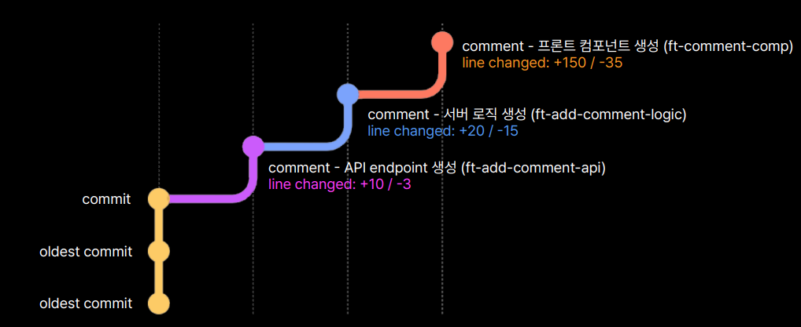
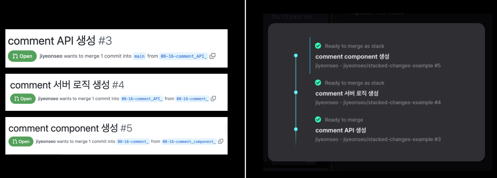
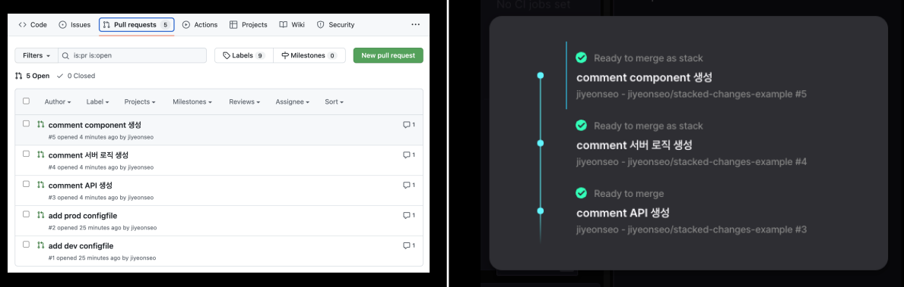
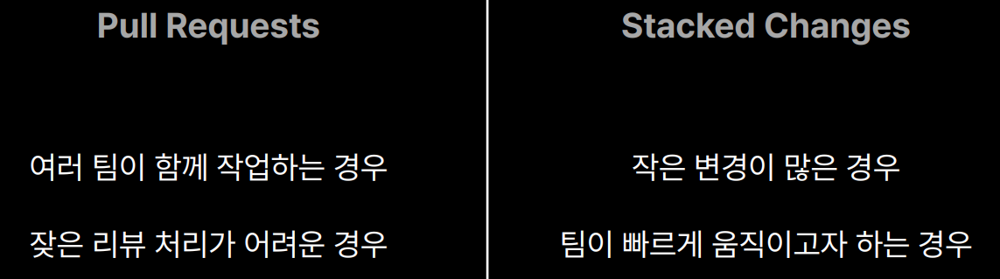

# Pull Request vs Stack Changes

이 컨텐츠에서는 기존 Github 에서 자주 진행하던 `Pull Request` 이외에 `Stack Changes`라는 방법을 통한
코드 리뷰 방법을 제시하고 있었다. 이 컨퍼런스를 들으며 내용을 정리하고 개인적인 사견과 함께 내용을 정리해 보았다.

- 좋은 코드리뷰의 경험 
   - 적은 또는 적당한 크기의 코드 변경
   - 코드 작업 명확성
   - 빠른 리뷰 속도

우리는 코드 리뷰를 통해서 서로의 코드에서 잘못된 점을 수정하거나, 보다 나은 방향으로 코드를 만들기 위한 고민을 할 수 있다.
하지만, 코드 리뷰를 도입하고 이를 제대로 수행하는 경우도 있지만 유명무실하게 코드리뷰가 진행되는 경험 또한 존재한다.
왜 그럴까?

##  Pull Request 의 단점 또는 아쉬운점

개발자 별로 커밋하는 주기가 다르고 커밋량도 다르다. 여기서 말하는 커밋 주기와 커밋량은 개발자마다 하나의 커밋을 작업 단위로 나누는 기준이 다르다는 것이다.
어떤 개발자는 할당받은 업무의 전체적인 작업을 모두 끝마치고 커밋을 하는 반면, 다른 개발자는 특정한 기능이 개발되거나 현재까지
지금까지 개발된 내용의 변화가 없을 무렵 커밋하는 경우도 있다. 심지어 기능하나를 개발할 때마다 커밋을 할 수도 있다.  
하지만, 가장 근본적인 문제는 커밋을 했다고 항상 Pull Request 를 하는 것이 아닌, 어떤 작업이 완료되었을 때야 비로소 Pull Request 를 
올리게 된다는 점이다. 이렇게 개발된 코드들은 기능에 따라 코드량이 기하급수적으로 늘어나고, 따라서 코드 리뷰를 해야할 내용 또한 많아지게 되는 문제가 발생한다.

- 결과적으로 코드 리뷰하기에 매우 부담되는 상황이 발생하고
- 코드 리뷰 속도가 느려지며
- 리뷰 속도가 느려짐에 따라 다른 작업과 충돌 가능성도 높아짐

## Stacked Changes 관점 코드 리뷰

`Stacked Changes` 관점에서 커밋은 말그대로 stack 이라고 한다. 즉, 커밋에 따른 코드가 차곡 차곡 쌓이고 다음에 커밋되는
코드는 이전 코드에 영향을 끼치지 않는다는 것이다. 사실 여기까지만 보면 Pull Request 의 커밋과 크게 다른점이 없어보였다.
하지만, 최종적으로 Stack Changes 를 통해 Submit(PullRequest)를 하게되면, 커밋 단위로 풀리퀘스트가 생성되는 식으로 표현되었다.
여기까지만 생각하면 말그대로 커밋할때마다 풀리퀘스트 날리는 것과 큰 차이가 없어 보이지만 컨퍼런스에서 언급하는 `Graphite` 라는 툴의
Dashboard 를 보면 하나의 일관된 흐름으로서의 풀리퀘스트를 볼 수 있다는 장점이 있었다.

Stack Changes 를 통해 
- 작업 결과 공유 뿐만 아니라 작업자의 의식 또는 작업의 흐름을 파악할 수 있다는 점이 인상깊었다.
  - 물론 GitHub 에서의 Pull Request 를 보면 왼쪽의 사진처럼 나타나겠지만, Graphite Dashboard 를 이용하면, 
  개발자가 어떤 작업의 흐름으로 결과까지 올 수 있었는지를 파악하기 좋아보였다.
- 또한 개별 코드 리뷰수가 감소
- 코드 리뷰에 대한 작업이 명확
- 따라서 빠른 코드 리뷰가 가능

## 결론

코드 리뷰는 그 자체로도 좋은 개발을 위한 방법이며, Pull Request 와 Stacked Changes 모두 좋은 수단이다.
이 두가지 방법은 각자의 상황에 따라 적용 여부를 판단해야한다.

## 회고

우선 별도의 다른 팀없이 소규모 백엔드 팀만 운영 중인 상황에서 굉장히 효율적인 방법이라는 생각이 들었다.
앞서 언급했지만, 개발자마다 커밋 속도나 규모가 다르기 때문에 간혹 많은량의 코드 리뷰가 올라오면 부담인 상황이 존재하기 때문이다.
그래서 자주 커밋하고 풀리퀘스트를 하자는 식으로 서로간의 협의는 해두었지만, 막상 작업을 하다보면 이를 잊기 쉽다.
특히 나처럼 커밋은 자주하지만, 풀리퀘스트는 모든 기능이 완료 되었을 때 올리는 경우에 더 도움이 될 것 같으며 조만간 개발자들간의 얘기를 통해 도입해봐도 좋을 것 같다.

## Reference

- 코드 리뷰의 또 다른 접근 방법 : Pull Request vs Stack Changes 
- 컨텍스츠아이오 서지연

