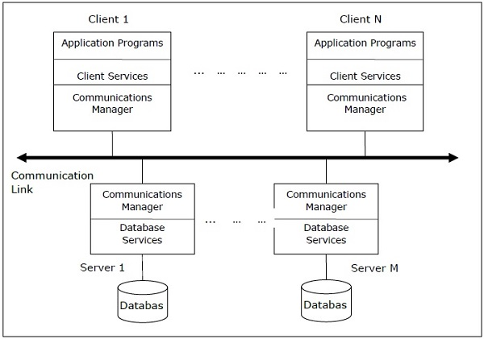
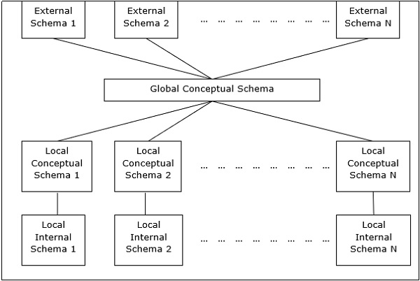
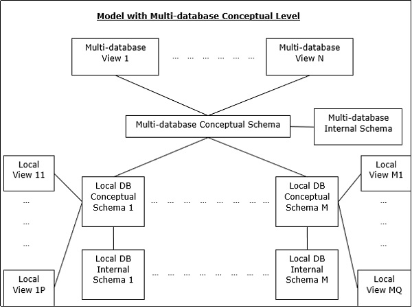
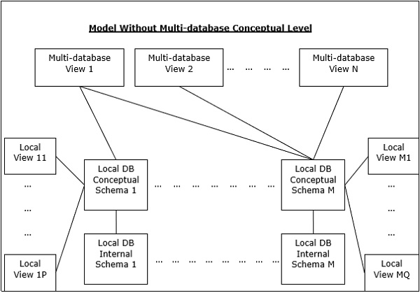
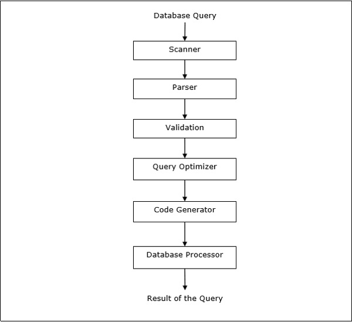
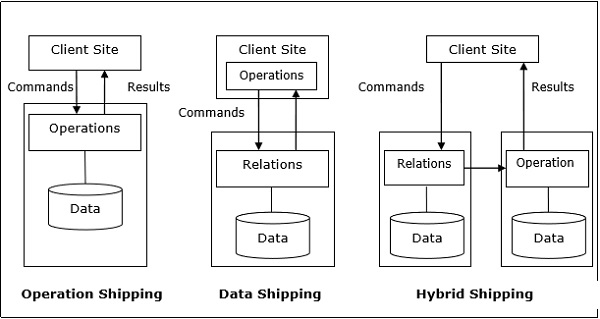

# Distributed Database

### Feature
- 컬랙션 내의 database는 논리적으로 상호 연결되어 있음. 종종 단일 논리 DB를 나타내기도 함.
- 데이터는 물리적으로 여러 곳에 저장되어 있으며, 각 site의 데이터는 다른 곳과 독립적인 DBMS로 관리할 수도 있음.
- 각 사이트의 프로세서는 네트워크로 연결되며, 다중 프로세서 구성은 없음.
- 분산 데이터베이스는 느슨하게 연결된 파일시스템이 아님.
- 트랜잭션 처리를 통합하지만, 트랜잭션 처리 시스템과 동일하지 않음.  

## Type of Distributed Database

### Homogeneous

- 모든 site가 동일한 또는 비슷한 OS와 DBMS를 사용.
- 각 site는 다른 모든 site를 인식하고 협력하여 사용자 요청을 처리.
- Database는 단일 database인 것처럼, 단일 인터페이스를 통해 액세스
- 세부 분류로는
  -  Autonomous: 각 Database가 자제적으로 작동하는 독립된 Database. 제어 어플리케이션에 의해 통합되고, 메시지 전달을 사용해 업데이트를 공유.
  - Non-autonomous: Data가 homogeneous 노드에 분산되고 중심이 되는 마스터 DBMS는 사이트 전체의 data 업데이트를 조정.  
  
### Heterogeneous
- 각 site들이 다른 OS와 DBMS 그리고 data model을 가지고 있음.
- 일치되지 않는 schema 때문에 쿼리 프로세싱이 복잡.
- 일치되지 않는 소프트웨어 등에 따라 트랜잭션 프로세싱이 복잡.
- 다른 site들에 대해 인지하지 못할 수도 있기 때문에 유저 요청에 대한 제한적인 협력이 가능.
- 세부 분류로는
  - Federated: 본질적으로는 독립되었으나 통합되어 하나의 Datase 시스템으로 동작.
  - Un-federated: Database 시스템이 중앙 조정 모듈을 통해 Database들에 접속.

---

## Distributed Database Manager System

### Feature

- Distributed database 에 대한 create, retrieve, update, delete 수행.
- 주기적으로 database 를 동기화하고 접근 방법을 제공하여 분산환경의 투명성을 사용자들에게 제공.
- 한 곳에서의 수정이 다른 분산 데이터에 전체적으로 업데이트 됨을 보장.
- 대용량의 데이터를 처리하는 곳에서 사용되며, 다수의 사용자가 동시에 접근.
- Database 의 무결성과 기밀성을 유지.

### Pros

- Modular development
- More Reliable
- Better Response
- Lower Communication Cost

### Cons

- Need for complex and expensive software: 구축 및 관리에 비용 소요.
- Processing overhead: 간단한 작업에도 여러 site를 경유하는 다수의 커뮤니케이션 및 추가적인 계산이 필요할 수 있음.
- Data integrity: 여러 사이트에서 data를 업데이트하기 때문에, 데이터 무결성이 필요.
- Overheads for improper data distribution: 쿼리의 응답성이 데이터 분산에 의존적임. 적절치 못한 데이터 분산은 응답이 매우 느려짐.

## Distributed Database Manager System Architecture

DDBMS architecture는 세가지 파라미터에 의존적으로 개발
- Distribution: 여러 site에 걸친 data의 물리적인 분산을 나타냄
- Autonomy: Database 시스템의 제어 분산과 독립적으로 DBMS를 운영할 수 있는 정도를 나타냄.
- Heterogeneity: 데이터 모델, 시스템 구성 요소, DB의 uniformity 또는 dissimilarity를 나타냄.  

## Common Architecture models

### Client-Server Architecture for DDBMS

- 기능적으로 server와 client로 구분된 2단계 architecture.
- Server는 주로 데이터 관리, 쿼리 프로세싱, 최적화 및 트랜잭션 관리.
- Client는 주로 사용자 인터페이스를 포함하고 일관성 검사 및 트랜잭션 관리.
- Single server multi client와 multi server multi client로 세분화 될 수 있음.  

### Peer to Peer Architecture for DDBMS

- 각각의 peer들은 database 서비스를 전달하기 위해 server, client를 겸업.
- Peer간의 리소스를 다른 peer들과 공유하고 협력하여 행동을 처리.
- 주요 스키마 4단계 존재
  - Global Conceptual Schema: 데이터를 global logical view로 나타내는 schema.
  - Local Conceptual Schema: 각 site(local)의 논리적인 데이터 구조를 나타는 schema.
  - Local Internal Schema: 각 사이트의 실제 데이터 구조를 나타내는 schema.
  - External Schema: 데이터 사용자의 view를 나타내는 schema.

### Multi DBMS Architecture

두개 혹은 그 이상의 autonomous database system의 컬렌션으로 구성된 통합 database system.
주요 스키마가 6단계가 존재한다.

- Multi-database View Level: 통합된 분산 database의 하위 집합으로 구성된 여러 유저 view.
- Multi-database Conceptual Level: global logical multi-database 구조 정의로 구성된 통합된 multi-database
- Multi-database Internal Level: 다른 site와 multi database에서 로컬 데이터 매핑으로의 데이터 분산.
- Local database View Level: 로컬 데이터의 public view.
- Local database Conceptual Level: 각 site에서의 로컬 데이터 구조.
- Local database Internal Level: 각 site에서의 물리적 데이터 구조.

--- 

## Design Strategy

## Data Replication

- Database의 복사본을 둘 혹은 그 이상에 저장하는 과정.
- Distributed database system에서 많이 쓰이는 fault tolerance 기법.
- 즉, 장애가 발생하더라도 시스템을 유지시키기위해 필요한 기법.

### Pros

- Reliability: 다른 site에 copy가 존재하기에 한 site에서 fail이 발생해도 database system은 문제없이 동작.
- Reduction in Network Load: Local copy를 이용하여 쿼리 프로세싱이 가능하기에 네트워크 사용량 감소.
- Quicker Response: 데이터의 local copy를 사용할 수 있기에 빠른 쿼리 프로세싱과 결과적으로 빠른 응답을 보장.
- Simpler Transaction: 서로 다른 site에 있는 테이블 조인에 대한 트랜잭션이 줄어들고 네트워크의 최소한의 조정만 필요.

### Cons

- Increased Storage Requirements: 다수의 data copy는 스토리지 코스트 증가. 중앙 집중형에 비해 copy의 배수로 필요량이 늘어남.
- Increased Cost and Complexity of Data Updating: Data가 업데이트 될 때마다, 모든 copy에 수정 사항을 반영해야 됨. 이것은 복잡한 동기화 기술과 프로토콜이 필요.
- Undesirable Application- Data Coupling: 업데이트 메커니즘이 사용되지 않는다면, 어플리케이션 부분에서 data 불일치를 제거하기위한 조정이 필요. 그 결과 적절치 않은 어플리케이션이 만들어지고 data coupling이 일어남.

## Fragmentation

- Fragmentation은 기존의 테이블을 더 작은 테이블의 set으로 나누는 작업. 즉, 테이블의 하위 집합을 fragment라고 함.
- Horizontal, vertical, hybrid 세가지 종류의 타입이 있음.
- Fragmentation은 fragment 상태에서 원본 테이블 상태로 재구성될 수 있도록 수행되어야 함. 필요할 때 마다 재구성할 수 있도록 하기위해 필요. 이런 요청을 re-constructiveness라고 함

### Pros

- Data가 사용되는 site 근처에 저장되기 때문에 database system의 효율성이 향상.
- Data를 로컬에서 사용가능하기에 로컬 쿼리 최적화가 대부분의 쿼리에 충분.
- Site에 관련 없는 데이터를 사용하지 않으므로 시스템의 보안 및 개인 정보 유지 가능.

### Cons

- 재귀적인 fragmentation의 경우, 재구성 작업이 난이도 높은 작업이 필요.
- 다른 site의 백업 복사본이 없다면, 장애가 발생할 경우 database를 비효율적으로 만들 수 있음.

---

## Distribution Transparency
Distribution database의 속성으로 내부 세부정보를 사용자에게 보이지않게 하는 것이다. 
디자인 시, 테이블을 fragmentation하고 다른 site에 저장할 수 있으나 세부 사항은 감춰져 있기 때문에, 중앙 집중식 database처럼 사용하기는 쉬움.

## Location Transparency
- 사용자가 테이블 또는 테이블의 fragment에서 쿼리 작업을 할 때, 마치 로컬에 저장되어 있게끔 한다.
- 실상 데이터는 distributed database system의 다른 site에 존재하지만, end-user는 이를 완전히 잊고 사용할 수 있다.
- Remote site의 주소와 접근 메커니즘이 숨겨져 있음.
- Location transparency를 통합하기 기본 조건은, DDBMS가 update 된다면 data dictionary와 데이터의 위치에 대한 detail을 포함하는 DDBMS directory에 대한 접근할 수 있어야 함.

## Fragment Transparency
- Fragmentation transparency는 사용자가 fragment 되지 않은 것처럼 테이블을 쿼리할 수 있게 해주는 것이다.
- 유저가 쿼리하고 있는 테이블이 사실 fragment 이거나 여러 fragment의 집합이라는 것과 다른 위치에 있다는 것을 숨긴다.
- SQL의 view와 비슷한 개념이며, 사용자가 테이블 자체 대신 테이블의 view를 사용하고 있다는 것을 모르는 것과 같이 비슷한 개념이다.

## Replication Transparency
- Replication transparency는 database의 복사본이 유저에게 감추는 것을 보장하는 것이다.
- Concurrency transparency와 failure transparency와 관련이 있다.
  - Concurrency transparency: 유저가 언제든 데이터를 업데이트 하면, 이 업데이트는 테이블의 모든 복사본에 반영되지만, 이 작업이 유저에겐 공개되지 않는 것이다. 
  - Failure transparency: 특정 사이트에서 실패한 경우에도 유저는 실패된 상황을 알지 못해도 쿼리를 진행할 수 있는 것이다.

---

## Query Optimization

- Distributed system에서는 쿼리 실행을 위한 실행전략을 찾는 것이 optimization 목표이다.  
- 보통 쿼리 수행의 시간은 다음의 합으로 도출.
  - 쿼리와 database 간 통신에 걸리는 시간.
  - Local query fragment의 수행 시간.
  - 다른 site로부터 받은 data를 merge하는 시간.
  - 사용자에게 결과를 보여주는 시간.  

### Relational Algebra
- Relational algebra는 관계형 database model의 기본 연산의 집합으로 정의한다.
- 일련의 relational algebra operation은 relational algebra expression을 만들어 낸다.
- 이 expression의 결과가 database query의 결과를 나타낸다.
- 기본적인 연산들은 다음과 같다.
  - Projection: 테이블내 필드의 하위집합을 나타냄. 이것은 테이블의 수직분할을 표현한다고 볼 수 있음.  
Syntax -> {<{Attribute List}>}{<{Table Name}>}, ex. {Name, Age}{STUDENT}
  - Selection: 테이블 내 tuple의 하위집합을 나타낸다. 테이블의 수평분할을 표현한다고 볼 수 있다.  
Syntax -> {<{Condition}>}{<{Table Name}>}
  - Union: 합집합
  - Intersection: 교집합
  - Join: join은 두개의 서로 다른 테이블의 쿼리 결과를 하나의 테이블로 결합.

### SQL query to Relational Algebra

- SQL query는 optimization전에 relational algebra로 번역된다.
- 우선 쿼리문이 보다 작은 쿼리 블럭으로 분리된다.
- 이 블록들은 같은 의미를 나타내는 relational algebra로 번역된다.
- Optimization에는 각 블록에 대한 최적화 + 쿼리 전체에 대한 최적화가 포함된다.

### Computation of Relational Algebra Operations

- Relational algebra 연산자들의 계산은 여러가지 방법으로 진행할 수 있으며, 각각의 대안을 access path라고 한다.  
- 연산을 결정하는 주요 요인 세가지는
  - Operator type
  - Available memory
  - Disk Structure
- Relational algebra 연산의 수행 시간은 다음의 합과 같다.
  - tuple들에 대한 수행 시간
  - 디스크에서 메모리로 테이블의 tuple을 가져오는 시간
- 특히 분산처리 시스템에서는 tuple을 처리하는 시간보다 tuple을 가져오는 시간이 크기 때문에, disk access는 비용을 계산하는 척도로 간주된다.

---

## Query Optimization in Distributed System

### Mapping Global Queries into Local Queries

- 전역적인 쿼리 수행을 위한 테이블들은 분산되어 여러 site에 저장되어 있으며, local database에는 local data에 대한 정보만을 가지고 있다.
- 따라서 controlling site에서는 global data에 대한 dictionary를 이용하여 분산에 대한 정보를 수집하고 fragment에 대한 global view를 재구성해야 한다.
- Replication이 없는 경우, optimizer는 fragment가 저장된 site에서 local query로 수행한다.
- Replication이 있는 경우, global optimizer가 communication cost, workload, server speed를 기반으로 최적의 site를 선정하여 수행한다.
- Global optimizer는 distribute site들에 대한 최소한의 데이터 전송을 토대로 execution plan을 생성해야 한다.  
- Execution plan은 다음 요소를 명시해야 한다.
  - fragment의 위치
  - 실행되는 쿼리의 순서
  - 중간 결과 전송과 관련된 프로세스
- Local query는 local database에 의해 최적화하며, 최종적으로 local query의 결과는 horizontal fragment의 경우 union, vertical fragment의 경우 join으로 합쳐진다.

### Distributed Query Optimization

- 분산 쿼리 최적화는 필요한 쿼리 결과를 생성하는 많은 수의 쿼리 트리를 평가해야 한다.
- 주된 원인으로는 많은 수의 fragments data와 replicate data 때문이다.
- 분산 쿼리 최적화의 주된 이슈로는 분산 시스템 내 자원 활용법, 쿼리 트레이딩, 쿼리의 솔루션 공간 감소이다.

### Optimal Utilization of Resources in the Distribution System

- 분산 시스템은 쿼리를 처리하기 위해 다양한 site에 다수의 database들이 존재한다.
- 최적 리소스 활용을 위한 접근법은 다음과 같다
  - Operation Shipping: 작업이 client에서 하는 것이 아닌, 데이터를 가진 쪽에서 하는 것, 그리고 그 결과가 client site로 전송된다. Select와 project와 같은 동일한 site에서 연산자를 사용할 수 있을 때 적합하다.
  - Data Shipping: Data fragment가 연산을 수행하는 client로 전송되는 것을 의미한다. 이것은 연산자가 다른 site에 존재하는 경우 유용하며, 또한 통신 비용이 낮고 local processor가 client 보다 느린 시스템에도 적합하다.
  - Hybrid Shipping: 두개의 조합. 보통 processor power가 높은 쪽에 data를 전달하여 연산을 처리하고 이를 client에 보내준다.

### Reduction of Solution Space of the Query

- 최적화 솔루션은 쿼리 비용과 데이터 전송을 줄이기 위해 솔루션 공간을 줄이는 것과 관련이 있다.
- 중앙집중 시스템의 heuristic과 마찬가지로 heuristic rule을 통해 실현 가능하다.
  - Selection과 projection 연산은 가능한 빨리 수행하여 과도한 네트워크 교환과 같은 데이터 흐름을 감소시킬 수 있다.
  - 특정 site와 관련이 없는 selection condition을 제거하여 horizontal fragment에 대한 단순화를 수행한다.
  - 여러 site에 위치한 fragment들에 대하여 join 및 union 작업을 진행 시, 가장 많은 데이터를 가진 곳에 데이터를 전송하여 작업을 수행한다.
  - Semi join 작업을 이용하여 join할 tuple에 대한 한정시킴으로써, 데이터 전송량을 줄여서 통신 비용을 줄일 수 있다.
  - 분산 쿼리 트리에서 일반적인 leaves와 하위 트리를 병합한다.

