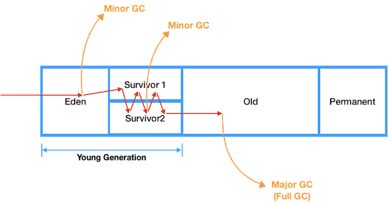
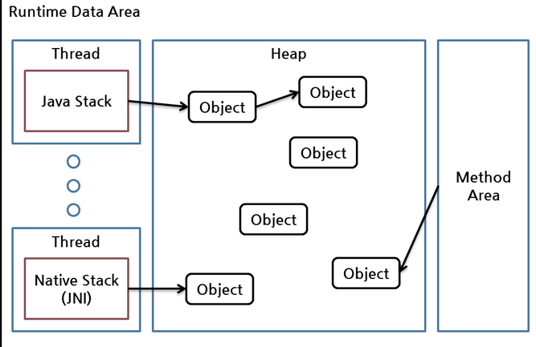
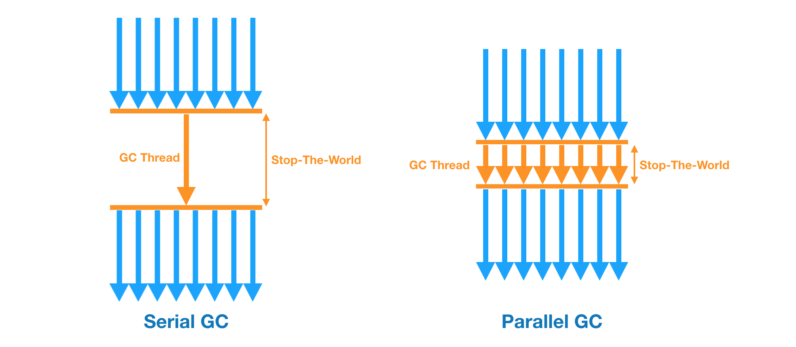
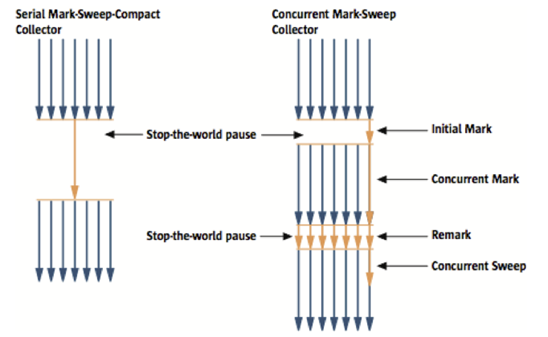

# Garbage Collection

## Intro

`Garbage Collection`은 JVM 상에서 더 이상 사용하지 않는 데이터에 할당된 메모리를 해제시켜주는 장치이다.
기본적으로 자동을 동작하며, `Heap`영역 내 객체 중 참조되지 않는 데이터가 대상이 된다.
가비지 컬렉션은 `weak generational hypothesis`이라는 전제 하에 만들어졌다

```text
Weak Generational Hypothesis

- 대부분의 객체는 빠르게 접근 불가 상태(unreachable)또는 미사용(unused)가 된다
- 오래된 객체에서 새로운 객체로의 참조는 아주 적게 존재한다
```
위 전제를 바탕으로 heap은 두개의 물리적 공간으로 나뉘는데 JVM에서 간단히 설명한 `Young`과 `Old` 영역이다.

## Heap Detail(Minor and Major GC)

<p align="center"></p>

Young Generation
- 새롭게 생성된 객체가 할당(Allocation)되는 영역
- `weak generational hypothesis` 전제와 같이, 대부분의 객체는 Young 영역에 생성되었다가 사라진다
- Eden, Survival 0,1(s0, s1) 
  - 새롭게 생긴 객체들이 할당되는 위치가 Eden이며, 이 영역이 가득차면 `Minor Garbage Collection(Minor GC)`가 발생한다
  - unreachable 객체들은 메모리에서 해제되고, reachable 객체들은 Survival 영역 중 하나로 이동
  - 기존 s0에 있던 객체 중 reachable 객체는 s1으로 이동.
  - s1이 가득차게 되면 다시 s0으로 reachable 객체가 이동하며 계속 생존하는 객체는 `Old Generation`으로 이동.
- 핵심은 Eden 영역에 최초로 객체가 만들어지고, Survivor 영역을 통해서 Old 영역으로 오래 살아남은 객체가 이동한다는 사실

Old Generation
- `Young Generation`에서 넘어온 reachable 객체들이 저장되며, 대부분 생명 주기가 긴 객체들이 저장된다
- `Young Generation`보다 큰 크기로 할당되기에 GC시간이 오래걸리며, 따라서 자주 발생하지 않는다
- 여기서 발생하는 GC는 `Major GC`


### Reachable and Unreachable

<p align="center"></p>

- Reachable
  - Heap 영역 내부의 객체를 Method Area, Stack, Native Stack 에서 참조되면 reachable 로 판정
  - reachable 로 인식되게 만들어주는 JVM Runtime Area 들을 root set
  - reachable이 참조하고 있는 대상 역시 reachable
- Unreachable
  - root set에 의해 참조되지 않는 대상
  - Garbage Collection의 대상

### Young and Old Generation의 이점

1. 두 Generation의 크기는 `Young < Old`이다. 따라서 이를 물리적으로 분리하고, 적은 크기를 가진 `Young Generation`을
주기적으로 GC하는 것이 `stop-the-world`로 인해 어플리케이션이 중지되는 시간이 짧고 성능상 이점이 존재한다.
2. `Young Generation`은 영역 전체를 GC 하기 때문에 해당 부분은 연속된 여유 공간에 할당된다. 따라서 메모리 파편화를 방지할 수 있다

```text
Stop-The-World(STW)

GC과정을 통해 JVM은 여유 메모리를 확보할 수 있다.
하지만 GC가 발생하면, GC를 실행하는 쓰레드를 제외한 모든 쓰레드가 작업을 멈추게되는데 이게 stop-the-world이다.
따라서, 빈번한 GC는 성능을 저하시키기에 적절한 빈도의 GC가 실행되도록하는 것이 중요하다
```

## Garbage Collection 방식


<p align="center"></p>

### Serial GC

이름 그대로 순차적으로 Minor GC, Major GC 모두 순차적으로 진행하며, 서버용으로는 절대 사용하면 안되고 메모리와 CPU 코어가 적은 경우 사용

- Young Generation: generation algorithm
- Old Generation: mark compact algorithm

### Parallel GC

Serial GC와 동일하지만, Young Generation이 병렬로 동작한다

- Young Generation: generation algorithm (parallel)
- Old Generation: mark compact algorithm

### Concurrent Mark Sweep GC (CMS GC)

<p align="center"></p>

CG에서 발생하는 STW(stop-the-world)를 최소화하기 위한 방식

- 작업 순서
  - Initial Mark
    - 클래스 로더에서 가장 가까운 객체 중 reachable 확인
  - Concurrent Mark
    - Initial Mark에서 확인된 객체에서 참조하는 객체들을 탐색
    - STW없이 다른 쓰레드와 동시에 진행
  - Remark
    - Concrruent 단계에서 추가되거나 삭제된 객체 확인
  - Concurrent Sweep
    - unreachable 정리
    - STW없이 다른 쓰레드와 동시에 진행
- Parallel GC와는 `Compactaion` 작업 여부의 차이가 존재
  - Parallel GC는 이 단계를 통해 메모리 할당 공간 사이에 빈 공간을 제거하여 메모리 단편화 현상을 제거
  - CMS GC는 이 단계가 기본적으로 제공되지 않고 따라서 메모리 사용량이 높고 메모리 단편화 현상이 발생할 수 있다
  - 메모리 단편화 발생 시 Serial GC 방식을 통한 Full GC가 진행된다
- Young Generation: parallel copy algorithm
- Old Generation : Concurrent mark and sweep algorithm

### Garbage First GC (G1 GC)

<p align="center"></p>

기존 GC알고리즘은 큰 메모리에서 짧은 STW를 갖기 어렵다는 문제에 초점을 맞춰 등장한 GC 기법이다.

- 앞선 GC와는 달리 Heap 공간을 `Region`으로 나누고 유동적으로 Eden, Survivor, Old로 사용된다
- Humongous region
  - 객체의 크기가 큰 경우 사용되는 영역
  - 객체가 region의 크기의 50% 이상인 경우이 영역에 할당된다
  - GC 동작이 최적으로 동작하지 않음
- `Young Generation`은 parallel 이나 CMS와 같이 멀티쓰레드로 정리 (STW 발생)
- 여러 `Old Generation`에서는 CMS처럼 백그라운드 쓰레드로 region을 탐색하고 가장 많이 비어있는 영역부터 회수를 진행
- G1에 의해 교체되는 공간은 evacuation(배출)에 의해서 GC 동작
  - 멀티 프로세스를 사용하기에 STW가 줄고 reachable 객체를 다른 old 영역으로 옮기고 해당 영역은 삭제
  - 다른 영역으로 이동하는 과정에서 compacting을 통해 메모리 단편화 방지

## 간단 정리

`Garbage collection`은 사용하지 않는 데이터에 대한 메모리를 해제시켜주는 작업으로 자바에서는 `Heap`영역을 대상으로 진행된다.
`Heap`내에는 Eden, Survivor, Old 영역이 존재하며 Eden과 Survivor에서는 `Minor GC`가 Old 영역에서는 `Major GC`가 동작한다


## Reference

- https://d2.naver.com/helloworld/1329
- https://code-factory.tistory.com/48
- https://mangkyu.tistory.com/118
- https://tecoble.techcourse.co.kr/post/2021-08-30-jvm-gc/
- https://mirinae312.github.io/develop/2018/06/04/jvm_gc.html
- https://docs.oracle.com/javase/8/docs/technotes/guides/vm/gctuning/generations.html