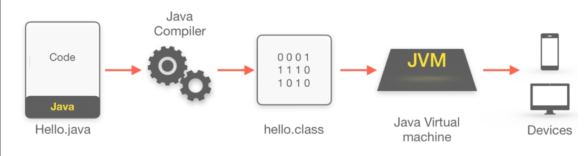
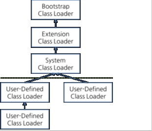

# Java Virtual Machine (JVM)

## Intro

`A Java virtual machine (JVM) is a virtual machine that enables a computer to run Java programs`

JVM은 컴퓨터가 java 프로그램을 실행 가능하도록하는 가상 머신이다.
즉, 하드웨어에 종속되지 않고 JVM 환경에서는 모든 자바 바이트코드를 실행할 수 있다.

여기서 자바 `바이트코드`란, java source code(`.java`)가 아닌, 자바 컴파일러(`javac`)를 통해 컴파일한
결과물(`.class`)을 말하며, JVM은 이 바이트코드를 실행하게 된다.

## 특징

- 스택 기반 가상머신
- 심볼릭 레퍼런스
  - 기본 자료형(int, float, double ...)을 제외한 모든 타입은 메모리 주소 기반 레퍼런스가 아닌 심볼릭 레퍼런스
  - C와 같이 주소 값을 임의로 조작이 가능한 포인터 연산이 불가능
- 기본 자료형에 대한 명확한 정의
  - c, c++은 컴파일러에 따라 자료형의 크기가 달라지지만, JVM은 이를 명확히하여 호환성 유지
- 가비지 컬렉션(Garbage Collection) 사용

## 구조

JVM은 크게 세 개의 구조로 이루어져 있다

1. Class Loader(클래스 로더)
2. Runtime Data Areas(런타임 데이터 영역)
3. Execution Engine(실행 엔진)

`클래스 로더`가 컴파일된 자바 바이트코드를 `런타임 데이터 영역`에 로드하고, `실행 엔진`이 자바 바이트코드를 실행한다.

### Class Loader

`JVM 내로 클래스 파일(*.class)을 로드하고, 링크를 통해 배치하는 작업을 수행하는 모듈`
런타임 시점(`Dynamic Load`), 즉 클래스의 인스턴스를 생성하거나 참조하면 클래스 로더를 통해 메모리에 로드하게된다.

#### 클래스 로더 단계

1. Loading
   - 클래스 파일을 가져와서 JVM의 메모리에 로드한다
2. Linking
   1. Verification
      - 로딩된 클래스가 자바 언어 명세 및 JVM 명세에 맞는지 검증한다
      - 클래스 로드 과정 중 가장 복잡하고 시간이 오래 걸림
   2. Preparation
      - 클래스가 필요로 하는 메모리를 할당하고, 메모리를 초기화한다.
   3. Resolution(optional)
      - 심볼릭 레퍼런스를 다이렉트 레퍼런스로 변경한다.
3. Initialization
   - 클래스 변수 값을 초기화한다.
   - static initializer들을 수행하고, static 필드들을 설정된 값으로 초기화한다.

#### 클래스 로더의 특징

- 계층 구조
  - 클래스 로더간 부모-자식 관계를 형성하는 계층구조를 가진다.
  - 최상위 클래스 로더는 `Bootstrap Class Loader`
- 위임 모델
  - 계층 구조를 바탕으로 클래스 로더간 클래스 로드를 위임하는 구조
  - 즉, 클래스를 로드할 때 상위 클래스 로더를 확인하여 클래스가 존재한다면 해당 클래스를 사용하고 없다면, 요청받은 클래스 로더가 클래스를 로드한다. 
- 가시성
  - 하위 클래스 로더는 상위 클래스 로더의 클래스를 찾을 수 있지만, 그 반대는 불가능
- 언로드 불가
  - 클래스를 로드할 수 있지만, 언로드는 불가
  - 단, 클래스 로더 자체를 삭제하고 새로운 클래스 로더를 생성하는 것은 가능

> 각 클래스 로더는 로드된 클래스들을 보관하는 네임스페이스(namespace)를 갖는다
> 클래스를 로드할 때 이미 로드된 클래스인지 확인하기 위해서 네임스페이스에 보관된 FQCN(Fully Qualified Class Name)을 기준으로 클래스를 찾는다.
> 비록 FQCN이 같더라도 네임스페이스가 다르면, 즉 다른 클래스 로더가 로드한 클래스이면 다른 클래스로 간주된다.

디폴트 클래스 로더에는 `Bootstrap Class Loader`, `Extension Class Loader`, `System Class Loader`가 있으며,
추가적으로 `User-Defined Class Loader`가이 존재한다
- Default Class Loader
  - BootStrap Class Loader
    - JVM을 기동할 때 생성되며, Object 클래스들을 비롯하여 자바 API들을 로드한다.
    - 다른 클래스 로더와 달리 자바가 아니라 네이티브 코드로 구현되어 있다.
  - Extension Class Loader
    - 기본 자바 API를 제외한 확장 클래스들을 로드
  - System Class Loader (Application Class Loader)
    - 어플리케이션 클래스들을 로드
    - 사용자가 지정한 $CLASSPATH 내의 클래스들을 로드
- User-Defined Class Loader
  - 애플리케이션 사용자가 직접 코드 상에서 생성해서 사용하는 클래스 로더
  - WAS같은 프레임 워크는 웹 어플리케이션을 독립적으로 동작하게 하기 위해 사용자 정의 클래스 로더를 사용한다

### Runtime Data Areas

런타임 데이터 영역은 JVM이 운영체제로부터 할당받은 메모리 영역이다.
개별 쓰레드마다 생성되는 영역과 모든 쓰레드가 공유하는 `Heap`과 `Method Area`에 생성되는 영역이 존재한다

#### in Thread

각 스레드마다 하나씩 존재하며, 스레드가 시작될 때 할당된다.

- PC Register (Program Counter Register)
  - 현재 쓰레드가 실행되는 부분의 주소와 명령을 저장하는 영역
- JVM Stack
  - 쓰레드의 수행 정보를 `Stack Frame`이라는 구조체를 통해 저장
  - 이름에서 알 수 있듯이, stack 구조를 가지며 push, pop 동작만을 수행한다
  - 메서드가 수행될 때마다 하나의 스택 프레임이 생성되어 해당 스레드의 JVM 스택에 추가되고 메서드가 종료되면 스택 프레임이 제거한다
  - Stack Frame
    - Local Variable Array
      - 0부터 시작되며, 0은 메서드가 속한 클래스의 `this 레퍼런스`, 1부터는 메서드의 파라미터와 지역변수
    - Operand Stack
      - 메서드의 실제 작업 공간
      - 각 메서드는 피연산자 스택과 지역 변수 배열 사이에서 데이터를 교환하고, 다른 메서드 호출 결과를 추가하거나(push) 꺼낸다(pop)
    - Reference to Constant Pool
      - 실행 중인 클래스에 존재하는 런타임 상수 풀에 대한 레퍼런스
  - 지역 변수 배열, 피연산자 스택의 크기는 컴파일 시에 결정되기 때문에 스택 프레임의 크기도 메서드에 따라 크기가 고정
- Native Method Stack
  - 자바 외의 언어로 작성된 네이티브 코드를 위한 스택
  - Java Native Interface(JNI)를 통해 바이트코드로 전환되어 저장된다
  - 일반 프로그램처럼 커널이 독자적으로 프로그램을 실행하는 영역

### Method Area

클래스 멤버 변수의 이름, 데이터 타입, final 클래스 변수를 저장하기 위한 메모리 공간

- Method Area(= Class Area, Static Area)
  - JVM이 읽어들인 클래스와 인터페이스 대한 런타임 상수 풀, 멤버 변수(필드), 클래스 변수(Static 변수), 생성자와 메소드를 저장하는 공간이다
  - Runtime Constant Pool
    - 메서드 영역에 포함되는 영역이긴 하지만, JVM 동작에서 가장 핵심적인 역할을 수행하는 곳
    - 각 클래스와 인터페이스의 상수뿐만 아니라, 메서드와 필드에 대한 모든 레퍼런스까지 담고 있는 테이블
    - 어떤 메서드나 필드를 참조할 때, 런타임 상수 풀을 통해 해당 메서드나 필드의 실제 메모리상 주소를 찾아서 참조한다

### Heap

JVM이 관리하는 프로그램 상에서 데이터를 저장하기 위해 런타임 시 동적으로 할당하여 사용하는 영역이다.

- new 연산자로 생성되는 객체와 배열을 저장한다.
- 힙 영역에 생성된 객체와 배열은 스택 영역의 변수나 다른 객체의 필드에서 참조한다.
- 가비지 컬렉션의 대상이며, 참조하는 변수나 필드가 없다면 의미 없는 객체가 그 대상이 된다.

## Reference
