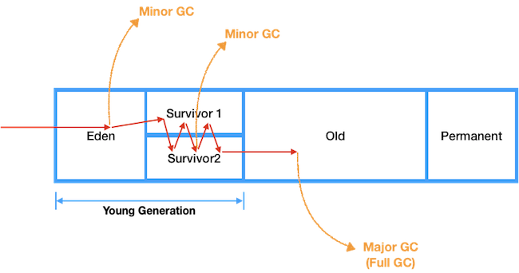

# Static

## Intro

`Static`을 사용하는 것은 메모리에 할당하여 프로그램 종료 시 까지 공유된 상태를 유지하게 되는 것을 의미한다.
JVM에서 [Runtime Data Areas](JVM.md#Runtime-Data-Areas) 중 `Method Area`를 보면 다음같이 작성한 내용이 있다.

> JVM이 읽어들인 클래스와 인터페이스 대한 런타임 상수 풀, 멤버 변수(필드), 클래스 변수(Static 변수), 생성자와 메소드를 저장하는 공간

즉, `GC`의 대상이 되는 `Heap`과 달리, `Method Area`는 그 대상이 되지 않고 프로그램 종료 시까지 유지된다는 것이다.
하지만, Java 8에서 `Heap`의 `Permanent`가 `Metaspace`로 변경되며 `Static Object`와 상수화된 `String Object`가 `Heap`으로
넘어갔다. 이 부분에 의문이 생겨 `static`을 정리해보고 마지막으로 `Heap`으로 넘어간 부분에 대해 알아보려한다.  
또한, `static`을 `객체와의 분리`라는 관점에서 다시 한번 정리해본다.

## Static variable and method

```java
class StaticMember {
    int nonStaticNum = 0;
    static int staticNum = 0;
    public static void  incrementNum() {
        staticNum++;
    }
}

class StaticMemberUse {
    public static void main(String[] args) {
        StaticMember sm = new StaticMember();
        println("sm.staticNum = " + sm.staticNum); // staticNum = 0
        sm.incrementNum(); // staticNum = 1

        println("StaticMember.staticNum = " + StaticMember.staticNum); // staticNum = 1
        StaticMember.incrementNum(); // staticNum =2
    }
}
```

`static`키워드를 사용하여 필드 및 메소드를 선언하는 방식은 위와 같으며 이는 다음과 같은 특징을 가진다

- `StaticMember` 클래스로 객체를 생성하게되더라도 `static variable`은 초기화되지 않으며, 이를 공유한다
- 객체를 생성하지 않더라도 `static`으로 선언한 필드나 메소드는 사용가능하다

이처럼 `static`으로 선언한 변수 및 함수를 우리는 정적 멤버 또는 클래스 변수라고 한다.
`StaticMember class`의 `nonStaticNum`은 객체가 생성될 때마다 새로운 값을 가지게 되고, 이는 즉 객체에 관계가 있다고 생각할 수 있다.
그래서 우리는 `nonStaticNum`과 같은 변수를 `멤버 변수`라고하며, 함수의 경우 `멤버 함수`라고 부른다.  
하지만 정적 멤버들의 경우 객체와 상관없이 사용가능하며 객체보다는 클래스에 의존적이며 따라서 `클래스 변수`라는 의미가 좀더 와닿게 된다.
즉, `객체와 분리되어 동작`하는 변수를 `static 변수`로 볼 수 있다. 

## Static class

개발 중 static variable 이나 static method는 사용하거나 이해하기 어렵지 않지만, static class는 사용 중 의문점이 들 때가 많았다.

- 일반적인 클래스는 static으로 선언이 되지 않지만, inner class인 경우 static으로 선언 가능한 점
- inner class를 static으로 선언 가능하다고 IDE에서 warning을 주는 점
- 그렇다면 언제 static inner class를 사용해야되는지

따라서, 여기서는 static class에 대한 나의 궁금증을 해결하고 언제 이를 사용해야하는지를 서술하겠다

### 왜 Outer class에는 static이 되지 않을까?

이 부분은 왜 되지 않을까의 관점에서 왜 static으로 되어야할까로 생각해보면 궁금증이 풀리게 된다. 우리는 왜 static을 사용할까?

1. 클래스의 모든 객체들이 공통된 값 또는 함수를 사용하기 위해
2. 객체를 생성하지 않고 클래스의 이름으로 클래스 내의 멤버를 사용하기 위해

보통 위 두 가지 이유가 될 수 있다. 그렇다면 Outer class의 경우 이런 것들이 필요할까?

1. 클래스를 객체 입장에서 보면, 클래스는 이미 모든 객체에서 공통으로 사용되는 것이기에 static은 필요하지 않다
2. 사용자 입장에서 객체 생성없이 클래스 멤버를 접근하고자 하려면 클래스 이름이 필요하다. 하지만 클래스 입장에서 보면,
이는 클래스의 일부이기에 static이 아니더라도 접근하는데 문제가 없다

따라서, outer class는 static이 될 수없다기 보단 될 필요가 없는 것이다.[참조](https://dzone.com/articles/why-an-outer-class-cant-be-static)

### Static Inner class

```java
class OuterClass {
    public OuterClass(){
    }
    public class InnerClass{
    }
    static class StaticInnerClass{
    }
}
```

Inner Class 와 Static Inner Class 를 살펴보는데 있어 중요한 점은 Outer Class 와 `관계를 맺고 있느냐 분리되어 있느냐`이다.

#### Inner Class vs Static Class

- Inner Class
  - 상위 클래스(`Outer Class`)를 통해서만 객체를 생성할 수 있다.
  - 상위 클래스의 멤버를 사용할 수 있고 그 멤버를 사용하는 관계를 가진다
  - 상위 클래스와 암묵으로 연결되어 있다
    - 상위 클래스가 객체화 될 때, 이 관계가 생성되며 Inner class 객체 안에 그 관계 정보가 생성된다
    - 관계 정보는 메모리 공간을 차지하고 생성 시간이 오래 걸린다
- Inner Static Class
  - 사실상 두 개의 분리된 클래스로 나눌 수 있으며, 따라서 관계가 존재하지 않는다
    - 상위 클래스 객체와 분리되어 있고, `객체와 별개로 생성 가능`하다
  - 상위 클래스에 접근할 일이 존재하지 않을 때 사용
  - 멤버 클래스가 상위 클래스를 참조할 일이 없다면 무조건 적으로 `static`을 사용
    - 숨은 외부 참조로 인한 메모리 사용 및 GC가 상위 클래스의 인스턴스 조차 수거하지 못하는 메모리 누수현상이 발생할 수 있다

Inner static class 는 개념적으로는 상위 클래스와 연결되어 있음을 표현할 때 사용하지만, 독립된 클래스라는 것을 인지해야한다. 

## Permanent vs metaspace

<p align="center"></p>
<p align="center"></p>

Java 8로 넘어오면서 `Permanent`는 `Metaspace`로 변경되며 `Static Object`이 `Heap`영역에서 관리하게 되었다.

- `Static Object`는 그 동안 알고 있던 `static`과 다른 것인가?
- 같은 것이라면, Heap 으로 넘어가면서 GC를 통해 `static`으로 선언된 것은 정리되는가?
- `Method Area`에서 분명 static 에 대한 정보를 저장하는 곳이 있었는데 그건 어떻게 되는가?

이런 혼란한 생각들이 생겼고, 이 부분에 대해 정리해보려한다


## Reference

- https://dzone.com/articles/why-an-outer-class-cant-be-static
- https://codechacha.com/ko/java-static-keyword/
- https://johngrib.github.io/wiki/java-inner-class-may-be-static/
- https://jgrammer.tistory.com/144