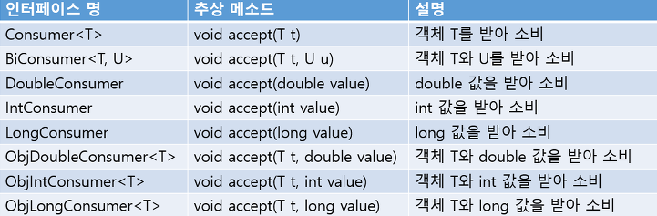
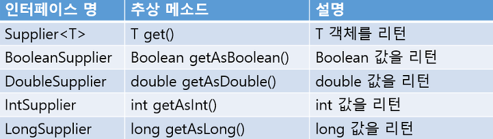
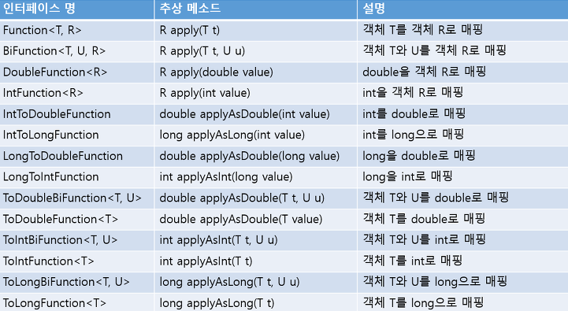
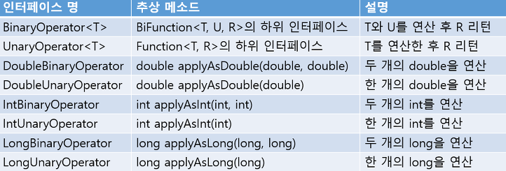
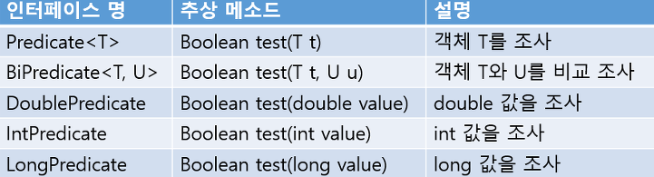
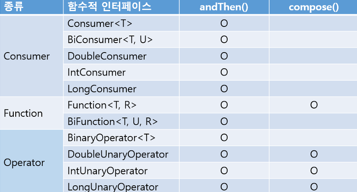
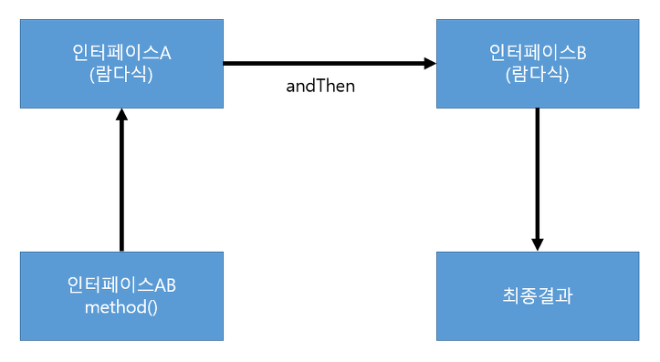
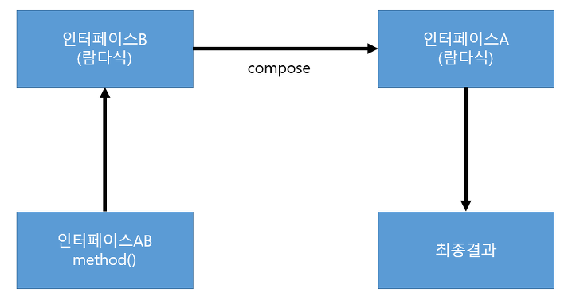

# Lambda Expression and Functional Programming

## Lambda Expression

Java 8에서 부터 `Lambda Expression(람다식)`을 지원하게되며 객체 지향 프로그래밍과 함수적 프로그래밍을 혼합하여
더욱 효율적인 프로그래밍이 되도록 언어가 변하고 있다. 람다식은 `Anonymous function(익명 함수)를 생성하기 위한 식` 으로서,
함수형 프로그래밍에 가깝다.

#### Anonymous function(익명 함수)

이름 없는 함수 또는 객체를 의미한다. 일회성으로 구현 객체 호출하기 위해 클래스를 만드는 것은 비효율적이다.
따라서 이런 비효율성을 줄이고, 클래스 없이 구현 객체를 만들 수 있는 방법을 제공한다.
익명 함수는 모두 `일급 객체`라는 특징을 가진다

#### 장점

- 코드의 간결성
  - 기호와 약속된 표현을 통해 불필요한 코드가 삭제되며, 반복문 삭제를 통한 복잡한 식이 단순화 된다
- 지연연산 수행
  - 지연연산을 지원함으로써, 불필요한 연산을 최소화 한다
- 내부반복 지원
  - 내부반복 지원을 통해 멀티쓰레딩을 통한 병렬처리가 가능하다

#### 단점

- 람다식의 호출이 까다로움
- 람다식을 남용하게 되면 가독성이 떨어짐.


## 기본 문법

```text
(타입 매개변수, ...) -> { 실행문 ; ...}
```

1. 매개변수와 리턴 값이 없는 람다식
```java
public interface LambdaInterface {
    public void method();
}

public class test {
  public static void main(String[] args) {
    LambdaInterface lambdaInterface =
            () -> {
              System.out.println("lambdaInterface call");
            };
    lambdaInterface.method();
  }
}
```

2. 매개변수가 있고 리턴값이 없는 람다식
```java
public interface LambdaInterface {
    public void method(int a);
}

public class test {
  public static void main(String[] args) {
    LambdaInterface lambdaInterface =
            (a) -> {
              int result = a * 3;  
              System.out.println("lambdaInterface call : " + result);
            };
    lambdaInterface.method(3);
  }
}
```

3. 매개변수와 리턴 값이 있는 람다식
```java
public interface LambdaInterface {
    public int method(int a, int b);
}

public class test {
  public static void main(String[] args) {
    LambdaInterface lambdaInterface =
            (a, b) -> {
              int result = a * b;  
              System.out.println("lambdaInterface call : " + result);
              return result;
            };
    int lambdaResult = lambdaInterface.method(3, 5);
  }
}
```
---

## 표준 API의 함수적 인터페이스

<p align="center"></p>

Java 8부터는 빈번하게 사용되는 `Functional Interface`는 표준 API 패키지로 제공한다.
구현 및 사용법은 `src/main/java/lambda/FunctionalInterfaceStudy.java`으로 확인하자.

### Consumer

<p align="center"></p>

단순 소비(Consume), 파라미터만 소비하고 리턴 값은 없다.

### Supplier

<p align="center"></p>

파라미터는 없지만, 리턴을 제공(Supply)한다.

### Function

<p align="center"></p>

파라미터와 리턴을 제공하는 함수(Function)의 역할을 한다.

### Operator

<p align="center"></p>

근본적으로 `Function`과 같지만, 파라미터와 리턴이 같은 타입이다.

### Predicate

<p align="center"></p>

근본적으로 `Function`과 같지만, 리턴은 `boolean` 타입을 가진다.

---

## andThen, compose 디폴트 메서드

<p align="center"></p>

두 개의 `Functional Interface`를 순차적으로 연결하고, 첫 번째 처리 결과를 두 번째 매개값으로 제공해서
최종 결과값을 얻을 때 사용한다.

### andThen

<p align="center"></p>

인터페이스 AB 를 기준으로 A를 실행하고 B를 순차적으로 수행한다.

- Consumer andThen
  - `Consumer`는 소비만 할 뿐 결과를 리턴하지 않는다
  - 따라서 Consumer andThen 은 단지 호출 순서만을 결정하게 된다.
- Function andThen
  - `Function`은 결과를 리턴하기에 다음 순서의 Function 의 파라미터로 넘어가게 된다.

### compose

<p align="center"></p>

인터페이스 AB 를 기준으로 B를 실행하고 A를 역순으로 수행한다.

## Reference

- 이것이 자바다 (저자: 신용권)
- https://mangkyu.tistory.com/111
- https://khj93.tistory.com/entry/JAVA-%EB%9E%8C%EB%8B%A4%EC%8B%9DRambda%EB%9E%80-%EB%AC%B4%EC%97%87%EC%9D%B4%EA%B3%A0-%EC%82%AC%EC%9A%A9%EB%B2%95
- https://makecodework.tistory.com/entry/Java-%EB%9E%8C%EB%8B%A4%EC%8B%9DLambda-%EC%9D%B5%ED%9E%88%EA%B8%B0
- https://vagabond95.me/posts/lambda-with-final/