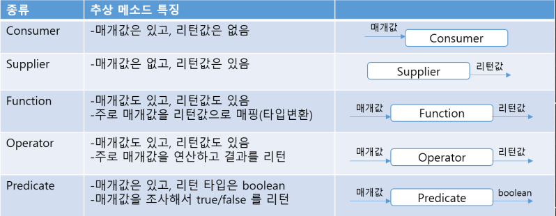

# Lambda Expression and Functional Programming

## Lambda Expression

Java 8에서 부터 `Lambda Expression(람다식)`을 지원하게되며 객체 지향 프로그래밍과 함수적 프로그래밍을 혼합하여
더욱 효율적인 프로그래밍이 되도록 언어가 변하고 있다. 람다식은 `Anonymous function(익명 함수)를 생성하기 위한 식` 으로서,
함수형 프로그래밍에 가깝다.

#### Anonymous function(익명 함수)

이름 없는 함수 또는 객체를 의미한다. 일회성으로 구현 객체 호출하기 위해 클래스를 만드는 것은 비효율적이다.
따라서 이런 비효율성을 줄이고, 클래스 없이 구현 객체를 만들 수 있는 방법을 제공한다.
익명 함수는 모두 `일급 객체`라는 특징을 가진다

#### 장점

- 코드의 간결성
  - 기호와 약속된 표현을 통해 불필요한 코드가 삭제되며, 반복문 삭제를 통한 복잡한 식이 단순화 된다
- 지연연산 수행
  - 지연연산을 지원함으로써, 불필요한 연산을 최소화 한다
- 내부반복 지원
  - 내부반복 지원을 통해 멀티쓰레딩을 통한 병렬처리가 가능하다

#### 단점

- 람다식의 호출이 까다로움
- 람다식을 남용하게 되면 가독성이 떨어짐.


## 기본 문법

```text
(타입 매개변수, ...) -> { 실행문 ; ...}
```

1. 매개변수와 리턴 값이 없는 람다식
```java
public interface LambdaInterface {
    public void method();
}

public class test {
  public static void main(String[] args) {
    LambdaInterface lambdaInterface =
            () -> {
              System.out.println("lambdaInterface call");
            };
    lambdaInterface.method();
  }
}
```

2. 매개변수가 있고 리턴값이 없는 람다식
```java
public interface LambdaInterface {
    public void method(int a);
}

public class test {
  public static void main(String[] args) {
    LambdaInterface lambdaInterface =
            (a) -> {
              int result = a * 3;  
              System.out.println("lambdaInterface call : " + result);
            };
    lambdaInterface.method(3);
  }
}
```

3. 매개변수와 리턴 값이 있는 람다식
```java
public interface LambdaInterface {
    public int method(int a, int b);
}

public class test {
  public static void main(String[] args) {
    LambdaInterface lambdaInterface =
            (a, b) -> {
              int result = a * b;  
              System.out.println("lambdaInterface call : " + result);
              return result;
            };
    int lambdaResult = lambdaInterface.method(3, 5);
  }
}
```

## 표준 API의 함수적 인터페이스

<p align="center"></p>

Java 8부터는 빈번하게 사용되는 `Functional Interface`는 표준 API 패키지로 제공한다.

--- 

## Functional Programming

대입문을 사용하지 않는 프로그래밍이며, 작은 문제를 해결하기 위한 함수를 통해 흐름이 진행된다.
함수는 다른 함수를 호출하거나 매개변수로 받을 수 있으며, 함수는 무엇을(What) 할 것인지에 초첨이 맞춰져있다
```text
example
add(1, 10); // 두 값을 더하는 함수
multiple(2, 3); // 두 값을 곱하는 함수
print(add(1, multiple(3, 4)));
```

### 특징

#### Pure Function (순수 함수)

함수형 프로그래밍에서 사용되는 함수는 모두 순수 함수로서, Side Effect(역효과)가 제거된 함수이다.

- 함수의 실행이 외부로 영향을 끼치지 않는다
- Memory I/O 관점에서 side effect 가 없다
  - 함수 자체가 독립적이며, Thread 에 안정성을 보장받을 수 있음
    - 병렬 처리를 동기화없이 진행 가능하다
  - Side Effect
    - 변수의 값, 객체의 필드 값이이 변경 또는 설정됨
    - 자료 구조를 제자리에서 수정함
    - 예외나 오류가 발생하면 실행이 중단됨

#### First Class Object (일급 객체)

1급 객체란 다음이 가능한 객체를 의미한다

- 변수나 데이터 구조안에 담을 수 있는 객체
- 파라미터로 전달 가능하며, 반환(return value)값 으로도 사용 가능하다
- 할당에 사용된 이름과 무관하게 고유한 구별이 가능하다

#### Referential Transparency (참조 투명성)

참조 투명성이란 다음을 의미한다

- 동일한 인자에 대해 항상 동일한 결과를 반환한다(멱등)
- 기존의 값은 변동되지 않고 유지된다(Immutable)

## Reference

- 이것이 자바다 (저자: 신용권)
- https://mangkyu.tistory.com/111
- https://khj93.tistory.com/entry/JAVA-%EB%9E%8C%EB%8B%A4%EC%8B%9DRambda%EB%9E%80-%EB%AC%B4%EC%97%87%EC%9D%B4%EA%B3%A0-%EC%82%AC%EC%9A%A9%EB%B2%95
- https://makecodework.tistory.com/entry/Java-%EB%9E%8C%EB%8B%A4%EC%8B%9DLambda-%EC%9D%B5%ED%9E%88%EA%B8%B0
- https://vagabond95.me/posts/lambda-with-final/