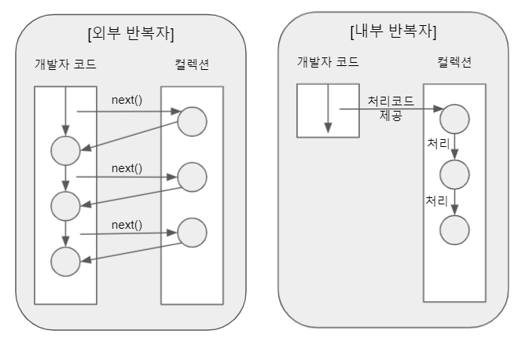

# Stream

Java 8부터 저장 요소를 하나씩 참조해서 람다식으로 처리할 수 있는 `Stream`이 추가되었다. 데이터를 추상화하고 처리하는데 자주 사용되는 함수들을 정의해 사용함으로써, 코드량을 감소시키고 가독성을 높일 수
있다

## 특징

### 람다식으로 요소 처리 코드를 제공한다

스트림이 제공하는 대부분의 메소드는 함수 인터페이스를 파라미터로 가지기 때문에 람다 또는 메소드 참조를 통해 처리를 원하는 내용을 전달할 수 있다

```text
stringList
    .stream()
    .foreach( s -> System.out.println(s)); // 내부 반복
```

### 내부 반복자를 사용하여 병렬처리가 쉽다

<p align="center"></p>

외부 반복자는 for, while 과 같이 직접 요소를 반복하는 코드를 사용하는 코드를 사용하는 패턴이다. 
반면, 내부 반복자는 `컬렉션 내부에서 요소를 반복`시키고 개발자는 `요소에서 처리해야할 내용만을 제공`하는
코드 패턴이다. 요소의 반복에 대한 부분은 컬렉션이 담당하고 요소를 처리하는 부분에만 집중 가능하다.
여기서 병렬처리란, 하나의 작업을 여러 개의 서브 작업으로 나누고 분리된 스레드에서 서브작업을 병렬적으로 수행 후 결과를
자동으로 합하여 최종결과물을 생성하는 것이다.

### 스트림은 중간 처리와 최종 처리를 할 수 있다.

<p align="center"></p>

스트림은 컬렉션의 요소에 대해 중간처리와 최종 처리를 나누어 진행할 수 있다.
중간 처리에는 `filter, map, sort`등이 있고 중간 처리 결과를 집계하여 계산할 수 있는 최종 처리가 존재한다.

### 기타 특징

- 원본의 데이터를 변경하지 않고 데이터를 처리할 수 있다
- 스트림은 일회성으로 사용된다

## 중간 처리

### Filter and distinct

`Filter`는 말 그대로 조건에 맞는 데이터만을 추출하여 더 작은 컬렉션으로 만들어 내는 연산이다. 파라미터로 `Predicate` 인터페이스를
받고 있기 때문에, `boolean`을 반환하는 람다식을 작성하여 함수 구현이 가능하다. 
`Distinct`는 컬렉션 내 중복을 제거하는 것으로 추가 파라미터 없이 중복을 제거 가능하다. 단, distinct 는 `Object의 equals()`를 사용하기 때문에,
요소가 클래스인 경우 `equals와 hashCode를 반드시 구현`해줘야한다.

### Mapping

`Mapping`은 스트림의 요소를 다른 스트림으로 대체하는 연산이다. 대표적으로 `Function` 인터페이스를 파라미터로 받는 `map, flatmap`과
파라미터 없이 스트림의 형식을 바꾸는 `asXXXStream, boxed`가 존재한다

### Sort

스트림 요소를 정렬하기 위해 사용된다. 만약 내부의 요소가 클래스인 경우 클래스 에 `Comparable`을 implement 하여
`compareTo`를 구현해줘서 비교 가능하게 해야한다.

## 최종 처리

### Matching

최종 처리된 결과물이 특정 조건에 만족하는지를 확인하는 메소드이다. `Predicate`를 파라미터로 받아 조건에 해당하는지를
판단한다.

### Aggregation

최종 스트림 요소들에 대한 집계 함수를 수행한다. count, sum, min, max 등이 대표적인 집계 함수이며, Stream 이 비어있는
경우 값이 null 이 될 수 있기에 `Optional`형태로 리턴한다. 

### Collect

결과 스트림 요소들을 원하는 collection 형태로 변환하고 싶을 경우 사용한다. 자주 사용되는 컬렉터의 경우 `Collectors`에
static 으로 정의되어 바로 사용가능하다.