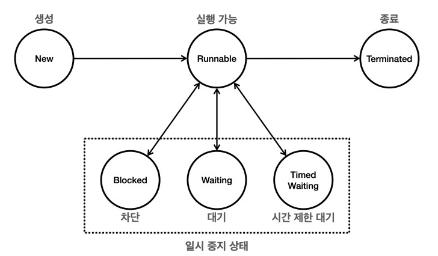

# 스레드 제어와 생명 주기

## 스레드 기본 정보

Thread 클래스가 제공하는 정보를 확인해보자
[소스코드](../src/main/java/org/example/thread/control/ThreadInfoMain.java)

- 스레드 객체 정보
  - Thread[#21,myThread,5,main]
  - [스레드 ID, 스레드 이름, 우선순위, 스레드 그룹]
- 스레드 ID
  - JVM 내 각 스레드에 대해 유일
- 스레드 우선순위
  - 기본 값은 5이고 높을 수록 우선순위가 높다
  - 하지만 실제 실행 순서는 JVM 구현과 운영체제에 따라 달라질 수 있음
- 스레드 그룹
  - 스레드 그룹은 스레드를 그룹화하여 관리할 수 있는 기능을 제공
    - 기본적으로 부모 스레드와 동일한 스레드 그룹에 속함
    - 부모 스레드는 새로운 스레드를 생성하는 스레드
  - 스레드 그룹은 여러 스레드를 하나의 그룹으로 묶어 특정작업(일괄 종료, 우선순위 설정등)을 수행
- 스레드 상태
  - 주요 상태
    - NEW: 아직 시작되지 않음
    - RUNNABLE: 실행 중이거나 실행될 준비가 된 상태
    - BLOCKED: 동기화 락을 기다리는 상태
    - WAITING: 다른 스레드의 작업이 완료되기를 기다리는 상태
    - TIMED_WAITING: sleep 처럼 일정시간동안 기다리는 상태
    - TERMINATED: 실행 종료

---

## 스레드 생명 주기

<p align="center"></p>

스레드의 생명주기를 살펴보자
[소스코드](../src/main/java/org/example/thread/control/ThreadStateMain.java)

> 자바에서는 위 그림의 스레드의 일시 중지 상태는 없다. 스레드가 기다리는 상태를 묶어서 쉽게 설명하기 위한 용어이다.

### New

- 스레드가 생성되고 아직 시작되지 않은 상태
- `start()` 메서드를 호출하지 않은 상태

### Runnable

- 스레드가 실행될 준비가 된 상태로 실제로 CPU에서 실행될 수 있음
- start() 메서드가 호출되면 스레드가 해당 상태가 됨
- Runnable 상태의 모든 스레드가 동시에 실행되는 것은 아니고, 운영체제 스케쥴링에 따라서 실행 대기열에 들어가 있을 수 있음
  - 즉, 실제 실행 중일 수도 실행 대기열에 들어가 있을 수도 있음

### Blocked

- 스레드가 다른 스레드에 의해 동기화 락을 얻기 위해 기다리는 상태
- 예를 들어 synchronized 블록에 진입하기 위해 락을 얻어야하는 경우 이 상태가 됨

### Waiting

- 스레드가 다른 스레드의 특정 작업을 `무기한` 기다리는 상태
- wait(), join() 메서드 호출로 인해 발생
- 다른 스레드가 notify() 또는 notifyAll() 메서드를 호출하거나 join()이 완료될 때까지 기다림

### Timed Waiting

- `특정 시간`동안 다른 스레드의 작업을 기다리는 상태
- 주어진 시간이 경과하거나 다른 스레드가 해당 스레드를 꺠우면 이 상태에서 벗어남

### Terminated

- 스레드의 실행이 완료된 상태 또는 예외가 발생하여 종료된 경우
- 한번 종료되면 다시 시작할 수 없음

### 체크 예외 재정의

자바에서 메서드 재정의 시, 재정의 메서드가 지켜야 할 예외와 관련된 규칙이 있다.

- 체크 예외
  - 부모 메서드가 체크 예외를 던지지 않는 경우, `자식 메서드도 체크 예외를 던질 수 없음`
  - 자식 메서드는 부모 메서드가 던지는 체크 예외의 `하위 타입`만 던질 수 있음
    - 자식 메서드가 부모 메서드보다 넓은 범위의 예외를 던지면 해당 코드의 모든 예외를 처리할 수 없어 일관성을 해치게 된다
- 언체크(런타임) 예외
  - 예외 처리를 강제하지 않으므로 상관없음

따라서 Runnable 인터페이스에서 run 메서드 구현시 InterruptedException를 밖으로 던질 수 없다.

```java
public interface Runnable {
    public void run();
}
```

자바에서는 run 메서드에서 예외처리를 강제함으로서 프로그램이 비정상적으로 종료되는 상황을 방지한다.
특히 `멀티스레딩 환`경에서 예외 처리를 강제함으로써 `스레드의 안정성과 일관성을 유지`할 수 있다.

---

## Join

join() 메서드를 통해 WAITING 상태가 어떤 것이고 왜 필요할까?

- 스레드를 start 하면 main 스레드는 스레드에 실행을 위임하고 다음 코드를 실행한다.
  - 즉, 각 스레드가 끝날 때 까지 기다리지 않는다!
- 만약 각 스레드의 실행이 끝나고 나서 그 결과를 가지고 처리하고 싶다면 어떻게 해야할까?

join() 메서드를 호출하는 스레드는 대상 스레드가 TERMINATE 될 떄 까지 대기하게 된다.
이때 대상 스레드가 TERMINATE되면 다시 RUNNABLE로 변경되게 되는데 그 전까지는 WAITING 상태가 된다.

- join()을 하는 스레드는 스케쥴링에서 벗어나서 CPU를 사용하지 않지만 스레드는 점유한 상태
- 다른 스레드가 완료될 떄 까지 무기한 기다려야되는 단점이 존재

---

## Interrupt

특정 스레드의 작업을 중간에 중단하려면 어떻게 해야할까?

- 스레드를 중단하는 가장 쉬운 방법은 변수(runFlag)를 사용하는 것
  - [소스코드](../src/main/java/org/example/thread/control/interrupt/ThreadStopMainV1.java)
- 위 코드의 문제점은 main에서 runFlag를 바꿔도 worker가 바로 중단되는 것이 아니라는 것

이런 경우 인터럽트를 사용하면 WAITING, TIME_WAITING 상태에 있는 스레드를 RUNNABLE로 만들 수 있다.
[소스코드](../src/main/java/org/example/thread/control/interrupt/ThreadStopMainV2.java)

여기서 알아야할 점은 해당 코드에서 interrupt() 메서드를 호출한다고 해서 바로 종료되는 것이 아니라는 점이다. 
Thread.sleep()과 같이 `InterruptedException을 발생시키는 메서드를 호출하거나 호출 중`일 때 종료된다

- interrupt() 메서드를 통해 TIMED_WAITING, WAITING 상태에 있는 스레드를 RUNNABLE로 변경되면서 InterruptedException을 발생시킨다
  - RUNNABLE 상태가 되어야 catch 블록이 실행할 수 있음
- 인터럽트를 사용하면 대기 중인 쓰레드를 꺠워서 RUNNABLE 상태로 만들 수 있다

---

## yield

어떤 스레드가 얼마나 실행될지는 운영체제의 스케쥴링에 의해 결정된다. 이때 특정 스레드가 바쁘지 않은 상황에서
CPU 실행 기회를 다른 스레드에게 넘기고 싶을 때 yield() 메서드를 사용할 수 있다.
소스코드를 확인해보면 아무것도 하지 않았을 떄(empty), sleep, yield를 사용했을 떄를 비교할 수 있다.
[소스코드](../src/main/java/org/example/thread/control/yield/YieldMain.java)

### sleep vs yield

- sleep
  - 일정 시간동안 RUNNABLE -> TIMED_WAITING 상태로 변경
    - 이 경우 CPU는 자원을 사용하지 않고 실행 스케쥴링에서 제외되며, 일정 시간 이후 다시 RUNNABLE 상태로 변경되면 실행 스케쥴링에 포함
    - 결과적으로 보면 `TIMED_WAITING 상태`가 되어 다른 스레드에 CPU 실행 기회를 양보하는 효과
  - 단점
    - 스레드의 상태가 계속 변화되며 설정한 시간 동안 스레드가 실행되지 않음
    - 양보할 스레드가 없어도 일정 시간이 지나야 다시 실행
- yield
  - 실행 중인 스레드가 다른 스레드에게 실행 기회를 양보
    - 이 경우 스레드의 상태는 `RUNNABLE로 유지`되지만, 스케쥴링 큐로 들어가 다른 스레드에게 실행 기회를 양보
  - 운영체제에게 양보하도록 `힌트를 제공`하며 강제되지는 않는다