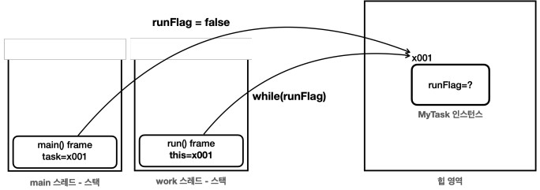
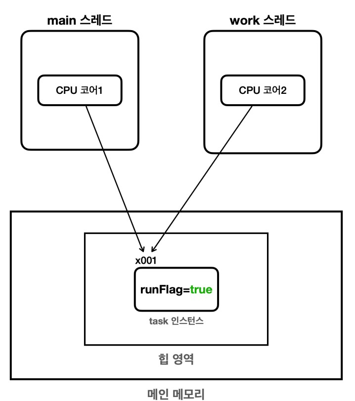
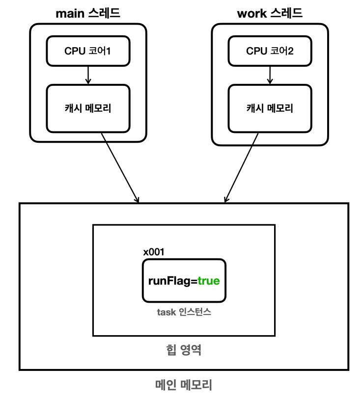
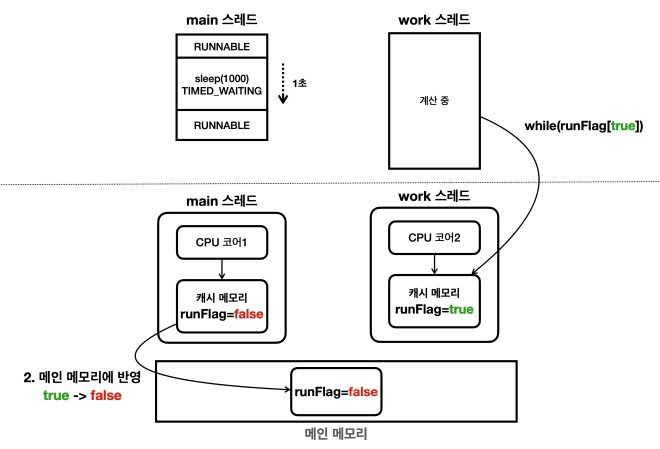

# 메모리 가시성

## volatile

volatile을 사용하지 않는 경우 flag가 변경되어도 쓰레드가 변경된 값을 인지하지 못할 수 있다.
[소스코드](../src/main/java/org/example/thread/volatile1/VolatileFlagMain.java)

메모리 구조를 살펴보면 위와 같은것 같은데, 왜 flag가 변경되어도 쓰레드가 동작을 멈추지 않을까?

### 메모리 가시성 문제

`한 스레드에서 변경한 값이 다른 스레드에 언제 보이는지에 대한 문제`를 메모리 가시성(Memory Visibility) 문제라고 한다.

일반적으로 생각하는 메모리 구조

실제로는 CPU는 처리 성능을 개선하기 위해 중간에 캐시 메모리를 사용하게되어 다음과 같은 구조가 된다.

위 캐시 메모리를 사용하게되면 다음과 같은 흐름으로 동작하게 된다.

- 자바 프로그램이 실행되면서 flag 변수를 메인 메모리에 읽어옴
- CPU는 값을 효율적으로 처리하기 위해 캐시 메모리에 해당 값을 저장
- main 스레드와 work 스레드는 각각 캐시 메모리에 저장된 값을 읽어옴
  - 초기 값은 true로 캐시 메모리에 저장
- 일정 시간 후 flag 값을 false로 바꾸지만 메인 메모리의 값이 아닌 캐시 메모리의 flag 값이 false로 변경됨
- work 스레드는 캐시 메모리의 값을 읽어오기 때문에 flag 값이 변경되었음에도 불구하고 계속해서 true로 인식

그림으로 살펴보면 다음과 같은 형태가 된다

그럼 캐시 메모리에 있는 값은 언제 메인 메모리에 반영될까?

- CPU 설계 방식과 종류에 따라 다르기에 알 수 없음
- 또한 메인메모리에 반영된 flag 값이 캐시 메모리에 반영되는지 또한 알 수 없음
- 주로, 컨텍스트 스위칭이 될 때 캐시 메모리도 함께 갱신
  - sleep 또는 콘솔에 내용 출력 시

### volatile 키워드

여러 스레드에 같은 시점에 정확히 같은 데이터를 보는 것이 중요할 수 있다. 이런 경우 성능을 약간 포기하더라도
값을 읽거나 쓸 때 `메인 메모리에 직접 접근하게 설정`할 수 있다.
[소스코드](../src/main/java/org/example/thread/volatile1/VolatileFlagMain2.java)

---

## 자바 메모리 모델(Jva Memory Model, JMM)

- 자바 프로그램이 어떻게 메모리에 접근하고 수정할 수 있는지에 대한 규정
- 특히 멀티스레드 프로그래밍에서 `스레드 간의 상호작용을 정의`
- 핵심은 여러 스레드들의 작업 순서를 보장하는 `happens-before` 관계에 대한 정의

### happens-before

자바 메모리 모델에서 `스레드 간의 작업 순서를 정의`하는 개념이다. 예를 들어 A 작업이 B 작업보다
happens-before 관계에 있다면 A 작업의 메모리 변경 사항은 B 작업에서 볼 수 있다.

- 한 동작이 다른 동작보다 먼저 발생함을 보장
- 스레드 간의 메모리 가시성을 보장하는 규칙
- 즉, 한 스레드에서 수행한 작업을 다른 스레드가 참조할 때 `최신 상태를 보장`

happens-before 관계가 발생하는 경우는 다음과 같다.

- 프로그램 순서 규칙
  - 단일 스레드 내에서 순서대로 작성된 명령문
- volatile 변수 규칙
  - volatile 변수에 쓰여진 값은 다른 스레드에서 읽는 작업보다 happens-before 관계 형성
- 스레드 시작 규칙
  - Thread.start()를 호출하면 해당 스레드 내 모든 작업은 start() 호출 이후에 실행된 작업보다 happens-before 관계 형성
  - 즉 start() 호출 전에 반영된 내용은 메모리에 반영
- 스레드 종료 규칙
  - join을 호출하면 호출한 스레드는 join()의 `대상이 되는 스레드의 모든 작업`에 대해 happens-before 관계 형성
  - 즉, join 대상의 결과를 호출한 스레드에서는 볼 수 있음
- 인터럽트 규칙
  - interrupt를 호출하면 인터럽트가 걸린 스레드의 `인터럽트 상태를 확인하는 작업`이 happens-before 관계 형성
- 객체 생성 규칙
  - 객체의 생성자는 객체가 완전히 생성된 후에만 다른 스레드에 의해 참조될 수 있음을 보장
- 모니터 락 규칙
  - synchronized 블록을 종료 후, 모니터 락을 얻는 모든 스레드는 해당 블록의 작업을 볼 수 있음
- 전이 규칙(Transitive Rule)
  - A가 B를, B가 C를 볼 수 있으면 A는 C를 볼 수 있다

정리하자면 `volatile 또는 스레드 동기화 기법을 사용하면 메모리 가시성 문제가 발생하지 않는다`.
