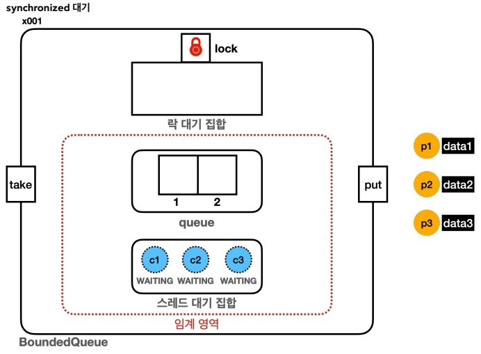
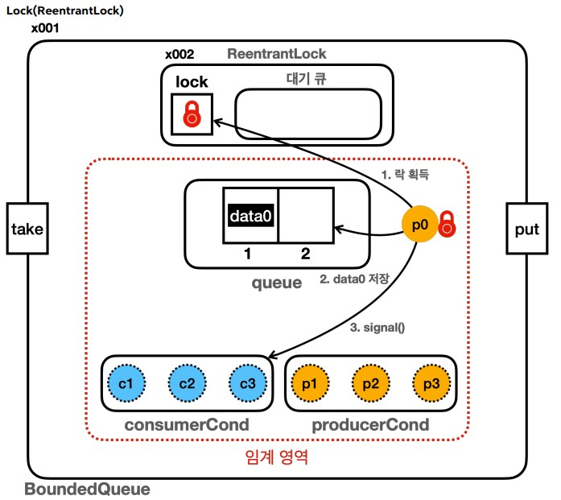

# 생산자, 소비자 문제

## Object.notify() vs Condition.signal()

- Object.notify()
  - 대기 중인 스레드 중 임의의 하나를 선택해서 깨움
  - 깨어나는 순서는 정의되어 있지 않고, JVM 구현에 따라 다름
  - synchronized 블록 내 모니터 락을 가진 스레드가 호출해야 함
- Condition.signal()
  - 대기 중인 스레드 중 하나를 깨우며, 일반적으로 Queue 구조이기에 FIFO 순서로 깨움
  - ReentrantLock을 가진 스레드가 호출해야 함

### 스레드의 대기

#### synchronized 대기

- 대기 1: 락 획득하며 대기
  - `BLOCKED` 상태로 락 획득 대기
    - `BLOCKED 상태의 스레드는 스레드 대기 집합이 아닌 락 대기 집합이라는 자바 내부에 따로 보관`
    - 즉, Object.wait()를 통해 기다리는 대기 사앹와 스레드가 모니터 락을 기다리는 상태가 다르다는 점
  - synchronized를 시작할 때, 락이 없으면 대기
  - 다른 스레드가 synchronized를 빠져 나갈 때 대기가 풀리며 락 획득
- 대기 2: wait() 대기
  - `WAITING` 상태로 대기
  - wait() 호출 시, `스레드 대기 집합`에서 대기
  - 다른 스레드가 notify() 호출 했을 때 빠져나감

자바의 모든 객체 인스턴스는 멀티 스레드와 임계 영역을 다루기 위해 내부에 3가지 기본 요소를 가진다.

- 모니터 락
- 락 대기 집합(모니터 락 대기 집합)
  - 1차 대기소
- 스레드 대기 집합
  - 2차 대기소

위 세가지 요소를 통한 멀티 스레드의 과정은 다음과 같다.

1. synchronized를 사용한 임계 영역을 들어가기 위해 `모니터 락`이 필요
2. 모니터 락이 없다면 `락 대기 집합`으로 BLOCKED 상태로 대기
3. 모니터 락이 반납되면 `락 대기 집합` 중 하나의 스레드가 `모니터 락`을 획득 후 RUNNABLE로 변경
4. wai()를 호출해 `스레드 대기 집합`에 들어가기 위해 모니터 락 필요
5. `스레드 대기 집합`에 들어가며 `모니터 락` 반납
6. 스레드가 notify()를 호출하면 스레드 대기 집합 중 하나의 스레드가 `스레드 대기 집합`을 나와 `모니터 락` 획득 시도
   - `모니터 락`을 획득한다면 임계 영역 수행
   - 획득하지 못한다면 `락 대기 집합`으로 이동

#### ReentrantLock 대기 vs synchronized

Lock(ReentrantLock) 또한 2가지 단계의 대기 상태가 존재한다.

- 대기 1: ReentrantLock 획득 대기
  - 대기 큐에서 관리
  - `WAITING` 상태로 락 획득 대기
  - lock()을 호출 했을 때 락이 없으면 대기
  - 다른 스레드가 unlock()을 호출하면 대기가 풀리며 락 획득 시도, 락 획득하면 대기 큐에서 나옴
- 대기 2: await() 대기
  - condition.await() 호출 시, condition 객체의 스레드 대기 공간에서 관리
  - `WAITING` 상태로 대기
  - signal() 호출 시, 객체의 스레드 대기 공간에서 빠져나감