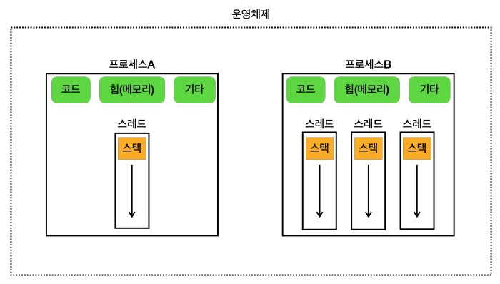

# 프로세스와 스레드

## 멀티태스킹과 멀티프로세싱

### 멀티태스킹

- `운영체제 소프트웨어 관점`
- CPU가 빠르게 두 프로그램의 코드를 번갈아 수행하는 것
  - 사람이 느낄 떄는 동시에 실행되는 것으로 느껴짐
- 실생 시간을 분할하여 동시에 실행되는 것처럼하는 것을 `시분할(Time Sharing) 기법`
- CPU가 하나만 있어도 동시에 여러 작업을 동시에 수행할 수 있음

### 멀티프로세싱

- `하드웨어 장비 관점`
- CPU 코어가 두개 이상인 경우 물리적으로 동시에 2개의 프로그램 처리 가능
- 코어 내에서는 멀티태스킹으로 처리

---

## 프로세스와 스레드

### 프로세스

- 프로그램을 실행하면 프로세스가 만들어지고 프로그램이 실행
  - 운영체제 안에서 `실행중인 프로그램이 프로세스`
  - 프로세스는 실행 중인 프로그램의 `인스턴스`
- 각 프로그램은 독립적인 메모리 영역을 가지고 있음
  - 따라서 각 프로세스는 서로의 메모리에 직접 접근할 수 없음
  - 따라서 하나의 프로세스에 문제가 발생하더라도 다른 프로세스에 영향을 주지않음
- 프로세스 메모리 구성
  - 코드 영역: 실행할 프로그램의 코드가 저장
  - 데이터 영역: 전역 변수, 정적 변수등이 저장되며 위 그림에서의 기타 영역
  - 힙 영역: 동적 할당 영역
  - 스택 영역: 메서드 호출 시 생성되는 지역변수와 반환 주소가 저장(스레드에 포함)

즉 프로세스는 실행 환경을 제공하는 컨테이너 역할을 담당한다.

### 스레드

프로세스는 `하나 이상의 스레드를 반드시 포함`한다.

- 스레드는 프로세스 내에서 실행되는 작업의 단위
- 스레드는 한 프로세스 내에서 여러개가 존재할 수 있으며, `프로세스 내 동일한 메모리 공간을 공유`
- 스레드 메모리 구성
  - 공유 메모리: 코드 영역, 데이터 영역, 힙 영역을 공유
  - 스택 영역: 스레드마다 독립적으로 가짐

---

## 스레드와 스케쥴링

### 단일 코어 스케쥴링

- 운영체제는 내부에 `스케쥴링 큐`를 가지고 있고 각 스레드는 스케쥴링 큐에서 대기
- 스케쥴링 큐에 대기하는 스레드를 실행, 다시 스케쥴링 큐에 넣고, 다른 스레드를 실행하는 작업을 반복

### 멀티 코어 스케쥴링

- 마찬 가지로 운영체제 내부의 스케쥴링를 이용
- 하지만 연산을 실행하는 물리적인 CPU의 갯수가 늘어나므로 각 스레드를 `병렬로 실행`

---

## 컨텍스트 스위칭(Context Switching)

멀티 태스킹을 위해 스레드를 멈추고 다시 실행하는 과정 중에 각 `스레드가 실행 시점에 CPU가 사용하던 값을 메모리에 저장`해야한다.
이후 해당 스레드가 다시 실행되면 CPU에서 이 값을 불러와야 하는데 이 과정을 `컨텍스트 스위칭`이라고 한다.
그렇기에 멀티스레드는 효율적이지만 컨텍스트 스위칭으로 인해 `언제나 효율적인 것은 아니다`.

실제로는 컨텍스트 스위칭에 걸리는 시간은 매우 짧지만, 스레드가 많아지면 이 비용이 커질 수 있다.

### 실무 이야기

쓰레드가 하는 작업은 CPU 바운드 작업, I/O 바운드 작업으로 구분할 수 있다.

- CPU 바운드 작업
  - CPU 연산 능력을 많이 요구하는 작업
  - 계산, 데이터 처리, 알고리즘 실행 등 `CPU 처리 속도가 작업 완료 시간을 결정`하는 경우
  - CPU 코어 수 + 1개가 이상적
- I/O 바운드 작업
  - 디스크, 네트워크, 파일 시스템 등 I/O 작업을 많이 요구하는 작업
  - I/O작업은 작업이 완료될 떄 까지 대기 시간이 많이 발생
  - CPU를 최대한 사용할 수 있는 숫자까지 스레드를 생성하는게 이상적이지만, 컨텍스트 스위칭을 고려해 적절한 성능테스트 필요

웹 어플리케이션 서버의 경우 I/O 바운드 작업이 많다.